# 11-文件忽略进阶：忽略已加入版本控制器的文件

> 对自己不满是任何真正有才能的人的根本特征之一。 ——契诃夫

在前面我们学习常见的忽略文件操作方法，大多数情况下已经满足日常使用，但有时候也会有一些特殊需求用之前的方法并不好处理。

比如说，想忽略某一个文件夹下的绝大多数文件，保留个别文件；再比如已经加入到版本控制器的文件，再去设置忽略规则不起效果等问题，这些问题通过本节内容，你可以轻松的应对，主要内容有：设置忽略排除、忽略已提交的文件。

## 11.1 设置忽略排除

按照前面所学的知识，在设置文件忽略时候，我们会在`.gitignore` 文件中将目录添加进去，比如，在你的项目中如果使用了 composer，那么通常会产生一个 vendor 文件夹，这个文件夹通常是由 composer 管理，所以一般我们会在`.gitignore` 文件添加路径忽略它，如下图编辑 .gitignore 文件所示。

### 11.1.1 忽略文件夹

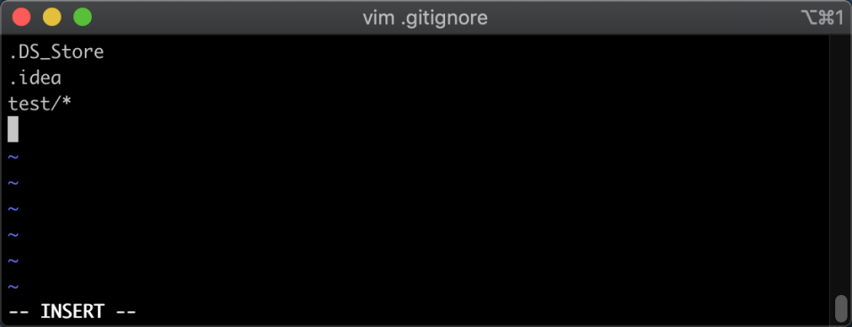
在图中可以看到，路径中会设置星号，这是表示匹配所有文件 (**因为后续需要排除此文件夹下的某个文件，所以这里的星号一定要加上**)，保存修改后，我们再回到终端交互中，查看当前文件的修改，参考命令如下：

```
git status
```

命令执行之后，返回结果如下图所示：

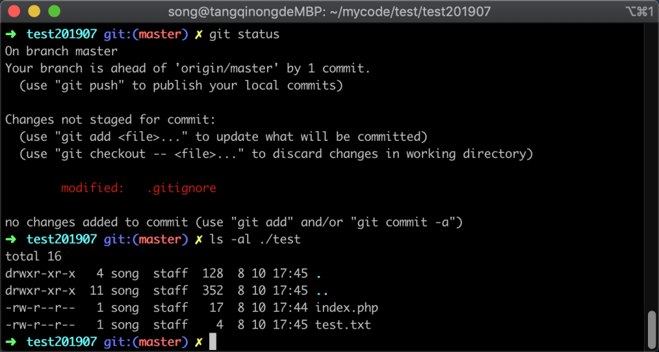

在图中可以看到 git 并没有提示我们心中了一个 test 文件夹，说明成功忽略了 `test` 文件夹以及下面的文件。

### 11.1.2 设置反向排除

接下来我们再次去编辑 `.gitignore` 文件，设置忽略规则里面加上排除规则，参考规则如下：

```
!/test/index.php
```

使用 vim 编辑界面如下图所示：
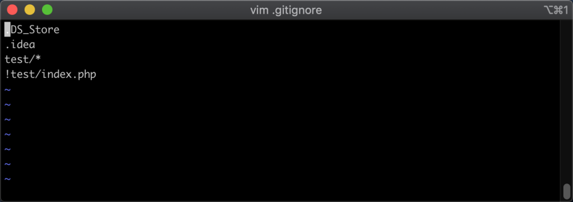

在图中的 `!` 表示要排除的意思，因此在`.gitignore` 文件夹中加入 `!` 也可以理解为取反的意思。

### 11.1.3 反向排除结果验证

接着我们保存修改，然后回到终端进行交互，再次使用 git 的查看文件状态命令，参考命令如下：

```
git status
```

命令执行后，返回结果如下图所示：

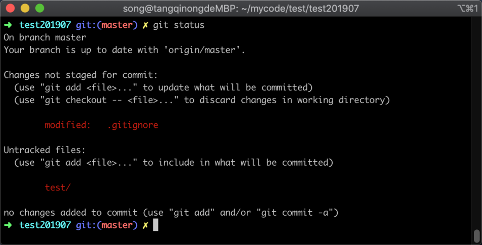

在图中可以看到 Git 提示新增了一个 `test` 文件夹，这便是因为我们刚才对 `test/index.php` 文件设置反向忽略规则，所以此时 `test` 文件夹依然会显示出来，此时设置反向忽略就成功实现了。

## 11.2 忽略已提交文件

有的时候，可能一不小心把某一个原本应该忽略的目录提交到了版本控制器中，再使用 `.gitignore` 文件去忽略的时候，发现无论如何都无法再次将其忽略，只好默默忍受；其实这是因为 git 已经索引了该文件而导致，接下来我带着大家复现并解决此问题。

### 11.2.1 问题复现

我先来让这个问题复现，让大家感受一下这个问题，首先我在版本库中创建一个目录并新增一个文件，提交文件到版本控制器中，参考命令如下：

```
mkdir test2 && echo '1231' > test2/test.txt && git add . && git commit . -m ;测试忽略已提交的文件'
```

命令执行后，返回结果如下图所示：

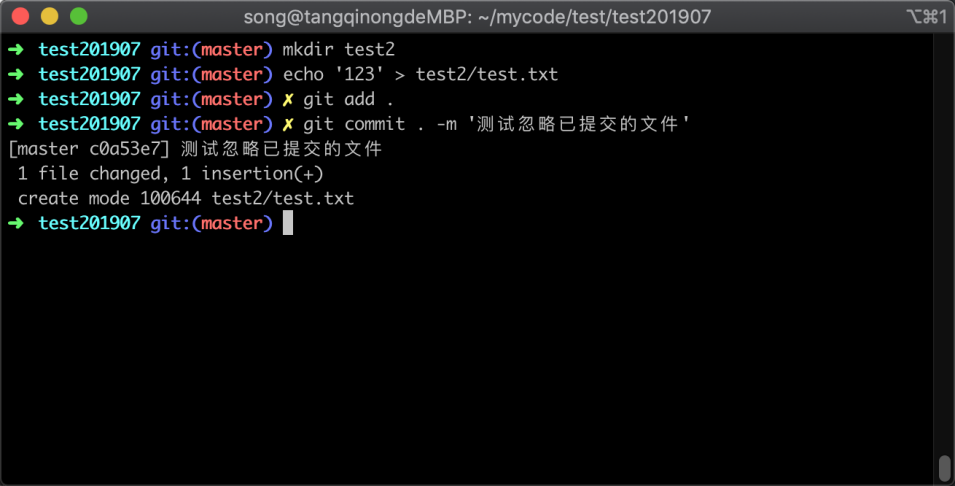

通过图中可以看出，我新增了一个目录和文件，并提交到版本库成功。

接着我在`.gitignore` 文件中加入，忽略规则，规则参考如下：

```
test2/*
```

使用 vim 编辑 `.gitignore` 文件如下图所示：

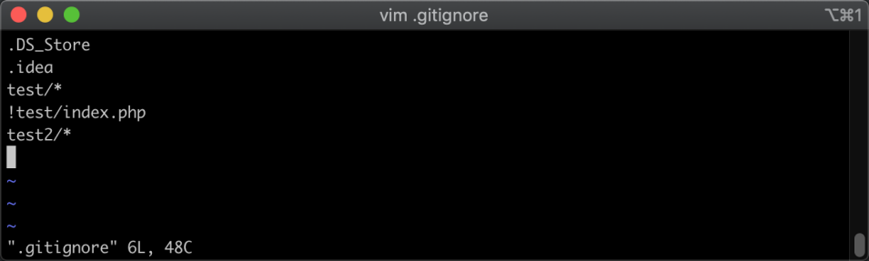

增加忽略规则之后，使用 `:wq` 命令保存，并回到终端交互窗口中，然后去修改我们刚才要忽略的文件，修改之后再查看 Git 会不会提示刚才设置了忽略的文件的修改，参考命令如下：

```
echo ‘添加到忽略文件后再次修改’ >> test2/test.txt && git status
```

命令执行完毕之后，返回结果如下图所示：

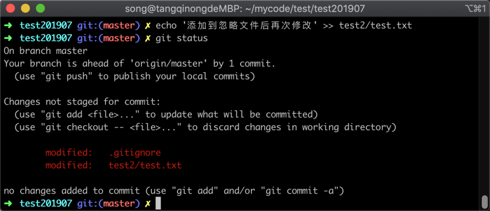

在图中依然可以看到已经设置了忽略的文件，git 依然提示改文件被修改。

### 11.2.2 忽略已存在的文件

遇到上面这种情况时候，我们需要先删除掉该文件的缓存，才能让他成功忽略，所以正确的操作步骤是先在 .gitignore 中设置该文件为忽略，然后执行删除缓存命令，参考命令如下：

```
git rm --cached test2/index.php
```

执行命令之后，再使用 git status 查看是否成功忽略，结果如下所示：

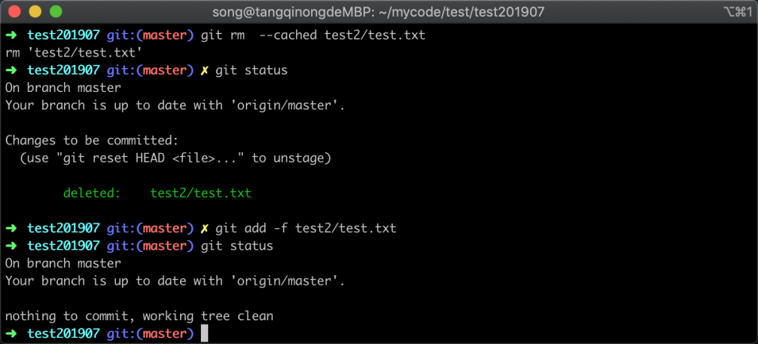

可以看到 `test2/test.txt` 已经不再提示被修改了，说明成功了。

### 11.2.3 忽略已存在的文件夹

忽略已存在的文件夹方式和上面基本一致，我现在模拟一个已经存在的文件夹，如下图所示：

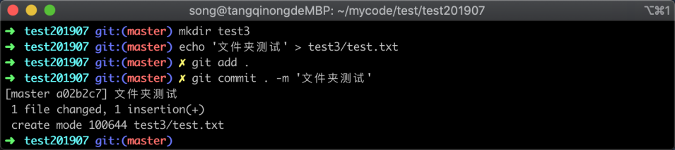

然后编辑 `.gitignore` 文件，在文件中加入要忽略文件夹，如下图所示：

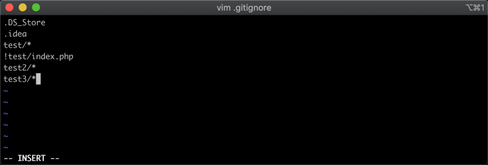

然后使用删除该文件夹的缓存，参考命令如下：

```
git rm -r --cached test3/
```

命令执行后，同样适用 `git status` 查看当前的工作区状态，返回结果如下图所示：

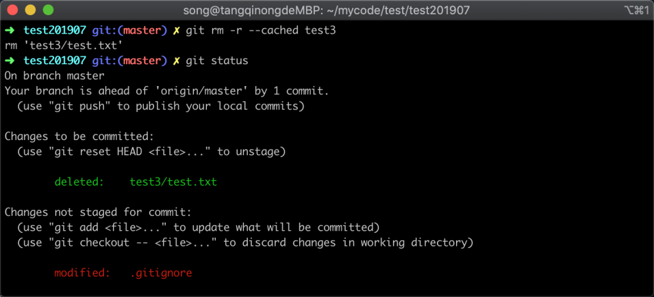

在图中可以看到 test3 文件夹已经从缓存中删除了。

接着我们需要将此修改提交，因为在忽略文件里已经忽略了该文件夹，所以在提交的时候需要注意加上 `-f` 参数，表示强制添加，参考命令如下：

```
git add -f test3
```

命令执行后，返回结果如下图所示：

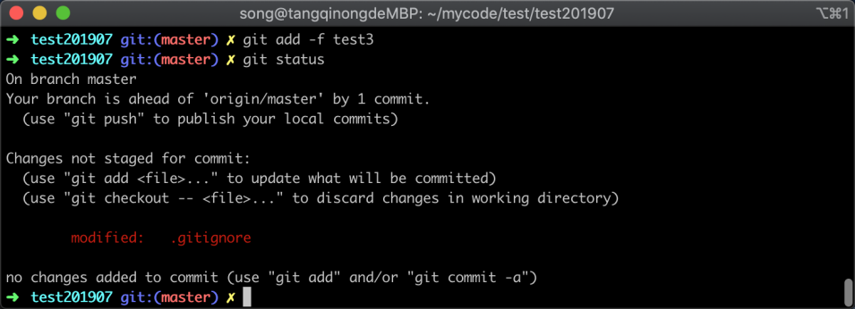

在图中已经看不到 `test3` 文件夹的修改信息，说明忽略已存在的文件夹也成功了。

## 11.3 小结

在这一节中，我们更进一步的学习了如何处理需要忽略的文件，主要内容有反向忽略规则，和忽略已加入版本控制器的文件，有两点需要注意：

1. 反向忽略应用场景是该文件夹大部分文件需要被忽略，只需要保留少部分的时候
2. 忽略已存在的文件夹最后一步需要使用 `-f` 进行强制添加，否则会提示操作失败
