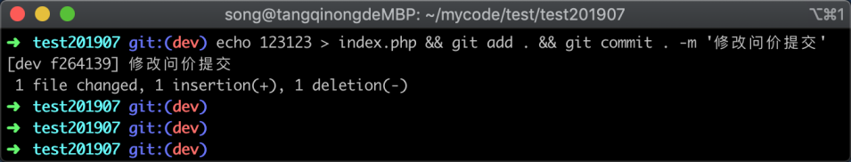
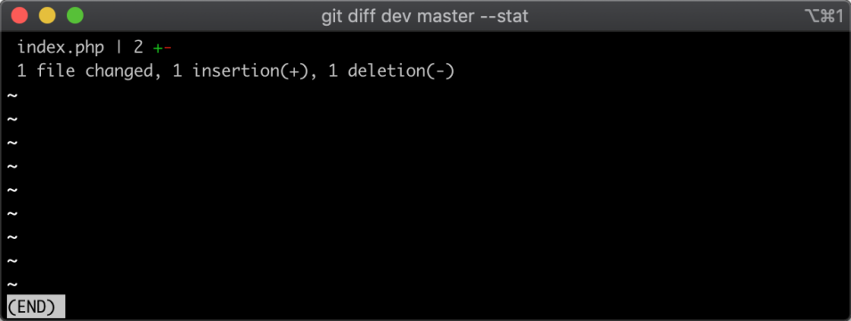
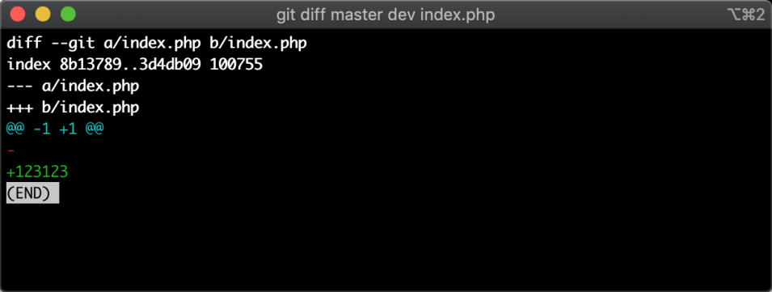
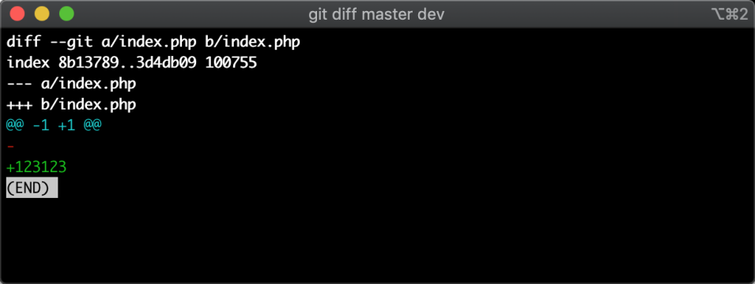
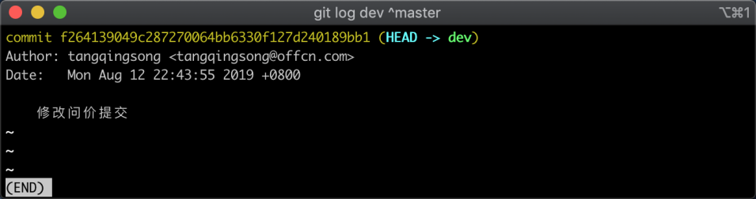
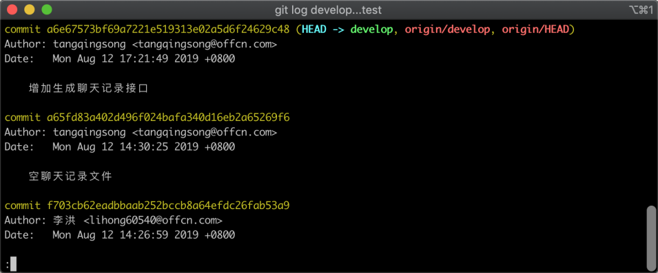
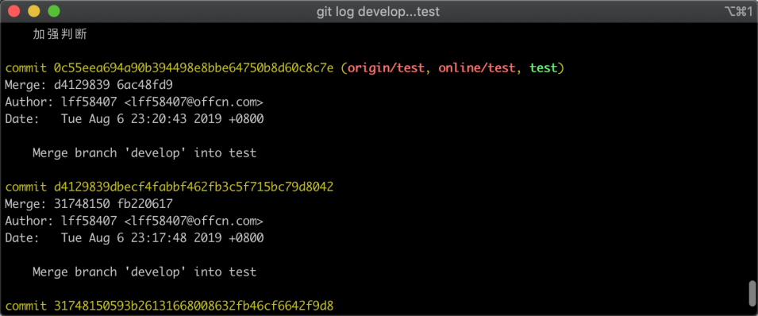
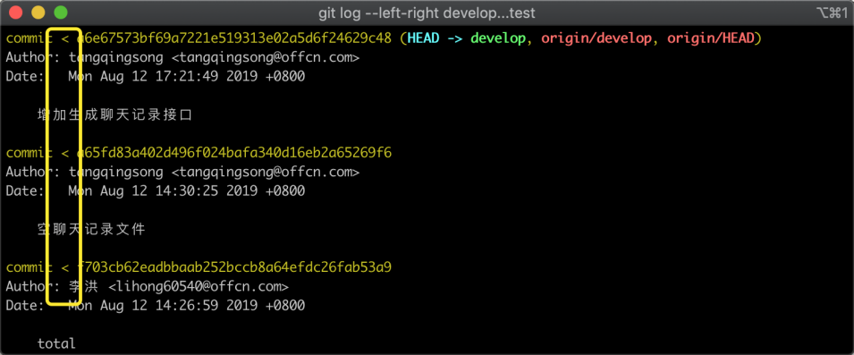

# 12-比较分支差异：展示两个分支的差异部分


> 每个人的生命都是一只小船，理想是小船的风帆。 ——张海迪

在前面讲到了分支的常用操作，有时候需要比较两个分支有什么不同；比如说我在 dev 开发分支上开发代码，由于开发的时间比较长，可能你已经忘记在 Dev 分支上提交了代码，有哪些代码在 master 分支还没有的；

这个时候按照我们前面所掌握的，你可以先切回到 master 分支，然后通过 git log 查看最后的提交记录，然后在切回到 dev 分支进行人工对比，这种方法明显操作起来繁琐，所以在这一节当中教大家怎么比较两个分支的差异。

主要有两个部分：1. 比较分支的提交记录 2. 比较分支的代码差异。

## 12.1 环境准备

在学习之前我先准备一个实验环境，这个环境会让两个分支产生差异，便于后面我们的演示，首先我需要基于 master 分支上新建一个 dev 分支，参考命令如下所示：

```
git checkout -b dev
```

新建分支之后，我需要让两个分支的代码不同，以及提交记录不同，所以我先修改文件，然后再将修改的文件提交到版本控制器中，参考命令如下所示：

```
echo 123123 > index.php && git add . && git commit . -m '修改问价提交'
```

命令执行之后，返回结果如下所示：



从图中可以看到有一个文件被修改，增加了一行，减少了一行，因为此时还没有合并到 master 分支，所以现在 master 分支和 dev 分支已经产生了不一样的地方，接下来我们将尝试通过命令查看具体差异。

## 12.2 查看代码差异

查看差异分为两种，具体的代码文件差异，和提交记录的差异；这里我们先来查看代码的具体差异，分别有三种方式：1. 查看哪些文件被修改了 2. 查看某个文件的代码差异 3. 查看全部的代码差异。

### 12.2.1 查看文件差异

有时候，我们想知道当前的分支与另外一个分支，有哪几个文件不一样，这个时候可以使用如下参考命令：

```
git diff master dev  --stat
```

命令执行之后，返回结果如下图所示：



在图中可以看到，我们刚才修改的 index.php 文件显示了出来，并且告诉我们这个文件与 master 分支相比增加了一行代码，同时也删除了一行代码。

### 12.2.2 显示文件具体修改

通过前面的文件修改差异，我们已经知道了有哪些文件被修改了，现在我想知道某一个文件具体被修改了什么内容，此时可以参考如下命令：

```
git diff master dev index.php
```

在命令中使用了 master 分支最新的代码与 dev 分支最新的代码进行对比，同时传递了一个文件名，因此这里只会展示此文件的具体修改内容，返回结果如下所示：



在图中可以看到删除了一行空内容，又增加了一行内容为 123123。

### 12.2.3 显示全部文件的修改

刚才，我们通过指定了某一个文件查看具体的代码修改，其实这里还有一种用法，就是不填文件名，那么就是查看所有的修改，参考命令如下：

```
git diff master dev
```

这里需要注意，如果你修改的文件比较多，一次查看所有的修改可能会眼花缭乱，适合修改内容不多的情况下使用，返回结果结构和前面的基本一致。



在图中可以看到同样显示了具体的修改内容，因为我只修改了一个文件，所以只展示了一个文件，如果修改了多个文件的话，这里都会显示出来。

## 12.3 查看提交记录差异

除了可以看代码的差异外，有时候还需要查看提交记录的不同，比如说我想查看开发分支比生产分支多了多少提交记录；通常查看提交记录的不同有下面几种方法：1. 查看 A 分支有但 B 分支没有的记录 2. 单纯的比较两个分支的差异 3. 显示个记录在某些分支上存在。

### 12.3.1 查看新纪录

在前面环境准备中，我基于生产分支上新建了一个 dev 分支，然后提交了代码；但某些原因，我忘记了我提交了几次修改，此时我就可以通过查看 dev 分支中有的记录而在生产分支中没有的记录，参考命令如下：

```
git log dev ^master
```

命令执行之后，返回结果如下图所示：



在图中看到只有一条记录，说明我刚才在 dev 分支下只提交了一次代码。

### 12.3.2 单纯比较差异

现在遇到了一个新的情况，我不管两个分支谁提交的记录多，谁提交的少；而是只想知道两个分支记录有什么不一样，参考命令如下图所示。

```
git log branch1...branch2
```

命令执行后，返回结果如下图所示，实验需要多个差异才能明显看出效果，这里为了便于演示，下面的截图是我从一个真实的代码库中进行的对比：



在图中显示了在 develop 分支中新提交的记录，在图中注意看到绿色字体的 `develop`，这是说明这条记录目前存在于 develop 分支上，没有显示 `master` 分支则说明这条记录不存在与 master 分支，按下空格往下记录看，如下图所示：



在图中可以看到同样会显示 test 分支中有的记录，而在 develop 分支中没有，说明这个代码会展示两个分支的不同。

### 12.3.3 查看各记录存在于那些分支上

刚才上面的查看方式其实有一个缺陷，就是没有在每一个记录中显示所属分支，这样如果差异记录太多的时候就会造成不方便，所以我们还可以在命令中加入 `--left-right` 参数，这样在展示每条差异记录的时候，都能看出这条记录所属分支，参考命令如下：

```
git log --left-right develop...test
```

命令执行之后，返回结果如下图所示：



在图中，注意看我黄色框选的箭头符号，因为我们在命令中加入了 `-–left-right` 所以左箭头 `<` 表示是 develop 的，右箭头 > 表示是 test 分支的。

## 12.4 小结

在这节当中主要学习了如何比较两个分支之间的差异，包括代码差异以及提交记录的差异，练习方式如下：

1. 基于当前的分支新建一个分支，并修改代码提交
2. 使用 `git diff 分支1 分支2` 的方式进行代码差异比较
3. 使用 `git log 分支1..分支2` 的方式进行提交记录的差异比较
