# 20-单独回滚代码：记录不变只回滚代码


> 人要有毅力，否则将一事无成。——居里夫人

有些情况下我们需要将代码回滚，但是不回滚提交记录，原因可能是需要这些提交记录去追责，也有可能是服务器设置了不能强制提交等等原因。

此时如果使用 reset 去出去就显得不太合适，操作起来也会略显繁琐，在 Git 中有一个更加适合我们的命令 `git revert`，它就可以帮我我们快速解决刚才这个问题。

## 20.1 构造实验环境

我们在使用 `git revert` 命令之前，先来构建一个实验环境，用来体现此命令的价值所在，首先我们进入 Git 仓库中，然后去修改一个文件，并通过 `git status` 命令展示 git 的文件状态，参考命令如下：

```
echo '场景复现' >> index.php && git status
```

命令执行完毕之后，Git 返回的文件状态信息如下图所示：

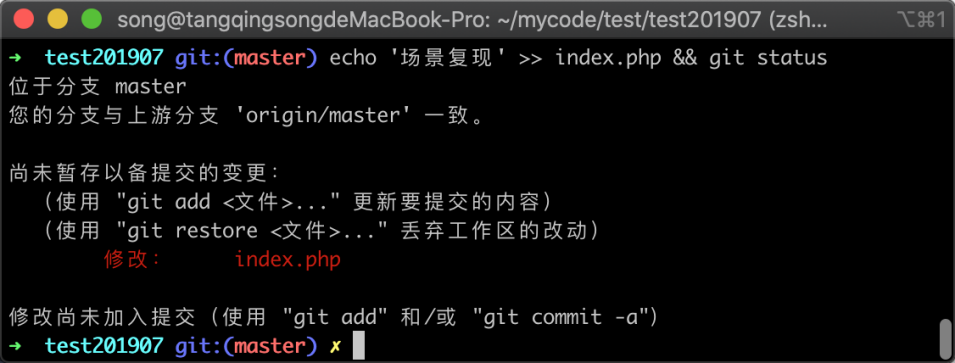

在上图中可以看到文件 `index.php` 已经被修改，接下来我们将修改的内容通过 `git commit` 提交到版本控制器中去，参考命令如下：

```
git commit . -m '回滚代码不回滚记录测试'
```

命令执行完毕之后，Git 返回的提示信息如下图所示：

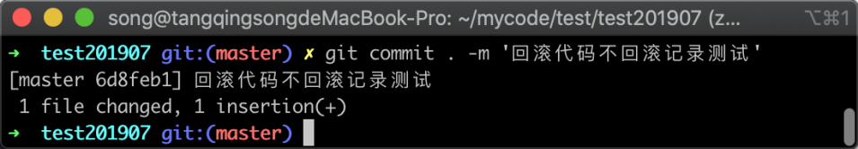

在图中可以看到一个文件被修改，增加了一行代码的提示，说明已经提交成功，接着我们将提交的版本推送到远程仓库中去，参考命令如下：

```
git push
```

命令执行完毕之后，远程仓库返回的信息如下图所示：

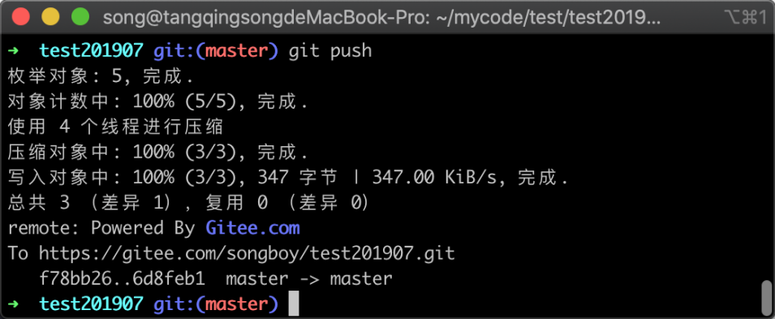

从上图中可以看出，已经成功将版本推送到远程仓库中。

### 20.2 使用 reset 回滚

假设此时我发现刚才提交的代码有问题，需要撤销这次修改，那么我们可能会使用前面学到的 `git reset` 命令，但这个命令有些情况下并不适合，下面我将使用 `git reset` 命令与 `git revert` 命令进行对比。

首先我们通过 `reset` 命令将版本恢复到上一个版本，参考命令如下：

```
git reset HEAD^
```

命令执行完毕之后，返回的信息如下图所示：

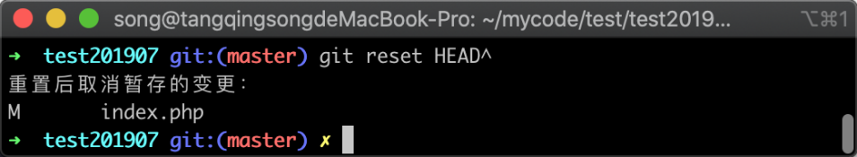

在上图中可以看到已经撤销版本成功，文件 `index.php` 的变更已经在工作区中，接着我们尝试将老版本再次推送到远程，参考命令如下所示：

```
git push
```

命令执行完毕之后，远程仓库提示拒绝推送，如下图所示：

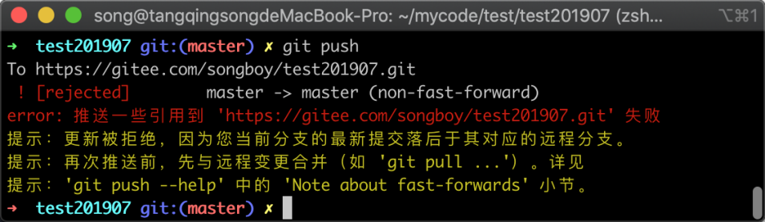

在上图中推送失败，是因为推送的版本比远程仓库版本老，如果要强制推送可以使用 `git push -f`，但很多时候我们远程仓库是设置了保护分支的，所以加上 `-f` 参数依然推送不了，所以有些时候并不适合使用 `git reset` 命令。

在明确 `git reset` 方式不合适之后，我们把代码回滚到远程最新的位置，参考命令如下：

```
git reset --hard origin/master
```

命令执行完毕之后，返回的信息如下图所示：

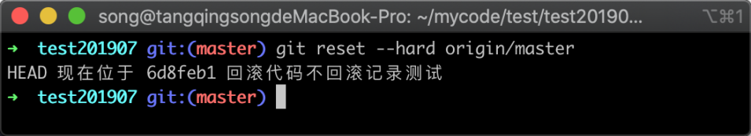

在上图中可以看出，Git 代码已经恢复到最新的版本，为了严谨的实验环境我需要再次通过 `git log` 来确认版本记录，参考命令如下：

```
git log
```

命令执行完毕之后，返回的版本记录列表如下图所示：

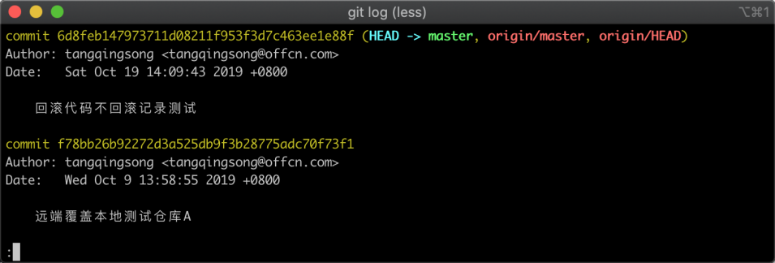

在图中可以看到我们之前构造的实验环境已经恢复完成，同时我们选择任意一个版本将它的 commitid 复制下来，用于我们后面的 `git revert` 实验。

## 20.3 revert 操作

revert 可以回滚指定的版本的代码，回滚代码后会生成一个新的版本号，记录下整个版本变动流程，就可以用 `revert` 这种操作方法，下面我们使用 revert 回滚，参考命令如下所示：

```
git revert 6d8feb147973711d08211f953f3d7c463ee1e88f
```

命令执行之后，会弹出一个合并代码的提示框，如下图所示：

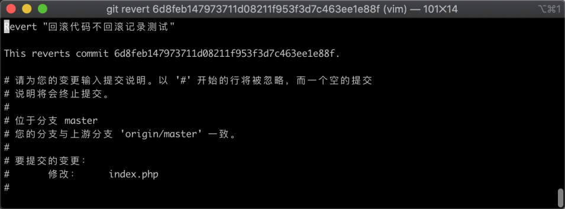

在图中需要我们编辑一些备注信息，编辑好之后，按键盘的 `esc` 键，然后输入 `:x` 再按下回车即可。操作完成之后，我们可以通过 `git log` 命令来查看版本记录的变化，参考命令如下所示：

```
git log
```

命令执行完毕之后，返回的版本列表信息如下图所示：

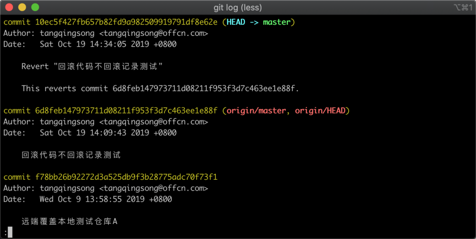

在上图中显示了版本记录，可以看到最新的版本记录已经发生了变化，备注信息中提示了是从 `revert` 中恢复来的，并展示了原始的 commitid，说明我已经操作成功。

接着我们通过 `git diff` 命令来与我们之前提交的版本区别，用来验证我们的代码效果，构造的命令如下所示：

```
git diff 6d8feb147973711d08211f953f3d7c463ee1e88f
```

命令执行完毕之后，返回的版本差异信息如下图所示：

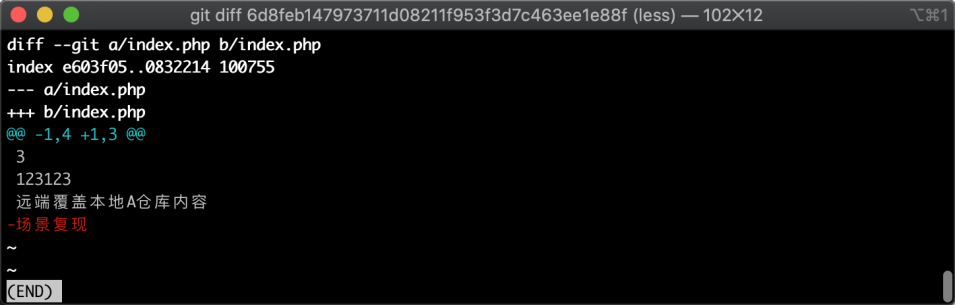

在差异信息中，我们可以看到当前最新版本，比此前提交的版本少了一行代码，而这个代码正是我们在前面提交的，说明我们通过 `revert` 命令撤销版本成功，接着我们尝试将新版本推送到远程，参考命令如下：

```
git push 
```

命令执行完毕之后，返回的信息如下图所示：

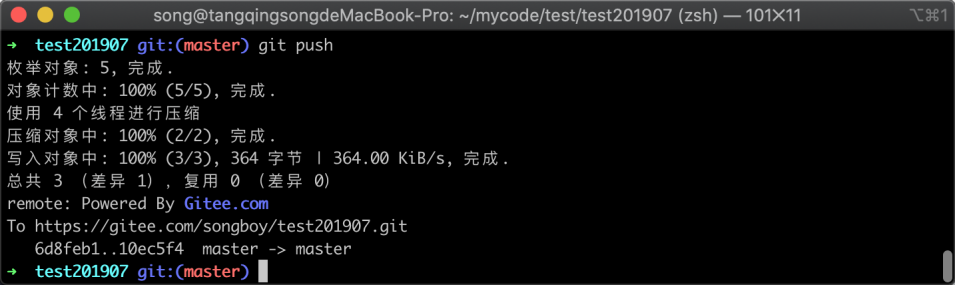

在返回的信息中，可以看出已经成功的提交了代码，并没有出现此前使用 `git reset` 恢复后推送远程仓库提示当前仓库落后于远程仓库。

**需要注意的是，在使用 `revert` 去恢复某个版本代码时，Git 只会撤销指定版本的代码，而不是指定版本后的所有版本**。比如说你提交了 1、2、3 三个版本，当你撤销版本 2 的时候，会生成版本 4，但是不会对版本 3 产生影响。

## 20.4 小结

在这一节中，主要学习了如何只撤销代码而不撤销版本记录，在文章当中用了 `git reset` 和 `git revert` 作对比演示，需要大致记住的几点有：

1. `git reset` 命令会改变之前的版本记录，可能会导致不能提交到远程仓库；
2. `git revert` 命令只会撤销某个版本的代码，然后在当前分支增加一条版本新纪录；
3. `git revert` 只会撤销指定版本的代码，而不是指定版本后的所有版本
