# 24-合并代码保留提交记录：rebase功能使用


> 老骥伏枥，志在千里； 烈士暮年，壮心不已。 ——曹操

在第 20 节中，我们了学习使用 `git merge` 进行分支合并，在执行合并时候会将目标分支的代码与当前分支的代码进行合并，合并完成之后会产生一个新的版本，在这一节当中我们学习一个与 `git merge` 类似的 `git rebase` 命令，`git rebase` 会将另外一个分支的提交的所有新版本记录复制到当前分支中，但和 `merge` 稍有差异；

大多数情况下使用 `git merge` 命令已经满足合并需求，但如果你不想在分支中看到合并完成后产生的 `merge branch` 版本记录时可以使用 `git rebase` 命令，这样会让当前分支看起来更加整洁，但区别也不仅仅如此，在这一节当中我使用 `git merge` 和 `git rebase` 作对比来进行演示。

## 24.1 merge 合并

`git merge` 命令和 `git rebase` 应用场景很类似，在这一节当中我们先使用 `git merge` 进行合并操作一次，然后大家注意观察版本记录列表中的版本记录顺序。

### 24.1.1 在 test 分支修改代码

现在首先我切换到 `test` 分支中，执行命令如下所示：

```
git checkout test
```

命令执行完毕之后，Git 返回信息如下图所示：

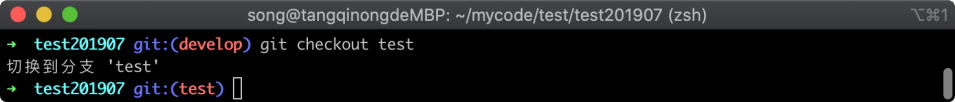

在上图中，可以看到已经切换到 `test` 分支当中，现在我随意在 `test` 分支当中修改代码，然后提交一个版本，执行命令如下所示：

```
echo '44444444' >> aa.txt && git commit . -m 'rebase测试'
```

命令执行完毕之后，会修改 `aa.txt` 文件的代码，并执行了 `git commit` 提交工作区的修改到新版本中，返回信息如下所示：

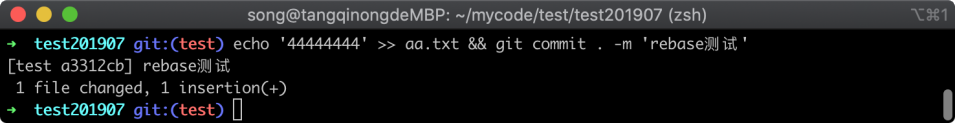

在上图中可以看到提交新版本成功。

### 24.1.2 将 test 分支推送到远程仓库

> 一会使用 `git rebase` 命令演示时候还需要当前的场景，这里我将刚才提交的版本推送到远程去，这样需要恢复当前版本的时候就可以用远程覆盖本地版本，免得重复构建实验环境。

执行推送到远程仓库的命令如下所示：

```
git push --set-upstream origin test
```

命令执行完毕之后，远程仓库返回的信息如下图所示：

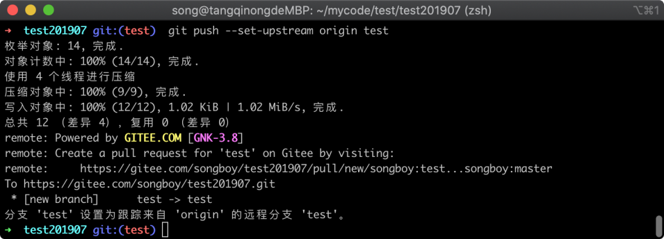

在上图中可以看到推送到远程仓库已经成功，接下来在 `develop` 也进行一些改动。

### 24.1.3 在 develop 分支修改代码

首先切换到 `develop` 分支中去，执行命令如下所示：

```
git checkout develop
```

命令执行完毕之后，Git 返回信息如下图所示：

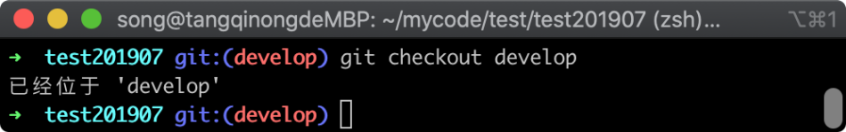

在上图中可以看到已经切换到 `develop` 分支，接着我随意的修改代码提交几个版本，执行命令如下所示：
develop 仓库提交代码多次代码。

```
echo '1111111111' >> aa.txt && git commit . -m 'rebase测试'
echo '2222222222' >> aa.txt && git commit . -m 'rebase测试2'
echo '3333333333' >> aa.txt && git commit . -m 'rebase测试3'
```

命令执行完毕之后，Git 返回的信息如下图所示：

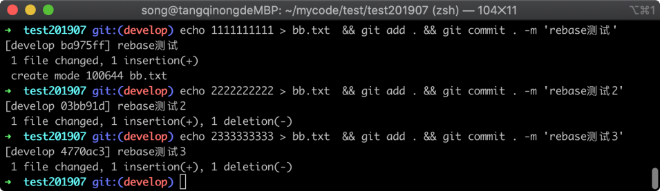

在上图中可以看到提交了三个版本，

### 24.1.4 使用 merge 命令合并代码

接着我们回到 `test` 分支中，并使用 `git merge` 命令将 `develop` 分支的代码合并过来，回到 `test` 分支的命令如下所示：

```
git checkout test
```

命令执行完毕之后，Git 返回的信息如下图所示：

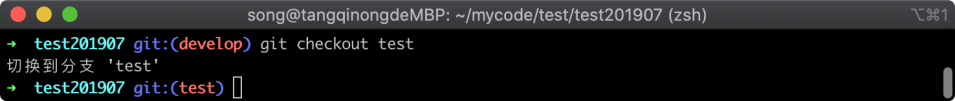

在上图中可以看到已经切换回 test 分支当中，接着使用 `git merge` 命令合并代码，执行命令如下所示：

```
git merge develop
```

命令执行完毕之后，Git 返回的信息如下图所示：

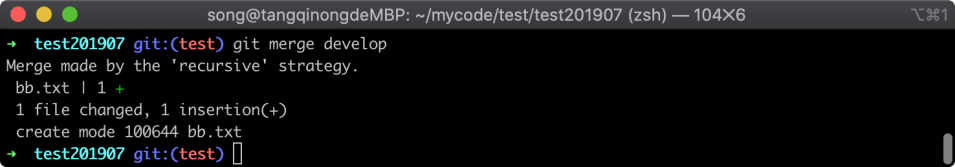

在上图中可以看到合并代码成功，显示了一行代码变更，我们现在就可以使用 `git log` 命令查看版本日志列表的效果了，执行命令如下所示：

```
git log
```

命令执行完毕之后，Git 返回的版本列表信息如下图所示：

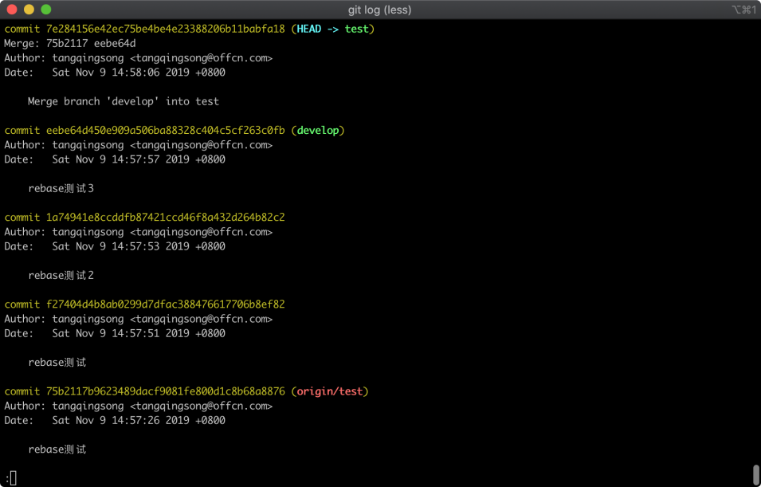

在上图中可以看到刚才分别在两个分支下提交的四个版本，在版本列表中顺序是时间的先后顺序，最开始在 `test` 分支提交的版本在最下方，后来切换到 `develop` 分支提交的三个版本在上方，最上方的版本为 `merge branch` 的版本记录，先记住这是 `git merge` 命令合并代码效果。

## 24.2 rebase 效果

接下来我们来试试 `git rebase` 命令的效果，通过版本记录列表对比两者有什么区别，我们现在依然在 `test` 分支下。

### 24.2.1 从远端恢复环境

使用 `git reset` 命令将版本撤销到 `git merge` 前的状态，直接以远端为准即可，执行命令如下：

```
git reset origin/test  --hard
```

命令执行完毕之后，Git 返回的信息如下图所示：

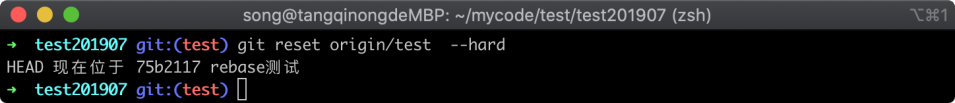

在上图中可以看到分支的版本已经回滚成功，我们可以使用 `git log` 命令来查看版本列表进行确认，执行的命令如下所示：

```
git  log
```

命令执行完毕之后，Git 返回的版本列表如下图所示：

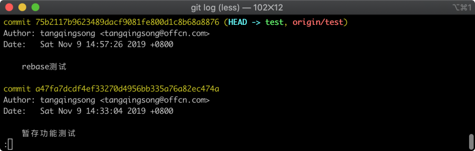

在上图中可以看到当前只有 `rebase测试`这个版本了，其他几个版本已经被撤销。

### 24.2.2 使用 rebase 命令复制版本记录

接着我们使用 `git rebase` 命令将 `develop` 分支的的代码复制过来，执行的命令如下所示：

```
git rebase develop
```

命令执行完毕之后，Git 返回的信息如下图所示：

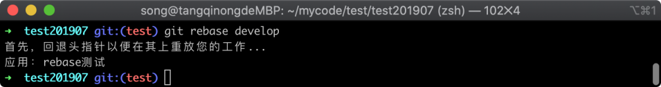

在上图中可以看到 `git rebase` 已经成功执行，接着我们使用 git log 查看提交日志，执行命令如下所示：

```
git log
```

命令执行完毕之后，Git 的版本列表如下图所示：

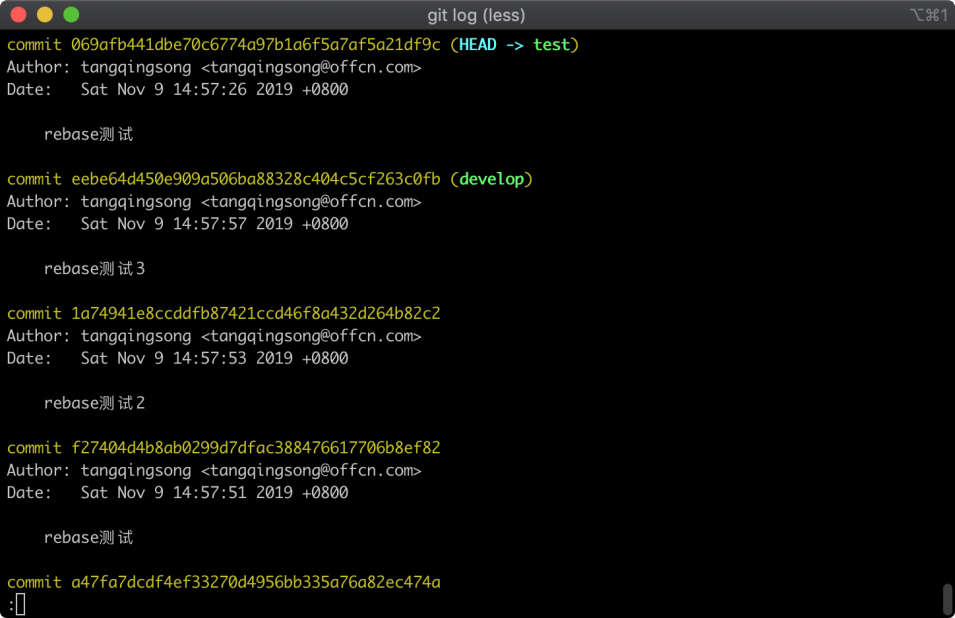

在上图中可以看到四个版本顺序与之前 `git merge` 版本记录是不一样的，`git rebase` 命令后版本顺序不是按照时间，而是将 `develop` 分支的版本记录放在下方，在当前分支提交的版本放在最上方，同时也没有产生一个 `Merge branch` 的版本记录。

## 24.3 小结

在这节中我们学习了一个 `git rebase` 命令，这个命令如果仅仅从代码层面比较，基本是没有区别的，主要的区别在于版本记录的变化，比如说，因为一些情况我需要在 `test` 分支修改一些代码，如果我使用了 merge 命令将 develop 的版本合并了进来，后续我想去撤销这次修改的代码，就比较麻烦。

因为 `git merge` 合并后的版本记录的顺序是按照时间顺序来的，这样在 `test` 分支提交的版本就可能在非常往后，而如果是 `git rebase` 命令进行的代码合并，则是把 ‘develop’ 分支的提交放在最后， 这样当需要撤销的时候就非常的方便，我们主要记录两个区别：

1. `git merge` 命令合并代码之后，版本记录会按照时间顺序排序，并自动产生一个 `Merge branch` 的版本；
2. `git rebase` 命令合并代码之后，版本记录会将目标分支的版本放在后面，然后再将当前分支的版本记录放在前边
