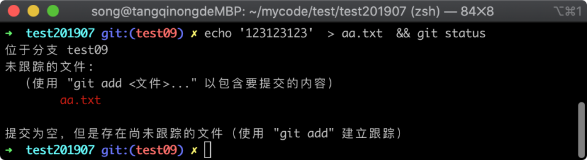
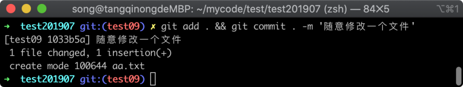
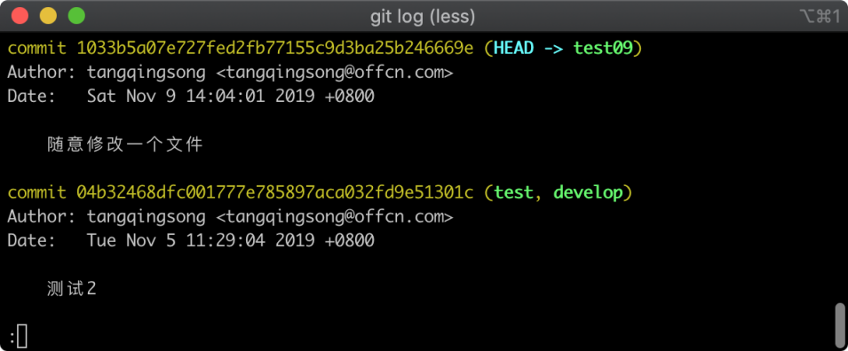
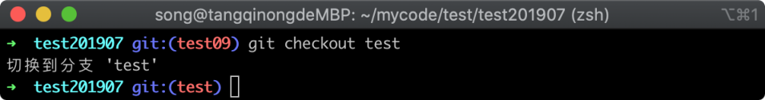
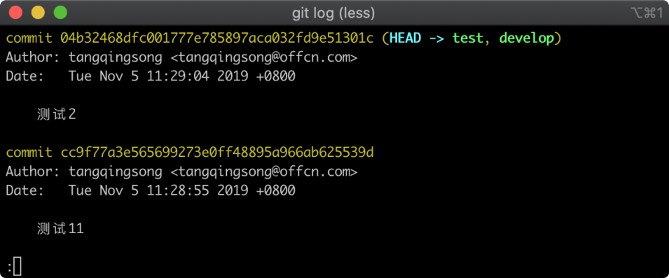
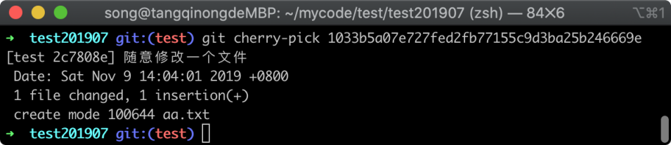
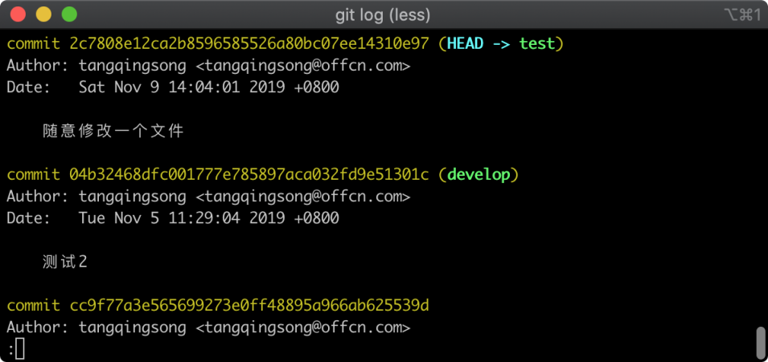
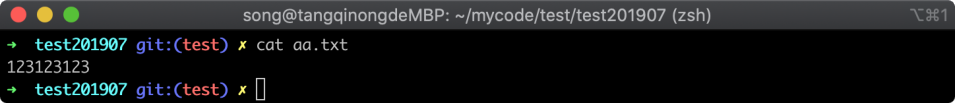

# 25-复制记录到当前分支: cherry-pick命令使用方法


> 勤学如春起之苗，不见其增，日有所长。——陶潜

有时候需要把另一个分支中的某个版本单独复制到当前分支中，如果直接使用 `git merge` 或者 `git rebase` 进行合并的话，会把另一个分支所有的版本记录都合并过来，这显然不是我们所需要的。

Git 当中提供了一个功能，它可以将另外一个分支中的某个版本单独复制到当前的分支中来，这就是我们这节要学的 `git cherry-pick` 命令。

## 25.1 构造环境

为了让大家更好的理解，我构建一个实验环境，首先在 `test` 分支的基础上新建一个分支，名字为 `test09`，参考命令如下所示：

```
git checkout -b test09
```

命令执行完毕之后，Git 返回的信息如下图所示：


在上图中，可以看到新建分支成功，并且已经切换到了 `test09` 分支上来，接着随意修改一个文件，然后提交一个新版本记录，修改文件的命令如下所示：

```
echo '123123123'  > aa.txt  && git status
```

命令执行完毕之后，通过 `git status` 展示文件状态如下图所示：



在上图中可以看到新增了一个 `aa.txt` 的文件，我们将这个文件添加到新版本里面去，使用 commit 提交到新版本的命令如下所示：

```
git add . && git commit . -m '随意修改一个文件'
```

命令执行完毕之后，Git 返回的信息如下图所示：



在上图中可以看到新增文件 `aa.txt` 成功，接着我们通过 `git log` 查看版本记录，查看版本记录执行命令如下：

```
git log
```

命令执行完毕之后，Git 返回的版本记录列表如下图所示：



在上图中，可以看到刚才提交的版本记录 commitid 值为 `1033b5a07e727fed2fb77155c9d3ba25b246669e`，我们将这个值先复制下来，然后通过 `git checkout` 命令切换到 `test` 分支，执行命令如下所示：

```
git checkout test
```

命令执行完毕之后，返回的信息如下图所示：



在上图中，可以看到已经成功切换到 test 分支当中，接下来，我们就可以开始将刚才在 `test09` 分支提交的版本记录复制到当前的分支下。

## 25.2 复制版本记录

在复制版本记录前，我们先来使用 `git log` 命令看看当前最新的版本号是多少，查看版本记录列表执行命令如下所示：

```
git log
```

命令执行完毕之后，Git 返回的版本列表如下图所示：



在上图中可以看到，当前最新版本的备注信息是`测试2`，一会我们将 `test09` 分支的指定版本记录复制过来之后，这里应该会发生变化。

现在正式开始复制版本记录了，我们可以使用 `git cherry-pick` 命令将 `test09` 分支中的第一条记录复制过来，这里需要将开始复制下来的 commitid 复制下来，然后组装成一条复制版本的命令，执行的命令如下所示：

```
git cherry-pick 1033b5a07e727fed2fb77155c9d3ba25b246669e
```

命令执行完毕之后，Git 返回的提示信息如下图所示：



在上图中可以看到之前在 `test09` 分支提交的版本备注信息，和新增的文件名被显示了出来，到这里就已经成功了。

## 25.3 结果验证

接下来，我们通过 `git log` 查看版本记录列表的方式验证一下，执行命令如下所示：

```
git log
```

命令执行完毕之后，Git 返回的版本信息如下图所示：



在上图中可以看到，最新的版本已经不是原来那个备注为`测试2` 的版本了，而是我们在 `test09` 分支提交的版本，接下来我们再验证文件是否也被改过来，通过 `cat` 命令查看文件，执行命令如下所示：

```
 cat aa.txt
```

命令执行完毕之后，`aa.txt` 文件内容如下图所示：



## 25.4 小结

`git cherry-pick` 命令是一个使用频率比较低，但在需要使用的场景时候非常省事，比如说，你在 develop 分支中开发，提交了 10 个版本，只有 2 个版本是稳定可以测试的，另外几个版本不可以，然后需要赶紧将两个稳定的版本提测，这个时候就可以使用 `git cherry-pick` 命令了，在操作的过程中大致有这几个操作步骤：

1. 在 develop 分支找到稳定版本的 commitid
2. 切换分支到 test 然后依次执行 `git cherry-pick` 命令
3. 通过 `git log` 检查是否正确
