# 29-历史记录清理：保留代码并删除一年前的提交记录


> 今天应做的事没有做，明天再早也是耽误了。——裴斯泰洛齐

Git 仓库使用久了之后会发现响应会越来越慢，占用的存储空间也会越来越大，出现这些问题的原因是因为 Git 会将我们代码的所有历史版本都会存储起来，当我们代码迭代了上千个版本之后就会占用很大的空间。

为了让 Git 的响应速度能够快点，我们可以通过一些方式减少 Git 仓库的存储空间，这一节当中主要教大家三种方式，分别是：克隆最后一个版本、清空版本记录、清理大文件等。

## 29.1 克隆最后一个版本

我们在克隆一个使用了很久的 Git 仓库时候可能会发现耗费时间非常长，这是因为 Git 会拉取所有的历史版本导致，我们如果想让 Git 在克隆代码的时候快一些，可以在 `git clone` 命令行后面加 `--depth=1` 参数，这样 Git 在克隆代码时候只会克隆最后一个版本的内容，这里我执行命令如下所示：

```
git clone https://gitee.com/songboy/test201907.git  tempdemo --depth==1
```

命令执行完毕之后，Git 克隆返回的信息如下图所示：

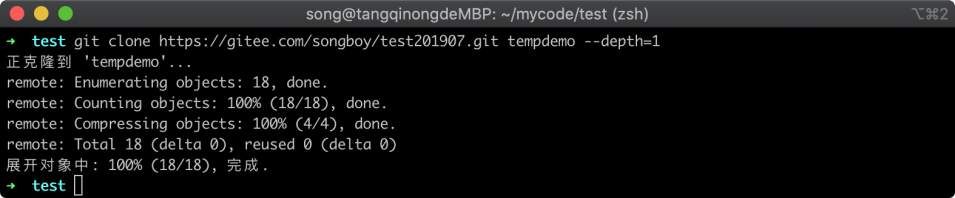

在上图中可以看到克隆已经完成，而且我在等待克隆完成的这个时间也非常短，接着我进入 Git 仓库，看看里面的代码是否已经克隆下来，执行命令如下所示：

```
cd tempdemo && ls 
```

命令执行完毕之后，Git 仓库的文件如下图所示：

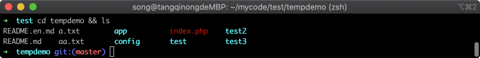

在上图中可以看到文件也都存在，我们再通过 `git log` 命令看看版本列表是否完整，执行命令如下所示：

```
git log
```

命令执行完毕之后，Git 版本列表如下图所示：

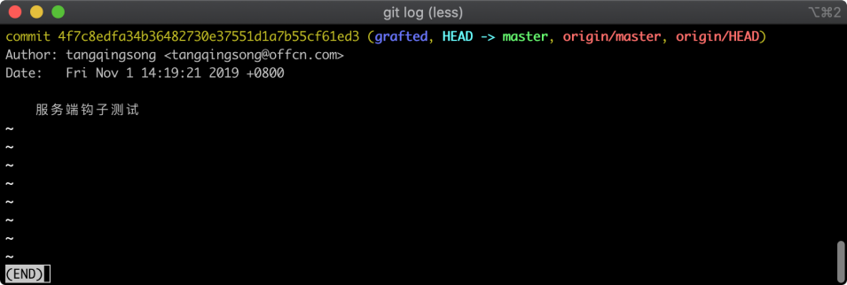

在上图中可以看到只有一个版本记录，说明 `--depth==1` 参数是可用的。

## 29.2 清空版本记录

上面一个例子只能解决本地仓库的占用大小，但是服务端依然保存了所以的版本记录，如果想把远程的仓库也进行清理，可以看看下面的方法，首先我们切换到 `develop` 分支中，执行命令如下所示：

```
 cd ../test201907  && git checkout  develop
```

命令执行完毕之后，Git 返回的信息如下图所示：

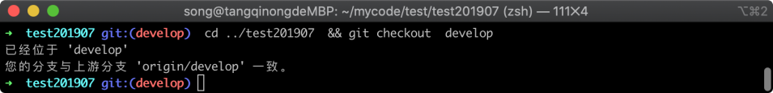

在上图中可以看到已经切换到 `develop` 分支当中。

接着我们创建一个新分支，不过在创建的时候我们需要加上一个 `--orphan` 参数，加上这个参数之后创建的分支有点特殊，他只有最后一个版本，而不是把所有的版本都复制过来，严格来说创建出来的不是分支，但很像分支，执行的命令如下所示：

```
git checkout --orphan new_branch
```

命令执行完毕之后，Git 返回的信息如下图所示：

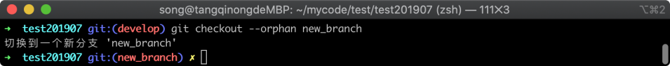

在上图中可以看到已经创建了一个 `new_branch` 分支成功，接着我们将这个特殊的分支里面的文件都添加进来，执行的命令如下所示：

```
git add -A  && git status
```

命令执行完毕之后，Git 仓库的文件状态如下图所示：

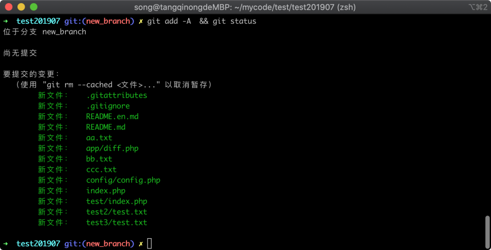

在上图中可以看到所有的文件都处于待添加状态，我们将这些文件使用 `commit` 命令提交到一个版本当中去，执行命令如下所示：

```
git commit -m "new version"
```

命令执行完毕之后，Git 返回的信息如下图所示：

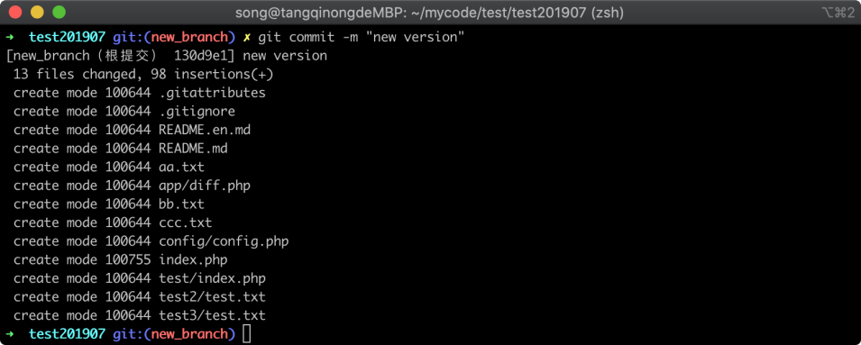

在上图中可以看到提交成功，并生成了一个版本记录，接着我们将原来的 `develop` 分支删除，执行命令如下所示：

```
git branch -D develop
```

命令执行完毕之后，Git 返回的信息如下图所示：

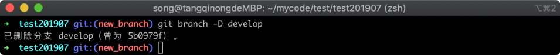

在上图中可以看到已经将 develop 分支删除成功，接着我们在将当前所在的 `new_branch` 分支改名为 `develop`，执行命令如下所示：

```
git branch -m develop
```

命令执行完毕之后，Git 返回的信息如下图所示：

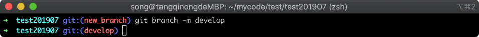

在上图中可以看到已经将分支改名成功，接着我们使用 `git push -f` 命令将本地仓库强制推送到远程仓库当中，这里需要注意：

> 有些仓库有 master 分支保护，不允许强制 push，需要在远程仓库项目里暂时把项目保护关掉才能推送

```
git push -f origin develop
```

命令执行完毕之后，Git 远程仓库返回的信息如下图所示：

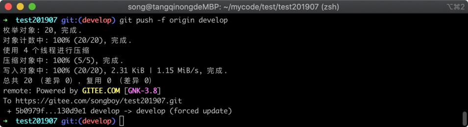

在上图中可以看到强制推送到远程的 `develop` 分支已经成功，此时我们已经将远程的历史版本记录给覆盖。

## 29.3 清理大文件

上面一小节中，我们可以通过清理版本库来减少 Git 存储的空间，但有时候我们需要保留历史版本记录，但又想减少 Git 存储空间，这个时候我们就可以考虑清理一些大文件。

Git 本身也给我们提供了解决方案，使用 `git branch-filter` 可以遍历 Git 的版本历史信息，然后从历史版本信息中删除大文件，最终 Git 仓库空间减少，在下面的命令中会涉及到很多 Linux 命令，这些命令我们不用细究，按照步骤执行即可。

> 演示出效果需要一个使用比较久，而且里面有大文件的仓库，这里我以我们公司的一个仓库为例来演示。

现在需要找出大文件的对应 hash 值，这里我们找出前 5 个为例，执行命令如下所示：

```
git verify-pack -v .git/objects/pack/pack-*.idx | sort -k 3 -g | tail -5
```

命令执行完毕之后，过滤后的 Git 返回信息如下图所示：

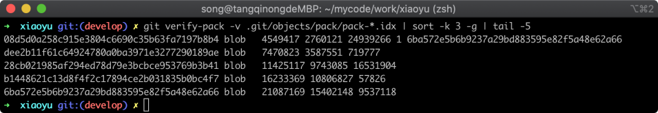

在上图中，可以看到 5 行记录，其中第 3 列代表文件占用空间大小，我们随意挑选一个 hash 值为例，将这个值 `6ba572e5b6b9237a29bd883595e82f5a48e62a66` 复制到剪贴板，然后根据 hash 值找到对应大文件名，执行命令如下所示：

```
git rev-list --objects --all | grep 6ba572e5b6b9237a29bd883595e82f5a48e62a66
```

命令执行完毕之后，Git 返回的信息过滤后如下图所示：

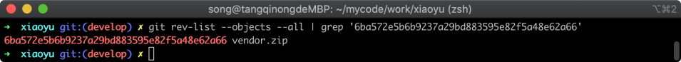

在上图中可以看到这个 hash 所对应的文件为 `vendor.zip` 文件，从文件名可以看出这是一个压缩包，我们要清除这个文件在所有历史中的记录，并强制刷新到所有分支，这里推送到远程仓库需要有强制推送权限。执行删除 `vendor.zip` 文件，在所有历史版本中的记录命令如下所示：

```
git filter-branch --index-filter 'git rm --cached --ignore-unmatch vendor.zip'
```

命令执行完毕之后，Git 返回的信息如下图所示：

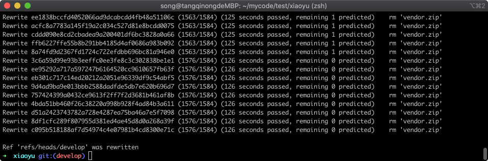

在上图中可以看到当前仓库有 1584 个版本记录，已经全部删除完毕；在上面的命令中我们删除了文件，但是在 Git 的 repo 里面还记录了这些文件的信息，这些信息也会占用一定的空间，我们继续清除这些信息，并收回存储空间，执行命令如下所示：

```
rm -rf .git/refs/original/  && git reflog expire --expire=now --all
```

命令执行完毕之后，Git 返回的信息如下图所示：


在清除多余信息之后，我们需要重新建立文件与 Git 仓库的关联关系，执行命令如下：

```
git fsck --full --unreachable
```

命令执行完毕之后，Git 返回信息如下图所示：

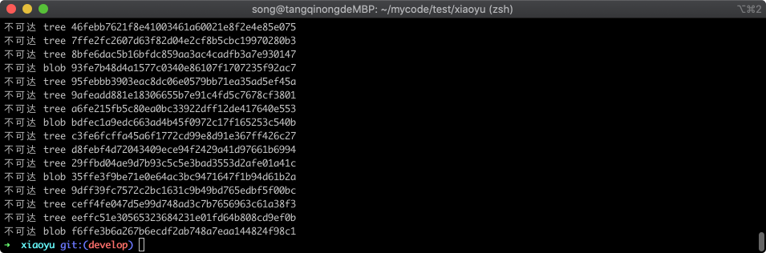

接着我们需要重新压缩代码，减少仓库体积：

```
git repack -A -d
```

命令执行完毕之后，如下图所示：

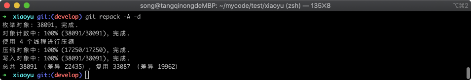

在上图中可以看到压缩任务已经执行完成，最后可以通过 Git 的 GC 清理一些垃圾数据，执行命令如下所示：

```
git gc --aggressive --prune=now
```

命令执行完毕之后，Git 仓库的文件状态如下图所示：

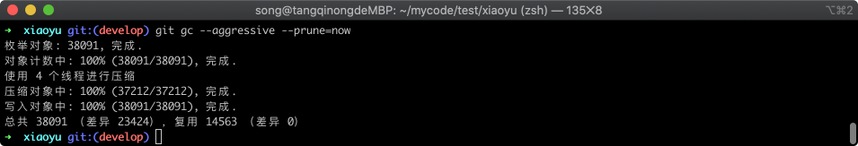

在上图中可以看到已经回收完成，总记录表有 38091 个对象，可用的只有 14563，其余的便被回收了，刚才这些操作都是在本地，我们如果想让远程仓库也清理，可以强制推送到远程仓库，执行命令如下所示：

```
git push --force origin master
```

命令执行完毕之后，Git 仓库的文件状态如下图所示：

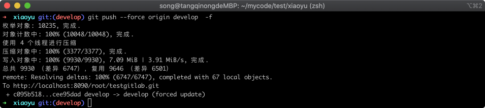

在上图中可以看到已经推送到远程仓库成功。

## 29.4 小结

在这一节当中主要学习了如何让 Git 仓库廋身，以达到让 Git 响应速度变快的同时也减少占用仓库的空间。

导致 Git 仓库太大的原因，通常是因为有大文件和迭代版本次数过多导致，前者我们尽量不要把大文件放到存储空间中去，后者的话很难避免，不过我们可以定期清理版本记录。
