# 30-搭建Git服务器：使用Docker快速搭建Gitlab


> 什么是路？就是从没路的地方践踏出来的，从只有荆棘的地方开辟出来的。 —— 鲁迅

在前面的章节中，我们学习了大量的 Git 命令使用，考虑到降低 Git 学习成本并没有教大家如何去搭建 Git 服务器，因为搭建 Git 服务的场景遇到的机会并不多。

但如果团队刚成立，通常需要搭建 Git 服务器，在这一节中我们学习如何使用 Gitlab 去搭建 Git 服务器，为了让大家在搭建的时候减少障碍，这里我们使用 Docker 的方式来搭建，因此首先需要安装 Docker。

## 30.1 安装 Docker

安装 Docker 的方式相对简单，直接去 Docker 官网（[www.docker.com](http://www.docker.com)）下载安装包即可，Windows10 以下系统稍微麻烦一些不过电脑的配置建议最少 8G 内存，如果对 Docker 不太理解是什么，可以把它当做是一个简化版的虚拟机，大家可以参考一下这个网址的内容进行安装：

```
https://www.imooc.com/article/49117
```

安装 `Docker` 完毕之后，我们可以通过执行 `docker` 命令来验证是否安装成功，执行命令如下所示：

```
docker
```

命令执行之后，Docker 返回的信息如下图所示：

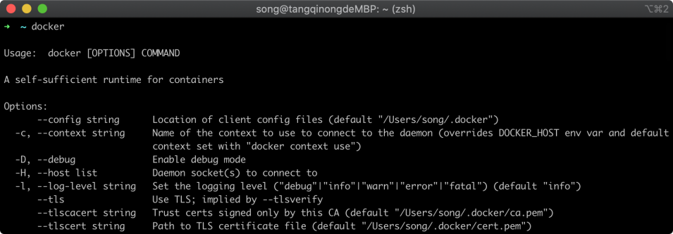

在上图中可以看到 Docker 返回的帮助信息，说明我们安装 Docker 已经成功。

## 30.2 下载 Gitlab 镜像

接着我们使用 Docker 去下载 `gitlab` 的镜像，Docker 下载 Gitlab 镜像的命令如下所示：

```
docker pull gitlab/gitlab-ce
```

命令执行完毕之后，Docker 返回的信息如下图所示：

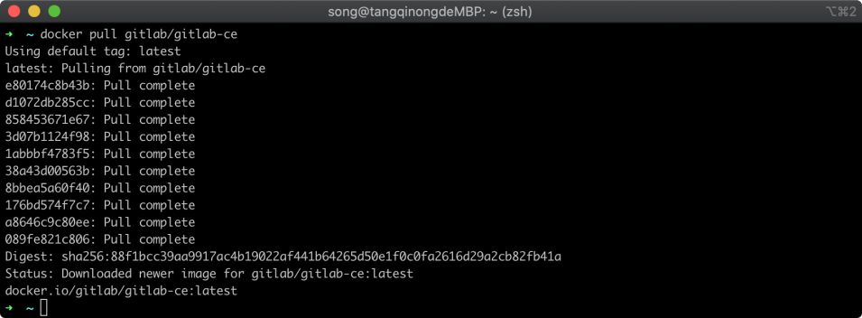

在上图中可以看到下载进行已经完成，这个下载的时间会根据你网速来决定，接着我们可以通过查看镜像列表来确认是否下载成功，执行命令如下所示：

```shell
docker images
```

命令执行完毕之后，Docker 返回的镜像列表如下图所示：

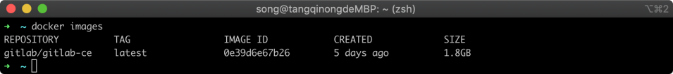

在上图中可以看到 `gitlab/gitlab-ce` 这个镜像，说明已经下载到本地了。接着我们先装备几个文件夹，这些文件夹将来要映射到 Gitlab 这个服务中，这样数据便会产生在这几个文件夹里面，将来做数据迁移更方便，建立相关存储文件夹，config 配置文件、logs 日志文件、 data 数据文件，执行的命令如下所示：

```shell
mkdir -p ~/config/gitlab/config
mkdir -p ~/config/gitlab/logs
mkdir -p ~/config/gitlab/data
```

命令执行完毕之后，我们使用 `ls` 命令确认一下，返回的信息文件夹列表如下所示：

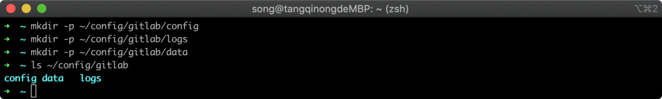

在上图中可以看到三个文件夹已经创建成功，他们的绝对路径位于：

```
/Users/song/config/gitlab/config, 
/Users/song/config/gitlab/logs,
/Users/song/config/gitlab/data。
```

## 30.3 运行 Gitlab 容器

接着，我们就可以使用 Gitlab 镜像来启动容器实例，Gitlab 提供 http 和 https 服务，我们将容器实例的 `443` 端口映射到宿主机的 `8443` 端口，容器实例的 `80` 端口映射到宿主机的 `8089` 端口，容器实例的 `22` 端口映射到宿主机的 `2222` 端口，接着把我们刚才创建好的配置文件夹、日志文件夹、数据文件夹挂载到容器里面去，最终的启动脚本命令为：

```
docker run --detach --publish 8443:443 --publish 8090:80 --publish 2222:22 --name gitlab --restart always -v /Users/song/config/gitlab/config:/etc/gitlab -v /Users/song/config/gitlab/logs:/var/log/gitlab -v /Users/song/config/gitlab/data:/var/opt/gitlab gitlab/gitlab-ce
```

命令执行完毕之后，Docker 会启动一个容器实例，并返回容器实例的 id，并在后台执行初始化脚本，如下图所示：

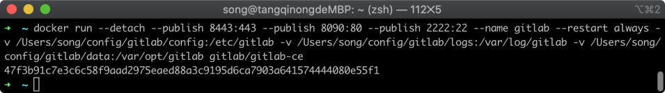

在上图中可以看到一个容器实例的 ID，也可以通过查看容器列表来查看当前有几个容器在运行，查看运行的容器列表命令如下所示：

```shell
docker ps
```

命令执行完毕之后，docker 返回的容器列表如下所示

```
CONTAINER         ID               IMAGE              COMMAND              CREATED   STATUS                 PORTS     
NAMES
47f3b91c7e3c  gitlab/gitlab-ce    "/assets/wrapper"   28 seconds ago      Up 26 seconds (health: starting)   0.0.0.0:2222->22/tcp, 0.0.0.0:8090->80/tcp, 0.0.0.0:8443->443/tcp   gitlab
```

在可以看到目前只有一个 Gitlab 容器在运行，我们可以通过 `docker logs` 命令查看容器的标准输出日志，执行命令如下所示：

```shell
docker logs -f gitlab
```

命令执行完毕之后，可以看到初始化的过程，当初始化完成之后，能看到如下图所示的信息：

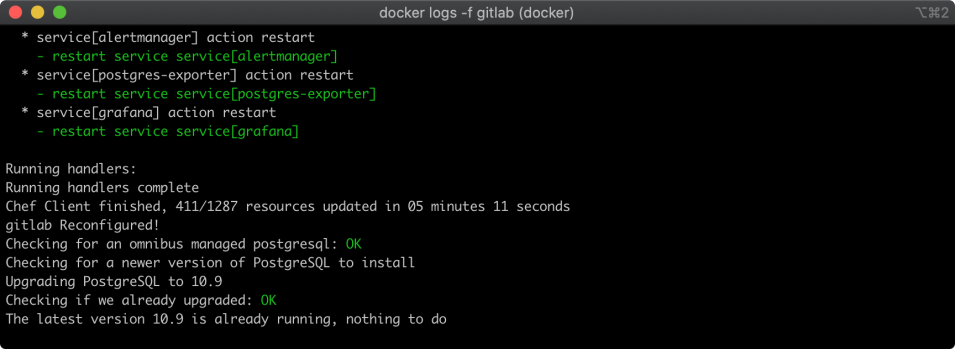

在上图中，可以看到提示服务已经启动完成，在我的电脑中这个过程大约执行了 2 分钟。

## 30.4 gitlab 管理配置

启动完成之后，我们就可以打开 Gitlab 的 web 管理页面进行管理了，在浏览器中输入网址：`http://localhost:8090` 即可进入 Gitlab 页面，首次进入管理页面时候，会让你设置 root 用户的密码，如下图所示：

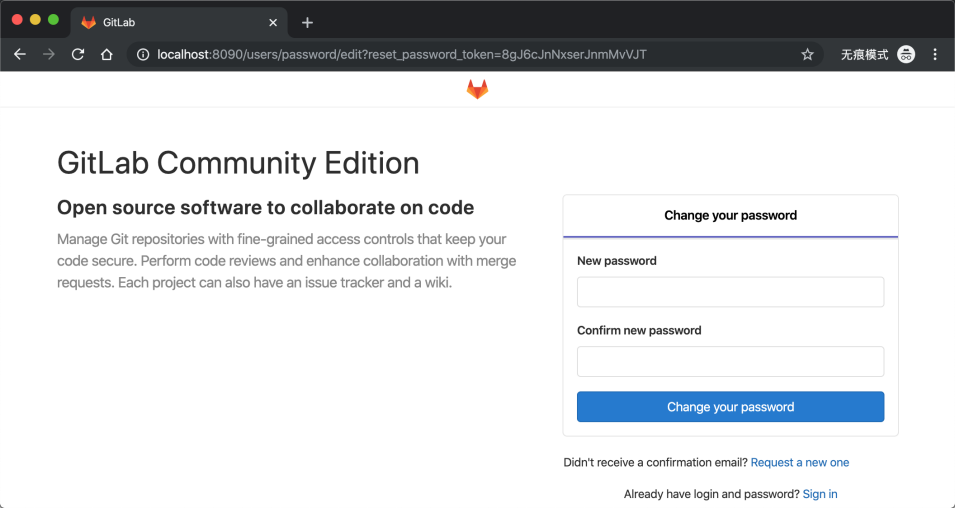

在上图中可以看到一个表单，将你需要设置的密码填写进去，然后提交就设置好了账户密码，下次再次登录时候用户名填写 `root`，密码填写刚才设置的密码就可以了，登录进入之后看到的页面如下所示，进去之后是英文界面，如下图所示：


在上图中，可以看到中间有一个 `Create a project` 的按钮，我们点击这个按钮就会来到创建仓库的页面，URL 地址为：
`http://localhost:8090/projects/new`，如下图所示：

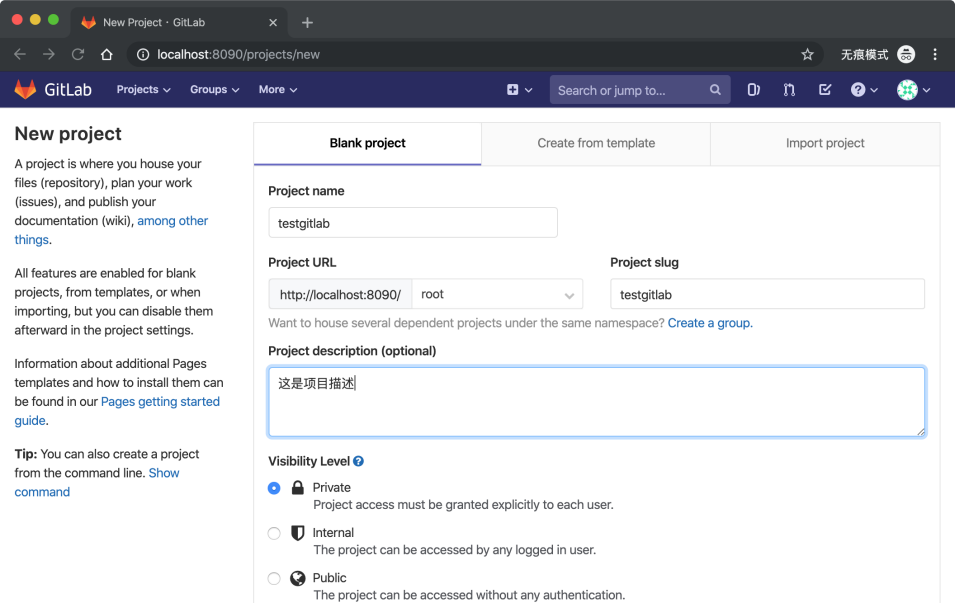

在这个页面当中，我们可以填写我们的仓库名称以及相关信息，然后提交表单后，Gitlab 会帮我新建一个仓库，并会在页面中自动跳转到创建项目的详情页面，如下图所示：


在上图中我们注意看我红色框选出来的内容，这个地址便是给客户端所使用的地址，我们可以用这个地址克隆和推送代码等，我们将这个地址复制出来 `http://47f3b91c7e3c/root/testgitlab.git`，把这个地址中的域名部分改成 IP+ 端口形式就可以给其他电脑访问，我把他域名部分改成 `localhost:8089` 之后的地址为：`http://localhost:8090/root/testgitlab.git`。

接着，我用这个地址克隆一份代码，执行的命令如下所示：

```
git clone http://localhost:8090/root/testgitlab.git
```

命令执行完毕之后，Git 返回的信息如下图所示。

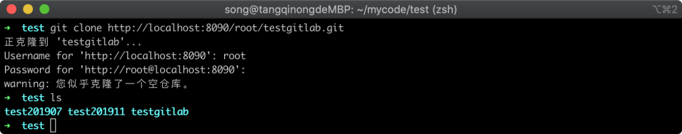

在上图中可以看到已经成功的克隆出一个仓库，至此已经搭建好自己的 `gitlab` 环境了。

## 30.5 Gitlab 日常维护

Gitlab 服务搭建好之后，我们后面可能会涉及到一些维护工作，因为使用 Docker 方式搭建的，所以这里我简单提一下一些常用到的文件配置，我们要进入 Gitlab 这个容器 (你可以理解为虚拟机)，需要执行命令如下所示：

```shell
docker exec -it gitlab bash
```

进入这个容器之后，我们可以通过 `ls` 命令查看文件列表，如下图所示：

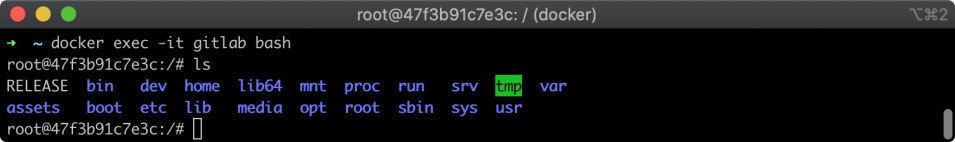

在上图中，可以看到这些文件夹和宿主机不一致，说明我们已经进入容器成功。在维护 Gitlab 中我们可能会修改配置文件，这个配置文件路径为 `/opt/gitlab/embedded/service/gitlab-rails/config/gitlab.yml`，我们可以大致查看一下命令：

```shell
tail /opt/gitlab/embedded/service/gitlab-rails/config/gitlab.yml
```

执行命令之后，返回了末尾 10 行配置，如下图所示：

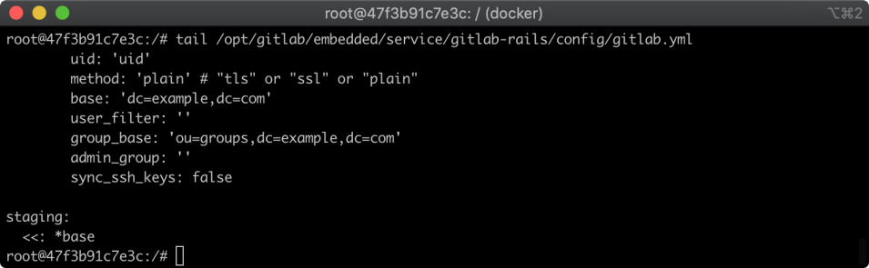

在上图中，可以看到这个配置文件是存在的，我们如果需要修改它通过 vim 编辑即可，在维护服务过程中可能需要启动或停止服务，不过容器里面的各项服务有很多，比如 `redis`、`Nginx`、`grafana` 等等服务，不过 Gitlab 提供了一个总开关，我们控制总开关即可，命令如下所示：

```shell
gitlab-ctl restart  // 重启
gitlab-ctl stop      // 停止
gitlab-ctl start     // 启动
```

我们以重启服务命令为例，命令执行完毕之后，如下图所示：

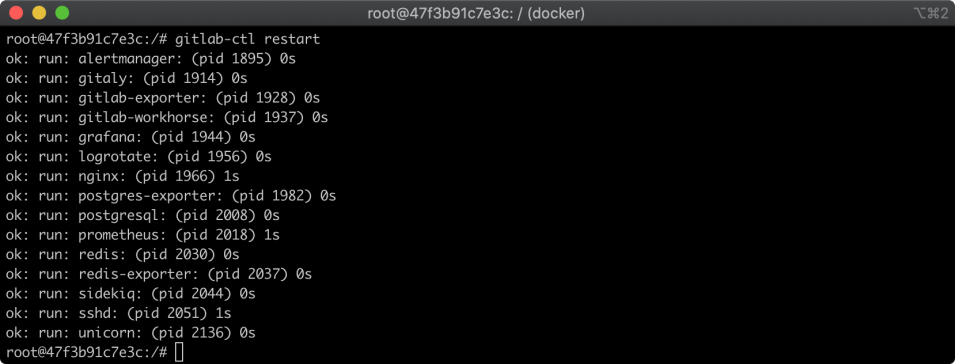

在上图中，可以看到有很多个服务会进行重启，另外两个命令类似。