# 16-本地覆盖远端：把本地仓库覆盖到远程仓库


> 学习从来无捷径，循序渐进登高峰。—— 高永祚

在使用 Git 的过程中可能会遇到这样的场景需要覆盖远程仓库，比如说，不小心把错误的代码推送到远程仓库，这个时候想把错误的代码撤销有两种方式。

第一种是代码层面覆盖，就是我们再次修改代码，把错误的代码纠正，然后再次提交，然后推送到远程仓库中。

第二种是将方式则是将记录覆盖，我们使用 `git reset 版本号` 命令恢复到上一个版本，然后重新提交，默认情况下 Git 会拒绝你的提交，因为提交的版本号比远程仓库的落后，所以需要用上强制提交方式，也就是本节需要提到的。

## 16.1 覆盖远程

两种方式的区别是第一种方式会在 Git 中记录两个无效的提交，而第二种方式则不会显示错误的提交记录；有些情况下你可能将一些敏感信息不小心提交上去了，如果第一种处理方式必然会泄露出去，而第二种则可以避免，下面我将两种方式逐一演示。

### 16.1.1 场景复现

现在我新建一个文件，模拟成数据库配置文件泄露的样子，执行的命令行如下：

```
mkdir config && echo "user = root  \n password = root" > config/dbconfig.php
```

添加文件后，再将代码提交到本地仓库当中，执行命令如下：

```
git add . && git commit config  -m '模拟配置文件泄露'
```

命令执行的截图如下：
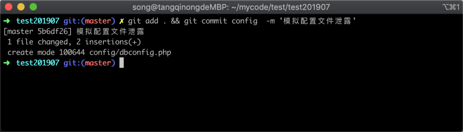

可以看到已经新建了一个 `dbconfig.php` 文件，接着我再把代码推送到远程仓库，命令如下：

```
git push
```

命令执行截图如下：

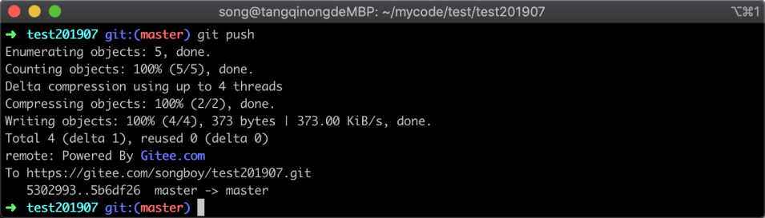

在图中的信息可以看出，我已经成功将本地仓库推送到远程仓库中。

### 16.1.2 代码覆盖

提交之后，我突然发现我不应该把配置文件提交上去，因为里面包含了一些很重要的信息，为了不让人发现这个文件的内容，于是我将这个文件删除，然后再次提交，执行命令如下：

```
rm config/dbconfig.php  && git diff
```

执行命令截图如下：
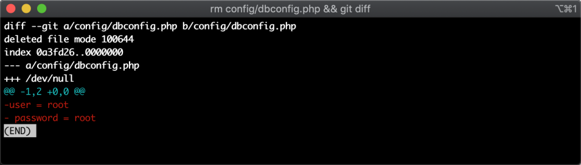

在图中可以看到，执行命令后 `dbconfig.php` 里面的内容已删除，接着我将修改的内容提交到本地仓库当中去，执行命令如下：

```
git add . && git commit config  -m '覆盖代码并推送'
```

执行命令后的截图如下：

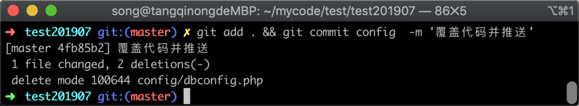

成功提交到本地仓库后，我再把本地仓库推送到远程仓库中，执行命令如下：

```
git push
```

执行命令后的截图如下：

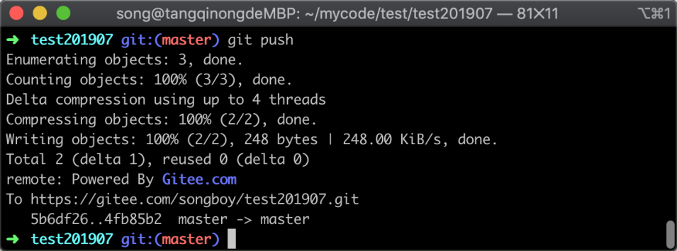

可以看到已经成功把本地仓库推送到了远程仓库当中去，接着我去远端仓库中去查看代码，验证一下是不是已经看不到配置文件了，下图为远程仓库的 web 页面。

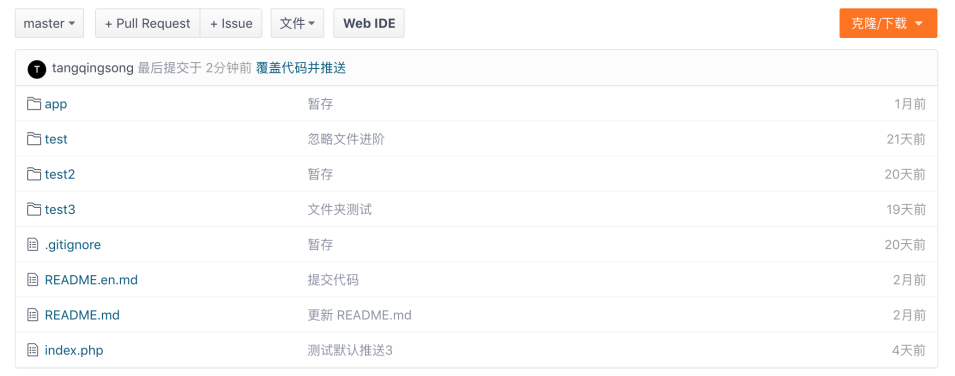

在远端仓库的 web 页面，可以看到 dbconfig 文件夹都不见了，说明已经成功了

接着我打开远端仓库的历史记录，如下图所示

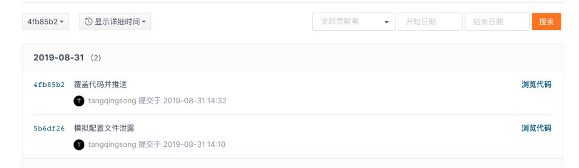

但是在历史记录中依然可以看到修改记录，点击修改详情，如下图所示：

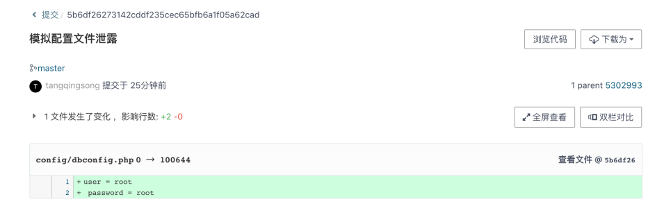

在图中可以看到误提交的内容依然可以被看到，这里得出一个结论，代码覆盖虽然可以将代码回滚，但是提交记录仍然会被保留，所以不适合敏感信息被提交上来的情况。

### 16.1.3 记录覆盖

使用代码覆盖的方式虽然可以将最新的代码修改回来，但在敏感信息泄露场景下依然不能满足，如果要彻底的让记录不留痕迹，我们可以使用记录覆盖的方式。

首先，我们通过查看提交记录得到上一次记录 hash 值，执行的命令如下：

```
git log
```

命令执行后终端中返回的信息，如下图所示：

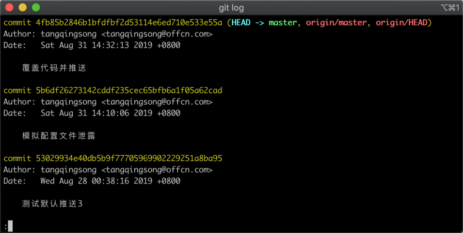

在图中可以看到，我们要把版本恢复到上上次，那么对应的 hash 值便是`53029934e40db5b9f77705969902229251a8ba95`，我们首先恢复到指定版本，并通过查看提交记录来判断是否恢复成功，执行命令如下：

```
git reset 53029934e40db5b9f77705969902229251a8ba95 && git log
```

命令执行之后，返回结果如下图所示：

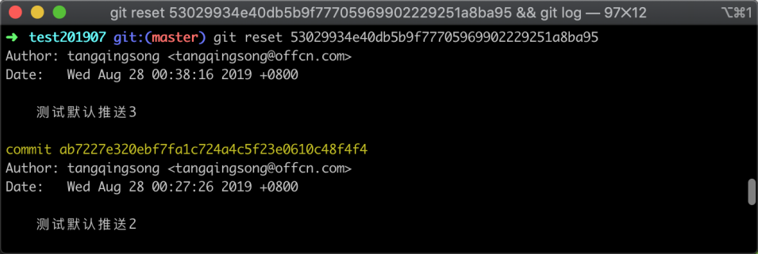

在图中可以看到，已经将代码恢复到历史版本了，接着我们使用 `git push`将本地仓库推送到远程，执行命令如下：

```
git push
```

命令执行之后，返回信息如下图所示：

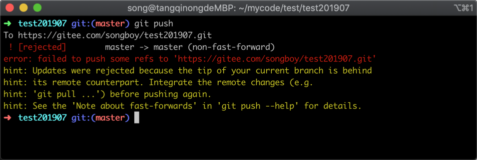

在图中可以看到提交并没有成功，因为提交的版本号落后于远程版本；如果我们需要提交需要用到强制推送命令，强制推送参考如下：

```
git push -f
```

命令执行之后，返回结果如下图所示：

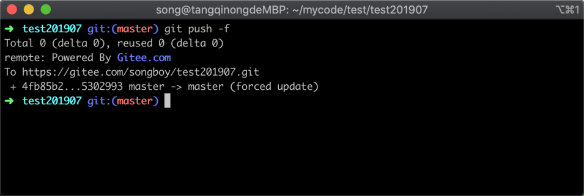

在图中可以看到已经提交成功，至此我们将错误的提交记录已经完全覆盖销毁。

## 16.2 权限控制

Git 默认情况下允许强制推送，但这样也有可能造成一些安全隐患，比如某个开发者做了一些操作，不想让其他人知道，他就可以使用强制推送的特点来抹掉痕迹，或者直接将整个远程仓库代码恢复到初始化的状态等问题。

我们可以设置远程仓库的强制推送权限，这里以码云平台为例，在项目的 `管理`->`基本设置` 中。

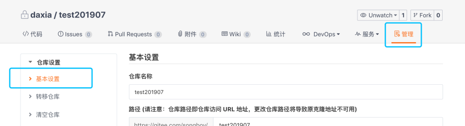

可以在下方看到一个强制推送的权限选项，默认是允许强制推送的，当勾选禁止强制推送则不能强制推送。

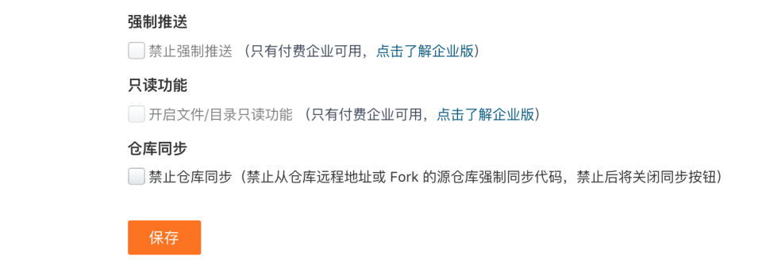

在公司团队中通常采用的是 gitlab 搭建，这里将 gitlab 设置的界面的地址发出来：

```
https://gitlab.eoffcn.com/video/php/record-edge-cloud/settings/repository
```

打开后可以看到一个设置权限的界面，选择一个分支分配给不同身份的组不同权限：

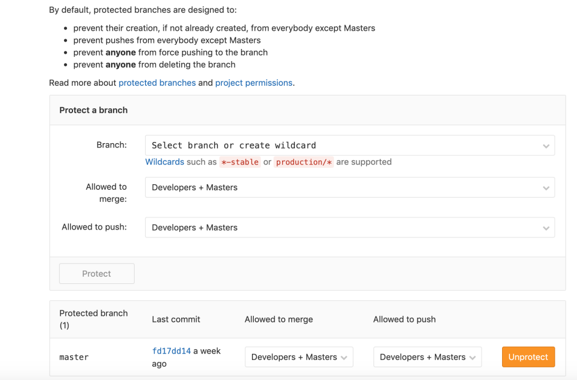

## 16.3 小结

在这一节中主要讲解了，将本地仓库覆盖到远程的两种方法，以及安全权限配置，需要注意的三点分别是：

1. 代码覆盖只是修改远程最新的代码，其他人仍然可以在历史中找到提交记录
2. 记录覆盖将彻底将远程的提交覆盖，包含了代码和提交记录
3. 强制推送权限最好只交给一个人去控制，否则容易引发一些安全问题

