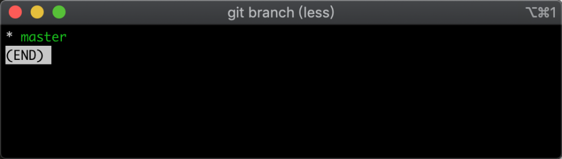
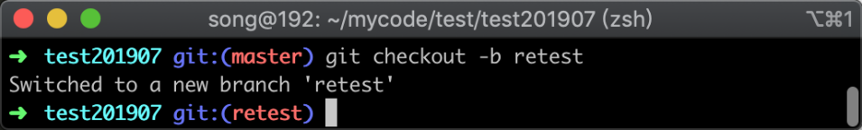
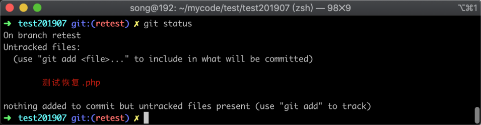
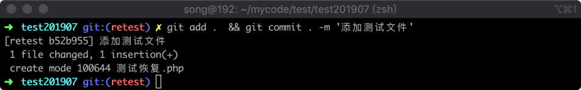
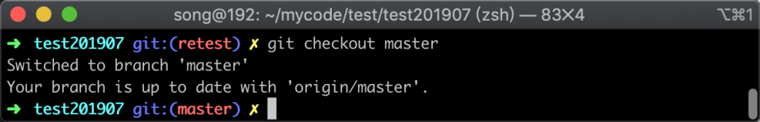
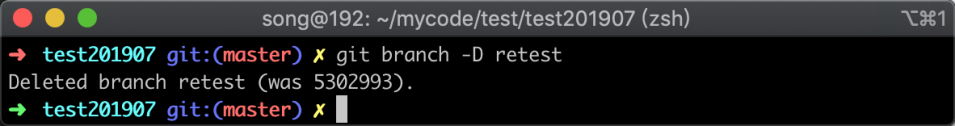
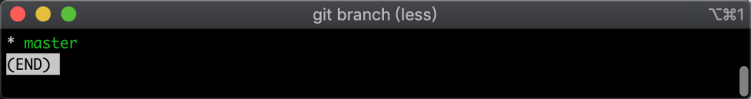
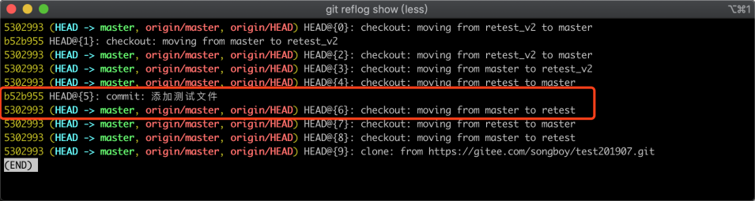
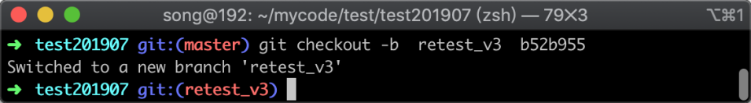
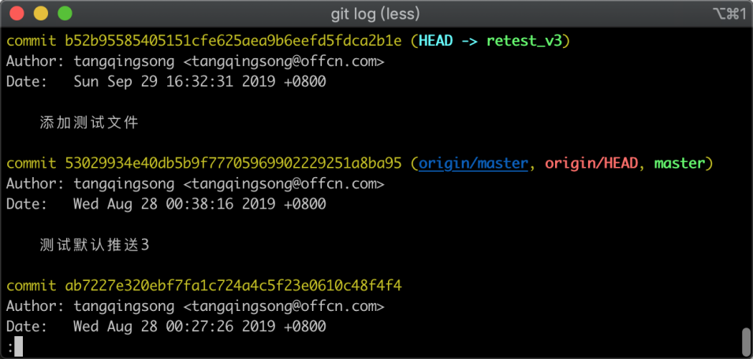

# 18-恢复已删除的分支：恢复误删除的分支数据


> 成功＝艰苦的劳动＋正确的方法＋少谈空话。 ——爱因斯坦

在使用 Git 的过程中，有时可能会有一些错误操作，造成分支被删除或者丢失，比如 `branch -d test`，如果我们想恢复此分支，可以通过 reflog 来进行恢复，不过前提是，这个 test 分支的信息没有被 `git gc` 清除。

一般情况下，除非手动执行了 `git gc` 命令，否则 gc 对那些无用的 object 会保留很长时间后才清除的，reflog 是 Git 提供的一个内部工具，用于记录对 Git 仓库进行的各种操作，可以使用 `git reflog show` 所有的管理类操作日志。

## 18.1 场景复现

我们现在模拟一下现场，首先我会新建一个分支，然后修改一些内容，然后提交到版本控制器中，最后再将此分支删除，模拟出分支被删除的情况。

首先，我们查看当前版本库控制器中有哪些分支，参考命令如下：

```
git branch
```

执行命令后，返回结果如下图所示：



在图中可以看到当前分支处于 master 中，并且本地只存在一个 master 分支。

接着我们新建一个新的分支，参考命令如下：

```
git checkout -b retest
```

命令执行之后，提示信息如下：



在终端的截图中可以看出新建分支已经成功，并且已经自动切换到了 `retest` 分支上

接着我们随意修改一下代码，参考命令如下：

```
echo '测试恢复' > 测试恢复.php
```

执行修改代码的命令后，我们再检查一下当前的修改状态，参考命令如下：

```
git status
```

执行命令后，返回的提示信息如下图所示：



在上图中可以看到新增了一个文件，我们将此文件提交到版本控制器中，参考命令如下：

```
git add .  && git commit . -m '添加测试文件'
```

命令执行完后返回如下图所示：



在图中可以看到一个文件被修改，新增了一行代码。接着我们开始将此分支删除，首先我们切换到另外一个分支上去，参考命令如下：

```
git checkout master
```

执行命令之后，返回的信息如下图所示：



在图中可以看到已经成功切换到了 master 分支，接着我再把 `retest` 分支删除，参考命令如下：

```
git branch -D retest
```

命令执行之后，返回的信息如下图所示：



在图中可以看到 Git 已经提示删除分支成功，接下来我们查看分支列表，参考命令如下：

```
git branch
```

命令执行之后，返回信息如下图所示：



在图中可以看出当前只剩下 `master` 分支，之前的 `retest` 已经不见了；至此我们实验环境已经完成，接下来将开始进行恢复分支的实践。

## 18.2 恢复实践

恢复的过程，相比实验环境搭建来说很简单，我们只需要两步操作即可，首先通过日志找到 `commitid`，然后通过新建分支的方式，加入 `commitid` 即可。

### 18.2.1 找出 commitId

在之前的章节当中，我们学习了 `git log` 命令，这条命令可以显示所有提交过的版本信息，但我们对分支的一些管理操作并不会显示出来；这些管理的操作日志并不是没有记录，而是需要使用 `git reflog` 命令才能显示，显示分支管理命令参考命令如下：

```
git reflog show
```

命令执行之后返回信息如下图所示：



在图中注意看红色框选区域，下面一条是我切换到 `retest` 分支时候记录下来的，另外一条是执行了提交操作，我们把 `commitid` 值 `b52b955` 复制下来。

接着使用 `git branch 分支名称 commit_id` 方式建立一个新的分支，参考命令如下：

```
git checkout -b  retest_v3  b52b955
```

命令执行之后，返回信息如下图所示：



在图中可以看出一个成功新建了一个 `retest_v3` 分支，并自动切换当前所在的分支为 `retest_v3`，接下来我们查看 `commitid` 是否也包含在里面，查看提交记录参考命令如下：

```
git log
```

执行之后，返回的提交版本记录如下图所示：



在图中可以看到，我们之前搭建实验环境时候提交的记录显示出来了，至此我们已经成功把丢失的分支，通过重建分支的方式恢复到了 `retest_v3` 上了。

## 18.3 常见问题

在实验 Git 中，还有很多种方式造成可能丢失记录或分支的情况，恢复起来其实都大同小异，这里针对几个常见的问题进行说明一下。

### 18.3.1 回滚 reset 操作

如果你不小心使用 `git reset` 回滚了提交记录，想找回之前的提交记录也是可以的；可以 `git reflog` 查看操作历史，找到执行 `git reset` 命令之前 `commitid`，然后 `git reset --hard` 到那个 `commitid` 即可。

### 18.3.2 从历史版本中找回删除的文件

有时候，我们在某个版本中删除了文件，后来又突然发现需要这个文件，也是可以恢复的；恢复之前首先确定要恢复的文件在哪一个版本（commit）中，假设那个版本号是： 7a4312sd，文件路径为 abc.php 那么参考命如下：

```
git checkout 7a4312sd abc.php
```

## 18.4 小结

Git 是一个比较成熟的版本控制器系统，通常误操作导致的代码丢失，只要还没有触发 `git gc` 操作，那么基本都是可以恢复的，恢复的方式主要是通过 `git reflog` 找出对应的 commitid，然后按照去恢复：

1. 使用 `git reflog` 可以查看 Git 的操作的日志，`git log` 只能查看版本日志；
2. 找回分支命令参考 `git branch 分支名称 commitid`。
