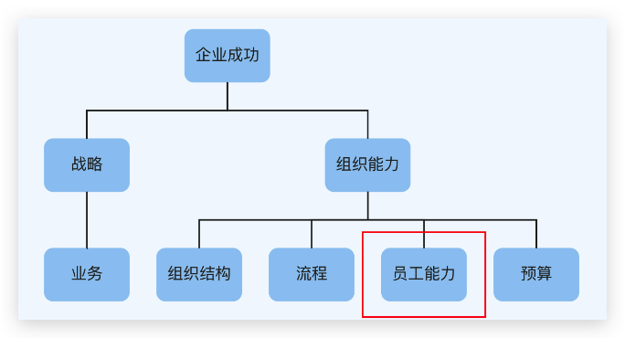
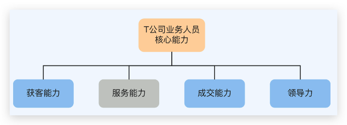
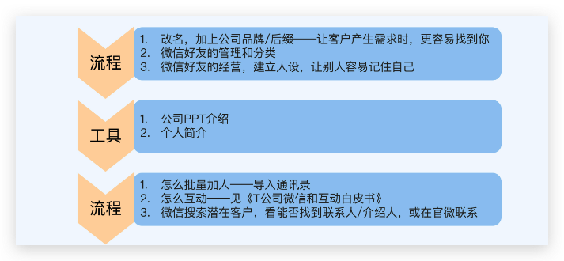
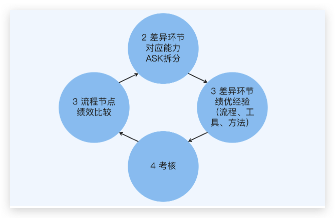

# 18-人才培养：怎么把人才转化成实际生产力？

<audio controls="" title="18-人才培养：怎么把人才转化成实际生产力？">
  <source
    id="mp3"
    src="/mp3/review-study/18-人才培养：怎么把人才转化成实际生产力？.m4a"
  />
</audio>

你好，我是张鹏！

在上一讲中，我讲述了 T 公司通过优化流程把人效提升了 3 倍的案例。但是，当流程优化到极致的时候，制约公司产出的可能就是员工的个人能力了。

个人能力的提升，首先要靠工作实践，可是如果完全放养，单纯靠员工自己去实践摸索，提升速度太慢，很难跟上竞争激烈的市场环境。所以，很多公司也会给员工安排培训，比如请专家来演讲，鼓励员工买书买课，但是往往钱花了不少，效果却不是很理想。

那么，怎么培养人才，才能形成实际的生产力呢？今天我们继续来看 T 公司的故事。

## 案例背景：规模不够大

T 公司优化流程的一年之后，流程已经把员工的能力发挥到了极致。这时创始人小 Y 还想让公司进一步成长，于是找我探讨了 2 个问题：

一个人总是重复做一个层次的类似工作，时间长了是不是就会丧失动力？

现有的团队还能不能进一步提升人效？

第一个问题的答案很明显，是的。无论工作一开始有多难，一旦精通了之后还要不停地重复，员工一定会产生倦怠感，这个也符合心流的原理。

心理学家米哈里·契克森米哈赖定义心流为一种将个体注意力完全投注在某活动上的感觉；心流产生时同时会有高度的兴奋及充实感。比如一个游戏迷在打游戏的时候会产生极度的专注和投入就是“心流”，因此现代企业都在想办法创造让员工能产生心流的工作体验。其中最核心的是三个机制：

清晰的目标；

即时反馈；

稍微超出能力的适度挑战。

很多员工干得好好地就会离职，“手头的工作没啥意思”（缺乏挑战和目标）就是一个重要的原因。

所以，如果想让员工在工作的时候有更饱满的热情，增加挑战、提升员工能力就成为了必备条件。也就是说，公司高层需要根据业务发展方向，科学地设置员工的职业成长路径：

首先，让员工成为“1”型人才（专才）；

接着，让员工从“1”型人才（一个点上专业，比如资深 XX 员）升级为“T”型人才（一专多能，能力覆盖一个业务，比如 Team Leader）；

未来，甚至让员工成为“π”型人才（跨职能专家，比如负责一个 BU 事业部或者分公司）。

确定了员工的发展方向之后，我们再看看第二个问题。

第二个问题就要复杂一些了。理论上来说，人效的增长是没有尽头的，主要与认知和赋能的边界有关（你可以思考一下人类近代的几次时代变革：蒸汽机时代——电气化时代——信息化时代）。

我们真正需要思考的问题是：**继续提升人效**更重要，还是**可复制的高人效**更重要。

小 Y 最终选择了**可复制的高人效**。从行业 3 倍人效提升到 4 倍～ 5 倍（4-5 倍产值），只会让人觉得你很牛；但是无法复制的话，规模就上不去，对于企业的意义远不如 3 倍人效规模放大 10 倍（30 倍产值）。

## 复盘详解

确定了“可复制的高人效”这个目标之后，小 Y 带着团队和我针对人才培养的问题做了一次复盘。

### 对比

这次复盘的目标是总结绩优员工的经验，复制到整个组织，从而提升整体绩效。于是我们就要看看，绩优员工的标准和普通员工到底有哪些差距。

我们还是从工作流程来开始分析：

1. 获取客源
2. 跟进洽谈
3. 独家委托
4. 需求确认
5. 实地带看
6. 签约交付
7. 售后服务

我们发现，流程中的各个环节分别需要不同的能力：

**服务能力**：对应跟进洽谈、实地带看和售后服务环节，这方面 T 公司以前就已经做得很棒了。

**获客能力**：对应获取客源环节。

**成交能力**：对应独家委托、需求确认和签约交付环节。

另外，还有一项能力不体现在某个具体的环节，那就是**领导力**，也就是带团队的能力。

我把这些能力依照 MECE 原则重新用逻辑树梳理了一遍，发现绩优员工和普通员工的能力区别在于：

获客能力

成交能力

领导力

到这里，能力提升的关键点就定位出来了。

### 逻辑

那么，T 公司要做的就是帮助员工提升这些能力吗？没这么简单。请注意，T 公司真正的问题是如何提高可复制的高人效，而**绩效不等于能力**。因此，我们需要做进一步的分析：

绩效好不好，按照“**杨三角”**（杨国安教授发明的组织发展理论框架）的理论要从三个层面去研究，分别是：

**员工能力**

**员工治理**

**员工意愿度**

其中，员工意愿度主要靠文化和激励机制，员工治理主要靠流程和规则，员工能力才是依靠培养机制。

于是在这次复盘中，我们决定聚焦讨论一个议题：**如何提升员工能力**。它涉及两个方面，一是确定培养的目标，二是确定培养的计划。

#### 一、培养的目标

培养的目标对应的是岗位或流程环节的能力模型。我们使用了 **ASK 框架**（逻辑树框架）来进行能力建模：

**素养（Attitude）**：包括诚信、责任心、服务意识等。

**技能（Skill）**：包括开拓能力、沟通能力、协调能力、应变能力等。

**知识（Knowledge）**：包括房产租赁专业知识、相关法律财务知识等。

每个环节需要的能力是不同的，由于商业保密的关系，这里我只拿**获客能力**举个例子：

A：主动性和系统思考等。

S：文案能力、组织能力和快速链接人的能力等。

K：房产知识和商业活动主办流程知识等。

针对主动性，我根据 T 公司的业务实际情况设计了若干考核行动条目，比如：

多长时间对已有客户进行电话回访。

对于客户 Call-in 的问题，多长时间进行回复。

多长时间做一轮陌拜等等。

这样按照逻辑树的形式分解下去，就可以落实到具体的行动考核点。

用 ASK 框架完成建模之后，** 知识（K）**和**技能（S）**的部分可以在内部进行培养，而**素养（S）** 则主要用于人员招聘的时候重点考核（因为这部分培养周期长和难度大）。

#### 二、培养的计划

怎么根据培养的目标制定培养的计划呢？

首先，我们把每一个流程中的大环节继续细分，比如获取客源环节又可以细分为两步：

第一步，**总结客户画像**。

第二步，**根据客户通路分为三个选项**：

拓新客

渠道合作

熟客维护

在每个分项上，根据绩优员工的成功经验总结出来形成**流程、工具**以及**方法**之后，逻辑树结合流程图就变成可以实操的**培训内容**了。

下面这张图展示了其中微信渠道拓新这一部分的实例：

接下来，为了让员工能够掌握这些技能，我们又设计了培养的考核点。

关于知识部分的，主要是通过培训学习和笔试、面试进行胜任力确认；

关于技能部分，需要通过关键历练（比如通过在微信上找到 20 个新客户来确认员工已经掌握了“微信拓客”能力）来验证；

关于素养部分，一部分是通过招聘，一部分是通过更长时间（半年以上）的合作过程来观察合不合适。

**整个员工能力提升的逻辑，其实是通过逻辑树拆分的过程，一直拆到无法拆分的状态为止。**

### 认知

T 公司在这一次复盘之前，做过无数次绩优员工的内部经验分享会，但是效果都不太好。在这次复盘的过程中，T 公司的高层意识到一点，**绩优员工零散的分享对于普通员工的帮助并不大**。

因为场景不可能是一模一样的，如果普通员工无法领悟到每一个场景对应的流程的底层逻辑和需要具备的核心技能和知识，依然无法达成相应结果。

另外，人的素养是长年累月形成的，虽然好的企业文化和内部培训可以起到一些作用，但是主要是靠选择合适的人做合适的岗位才可能得到期望中人岗匹配之后的化学效应。

整个人才培养的过程其实是有一个基本流程闭环的，可以总结成一个口诀：

**流程节点做比较，差异部分 ASK，重点环节萃经验，最后一定要考核。**

### 规划

T 公司高层基本了解了培养提升员工能力的思路之后，就开始制定员工的招聘和培养计划。

首先，他们成立人才培养小组，花了将近一周的时间详细梳理了颗粒度更细致的工作流程，并对每一个环节，进行了 ASK 的能力分解，这样就定制出了针对性更强的的岗位要求和培养计划。

接着，他们用了一个月的时间，形成了详细的培训内容，并制定培训计划，一开始的培训老师由高管以及绩优员工担当。

最后，针对不同的培养方式（知识、技能、素养）制定出考核的方式（笔试面试、关键历练、长时间观察评估）。由于身处服务行业，人是最重要的因素，在我的建议下，由创始人小 Y 亲自担当这个项目的总负责人，一抓到底。

## 最终结果：复制了高人效

经过大概半年的时间之后，T 公司增加了一倍的新人，可喜的是，3 倍的行业平均人效并没有下降。

并且他们规划在接下来的一年里，再增加 2 倍的人手，这样就几乎可以成为当地这个细分领域中第一梯队的选址服务商了。

## 小结

这一讲的内容中的案例，是上一讲的延续，在组织流程改造之后，接下来就是如何提升人效。现在，我们回顾一下重点内容：

可以通过对工作流程的环节上，绩优员工与普通员工的表现对比找出表现差距。

把这些环节对应的能力通过 ASK 模型梳理出细分的素养、技能和知识，素养用于招聘和选拔，技能和知识用于培养的目标设定。

把每个环节的颗粒度继续细分，对应给出每个节点对应的流程、工具和方法，达到可以培养的程度。

最后根据不同的内容范畴，决定考核方式。

## 思考题

这就是这一讲的全部内容了，最后留一道思考题给你：

在你们公司肯定有一些工作流程（产品研发、市场营销等），你能否根据这个流程上的环节，对比一下绩优员工和普通员工的表现，找出其中一个环节对应能力的 ASK 模型？

欢迎你把答案写在评论区，和我一起讨论。
