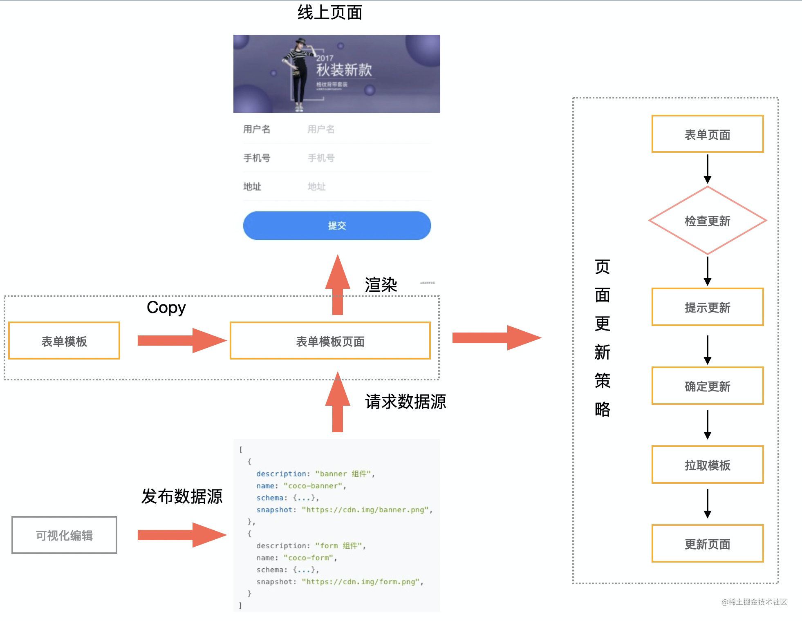

# 稳定性-模板的更新策略
模板开发不是一次性的活，可能随着业务的变更和调整，我们的模板也要做出相应的适配和二次开发。接下来我们开开心心的设计了以下模式来应对末班的变更：模板只有一套，线上页面基于模板渲染，编辑器后台对模板数据进行变更，之后将变更的数据结构发布，线上页面即可通过 `page = fn(template, data)` 的模式进行展现。当模板升级了，线上页面变随之升级。看起来似乎可以满足我们的需求。


但是上图设计有一个致命的缺陷：万一我们二次迭代开发的模板有一个线上问题，由于模板和最后投放页面没有隔离，那么使用该模板的页面将会都有问题，这个影响面会特别的广，也非常不可控。最可怕的是在某些场景有问题，在某些场景又正常，非常难以定位排查。其次我们无法保证做到新老页面的兼容性。举个🌰，假设我们升级之前的模板数据结构是
```json
{
  "data": {
    "img": ""
  }
}
```
升级之后变成了
```json
{
  "props": {
    "src": ""
  }
}
```
此时我们的页面如果不做兼容的化，就会出现 `新模板 + 老数据` 的情况，很容易导致页面报错不可用。那么我们应该如何设计呢？

## 解耦页面和模板
其实上述问题的本质就是因为我们的页面和模板是同一个，只不过是根据数据源来进行的不同渲染而已，如果我们把页面设计成从模板的拷贝，那么不就可以完美解决上述问题了吗？


我们再来顺一下流程：
1. 编辑器对模板页面进行数据结构生成&发布
2. 从表单模板中 clone 一份页面，和源解耦
3. 发布 clone 后的页面
4. 模板升级不影响 clone 后的页面

听起来还有点小激动，很快我们就完成了这样的功能，但是又出现了新问题：模板已经和页面解耦了，那后续页面如何享受模板更新呢？其实我们可以想象模板和页面是类似于 `gitlab` 上的2个仓库 A 和 B。 B 仓库是基于 A 仓库的 `clone`。要更新 B 其实我们可以先比较 A B 的版本关系，确定了 B 落后于 A 后，我们可以通过 `git` 操作 A 仓库，强更 B 仓库：



## 总结
本章节比较偏理论，但是程序设计本身就是这样，只有想清楚一件事之后，编码都是分分钟的事儿。这里在顺便说一下，模板版本号和页面版本号怎么维护的问题，模板版本号可以通过接口在模板发布的时候，传给 server 存储。页面版本在业务方基于模板创建页面的时候生成，取当前的模板版本号，存于 server 层。那么后面的事无非就是二者比较嘛。

最后我们再回到模板开篇提到的问题：如何实现一个跨框架、跨平台的模板页面，其实说到这里我们就很好的解决这个问题。我们为了跨框架、跨平台，其实核心就是为了解决编辑器如何呈现不同语言、框架的可视化编辑流程。

#### 1. 跨框架
要实现跨框架模板预览展示，核心要解决的就是不同框架操作通信的问题，这一层可以通过一个消息通信层（Message Adapter）来抹平差异。最终内嵌到后台预览的全部都是静态的 `html、js、css`。而浏览器天生支持对这些静态资源的解析执行。

#### 2. 跨平台
跨平台就需要实现不同端在浏览器中运行，这里我们以小程序举例。如何让微信小程序运行在浏览器环境下？其实业界已有很多解决方案，比如[wept](https://github.com/wetools/wept) 就是利用对小程序的逆向编译成 `html、js、css` 让其运行在浏览器端。

好了，接下来我们再思考一个问题：如果很多模板都用到了同一个 `banner` 组件，而且功能基本一致，我们有没有办法抽出一个类似于组件库的全局组件呢？这样就不用每个模板都写。
