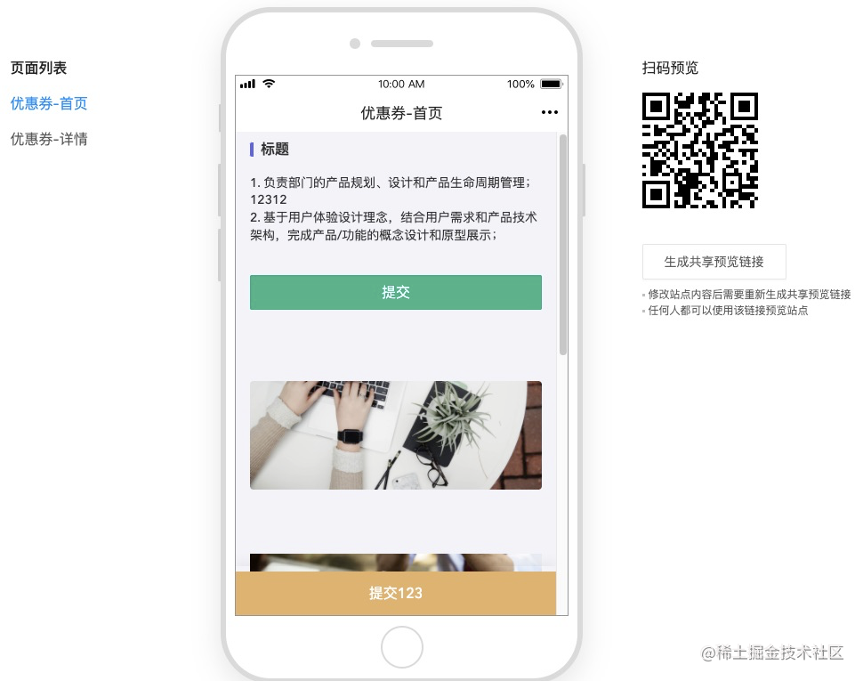
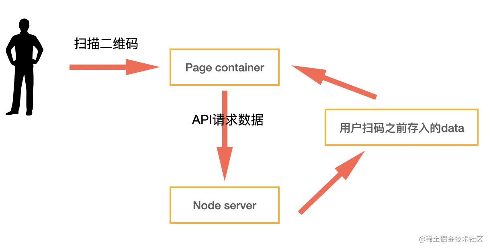

# 可视化编辑区mock&预览
如果我们来开发一个活动页，活动营销平台往往需要根据不同环境配置不同的活动 `id` 用于验证测试工作。所以我们编辑区展示的页面应该用什么环境的活动 `id` 呢？如果用测试环境的，那么可能会出现测试环境数据有很多脏数据，页面展示结构乱，不美观的情况，甚至可能因为测试环境不稳定经常挂，影响页面编辑操作。如果用线上环境的 `id` 那么测试环境将无法验证活动的功能。

所以上一个小节我们提到了如何解决业务模板 `api` 数据对编辑器展示内容不全的问题。我们再回顾一下一般项目开发工作流：

**视觉稿 -> 前端开发 -> 接口mock -> 联调 -> 测试 ....**

我们知道，在 `mock` 阶段，我们的视觉交互逻辑是最全的，可以用来模拟展示页面的基础交互和逻辑。所以们是否可以利用 `mock ` 数据来对编辑器进行展示呢？换句话说就是当模板页面处在编辑状态下时，请求的都是 `mock` 数据。但这样也有弊端，就是编辑区展示的数据可能不是真实的。所以我们需要解决这些问题，我们可以利用二者的优势来处理：在编辑时用 `mock` 解决样式问题，并提供预览能力，用于真实数据请求展示。

## 模板页面 mock
为了让页面模板在编辑时走 `mock`,在非编辑环境下走真实的网络请求，这就要求模板页面需要根据当前被内置的环境判断请求是否需要走 mock。接下来修改我们的模板页面请求，并增加环境判断：
```js
const http = opt => {
  const { url, method, params, config = {} } = opt;
  // 没有配置 VUE_APP_API 或者在编辑环境中直接走mock
  if (!process.env.VUE_APP_API || isEdit) {
    const fileName = url.replace(/\//g, '^');
    const mock = require(`../mock/${fileName}${method}.json`);
    return mock;
  }
  return axios[method.toLocaleLowerCase()](url, params, config);
};
```
再我们的模板项目 `coco-template` 下面再新建 `mock` 目录，用于 `mock` 网络请求。比如请求接口路径为 `api/1.0.0/getCampaignInfo`，为了减少开发需要在请求中自己手写 `mock` 路径，我们可以按照约定大于配置的原则，按照 `api^1.0.0^getCampaignInfo` 的文件名来命名文件：

```js
// 如果请求url为如下
const url = 'api/1.0.0/getCampaignInfo'

// 则mock  json文件名需将 / 替换为 ^, 并拼接方法名  即mock目录下需新增如下文件

api^1.0.0^getCampaignInfo
```
此时我们的模板文件的目录调整为：
```bash
coco-template
...
├─package.json
├─src
|  ├─App.vue
|  ├─main.js
|  ├─components
|  |-api
|  |-mock
|  |  └api^1.0.0^getCampaignInfo.json
...
```
这样便完成了我们编辑器 `mock` 化的展示。当值因为默写业务分支的关系，导致整个编辑器有交互问题，生成页面报错的情况。

## 模板页面预览
`mock` 虽然解决了我们编辑器编辑的问题，但是当用户配置完毕页面信息后，如何验证配置的信息是否正确呢？比如是一个抽奖活动，配置了一个抽奖 `id` ，但是因为所有内容都是 `mock` 的，所以可能必须要等发布后才能进行判断。所以我们要一个不用发布就能立刻预览的功能，来检测配置项。比如云凤蝶的预览能力：



那么如何设计预览功能呢？如果不考虑真机预览，我们可以将编辑数据存储于浏览器环境 `localStorage` 当中。但是往往我们的页面可能会涉及到和我们 `APP` 通信，比如内嵌在微信内，那么可能会调用微信的 `JSAPI` 所以我们不能直接把数据存储在当前浏览器环境中，我们也需要一个中央存储的地方，也就是 `server` 端。



再来看一下代码实现：
```js
// coco-template/common/coco-component.vue
 if (isPreview && pageId) {
  xhrGet(`${baseUrl}/project/preview?id=${pageId}`, (res) => {
    this.components = res.result.components;
    // ...
  });
  return;
}
```

## 总结
说到这里，我们的编辑区 `mock` 和预览功能基本实现了，接下来再思考一个小点，就是预览的时候，我们需要提供一个预览的链接，但是我们的页面有 3 种链接，分别是 测试环境、预发环境、线上环境，那应该如何选择呢？

举个🌰：假设我们只选择测试环境的链接作为预览，那么页面内部的业务接口请求也将会是测试环境的，当我们的配置数据是线上的时候，就会出现问题。如果我们选择线上环境地址，那么业务接口请求的也是线上的，如果配置了测试环境数据，那么页面也会有问题，所以我们需要设计一个方案可以兼顾各个环境的预览功能，最简单粗暴的方式是提供预览环境选择：


也欢迎有更好想法的小伙伴一起思考这个问题。

