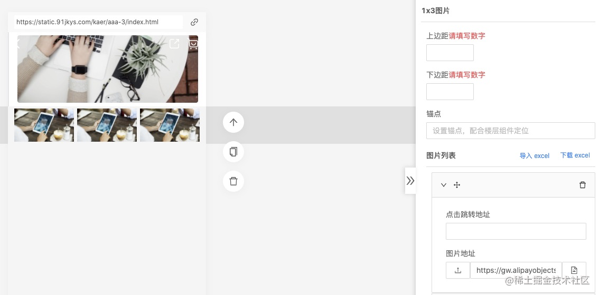

# vue3 Form render 实现
之前我们提到需要对模板和组件暴露出来的可编辑 `props` 进行 [JSON Schema](https://json-schema.org/understanding-json-schema/) 的表达，但是 JSON Schema 如何转化成业务可用的表单项进行数据编辑呢？所以我们需要一个 `form render` 来实现 `JSON Schema` 到 `表单` 的转换能力。

## 调研
业界有没有比较好的方案呢？答案是肯定的，比如以下几个表单渲染工具：

* [Form Render](https://x-render.gitee.io/form-render)
* [Formliy](https://formilyjs.org/#/bdCRC5/dzUZU8il)
* ...
`Formliy` 是一款比较强大的表单渲染器，目前对 React 支持最友好，Vue 相关的有一个 [vue-formly](https://github.com/formly-js/vue-formly) 但也仅仅是 Vue 2.x 的。还有就是 `Formliy` 过于强大，不仅仅支持 JSON Schema 还支持 JSX Schema 渲染表单。而我们只是单纯需要像 [Form Render](https://x-render.gitee.io/form-render) 这样的 JSON Schema 标准的轻量易用型框架。但是 `Form Render` 目前也仅支持 React 而我们的技术选型是 `vue3`，所以话不多说，自己造轮子。

我们先给自己定一个方向，我们的 `vue-form-render` 一定是非常易用的，需要接受一个 `schema` 入参用于表单描述，再接受一个 `formData` 入参作为表单初始值，当表单进行变更时需要提供 `change` 事件通知前端更新数据，如果表单输入不合法，则需要通过 `validate` 事件告知前端，所以终态一定是这样的：
```html
<formRender
  :schema="schema"
  :formData="formData"
  @on-change="change"
  @on-validate="validate"
/>
```
接下来我们开始详细介绍如何实现一个 `vue3-form-render`。先看一下我们实现的表单效果：



## formData 处理
还拿之前的 banner组件 举例，对于 banner 组件 来说渲染的 form 代码我们会这么写：
```html
<template>
  <div>
    <formRender
      :schema="schema"
      :formData="formData"
      @on-change="change"
      @on-validate="validate"
	/>
  </div>
</template>
<script>
export default {
  name: 'App',
  setup() {
    const state = reactive({
      schema: {
        "type": "object",
        "properties": {
          "src": {
            "title": "图片地址",
            "type": "string",
            "format": "image"
          },
          "link": {
            "title": "跳转链接",
            "type": "string",
            "format": "url"
          }
        },
        "required": [
          "src"
        ]
      },
      formData: {},
    });

    const change = (v) => {
      state.formData = v;
      // console.log(v);
    }
    const onValidate = (v) => {
      console.log(v);
    }

    return {
      ...toRefs(state),
      change,
      onValidate,
    }
  }
}
</script>
```
注意一下这里的 `formData` 参数是一个空对象，是没有默认值的一个具体的值，此时对于简单的 `string` 类型来说没有什么问题，但是如果我们的 `schema` 是个多级的对象，或者不仅仅是`string`类型，比如这样：
```json
{
  "type": "object",
  "properties": {
    "object": {
      "type": "object",
      "title": "object",
      properties: {
        string: {
          title: '字符串',
          type: 'string'
        },
      }
    },
    "radio": {
      "title": "是否通过",
      "type": "boolean"
    }
  }
}
```
我们再渲染的时候，就可能面临 `formData.object.string` 这的操作，或者是 `formData.radio` 因为他们都是没有默认值的，前者可能会报错，后者可能会出现展示问题。所以我们需要对 `formData` 按照 `schema` 的规范对未给定默认值的属性进行初始化：
```js
function resolve(schema, data, options = {}) {
  const {
    // 类型
    type
  } = schema;
  // 数据未初始化，给定默认值
  const value =
    typeof data === 'undefined' ? getDefaultValue(schema) : clone(data);

  if (type === 'object') {
    // 递归
    Object.keys(subs).forEach(name => {
      // ...
      resolve(subs[name], value[name], options);
    });
  }
  if (type === 'array') {
    // 递归
    value.forEach((item, idx) => {
      // ...
      resolve(subs[idx] || subs[0], item, options);
    });
  }
  return value;
}
```
然后我们再根据 scheme 类型，制定默认数据：
```js
function getDefaultValue(schame) {
  const { type } = schema;
  const defaultValue = {
    array: [],
    boolean: false,
    integer: '',
    null: null,
    number: '',
    object: {},
    string: '',
    range: null,
  };
  
  // ...
  
  return defaultValue[type];
}
```
到这里我们的 `formData` 会被处理成这样的格式：
```
{
  "src": "",
  "link": ""
}
```

## 表单渲染
表单渲染这块的逻辑，最简单的方式就是写很多很多功能组件，比如 `input`、 `number`、`richText` 等等，然后再根据 `schema` 的 type 属性来确定用哪个组件，比如：
```js
const mapping = {
  default: 'input',
  string: 'input',
  object: 'map',
  array: 'array',
  number: 'number',
  'string:color': 'color',
}

const widgets = {
  input,
  map: index,
  url,
  color,
  array,
  number,
}
```
然后根据 type 来动态引用：
```js
export default {
  setup() {
    return () => {
      const Field = widgets[mapping[`${props.schema.type}${props.schema.format ? `:${props.schema.format}` : ''}`]];
      return (
        <div className="vue-form-render">
          <Field
            schema={props.schema}
            formData={data}
            value={data}
            onChange={handleChange}
          />
        </div>
      )
    }
  }
}
```
注意，我这里使用的是 `jsx` 语法，因为 `jsx` 对于一些高度复杂的 `ui` 逻辑处理还是非常方便的。其次我们可以毫无保留的复用大部分 `form render` 的能力，因为 `form render` 是基于 react 来实现的，无非我们就是用 `vue3` 翻译了一遍而已。
最后再处理一下针对多级前端对象的循环渲染：
```js
// object
Object.keys(props.value).map((name, index) => {
  const schema = childrenSchemas[index].schema;
  const Field = widgets[mapping[`${schema.type}${schema.format ? `:${schema.format}` : ''}`]];
  if (!Field) return null;
  return (
    <Field
      value={props.value[name]}
      schema={schema}
      name={name}
      onChange={(key, val) => {
        const value = {
          ...props.value,
          [key]: val,
        };
        props.onChange(props.name, value);
      }}
    />
  )
});
// array 类似
```

## 校验
校验需要做的一方面是对数据格式的基础校验，一方面需要对用户自定义规则校验。先说一下数据格式的校验，比如对url的格式校验，则需要图片必须是符合域名规范的格式，图片必须是符合图片规范的格式，所以针对这一类的校验我们也可以通过 `type` 来判断：
```js
if (format === 'image') {
  const imagePattern =
    '([/|.|w|s|-])*.(?:jpg|gif|png|bmp|apng|webp|jpeg|json)';
  // image 里也可以填写网络链接
  const _isUrl = isUrl(value);
  const _isImg = new RegExp(imagePattern).test(value);
  if (usePattern) {
    // ignore
  } else if (value && !_isUrl && !_isImg) {
    return (message && message.image) || '请输入正确的图片格式';
  }
}

if (format === 'url') {
  if (usePattern) {
    // ignore
  } else if (value && !isUrl(value)) {
    return (message && message.url) || '请输入正确的url格式';
  }
}
```
如果是用户自定义的格式，我们也需要去支持正则匹配：
```js
// 正则只对数字和字符串有效果
// value 有值的时候才去算 pattern。从场景反馈还是这样好
if (value && usePattern && !new RegExp(pattern).test(value)) {
  return (message && message.pattern) || '格式不匹配';
}
```

## 编辑器使用
编辑器要使用 `form render` 则可以根据组件配置的 `schema` 来动态渲染表单：
```js
import FromRender from 'vue-form-render';
import 'vue-form-render/lib/vue-form-render.css';

import {useStore} from 'vuex';

export default {
  props: {
    // 当前选中的组件
    currentComponent: Object
  },
  setup(props) {
    const {commit} = useStore();
    const changeProps = (payload) => {
      // 触发组件编辑功能
      commit('changeProps', payload);
    }

    return () => {
      if (!props.currentComponent) return null;
      const {component, currentComponentSchema} = props.currentComponent;
      if (!currentComponentSchema) return null;
      return (
        <div class="form-container">
          <FromRender
            schema={currentComponentSchema.schema}
            formData={component.props}
            onOnChange={(e) => changeProps({...e})}
          />
        </div>
      );
    }
  }
}
```

## 结语
本章节实现的 `vue3-form-render` 的架构也可抽象表示成：


实现代码已上传至 Github，更多实现细节可以自行[查看](https://github.com/muwoo/vue-form-render)

