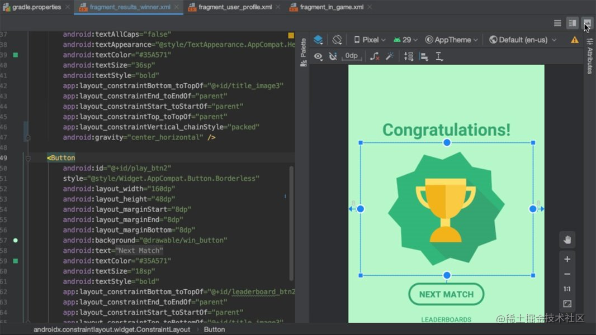
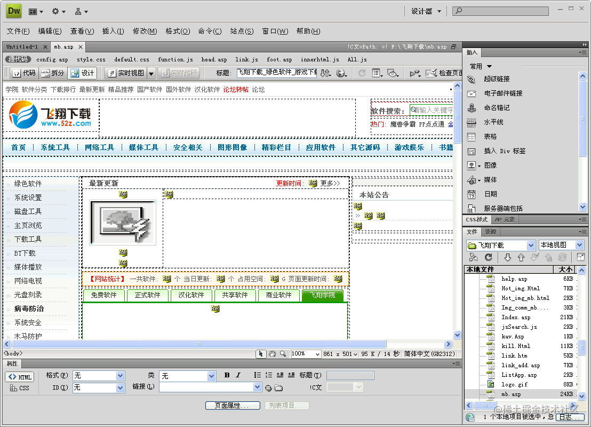

# 前言：可视化搭建诞生背景
## 关于我
笔者曾经在 51信用卡 从 0 到 1 设计实现过一套基于 h5 活动的可视化搭建体系，半年上线了近 1000 + 活动页。后面去了 蚂蚁集团 接触到了内部使用的 凤蝶 可视化搭建体系，让我对可视化搭建有了一起额外的认知。现在也是在当前公司负责可视化搭建这块的内容，可以说在 H5 可视化搭建领域，自己也是有一点摸爬滚打的经验，可以给大家分享，如果这个专题可以给你们带来一些灵感或者规避掉一些问题，那这个专题的目的就达到了。

## 什么是可视化搭建

可视化搭建字面意思就是通过 `GUI` 可视化交互搭建出之前通过代码开发出来的界面，可视化搭建并不是一个新词，如果之前接触过安卓开发的同学应该有用过 `Android Studio`，其便是一款支持可视化拖拉生成代码的开发工具：

当然，前端在很早之前也有很多可以搭建页面的 `GUI` 工具，比如 `Dreamweaver`：

## 为什么需要可视化搭建
### C 端活动
公司的发展离不开用户，公司业务的发展势必需要诞生很多的交互页面，比如活动、问卷等等。这些页面都有一些共性：活动周期短、发布频率快、需求重复多。但公司为了降低运营成本，是不会允许无限制的增加开发人力去做这些页面。而且对开发而言，重复劳动并不是一个最优解。所以我们可能需要有一个可视化搭建的能力，去助力业务，把开发的职责归聚到解决问题的本身.

### 中后台系统
对于中后台系统需求复杂度较低，至少 90% 的页面可以形成标准化。所以大量人员投入在重复性的工作上，以致于成长空间窄小，也无法发挥开发人员实际能力。
如果中后台体系可以实现由核心团队研发，能够给公司内包括前端、后端、测试等研发人员使用，通过简单的图形化配置和低代码，不仅直接实现业务需求，还提供权限、环境、灰度、埋点、监控等能力。那必将会大大缩减前端开发的负担和压力，也会加速业务进展。

## 现阶段的可视化搭建的分类
笔者在写可视化搭建工具之前，调研了现在市面上的比较常见的几款可视化搭建工具，并根据其功能特性，按照 3 个维度进行了一个简单的分类：

以上调研了那么多业界比较牛的前端可视化的框架工程，大致思路是类似的，百家争鸣，但是总的来看还是存在以下两点问题：

1. 交互逻辑需要侵入开发，无法自动生成
2. 只能在受限、具体的业务场景下发挥作用

这两个问题存在就会导致我们生产设计出来的东西需要 `low code`，那么 `low code` 面向的用户肯定是有一定编程经验的前端同学或者后端同学。但这种设计模式维护性较差，一般适用于非产品化的页面。

从工具开发的角度说, 页面可视化搭建工具是需要架构设计的, 不同工具的区分, 其实是不同的页面可视化搭建框架间的差异。本小册不会一一介绍如何实现这么多类型的可视化搭建，我们核心是通过其中一种类型来详细解剖其中的架构和技术细节原理。

目前互联网公司核心业务需求一般都是继续篇业务功能的搭建体系，比如活动页等场景，所以本小册也主要从这里出发，一步步去设计一个基于业务功能组件化的 h5 可视化搭建能力。

相关链接地址：

* [百度h5](https://h5.baidu.com/)
* [ih5](https://www.ih5.cn/general-user/template)
* [vvveb](http://www.vvveb.com/vvvebjs/editor.html)
* [鲁班h5](https://h5.luban-h5.com/)
* [ice](https://ice.work/)
* [bootcss](https://www.bootcss.com/p/layoutit/)
* [h5dooring](http://h5.dooring.cn/)
* [云凤蝶](https://www.yunfengdie.com/)

## 另附
本小册所完成的所有 demo 源码可以直接通过 [github](https://github.com/coco-h5) 阅读，如果您可以直接通过阅读源码了解设计的核心原理，那也是再好不过了。如果通过 github 源码查阅感觉对自己有所帮助，也非常感谢您可以再支持一下作者，购买小册阅读设计思想。

## 总结
本章节我们主要通过可视化搭建历史被分类介绍了可视化搭建相关知识，希望可以帮你建立一个最初的认知体系，大概清楚可视化搭建是个啥，要解决什么问题。那我们接下来就好开展工作了。

