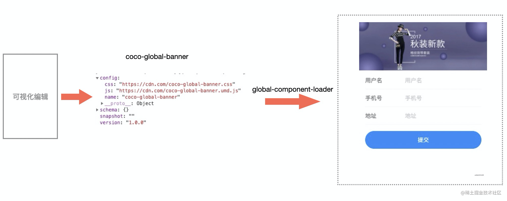
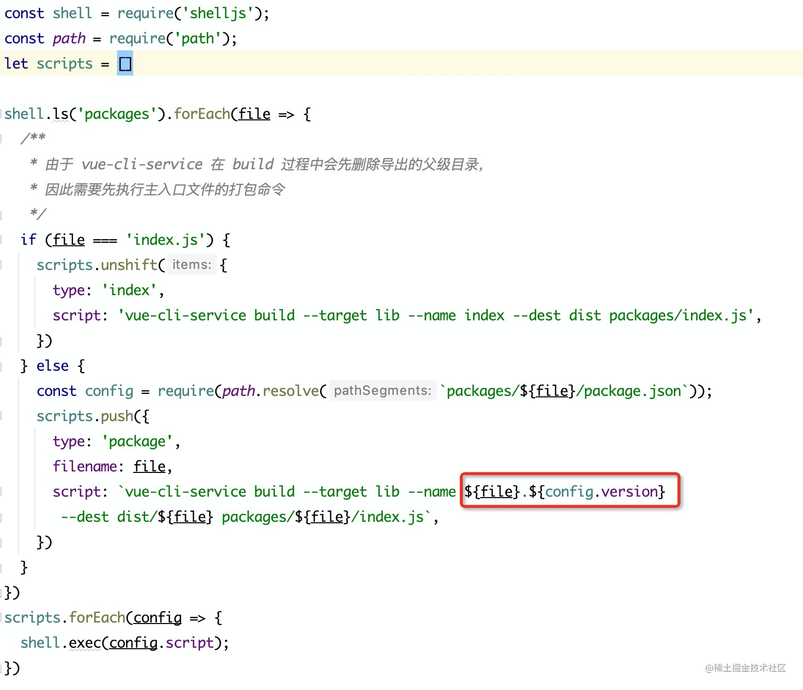

# 稳定性-组件更新策略
按照我们之前介绍的组件模式，接下来如果有的页面中需要用到对应组件，那么设计流程可能是这样的：


按照之前我们模板设计的套路，这样设计虽然没啥大问题，但是当组件因为新功能需要更新时，我们对整体的风险影响面是不可控的，只要用到了该组件的页面，在经历过发布后都会变更成最新的组件，因为我们的 cdn 指向的是 `https://cdn.com/coco-global-banner.umd.js` 这样的地址，每次发布都会进行覆盖式更新。

但心细的同学可能会想到，我们模板发布的时候可以通过 `hash` 的方式来控制 js 的更新，组件是否可以呢？其实组件更新和模板更新有一点区别，因为组件 `hash` 是无法对版本号进行判断的，一方面我们无法感知组件是否更新，另一方面我们也无法管理组件的发布版本。所以我们可以通过手动添加 `version` 的方式来发布组件：



通过这样调整之后，我们最后编辑发布出来的 cdn 地址如下：
```
https://cdn.com/coco-global-banner/coco-global-banner.0.0.1.umd.js
```
通过这种方式便实现了组件更新选择性升级的策略，我们的发布对线上现存的页面是无影响的。

## 一些额外的问题
前面几个章节，我们详细介绍过了组件从开发到发布后的版本控制的一系列问题，其中我们提到了全局组件可以通过动态挂载 js 的方式来实现动态渲染，但是我们全局组件如何告知编辑器，我有哪些可编辑属性呢？所以我们需要再设计一下事件通信规则：当组件js加载完成后，我们可以需要拿到 `window` 上组件的 `config`：（组件编译成 umd 格式后会被挂载到 window 上）
```js
// coco-global-banner/packages/index.js

import Component from './index.vue';
// 为了给全局提供组件的信息
import config from './package.json';

// 为组件提供 install 安装方法，供按需引入
Component.install = function (Vue) {
  Vue.component(`${config.name}.${config.version}`, Component);
};

// 默认导出组件
export {
  Component,
  config,
};
```
当组件加载完成后我们需要通过 vue 的 `emit` 事件来抛给外部模板，告知模板当前加载了哪些组件，由模板统一收集后和编辑器通信：
```js
// coco-template/common/global-component-loader.vue
{
  // ....
  created() {
    // ...
    this.$emit('onRemoteComponentLoad', {
      ...window[name], // 告知模板组件名称
    });
  }
}
```
当全局组件加载完成，监听`onRemoteComponentLoad` 事件后，模板开始将远程组件存储到 `remoteComponents` 列表中，再有通过 `postMessgae` 通知编辑后台来感知**特定版本的远程组件**的配置信息：

```js
// coco-template/common/coco-template.vue
export default {
  methods: {
        /**
     * 远程组件加载完成后需要生成 props
     * @param config
     * @param index 组件顺序标记
     */
    remoteComponentLoad({ config, index }) {
      // 根据 组件名+版本号 来判断组件是否已经被添加到模板当中
      const has = this.remoteComponents.filter(
        item => `${config.name}.${config.version}` === `${item.name}.${item.version}`
      )[0];
      if (!has) {
        this.remoteComponents.push(config);
      }
      // 初始化全局组件的 props 值
      this.components.forEach(item => {
        // 由于远程组件加载完成的时间点不一样，所以需要index 来告诉具体是哪个组件 load 完成
        if (item.config && item.config.index === index) {
          // 如果没有被修改的组件，默认 props 取 config 中的配置
          item.props = item.props || config.data;
        }
      });
      this.getConfig(); // 通信
    },
    getConfig() {
      // ...
      postMsgToParent(...)
    }
  }
}
```

## 总结
到这里，我们组件相关的核心功能暂时介绍的差不多了，后面我们再介绍`编辑器`和`server端`的时候，可能还是会涉及到组件这一块的变更，我们再遇到具体问题具体解决，这样会方便大家理解。