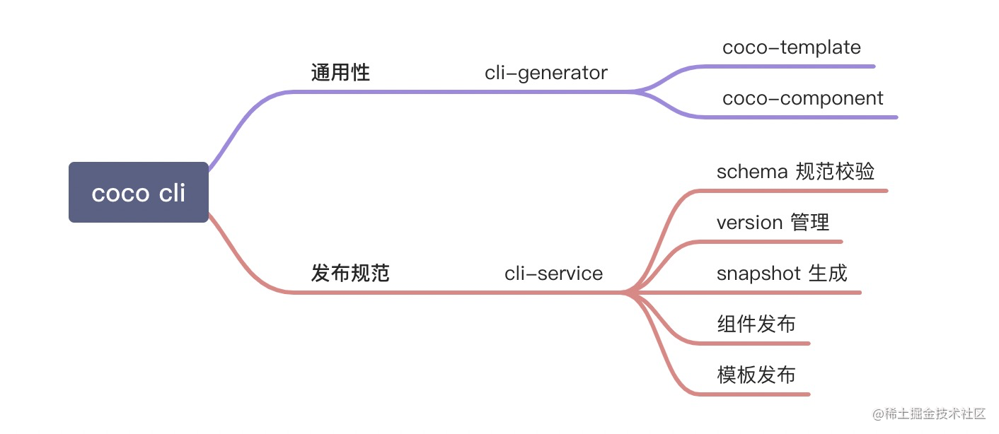
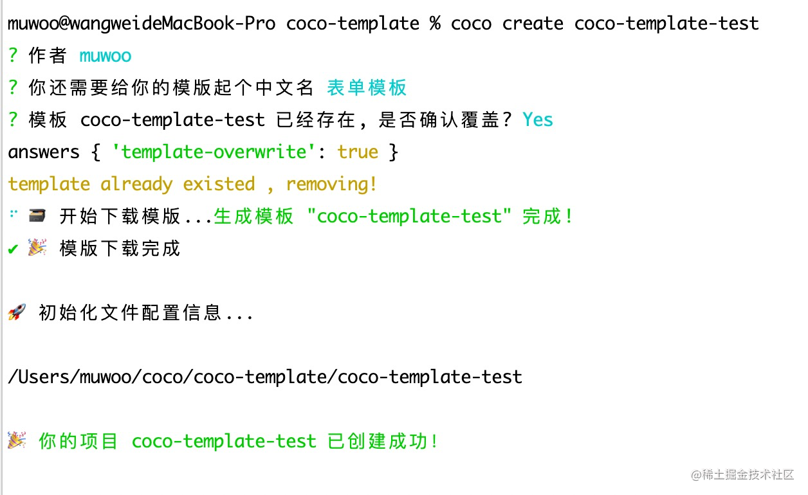

# 设计实现 CLI 为开发助力
前面我们已经介绍过了模板和组件的设计方式，我们基于这种模式已经简单的把表单页面模板开发完成了，接下来我们面临的问题就是：
1. 我们只开发了一套模板，如何保证后续模板的开发
2. 我们制定的模板、组件开发规范，如何保证不同开发者之间的统一
3. 模板开发完毕后，如何统一进行部署和发布
4. 模板的组件需要以缩略图的方式展示在编辑器组件选择取，如何生成缩略图

这些问题的本质都是**如何保障组件和模板的复用性和扩展性**所以我们可以通过设计一套 `CLI(Command Line Interface)` 架构来解决上述问题。`SPA` 应用中常用的如 `vue-cli`, `react-create-app`, `node.js`开发搭建 `express-generator`，`easy-mock` 脚手架服务 `mock-cli`，这些脚手架的目的旨在减少低级重复劳动，专注业务提高开发效率，规范 `develop workflow`。

我们按照当前的问题可以对 `CLI` 的核心功能设计成以下几个模块：



我们这次编写的脚手架(coco-cli)具备以下能力:
```shell
$ coco create project-name // 根据远程模板，初始化一个项目(远程模板可配置)
$ coco release // 发布模板
$ coco init // 初始化配置信息
```

## 如何开始
#### 1. 初始化 cli
接下来我们将从头开始介绍如何开始创建一个 `coco-cli` 来面向模板或者组件开发者，减少重复劳动，提高工作效率。开始动手：
```shell
$ mkdir coco-cli && cd coco-cli
$ npm init -y  // 初始化 package.json
```
接下来我们需要增加一个命令入口，指向可执行文件，比如当我们运行 `coco` 命令时，需要对应一个 `node` 执行文件，我们可以在 `package.json` 文件中指明 `bin` 来配置入口：
```json
{
  "name": "coco-cli",
  "version": "1.0.0",
  "description": "coco cli",
  "bin": {
    "coco": "./bin/index.js"
  },
  "main": "index.js",
  "scripts": {
    "test": "echo \"Error: no test specified\" && exit 1"
  },
  "keywords": [],
  "author": "",
  "license": "ISC"
}
```
对应的 `./bin/index.js` 文件中需要添加一下这样的声明：
```js
#!/usr/bin/env node
```
若是有使用过 `Linux` 或者 `Unix` 的前端开发者，对于 `Shebang` 应该不陌生，它是一个符号的名称，`#！`。这个符号通常在Unix系统的基本中第一行开头中出现，用于指明这个脚本文件的解释程序。所以增加这一行是为了指定用 `node` 执行脚本文件。`/usr/bin/env` 就是告诉系统可以在 `PATH` 目录中查找。 所以配置 `#!/usr/bin/env node`, 就是解决了不同的用户 `node` 路径不同的问题，可以让系统动态的去查找 `node` 来执行你的脚本文件。

接下来我们需要测试一下我们的脚手架，可以通过在当前目录执行 `npm link` 来增加一个 `软连接`：

```shell
$ npm link
// /usr/local/bin/coco -> /usr/local/lib/node_modules/coco-cli/bin/index.js
// /usr/local/lib/node_modules/coco-cli -> /Users/muwoo/coco/coco-cli
```

再打开我们的 `coco-template`，在 `script` 中增加一行命令：
```json
{
  "coco": "coco"
}
```
一个简单的 `cli` 已经完成。

#### 2. 常用模块
开发前先介绍以下几个常见的库:
* [chalk](https://github.com/chalk/chalk#readme) 可以在终端显示颜色
* [commander](https://github.com/tj/commander.js) 提供了命令行输入和参数解析，简化命令行开发
* [inquirer](https://github.com/SBoudrias/Inquirer.js) 交互式命令行工具，用来收集用户填入表单
* [ora](https://github.com/sindresorhus/ora) 终端加载动画效果，增加趣味性
* [shelljs](https://github.com/shelljs/shelljs) 通过在代码中编写shell命令实现功能
* [puppeteer](https://github.com/puppeteer/puppeteer) 主要用来启动无头浏览器生成网站缩略图
* [download-git-repo](https://www.npmjs.com/package/download-git-repo): 用来下载远程模板

这些模块来开发我们的 `coco-cli` 足以，此外如果你对这些模块有更多其他的需求，这里有更[多的](https://stackify.com/top-command-line-tools/)模块可以提供选择。

#### 3. create 模板、组件
我们接下来先实现一个创建模板的功能，用于初始化模板脚手架。我们希望通过：
```shell
$ coco create coco-template-test
```
这样的命令来实现一个 `coco-template-test` 模板的创建。这里就需要用到 `commander` 来进行命令行输入参数解析：
```js
program
  .command('create [template]')
  .description('generator a new template')
  .action(function(template){
    generate(template);
  });
```
然后我们再定义 `generate` 的实现：
```js
// 获取模板信息
async function getTemplateInfo() {
  return await inquirer.prompt([
    {
      name: 'author',
      type: 'input',
      message: '作者',
      default: ''
    },
    {
      name: 'templateName',
      type: 'input',
      message: '你还需要给你的模版起个中文名',
      default: ''
    }
  ]);
}
// 生成器
async function generate(name){
  // 交互式问答，生成模板配置信息
  const config = await getTemplateInfo();
  // 生成项目的目录
  const targetDir = path.join(targetRootPath, name);
  if(fs.existsSync(targetDir)){

    // 如果已存在改模块，提问开发者是否覆盖该模块
    inquirer.prompt([
      {
        name:'template-overwrite',
        type:'confirm',
        message:`模板 ${name} 已经存在, 是否确认覆盖?`,
        validate: function(input){
          if(input.lowerCase !== 'y' && input.lowerCase !== 'n' ){
            return 'Please input y/n !'
          }
          else{
            return true;
          }
        }
      }
    ])
      .then(answers=>{
        console.log('answers',answers);

        // 如果确定覆盖
        if(answers['template-overwrite']){
          // 删除文件夹
          deleteFolderRecursive(targetDir);
          console.log(chalk.yellow(`template already existed , removing!`));

          //创建新模块文件夹
          fs.mkdirSync(targetDir);
          copyTemplates(name, config);
          console.log(chalk.green(`生成模板 "${name}" 完成!`));
        }
      })
      .catch(err=>{
        console.log(chalk.red(err));
      })
  }
  else{
    //创建新模块文件夹
    fs.mkdirSync(targetDir);
    copyTemplates(name, config);
    console.log(chalk.green(`生成模板 "${name}" 完成!`));
  }
}
```
利用 `download-git-repo` 来下载远程模板：
```js
const download = require('download-git-repo');

async function downLoadTemplate(repository, projectName, clone) {
  await new Promise((resolve, reject) => {
    download(
      repository,
      projectName,
      {
        clone
      },
      (err) => {
        if (err) return reject(err);
        resolve();
      }
    );
  });
}
```
在用户输入之后，开始下载模板，这时候使用 `ora` 来提示用户正在下载模板，下载结束之后，也给出提示。
```js
const ora = require('ora');

const spinner = ora('🗃 开始下载模版...')
spinner.start();
await downLoadTemplate(`direct:git@github.com:coco-h5/coco-template.git`, name, true);
spinner.succeed('🎉 模版下载完成');
```

到这里为止，我们就已经可以通过 `coco create coco-template-test` 来完成模板的创建工作：



组件模板创建同理，这里就不在重复贴代码了。

#### 4. publish 模板、组件
首先，我们先定义好需要开发的命令：
```js
program
  .command('release')
  .description('发布模板')
  .action(function(){
    release();
  });
```

当我们的模板开发完毕时，我们需要将模板提交到编辑器后台管理页中，用于运营选择我们的模板。这里其实也就是干2件事，第一步先生成开发好的模板的缩略图，第二步就是将我们的 `coco.config.js` 文件提交到 `server` 端。这样我们的编辑后台就可以通过 `query` 来查询 `server` 获取模板信息：

```js
async function releaseTemplate({
  snapshot,
  nameSpace,
  context,
  webDomian,
  name,
  templateName,
  author,
  baseApi,
  gitUrl
}) {
  if (!snapshot) {
    // 通过 pupeteer 创建缩略图
    snapshot = await createSnapshot({ webDomian, nameSpace, context });
  }
  try {
    // 发布数据
    axios
      .post(`${baseApi}/template/update`, {
        name,
        templateName,
        author,
        snapshot,
        gitUrl,
        version: resolveJson(context).version
      })
      .then((res) => {
        log.success(`🎉 🎉 发布成功！`);
      })
      .catch((err) => {
        console.log(err);
      });
  } catch (error) {
    console.log(error);
  }
}
```

对于组件发布，则稍微麻烦一点，组件是在 `packages` 目录下按目录维度存储的，所以我们需要遍历组件目录，然后找到对应组件配置和缩略图进行上传：
```js
async function releaseComponents({ context, webDomian, nameSpace, gitUrl, name, baseApi }) {
  const sh = new Shell();
  const config = {
    name,
    gitUrl,
    description: 'test component',
    config: []
  };
  // 查找 packages 下所有文件
  sh.shell.ls('packages').forEach((file) => {
    if (file.indexOf('.') === -1) {
      const json = resolveJson(`${context}/packages/${file}`);
      if (!json.name || !json.version || !json.description) {
        log.error(`${context}/packages/${file} 存在不合规范的package.json, 必须包含name、version、description属性`);
        process.exit(0);
      }
      // 组件发布按照 组件名+组件版本 的形式进行发布，比如 coco-global-banner.0.0.1.umd.js
      const name = `${json.name}.${json.version}`;
      config.config.push({
        dir: file,
        snapshot: '',
        name,
        description: json.description,
        js: `${webDomian}/${nameSpace}/${name}.umd.js`,
        css: `${webDomian}/${nameSpace}/${name}.css`
      });
    }
  });
  try {
    // todo 生成缩略图 & 组件上传
  } catch (e) {
    log.error('上传失败' + e);
  }
}

```

#### 5. coco init 初始化配置
初始化配置工作是为了对一些不是用 `coco create` 创建的项目，进行配置文件初始化的工作。按照上面的介绍，第一步先接受命令的输入：
```js
program
  .command('init')
  .description('初始化 coco config 配置文件')
  .action(initial);
```

然后定义 `initial` 功能的实现，通过检测当前目录下是否已经存在 `coco.config.js` 来给用户进行是否覆盖的提示选择：
```js
module.exports = function(){
  // 配置文件如果存在则提示是否覆盖
  if(fs.existsSync(path.resolve('coco.config.js'))){
    // 连续提问
    inquirer.prompt([
      {
        name:'init-confirm',
        type:'confirm',
        message:`coco.config.js 已经存在，是否覆盖?`,
        validate: function(input){
          if(input.lowerCase !== 'y' && input.lowerCase !== 'n' ){
            return 'Please input y/n !'
          }
          else{
            return true;
          }
        }
      }
    ])
      .then(answers=>{
        if(answers['init-confirm']){
          copyCocoConfigJS();
        }
        else{
          process.exit(0);
        }
      })
      .catch(err=>{
        console.log(chalk.red(err));
      })
  }
  else{
    copyCocoConfigJS();
  }
};
```
如果选择确定生成 `coco.config.js` 最后只需要将我们定义好的模板文件，`copy` 到当前目录即可:
```js
const figlet = require('figlet');

function copyCocoConfigJS(){
  figlet('coco cli', function(err, data) {
    if(err){
      console.log(chalk.red('Some thing about figlet is wrong!'));
    }
    console.log(chalk.yellow(data));
    let targetFilePath = path.resolve('coco.config.js');
    let templatePath = path.join(__dirname,'../tpl/coco.config.js');
    let contents = fs.readFileSync(templatePath,'utf8');
    fs.writeFileSync(targetFilePath,contents,'utf8');
    console.log(chalk.green('初始化配置成功 \n'));
    process.exit(0);
  });
}
```
最后来看一下我们的 `cli` 目录结构如下：
```bash
coco-cli
├─package.json
├─tpl
|  ├─coco.config.js
|  └getConfig.js
├─lib
├─command
|    ├─generator.js
|    ├─release.js
|    └initial.js
├─bin
|  └index.js
```
文件结构要划分合理，`index.js` 是主入口文件， `commands` 专门放主要的命令功能逻辑，根据命令模块划分，比较细的功能实现可以抽成组件放在 `lib` 文件夹中，剩余的配置，以及模板等放 `tpl` 文件夹中。

## 总结
本小节主要介绍了 `CLI` 的入门以及如何设计 `coco-cli`，常见的 node 模块以及用法。CLI 是 web 开发的辅助工具，旨在提高 web 工作效率，当然用 `CLI` 来为开发提效只是可是化搭建中最基础的一部分，我们完全可以基于 `git` 操作在我们的编辑后台设计一套模板研发流程，通过可视化的方式管理研发的生命周期，包括模板的发布、灰度、审批等等一系列规范化流程。但是这里已经涉及到前端发布系统的相关知识。本小册不再做过多介绍，有兴趣的小伙伴可以加我的微信，我们一起沟通交流，也可以自己去实现这样一套流程，其实并不复杂。


