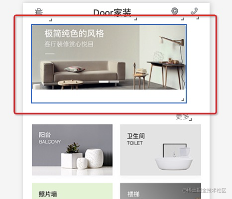
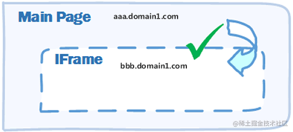

# 可视化编辑区实现
前面几个小节的介绍可能大家没有直观的感觉到跟可视化搭建的具体联系，因为还没有涉及到编辑这一块的内容。本小节开始，我们就可以开始设计编辑器的相关工作啦！

## 初始化项目
编辑器我们采用的是基于 `vue3` 来的，为啥不是 `react` 或者 `vue 2.x`，纯属个人喜好，别无他意。当然用什么框架不是重点，重点是只要我们掌握了思想就可以“为所欲为”。好了，先初始化 `vue3` 项目，对于 `Vue 3`，你应该使用 `npm` 上可用的 `Vue CLI v4.5` 作为 `@vue/cli@next`。
```shell
$ npm install -g @vue/cli@next

$ vue create coco-web
```
然后选择 `vue3` 模板一路到底。这里的目录结构我们调整我不做详细介绍，因为跟可视化搭建没啥关系，但是方便大家后续阅读，先把我自己的目录结构贴出来：
```bash
coco-web
├─babel.config.js
├─package.json
├─vue.config.js
├─src
|  ├─App.vue
|  ├─main.js
|  ├─router
|  ├─pages
|  |   ├─edit
|  |   |   └index.vue
|  ├─hooks
|  ├─components
|  ├─common
|  ├─assets
|  ├─api
├─public
```

## 如何获取模板&组件信息
前面几个章节我们主要介绍的模板和组件如何给编辑器发消息，那么编辑器如何收消息？我们编辑器对模板的展示采用的是 `iframe` 的方式，之前我们提了采用 iframe 的方式是为了模板和编辑器解耦。（其实还有另一个原因：我们中间的预览区域其实就是为了尽可能模拟移动端页面效果。但是如果我们加入了一些包含类似 `position: fixed` 样式的组件，会发现样式上就出现了明显的问题。典型的比如 `Dialog Loading` 等）。

所以我们也是可以通过监听`postMessage` 的方式来实现消息接收：
```js
// 监听事件
window.addEventListener('message',(e) => {
  // 不接受消息源来自于当前窗口的消息
  if (e.source === window || e.data === 'loaded') {
    return;
  }
  // 调用消息处理函数，对传入的数据进行格式化
  store.commit(e.data.type, e.data.data);
});
```
上面的代码简单的展示了我们会通过 vuex 来管理消息通知后的调用函数，比如接受模板的信息通知：
```js
const mutations = {
  returnConfig(state, payload) {
    // todo 数据结构处理
  }
}
```

## 如何编辑
到这里，我们完成了对模板消息的接收动作，最终编辑器接收到的 `模板消息 + server端全局组件` 信息后我们格式化后是这样的：
```json
{
  "components": [
    {
      "snapshot": "",
      "description": "banner组件",
      "name": "coco-banner",
      "schema": {"type": "object", "properties": {}},
    },
    {
      "snapshot": "",
	  "description": "form组件",
      "name": "coco-form",
      "schema": {"type": "object", "properties": {}},
    }
  ],
  "userSelectComponent": [
    {
      "snapshot": "",
      "description": "banner组件",
      "name": "coco-banner",
      "schema": {"type": "object", "properties": {}},
    },
    {
      "snapshot": "",
     "description": "form组件",
      "name": "coco-form",
      "schema": {"type": "object", "properties": {}},
    },
    {
      "snapshot": "",
     "description": "banner组件",
      "name": "coco-banner",
      "schema": {"type": "object", "properties": {}},
    }
  ],
  "remoteComponents": [
    {
      "name": "coco-global-banner",
      "description": "全局banner组件",
      "snapshot": "",
      "config": {
        "js": "",
        "css": ""
      }
    }
  ]
}
```
这样我们的模板就可以同过 `userSelectComponents` 来进行页面的动态渲染，编辑区则根据 `components` 和 `remoteComponent` 来渲染对应的组件选择区域，用于提供用户选择。到这里我们就完成了可选组件部分。接下来我们需要对页面进行可视化编辑。

#### 1. 选择组件
可视化编辑器要实现的第一个功能就是对页面组件进行选择性编辑，要实现这个功能，我们先看一下市面上的可视化搭建体系的组件选择功能是什么交互，先看一下 `h5dooring`:


可以看到是可以对模板页面直接进行高亮选中，之后进行拖拽排序。直接选中我们可以做，但是进行拖拽排序我们无法实现，为啥这么说呢？可以想象一下，我们的模板和编辑器是通过 `iframe` 通信的，若要进行拖拽排序，则模板内部必须需要对排序动作进行实现，主要的是交互动画。当然实现并不是难事，我们可以利用 [Vue.Draggable](https://github.com/SortableJS/Vue.Draggable) 不超过20行代码即可搞定。

但是吧，这并不符合设计模式，因为就相当于我们的模板页面需要为了编辑器的功能强行注入了不应该拥有的代码，而且万一 `Vue.Draggable` 这玩意有啥浏览器兼容性 bug 或者其他的问题，我们的开发同学是不可控的，本身就不属于我们的业务需求。所以我们暂时不采用这种方案，我们再看一下[云凤蝶](https://www.yunfengdie.com/)的交互:


可以看到他的实现也是基于 `iframe` 的方式，没有直接对模板的结构进行拖拽编辑，选中也是通过无侵入方式的编辑器特定区块高亮实现。这个操作交互正好符合我们的设计。
但是再思考一个问题，我们要实现无侵入方式的高亮，必然得得知当前点击了哪个组件，以及组件的高度，我们才好把这块区域画出来。这就涉及到[父级操作子 iframe](http://www.webkaka.com/tutorial/html/2020/022982/)的相关问题，



先说结论：只需要我们对页面和编辑器设置相同主域，便可以进行跨域操作，获取子 iframe 的元素：
```js
 const eventInit = () => {
  // 获取子 iframe 的 dom
  const componentsPND = document.getElementById('frame').contentWindow.document.getElementById('slider-view');
  // 为页面组件绑定 click 事件
  componentsPND.addEventListener('click', (e) => {
    let node = e.target;
    // 遍历元素，找到以 'coco-render-id-_component_'  作为 id 的组件元素，计算高度和位置
    while(node.tagName !== 'HTML') {
      let currentId = node?.getAttribute('id') || '';
      if (currentId.indexOf('coco-render-id-_component_') >= 0) {
        const top = getElementTop(node);
        const { height } = getComputedStyle(node);
        restStyle(height, top, 'activeStyle');
      }
      node = node.parentNode;
    }
  });
  // 为页面组件绑定 mouseover 事件
  componentsPND.addEventListener('mouseover', (e) => {
    let node = e.target;
    // 遍历元素，找到以 'coco-render-id-_component_'  作为 id 的组件元素，计算高度和位置
    while(node.tagName !== 'HTML') {
      let currentId = node?.getAttribute('id') || '';
      if (currentId.indexOf('kaer-render-id-_component_') >= 0) {
        try {
          const top = getElementTop(node);
          const { height } = getComputedStyle(node);
          restStyle(height, top, 'hoverStyle');
        } catch (e) {
          // ignore
        }

      }
      node = node.parentNode;
    }
  });
}

```

找到需要标记的元素后，我们需要对其做高亮展示（这里需要注意的一点是需要判断一下操作按钮浮层是否超出编辑器展示范围，如果超出了需要重置上去）：

```js
  const restStyle = (height, top, type) => {
    state[type] = {
      height,
      top: `${top}px`,
    };
    nextTick(() => {
      const toolND = document.getElementById('se-view-tools');
      const toolHeight = parseInt(getComputedStyle(toolND).height, 10);
      state.toolStyle = {
        top: `${top + 10 + toolHeight > state.containerHeight ? top - toolHeight + parseInt(height, 10) : top + 10}px`,
      };
    });
  }
```
这样我们便完成了对可视化编辑区的类似于 `云凤蝶` 那样的标记工作。

#### 2. 调整组件顺序

调整组件顺序，我们也可以采用类似于云凤蝶那样的实现方式，在可视化编辑区右侧挂上编辑操作按钮：

```html
<div
    v-show="toolStyle.top"
    :style="{
      top: toolStyle.top
    }"
    class="se-view-tools"
    id="se-view-tools"
>
  <div :class="['sev-tools-move', (isTop || isBottom) && 'sev-tools-move-single']">
    <ArrowUpOutlined @click="changeIndex(-1)" v-if="!isTop" />
    <ArrowDownOutlined @click="changeIndex(1)" v-if="!isBottom" />
  </div>
  <div class="sev-tools-copy">
  	<CopyOutlined @click="copyComponent" />
  </div>
  <div class="sev-tools-copy">
  	<DeleteOutlined @click="() => deleteComponent()" />
  </div>
</div>
<script>
export default {
  setup() {
    const changeIndex = (op) => {
      postMsgToChild({type: 'sortComponent', data: {op, index: editorState.current}});
    };
    
    const copyComponent = () => {
      postMsgToChild({type: 'copyComponent', data: editorState.current});
    };

    const deleteComponent = (index) => {
      postMsgToChild({
        type: 'deleteComponent',
        data: index !== undefined ? index : editorState.current,
      });
    };
    
    return {
      changeIndex,
      copyComponent,
      deleteComponent
    } 
  }
}
</script>
```

#### 3. 添加组件
添加组件，我们可以通过拖拽的方式动态的添加到编辑区，这个需要用的一个 `html` 的一个拖方的 API [HTML 拖放 API](https://developer.mozilla.org/zh-CN/docs/Web/API/HTML_Drag_and_Drop_API)

##### 确定什么是可拖拽的
我们的组件预览是可拖拽的：

```html
<div class="list-view">
  <div
    @dragstart="(e) => setDragStart(e, true, item)"
    @dragend="(e) => setDragStart(e, false)"
    draggable
    class="co-item"
    :key="index"
    v-for="(item, index) in components"
  >
    <el-image
      class="preview-item"
      :src="item.snapshot"
      fit="fit"
    />
    <div class="co-title">{{item.description}}</div>
  </div>
</div>
<script>
export default {
  setup() {
    // ...
    return {
      setDragStart: (ev, v, data) => commit('setDragStart', {ev, v, data}),
    }
  }
}
</script>
```

##### 定义拖拽数据
将组件的信息，定义成拖拽数据
```js
// coco-web/src/store/modules/edit.js
const mutations = {
  setDragStart(state, {ev, v, data}) {
    state.uiConfig.dragStart = v;
    if (data) {
      ev.dataTransfer.setData("text/plain", JSON.stringify(data));
    }
  }
}
```

##### 定义一个放置区
```html
<div
  @drop="drop_handler"
  @dragover="dragover_handler"
  v-show="editState.uiConfig.dragStart"
  class="drag-hover"
/>
```

##### 具体放置在组件的哪个位置
拖进 `iframe` 放置的时候会触发放置区域 `ondrop` 事件，该事件回调函数会返回放置的 Y 轴坐标 `layerY`。那么便可以通过动态计算每个组件占据的高度和 `total`，通过比较 `layerY` 和 `total` 计算应出该放置的位置。

举个例子，如果放置位置 Y 为 40，组件 1 高度为 20，组件 2 高度为 30。那么就应该放置在组件 1 和组件 2 之间的位置。
```js
// 放置后触发
const drop_handler = (ev) => {
  ev.preventDefault();
  const data = ev.dataTransfer.getData("text/plain");
  const {layerY} = ev;
  // 计算放置的位置 index
  const index = getIndex(layerY); 
  // 特定位置增加组件
  commit('addComponent', {data: JSON.parse(data), index});
  commit('setDragStart', {
    v: false
  });
}

// 计算放置的位置
const getIndex = (y) => {
  const componentsPND = document.getElementById('frame')?.contentWindow.document.getElementById('slider-view');
  // 组件高度和
  let total = 0;
  let index = 0;
  // 遍历组件，计算高度和
  Array.from(componentsPND.childNodes).some((nd, i) => {
    try {
      total = total + parseInt(getComputedStyle(nd).height, 10);
      if (total > y) {
        index = i;
        return true;
      }
    } catch (e) {
      // todo
    }
    index = i;
    return false;
  });
  return index;
}
```


## 总结
本章我们主要介绍了编辑器如何显示对模板页面的编辑功能，接下来我们尝试着再思考一个问题：模板很多都是跟业务挂钩的，所以大多数都会发起业务的 `api` 请求，如果我们用的 `api` 返回的数据格式不对，或者缺少某些内容，那么整个操作区的交互将会非常丑陋，使用者也无法看到页面的所有功能，那么要怎么解决？以及如何对编辑后的页面进行预览？

