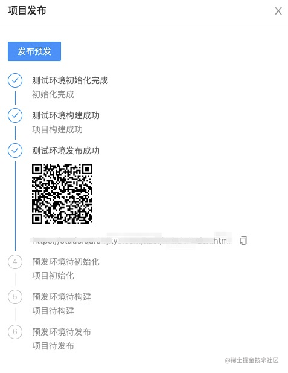

# 发布流程设计
上面的章节，我们介绍到了页面编译了，编译最终会产生静态的文件，这些文件无论我们通过怎么样的方式发布归根结底都是为了将静态文件推到 `CDN` 上，这里每个公司可能都不一致，所以这里不再详细赘述。那我们介绍啥呢？这次我们介绍一下如何设计发布流吧。

## 基于 mergeRequest 的发布流
按照前面的介绍，我们的模板是托管在 `gitlab` 仓库上的，最后拉取的页面也是基于模板仓库的 `clone`，所以我们是否可以把发布流看成是一次正常的开发流？作为正常的开发，我们可以采用 `gitflow` 来规范开发：


首先，项目存在两个长期分支。

* 主分支 master
* 开发分支 develop

前者用于存放对外发布的版本，任何时候在这个分支拿到的，都是稳定的分布版；后者用于日常开发，存放最新的开发版。

其次，项目存在三种短期分支。

* 功能分支（feature branch）
* 补丁分支（hotfix branch）
* 预发分支（release branch）

一旦完成开发，它们就会被合并进 `develop` 或 `master`，然后被删除。我们也可以基于该流程设计一套发布体系：

```js
const { Gitlab } = require('@gitbeaker/node');

// 发布测试
const api = new Gitlab({
  host: '',
  token: '',
});

async releaseTest(data) {
  
  // 编译渲染模板
  await this.renderTpl({
    repoUrl: data.gitConfig.ssh_url_to_repo,
    repoName: data.name,
    data: data.pageConfig
  }, 'devlopment');
  
  // 发布
  const projectId = data.gitConfig.id;

  const branchs = await api.Branches.all(projectId);
  
  // 基于 master 拉开发分支
  if (!branchs.map(branch => branch.name).includes('devlopment')) {
    await api.Branches.create(projectId, 'devlopment', 'master');
  }
  
  // create mergeRequest
  await api.MergeRequest.create(projectId, 'devlopment', 'qatest');
  // todo 触发发布动作
}

```
这里只是介绍了发布测试环境的方法，发布预发线上同理，只需要将 `qatest` 分支的代码通过 `gitlab API` 合并到对应分支再出发发布动作即可。
这里的流程主要是通过创建 `mr` 来完成编译代码的合并，合并到 `test` 环境后，再主动触发代码的发布动作。这里可以是 `CI/CD` 或者对接自己的发布系统。

这样的发布流设计也是没有任何问题的，但是我们需要思考一个问题就是如果 `merge` 没有变更内容是无法进行发布的，因为创建的 `merge request` 无法被合并。这个时候我们可以提示用户无代码变更不需要发布。但是如果某一个特殊的场景就需要再次发布，可能就不太适用。比如发布系统故障...

## 基于代码提交方式发布
这种发布模式操作比较取巧，核心方式就是利用 `node` 可以直接操作 `git` 脚本的方式对代码进行强行 `push`，本质就是上面那种模式的变种，只不过省去了 `mr` 的过程。其实本质来说没啥问题，因为本身 `server` 端的构建就是对已经测试过的页面进行数据注入，并不会影响页面的结构。核心代码如下：
```js
try {
  process.execSync(`cd static/${repoName} &&
    git init . &&
    git remote add coco ${repoUrl} &&
    git add . &&  
    git commit -m "Initial commit" &&
    git push -u coco ${branch || 'master'}:${env || 'master'} --force
  `);
} catch(e) {
  console.log(e)
  throw new Error(e);
} finally {
  // 清空对应结果目录。
  process.exec(`cd static && rm -rf ${repoName}`);
}
```

## 前端设计
前端也需要对发布结果做动态展示，这里设想一个场景：运营同学可以直接将编辑后的页面发布线上吗？当然不行，因为配置的页面如果运营误操作，可以能会对线上产生影响，所以我们一定要设计套类似于开发的方式经过 `测试 -> 预发 -> 线上` 这样的流程才能进行上线，虽然不会杜绝误操作的产生，但是至少降低了出错了成本。其次，我们有这样的机制，也是一个稳定性重要的保障。
接下来直接看交互：



必须经过发布测试，才可发布预发，预发发布完成才会出现发布线上按钮。

## 总结
到这里我们已经基本上介绍完了 基于业务场景的 H5 可视化搭建体系的核心内容，当然本小册不会帮你把所有细节点都涵盖上，因为这样感觉可以写好几年了~ 而且随着业务的变迁，当写完了可能就不适用当前的业务需求了。所以后面我们也会介绍一下当前还有哪些未提到但是需要解决的点，大家好根据自己的业务需求自行设计。


