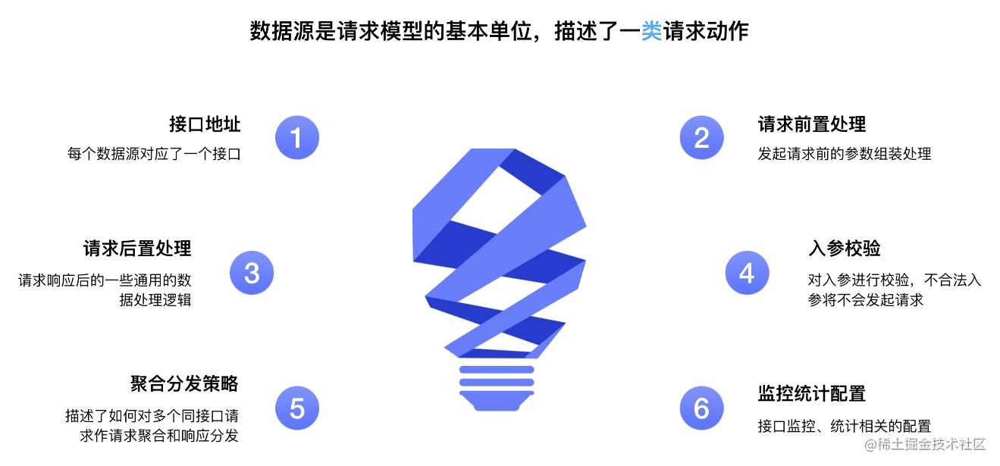
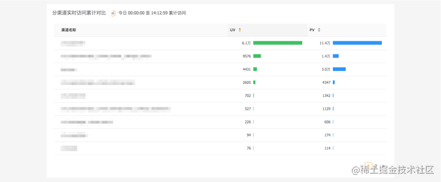
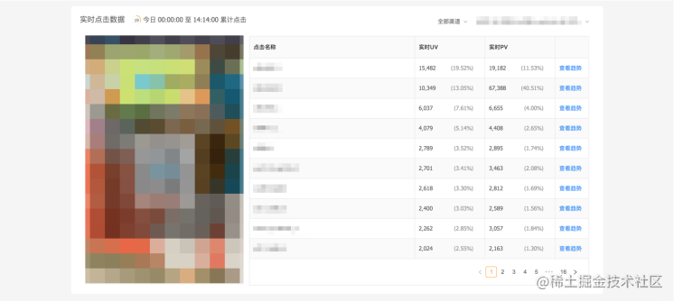
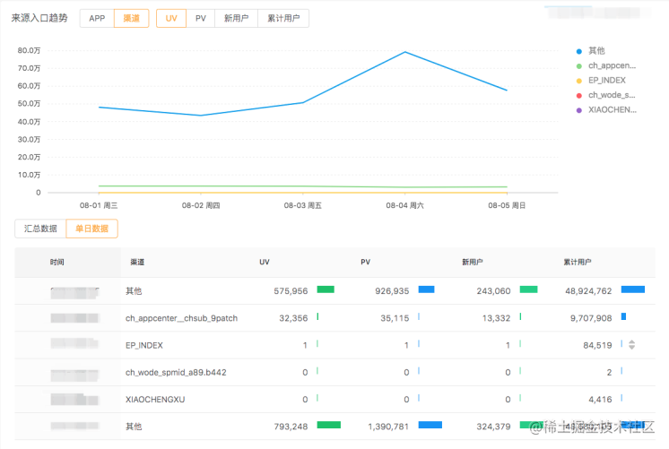
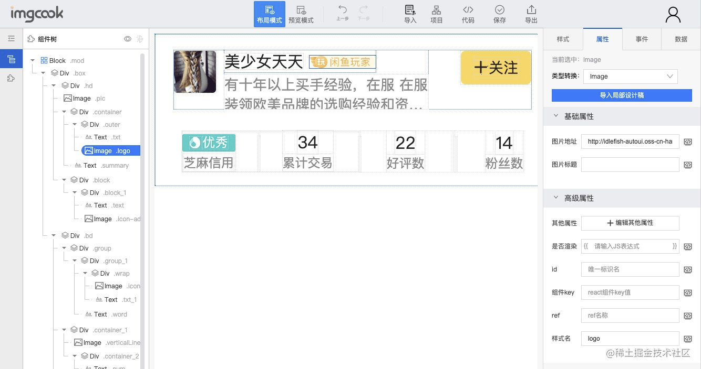

# 加餐：当前可视化搭建未解决的问题

事实上，「可视化页面搭建」的话题还远为结束：我们需要在此方向上探索更多可能：`微组件/微前端`，`页面归因能力`、`no/low code 技术`、`自定义组件埋点以及 A/B 流量能力`、`Serveless`、`云端 IDE` 等。

## 接口层⾯临的痛点
因为我们的设计的可视化搭建体系是面向于业务侧的，所以必然避免不了和接口数据层打交道，所以当搭建体系做到后面就会很容易面临这样的问题：
1. ⻚⾯是由组件组成的，每个组件可能都有自己的业务逻辑，那么对于茫茫多的请求，有时候想定位⻚⾯中某个请求来⾃哪个组件，可能得定位半天……
2. 如果一个页面用了2个不同组件，但2个组件都配置了同⼀个活动 ID，导致⻚⾯发出了 2 个⼀模⼀样的活动状态查询请求……
3. 商品接⼝⽀持批量请求，可我们⻚⾯中多个商品组件的接⼝请求并没有合理聚合，⾛批量调⽤……
4. 同一模板页面，可能需要用到不同的接口，比如有的模板需要查询新人活动的优惠券，有的模板需要查询老用户的优惠券...

针对以上问题，其实业界也有一些解法，比如京东的 `MPM` 搭建页设计的数据层架构：

就是针对数据源进行了 自由组合 + 统一管理 + 合并同类请求 + 聚合分发 的模式来进行管理。是一个不错的实践。

## 数据层面临的痛点
我们知道活动页的核心，除了页面还有页面投放出去的数据展示。所以我们需要设计一套可以针对特定页面的数据展示层来实时展示页面的投放数据详情，方便业务方实时调整投放数据，这块做的比较不错的是云凤蝶：
#### 1. 实时累计访问趋势

#### 2. 分渠道实时访问累计对比
各渠道的累计访问量对比

#### 3. 实时点击数据

#### 4. 来源入口趋势

小提示：把渠道标记追加到站点 url 后面，就能显示在卡片中。例如：
`http://render.yunfengdie.com/p/q/you-site-path.html?chInfo=liveshare`

总的来说，我们面临的问题不在于数据可视化展示这一块，而在于怎么展示，如何设计才能更好地帮助运营同学观测理解数据，这也是一门学问。

## 低代码的实践
我们可以实现 模板 -> 页面 的生成，在复用层面上我们是大大提效了，但是考虑一个问题，如果我们的模板只被复用一次，那么真的提效了吗？因为我们的模板依旧需要开发，那么有没有办法不开发呢？直接从 `sketch` 转成 h5 页面，省去开发这个环节？当然也是有的，比如业界比较成熟的方案 [imgcook](https://www.imgcook.com/)

可以支持我们直接导入 `sketch` 到编辑器，再转成 `html` 和 `css` 再对 `html` 进行事件绑定，即可完成简单的交互动作~

## 总结
可视化搭建作为前端的一个课题，在不断演进和迭代，本小册的介绍核心目的是为了给大家传输一定的思想和理念，帮助大家建立一定的基础，当然具体的搭建方案我们需要在业务演进的过程中不断摸索前进，毕竟适合自己的才是最好的。

