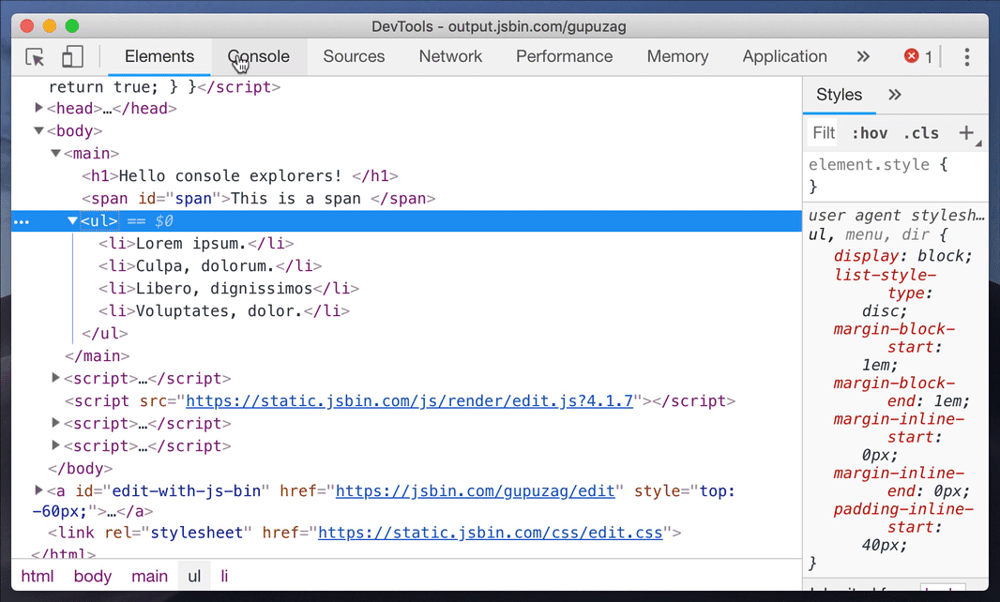

# 通用篇 - copying & saving

## 前言

在调试的过程中，我们总要对 `Dev Tools` 里面的数据进行 **复制** 或者 **保存** 的操作，所以我们来看看，关于这些，有什么小技巧呢？

## 1. `copy(...)`

你可以通过全局的方法 `copy()` 在 `console` 里 `copy` 任何你能拿到的资源，包括我们在后面[第六节]会提到的那些变量。例如 `copy($_)` 或 `copy($0)`

## 2. `Store as global` (存储为一个全局变量)

如果你在 `console` 中打印了一堆数据 (例如你在 `App` 中计算出来的一个数组) ，然后你想对这些数据做一些额外的操作比如我们刚刚说的 `copy` (在不影响它原来值的情况下) 。
那就可以将它转换成一个全局变量，只需要 **右击** 它，并选择 “`Store as global variable`”   (保存为全局变量) 选项。

第一次使用的话，它会创建一个名为 `temp1` 的变量，第二次创建 `temp2`，第三次 ...
。通过使用这些变量来操作对应的数据，不用再担心影响到他们原来的值:

## 3.保存堆栈信息( `Stack trace` )

大多数情况下都不是一个人开发一个项目，而是一个团队协作，那么 **如何准确的描述问题，就成为了沟通的关键** ，这时候 `console` 打印出来的堆栈跟踪的信息对你和同事来说就起大作用了，可以省去很多沟通成本，所以你可以直接把堆栈跟踪的信息保存为一个文件，而不只是截图发给对方：

## 4.直接Copy HTML

几乎所有人都知道，右击或者点击在 `HTML` 元素边上的省略号 (...) 就可以将它 `copy` 到剪贴板中

，但是你不知道的是：古老的`[ctrl] + [c]`大法依旧可用！

