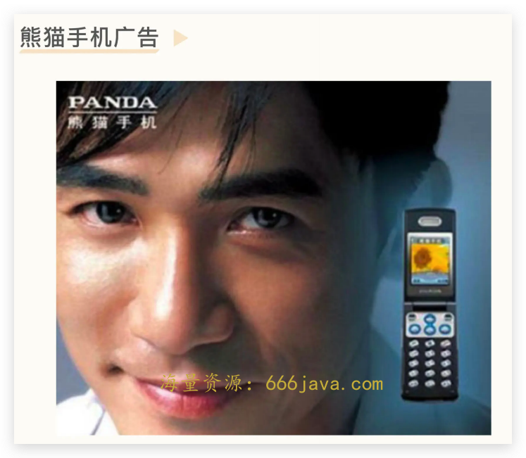
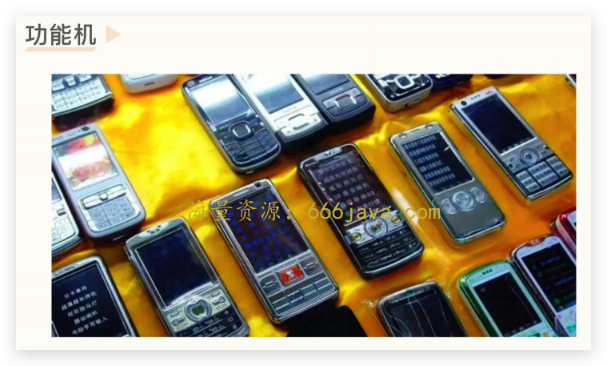
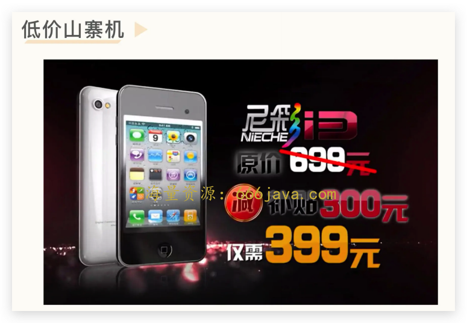

# 26-边界（上）：没有任何硬件基础的小米，为什么可以成为国内第一手机厂商？

<audio controls="" title="26-边界（上）：没有任何硬件基础的小米，为什么可以成为国内第一手机厂商？">
  <source
    id="mp3"
    src="/mp3/business-thinking/26-边界（上）：没有任何硬件基础的小米，为什么可以成为国内第一手机厂商？.mp3"
  />
</audio>

你好，我是雄峰。本节课是非共识机会的第三节课，今天我们来聊一下小米手机。

虽然小米现如今很成功，但放在 12 年前，没有人看好小米：互联网的同行不看好小米，国内手机行业的从业者也不看好小米。可以说，小米的成功是一个典型的非共识机会。

为什么不管是互联网同行还是手机同行，都认为小米做高质量的智能手机是一个不可能完成的任务？让我们把时间拨回到上个世纪，看看当时国内的手机行业是什么样的情况。

## 国内手机两拨失败的进攻

**手机市场天然是一个全球性竞争的市场。** 从 1988 年第一台手机——摩托罗拉 3200（大哥大）进入中国，到小米发售的 2011 年期间，接近 30 年的时间里，中国手机的先辈们朝着国外手机巨头发起了两次进攻，第一次依靠的是政策，第二次依靠的是低价，但均以失败告终。

这也是同行不看好雷军做国产手机的原因：前面都失败两拨了，你来凑什么热闹？

### 第一波：手机审批制

第一波国产手机浪潮是 1999 年到 2005 年，这一阶段著名的国产手机有波导、熊猫、科健等品牌。

这期间的国产手机之所以可以发展起来，是因为 **1999 年原信息产业部发布了“5 号文件”，规定手机生产必须经过相关审批，俗称“手机审批制”。**

这样一来，外国品牌被暂时压制，想进入中国的外国品牌也大多要走合资或者审批的方式，这是早期政策制定者用“ [市场换技术](https://baike.baidu.com/item/%E5%B8%82%E5%9C%BA%E6%8D%A2%E6%8A%80%E6%9C%AF/9519810?fr=aladdin)”的一个缩影。

但 5 号文件带来的后遗症也十分明显：一些 **有实力的厂商被挡在门槛外**，用户反而是用高价购买了低价产品，另一部分拥有牌照的厂商，热衷于通过向没有牌照的厂商倒卖牌照获利，并 **没有实际去研发产品**，且这种机制非常不利于已加入 WTO 的中国进一步对外开放。

因此，2005 年 2 月“手机审批制”修改为“手机核准制”，再到 2007 年核准制被取消，手机行业准入几无门槛。而“手机准核制”并没有带来什么起色，2005 年之后，国产手机不管从产品设计、产品质量还是产品售后上都一败涂地，逐步退出市场，走向了破产，只剩下为数不多的几个手机厂商。

### 第二波：联发科和山寨机

第二波国产手机浪潮指 2005 年到 2012 年，这一阶段没有某单一知名品牌的国产手机，而是一个特殊时代的代名词——“山寨机”。伴随着国产手机的大败退，国产手机走向了另一条路，就是模仿国外的知名手机并魔改，并以极低的价格售卖。

一部正常的手机大概要 3000 左右，这相当于一个人两个月左右的工资，但是山寨机只需要 300 块钱，就可以让用户享受大部分一致的功能以及外观相似的产品。

早期的山寨机并不叫“山寨机”，而被称为“黑手机”，最初的深圳山寨手机制造商们由于不好意思印上“深圳”二字，便采用首字母“SZ”标识。而随着整个山寨产业越发庞大，“SZ”便变为了“山寨”。最初的山寨机市场规模也并不庞大，仅以翻新等渠道寻找廉价方案为主，直到联发科“交钥匙”方案的出现。

山寨手机制造商最缺的是什么？当然是技术。联发科就给出了一套“交钥匙”的一站式解决方案。就好比你买了一个房子，开发商全部给你装修好了，给你一把钥匙直接搬进去住就好。联发科将手机芯片和系统都集成好之后，山寨手机制造商造手机跟组装玩具差不多，想做成什么样子开个模具就搞定了，想有什么功能加上就行。

但是山寨机属于灰色地带，不仅侵犯知识产品，且由于低价、无技术含量，产品的利润非常低，产品质量也非常差。山寨机最火的产品是一款叫做“尼采工厂店”的手机，非常像 iPhone4，对外宣称单手机利润只有 10 元。尼彩的老板卢洪波还向媒体宣传：“卖煤一吨只赚 10 元，一台手机能赚 10 元，已经很暴利了。”虽然这话是营销术语，但一定程度上可以体现国产手机低技术附加值的情况。

2010 年末，深圳开启了为期 6 个月的“打击侵犯知识产权和制售假冒伪劣商品”专项行动，山寨机逐步消失在大众视角下，成为了水下的产业。

伴随智能手机时代的开始，山寨机也从功能机时代过渡到了智能机时代，而山寨机市场彻底的消亡则来自小米推出了红米系列，用极端的低价推出了品质还不错的智能手机，横扫了中国大量山寨机厂商，良币开始驱逐劣币，也就是那段时间，国内山寨机彻底消亡，大量转型出海东南亚。

这两波失败的进攻过后，在用户的认知下，国产货大多都是低端货就是劣质货的代名词，不管是品牌上以及技术上，都不如国外品牌。

这就导致大家认为，即便小米做出了手机，也很可能没有人买，最终砸在手里面，因为前面的手机厂商基本都挂了。所以后面小米 1 出来之后，雷军走到哪里都会把手机摔到哪里，就是为了证明自己的手机质量好，不是山寨机。

## 手机行业的自身门槛

除了用户对国产手机没有认知以外，业内不看好小米做手机，还有一个原因，就是大家认为 **小米低估了手机行业的门槛**。要想做出一款还不错的智能手机，还有三个点需要被解决：

1. 高质量的手机元器件；
2. 高标准的手机代工厂；
3. 覆盖全国的销售和售后渠道。

这三个点无一不需要资深的行业门槛和时间积累。所以雷军最开始做手机的时候找到了关系好的联想去聊，当时联想是国内 Top1 的手机制造商，而内部的第一反应是： **雷军凭什么做手机？他要啥没啥。**

### 高质量元器件

有一个小故事就可以体现当时小米在硬件领域萌新的角色。

> 雷军做小米找合伙人的时候，挖互联网的人一挖一个准，毕竟资历在那里放着。但是挖硬件合伙人的时候，闹出了一个笑话。
>
> 钱晨是摩托罗拉资深的研发负责人，也是雷军挖角的对象。第一次打电话给钱晨的时候，雷军以为报出自己的名字对方会立即认出，但电话那头回答是“对不起，你是谁？我不认识你”。
>
> 事后雷军向同事说，他听到这句当场就尴尬了，因为在此之前他觉得自己已经很有名了，没想到手机圈的人连他名字都没听过。
>
> 小米当时面临的窘境在于， **要做手机最大的问题就是要先搞定元器件供应链，因为元器件是做手机的第一步，也是决定手机质量最关键的一步。但是手机圈的人没有人知道小米是谁** **。**

此外，小米看中的是 iPhone 的供应链体系，且小米想要自己研发手机，而并不是采用某方案商贴牌即可，这个过程中需要供应商配合做大量的元器件定制和改造，甚至技术突破。

所以，小米面临的第一个问题是：如果想要做出一部符合用户需求的手机，必然涉及到优质供应链的合作与配合。一部高端智能手机涉及的零部件达到数千个，这些东西涉及的供应链厂商涉及上百家。而当时高端智能手机的元器件基本集中在日、韩、台湾等企业中， **小米作为一个新** **人，** **要如何解决供应链合作的问题？**

### 高标准代工厂

设计出一部手机和以适当的价格大规模生产是两个概念。前者更多关注的是产品卖点和可行性验证，而后者则是大规模生产之后成本可控及良品率的问题。

你可以采用各种最好最新的技术，设计出一款非常棒的手机，但由于产品非常超前，导致手机的良品率非常低，只有 10%的合格率。如果基础成本都要 2000 了，那么一部手机怎么样都需要卖 2 万，可是，谁愿意花 2 万去买一部手机呢？

因此，好的手机代工厂可以帮手机品牌方解决两个问题： **手机良品率** 和 **大规模生产**。

当时的手机代工厂分为两批，一批是以“富士康”和“伟创力”为代表的台企和美企，这一部分主要做的是海外手机品牌，另一批是以赛龙、中天信为代表的广东企业，这一部分主要做的是国产手机品牌以及部分海外手机品牌（摩托罗拉低端产品）。前者的代工品质要比后者高，产量规模也比后者大，当然代工费也相对较贵。

另外，代工厂对于合作伙伴的手机硬件销量有一个最低要求：小的代工厂最少要求 10 万台，大的代工厂最少要求 100 万台。尤其是富士康这种大型代工厂，很多时候一个小客户的订单还不如一个大企业一天的订单，且大的代工厂都有长期合作的老客户，更加愿意划拨资源给到老客户们。

小米当时面临的第二个问题是： **小米作为一个行业新人** **，** **如何搞定优质代工厂？**

### 手机的售卖体系

手机生产出来面临的最关键问题是：如何尽快地卖出去。

当年市场上卖手机的方式有两种，一种是旗舰店直营，产品名气大、不愁销量，典型的是苹果；另一种则是渠道代理体系，可以说除了苹果以外的手机厂商都是这一套模式。尤其在中国这个区域市场极其复杂的地方。

诺基亚在 iPhone 崛起之前一直是中国手机市场的王者，之所以这么厉害，除了产品本身品质过硬以外，还跟其打造出了一个比任何其他手机品牌都更为强大的渠道有关。诺基亚的销售渠道有四类，分别是国代、FD（省级直控分销商）、直供以及运营商定制。

> 国代：全国代理商。这种代理商在全国都有较大的销售网络，比如爱施德和中邮普泰等；
>
> FD：这种代理商在某一省份有强大的销售能力；
>
> 直供：诺基亚的专营店、全国性的家电连锁以及手机零售专营店，比如国美、迪信通等；
>
> 运营商定制：三大运营商（移动、电信以及联通）的店面售卖。

通过这一套分区域的结构性体系，诺基亚可以完整覆盖中国大多数省市县以及区域的用户，从而成为功能机时代的王者，但是小米并没有这个领域的任何积累。

所以小米面临的第三个问题是： **一方面品牌不具备行业知名度，无法像苹果一样获取大量用户的认知，另一方面也没有老牌手机厂商具备的强大渠道能力，如何解决手机销量的问题？**

## 穿越人生低谷的感悟

雷军为什么敢顶着这么多的问题、同行以及手机行业巨大的不理解，出发做智能手机呢？

除了对智能手机新风口的洞察以及基础的判断，还有一点就是自己的不甘心和不服输。雷军成名极早，作为中国第一代最出名的程序员，现在的大佬（马化腾和丁磊）在当时都是仰望雷军的心态。而雷军一头扎进了软件领域，错失了互联网初期的风口。但这些都是不值得的么？

其实并不是。

前不久小米创始人雷军做了一场年度演讲，主题是 [《穿越人生低谷的感悟》](https://mp.weixin.qq.com/s/1uj6d9yY2wFKuqQXNzV4-g)。整个演讲大约 3 个小时，雷军分享了在创办小米之前遇到的一些挫折。演讲中提到的站店、泡论坛和卓越网这三段痛苦的经历，都为小米的创办做了至关重要的准备，其中有一段话是这样的：

> 没有任何人会喜欢挫折、失败，但每个人不可避免一定会经历，甚至，不少人现在正在经历。既然这些痛苦难以回避，那我们能做的，就是直面这些痛苦，在痛苦中坚持前行，让痛苦来塑造更好的我们，这就是痛苦的意义、挫折的馈赠。而你所经历的所有挫折、失败，甚至那些看似毫无意义消磨时间的事情，都将成为你最宝贵的财富。

这段话与乔布斯在斯坦福的分享有着很相似的地方。没有人会喜欢挫折，网上也经常会有“并不感谢苦难”的论调，但是从实际的人生阅历而言，每一段经历都是有意义的。

乔布斯曾经说过，当初自己辍学后不知道干什么，但是对学校的美术字课程非常感兴趣，如果没有当初自己的感兴趣，Mac 就不会有这么多丰富的字体，以及赏心悦目的字体间距。那么个人电脑就不会有现在这么美妙的字型了，而自己直到十多年后回头看才豁然开朗。

## **小结**

最后，我来小结一下今天的内容。今天我们回到了国内手机发展之初，回顾了当时手机行业野蛮生长的乱象，也了解到了 **手机行业的三个门槛：高质量元器件、高标准代工厂以及自身的售卖体系。**

为什么说小米做手机非常难，属于一个非共识的市场呢？我们可以从互联网同行和手机行业从业者两个角度去分析。

国内的互联网行业不看好小米做手机有两个核心原因。

1. **手机业务竞争非常激烈**

手机业务的竞争远大于当时的互联网产业。当时中国互联网大量依赖本土化壁垒来战胜海外竞争对手，本质上是一个区域互联网，但是手机业务面对的是一堆巨无霸，而且是全球竞争。

1. **手机行业不同于互联网行业，属于重资产**

手机产业有一个生死线：单款手机是否能够卖到 10 万+以上的规模。10 万台备货量就需要准备至少 2 亿以上的钱，那么最基础的成本投入也在 2 亿以上。这还不包括企业的运营以及其他费用，属于重资产的投入，不是互联网所擅长的轻资产领域。

这个投入成本远高于当时的互联网创业，2010 年底，小米拿到 4100 万美元 A 轮融资，领投方是晨兴资本，而晨兴资本是雷军的老合作伙伴，和雷军一起做天使投资人的时候投了不少公司。而那时的顶级基金都没投，业内人一看就知道前景。

国内手机同行也不看好小米做手机，原因也有两个。

1. **用户对国内手机品牌没有消费认知**

早期中国手机的先驱主要是依赖政策准入以及低价策略占据了不少市场，但是一直没有进入中高端市场，且消费者对于国产手机也没有印象。

与现如今国产手机横行市场走向世界不同的地方在于，12 年前的手机中高端市场，基本被国外品牌垄断，国产手机只能够在低端以及山寨机市场寻找出路。在用户的认知下，国产货不管是品牌上以及技术上，都不如国外品牌，很可能做出来没有人买，最终砸在手里面，因为前面的手机厂商基本都挂了。

1. **手机行业有自己的运行规则**

手机制造的基础是大量高质量元器件和高标准代工厂的合作，售卖的基础是线下渠道体系，这两者都需要在行业营浸比较久的手机厂商才可以做到。

小米作为一个刚入行的新人，很难快速搞定前面三个要求，只能够找二三线的厂商来造手机，这又是一条山寨机的方向，造出来的手机必然不尽如人意。

到这里，我们就聊完了小米做手机的非共识原因，下节课，我们具体探讨一下小米最开始是如何做成功的。

## 思考题

小米做手机是非共识的成功，为什么如今 [做汽车](https://www.163.com/dy/article/HEJ4O1JT052781GQ.html)，大家也不看好呢？

欢迎你在留言区和我交流互动。我们建立了一个 [读者交流群](http://jinshuju.net/f/DuxzBi)，欢迎你的加入！如果你觉得有所收获，也可以把这节课分享给你的朋友一起学习。我们下节课见。
