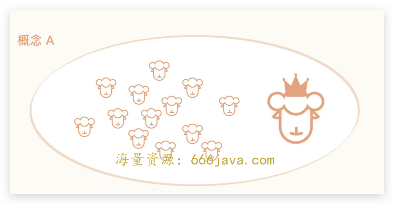
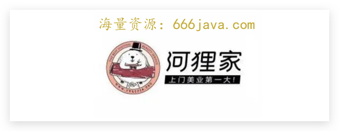
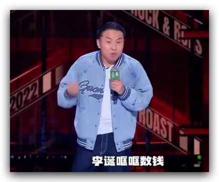
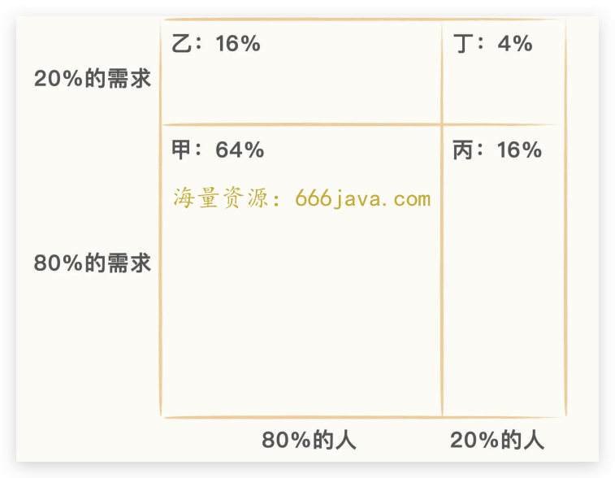
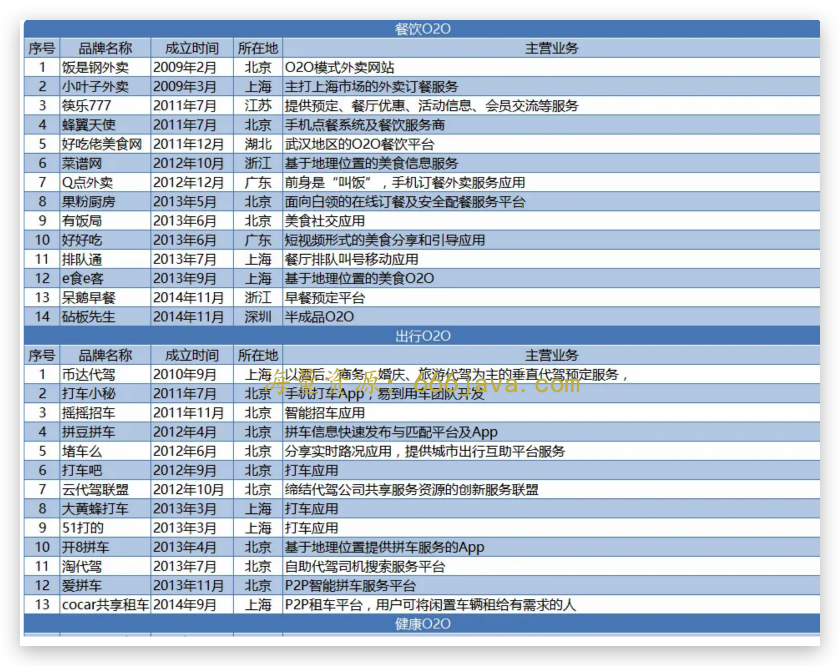
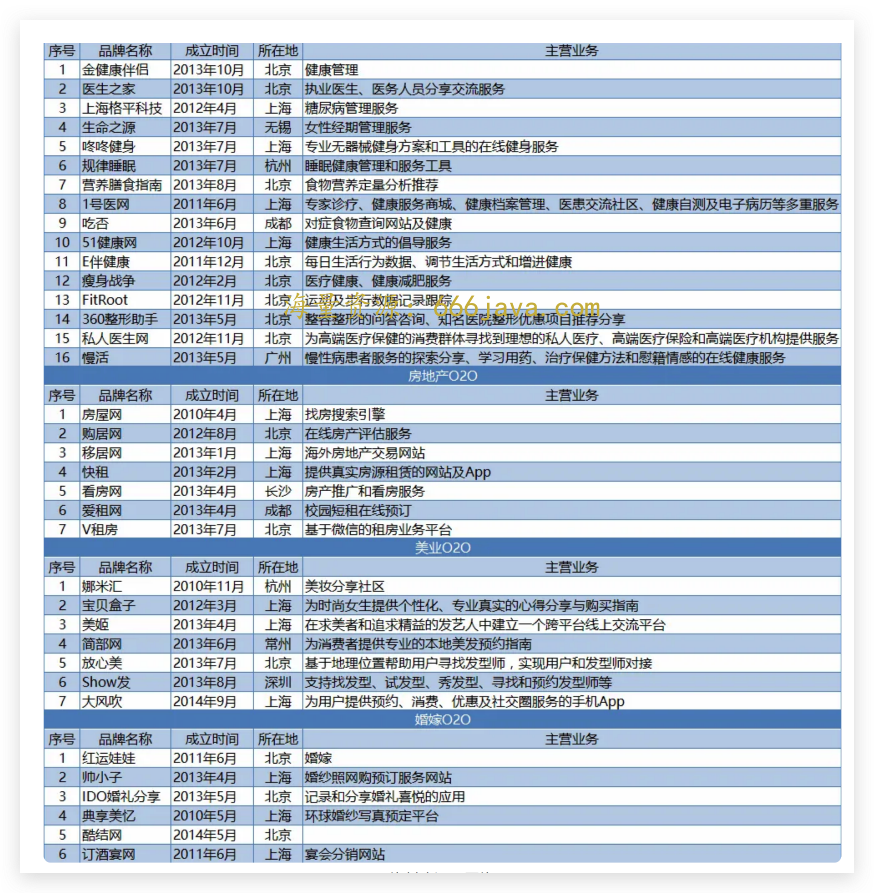

# 32-需求：为什么大部分 O2O 项目都是漫天烟花？

<audio controls="" title="32-需求：为什么大部分O2O项目都是漫天烟花？">
  <source
    id="mp3"
    src="/mp3/business-thinking/32-需求：为什么大部分O2O项目都是漫天烟花？.mp3"
  />
</audio>

你好，我是雄峰。这是终局思维的第四篇，今天我们要聊的是 O2O 领域，确切的说是 O2O 创业潮中最终失败的那些项目。

我们前文提过，推动互联网高速前进的 [底层驱动力](https://time.geekbang.org/column/article/552161) 有两个，分别是用户的扩大和网速的提升。移动互联网的发展进一步加速了这个过程，对比 PC 互联网，移动互联网最大的不同之处又在于其 **入网设备具备地理位置信息（GPS 定位）**， **这种特殊的信息介质给移动互联网改造现实社会带来了可能性。**

因此，2010 年前后，伴随着 4G 带宽的提速以及智能设备的普及，随之而来的是 O2O（Online To Offline）这种将线上线下结合的新模式逐步蔓延开来。

O2O（Online to Offline）模式就是将线下商务的机会与互联网结合，让互联网成为线下交易的线上平台，把线上的消费者引入线下进行消费体验。因此， **O2O 模式的核心在于线上交易、线下体验。**

我们所熟知的 O2O 服务中最常见的是打车、团购和外卖。实际上从 2013 年开始，因为滴滴和美团的成功，创业者们模仿它们推出了各式各样的 O2O 项目，覆盖生活服务的方方面面。比如上门保洁、上门美甲、上门美发按摩，还有上门洗狗以及上门洗衣洗车等等模式，关键是还以远低于成本的价格为用户提供服务，“1 元洗车”“1 元洗狗”“1 元按摩”比比皆是。

我有一位好朋友就在这股风潮下，开了一个 O2O 模式下的互联网宠物公司，主打 1 元洗狗，亏得没边了，做了一年多之后很快转型其他业务。

无独有偶，O2O 在经历了 15 年的疯狂之后，形势开始急转直下，2016 年行业流传出来了一份 O2O 死亡名单，我附在了文末，你可以看一下，80%的 O2O 企业都死在了这一年。

接下来，让我们回到当初的时间点去看 O2O 这个产业，回答两个核心疑问：

1. 为什么 O2O 当初会那么火？
2. 其失败的底层原因又是什么？

从中，我们再去学习平台产品的双边定理，并进一步复习之前学习的 [需求二八法则](https://time.geekbang.org/column/article/546770)，运用我们这个版块的核心知识点，用终局思维的角度去判断业务到底要怎么做才合理。

## 风口上的“租”

O2O 被美国 TrialPay 创始人 AlexRampel 在 2010 年首次提出，随即被引入中国，点燃市场热情，成为了风口上的概念。

而它之所以被人们所垂青，核心在于其成长为新平台型业务的可能性极大，平台业务的收租商业模式一本万利。从此，O2O 成为了风口上的那头“租”。

### 清晰的商业模式

为什么说这个商业模式一本万利呢？

即使发展到今天，O2O 的领头羊滴滴还在亏钱，美团的盈利也及其有限。但是在移动互联网早期，除了能够最快获得回报的游戏业务以外，从业者普遍认为 O2O 是离钱最近的方向之一： **因为它能够直接介入消费流程，对用户的消费决策有着较大的影响，不管是从中抽佣还是提供广告服务，都有非常高的收入空间。**

我们在分析 [百度](https://time.geekbang.org/column/article/557431) 的时候提到过，百度在移动初期之所以进军 O2O 领域，是因为信息流广告的商业模式没有确认之前，百度坐拥 14 个“亿级移动端产品”但是很难变现。

在 PC 端，百度通过搜索广告的方式一年获得了超 200 亿的收入，但在移动端因为手机屏幕远小于电脑，难以直接移植 PC 端的广告模式，加之移动端纯信息搜索的需求在降低，因此切入消费相关的商品和本地生活服务成为了大的方向，O2O 变现也顺理成章。

### 领头羊的榜样

回顾互联网发展这几十年，我们会明显感觉有一个概念驱动的影子： **一个概念下会诞生一批相应的公司，只要这批公司跑出了一个领头羊，就会拥有极为出众的财富故事和行业光芒，领头羊带来的光环和财富导致身后跟着一波新的羊群，从而做大了整个产业。**

互联网初期的门户概念下，诞生了四大门户；Web2.0 概念下，诞生了人人网、豆瓣网以及微博；O2O 概念下，诞生了美团和滴滴。

O2O 当初之所以这么火爆，一方面在于滴滴和美团这类领头羊的成功，极大地鼓舞了从业者的信心，一个打车一个团购只覆盖了生活服务的一部分领域，还有那么多生活相关领域可以切入。

比如后来雕爷做的河狸家，2014 年成立的一个上门美甲的项目，在短短一年内就完成了三轮融资，估计 3 亿美元，进一步刺激了行业的信心。

另一方面， **该领域竞争非常早期，巨头无暇顾及且无优势**。当时腾讯的重心是将社交关系和游戏业务覆盖到移动，前者缔造了微信，后者缔造了占据国内游戏收入半壁江山的腾讯互娱；阿里的重心也是移动化，为了移动化也闹出了不少笑话，比如推出 [来往](https://time.geekbang.org/column/article/563708)。

BAT 里面只有百度亲自下场做 O2O，另外两家则是通过投资的方式介入，这就给了大量创业者发展机会，再不济就成为两家巨头的代言人，总之进可攻退可守。

### 平台模式的执念

Caoz 老师在自己的公众号“Caoz 的梦呓”中发表过一篇文章： [万般皆下品，唯有收租高](https://mp.weixin.qq.com/s/vEcF7S0apYKKFmHA6VQvIQ)。大概的意思是自己前段时间看到了一篇分析北京各种烧烤连锁店模式和盈利的文章，被下面一句评论给扎心到了：

> 几十个人累死累活一个月能盈利 5 万，房东每个月坐收 10 万。

O2O 早期有一个迷人概念： **双边平台。一端连接用户，一端连接供给（商家/个体），通过互联网构建起一个服务模式，即可构建起一个平台，一旦用户养成用户习惯，则平台在中间长期旱涝保收。**

细想之下， **几乎所有的互联网巨头，本质上都是收租的生意**。不管是百度、阿里还是如今的字节、美团、京东，本质上都是一个巨大的流量连接供给侧和用户侧，从中间产生的巨大流量抽佣或者进行广告变现，平台上的商家拼死拼活，平台则旱涝保收。

以电商直播为例，字节的巨量千川广告日收入很快就突破了 3 亿，但是大量直播商家并不赚钱，大家本质上是给广告平台打工，和最近吐槽大会徐志胜吐槽李诞的段子有异曲同工之妙：

> 这不就是我给他打工的现状，我们努力奔跑，李诞生活美好，我们跑了 5 年，李诞哐哐数钱，我们跑得拼了命，李诞说今天晚上喝得不尽兴。

再比如河狸家以上门美甲作为切入点，进一步切入美妆服务，比如烫头、染发、护理等等，成为上门美业的平台——虽然事后证明这只是一个不切实际的愿望。

### 移动互联网的万历十五年

2012 年被称为互联网的“万历十五年”。

《万历十五年》是黄仁宇创作的历史学著作，这本书的英文名叫做《1587，A Year of No Significance》，直译过来就是“1587，一个无关紧要的年份”。虽然在表面的历史记载上，这一年是再平凡不过的一年，但在书中通过关键人物的详细描写，暴露出了明朝的各种弊端——这一年其实是历史上的一个重要节点。

而在 2012 那个时间点，越来越多的人相信移动取代 PC 是大势所趋，全面取代只是时间的问题，那一年发生了这么几个现象。

一个是 **百度 PC 端流量开始回落**。字节战略大神朱时雨在公众号的文章 [《2012：互联网的万历十五年》](https://mp.weixin.qq.com/s/zbAxhDNb87dw--Iuh2E6Mg) 中提到过一个有意思的现象：

> 互联网全年的流量有两个时间坑点，一个是 9 月份开学会有一个小跌幅，另一个是春节会有一个大的跌幅，前者持续时间较短，后者持续时间长达一个月多一点，此后用户流量就会恢复正常。
>
> 但是在 2012 年春节之后发生了一个诡异的事情，春节过后一个月流量依旧很颓势，后来找了各种分析发现依旧找不到合理的理由，最后只有一个因素可以解释——移动端开始替代 PC 了，其核心原因在于春节是智能手机销量的小高峰，很多人春节回城后兜里多踹了一部手机，摆弄新玩意，也在情理之中。

一个是 **微信的用户超过 1 亿**。微信于 2011 年 1 月 21 日推出，历经 433 天就突破了 1 亿用户，成为当时有史以来用户增长最快的产品。我进腾讯之后，跟早期的微信同事和其他部门的同事聊过这个事儿，微信的同事反馈是没有想到会这么快，很超乎内部的预期，其他部门的同事反馈，当时腾讯的不少 PC 业务也面临裁员，微信超过 1 亿以后，结果公司不裁员了，把很多人调往移动业务，开始了全面的移动化转型。

另外一个是 **红米手机的发布**。罗永浩前不久在一次直播上评价小米：

> 从小米推出的红米 1A 开始，中国山寨手机厂商渐渐都被小米干倒了，这是典型的良币驱逐劣币，在这个意义上，小米可以称得上功德无量。

2012 年开始，小米推出了红米 A1 系列手机，799 元的手机就可以媲美中档智能手机的性能，可以满足手机绝大多数的使用功能。大量红米手机被销往三、四线城市给到父母和家人使用。在小米的带动下，大量厂商也推出了对标红米的手机设备，进一步加速了智能手机时代的到来。

从此之后， **几乎所有的互联网企业都提出了移动优先或者向移动转型之类的战略，没有人再怀疑移动是不是未来，是不是泡沫，而在这个阶段，主流资本市场开始把钱洒向移动互联网相关的所有项目，期望成长出下一个“BAT”**。

也就是在这一年，SIG 海纳亚洲投资了张一鸣，成就了如今的今日头条，天使投资人王刚投资了滴滴，成就了如今的滴滴，也正是它们的成功，进一步推动了资本的大爆发。

## O2O 的大败局

当初有多么火热，如今就有多么的萧条。

2014 年，创业者还在围绕生活服务整合线上线下的模式四处出击，上门洗衣、家政、美容美甲、按摩、洗车、车辆保养等模式吸引着资本的无限关注。而 2015 年，头部公司 [在资本的推动下开始合并](https://time.geekbang.org/column/article/560747)，美团和大众点评合并，滴滴和快的合并，58 和赶集合并，携程和去哪儿合并。

此后，资本的钱基本涌向了合并后的“龙头”公司，没有获得资本支持的初创公司陷入了关闭的境地，这究竟是为什么呢？

### 伪需求集中爆发

O2O 火爆的时候出现了大量我看不懂的项目。

13 年在北京实习的时候看到了一个 O2O 项目，叫“妈妈厨房”。它的需求场景是大量北漂在外的人吃不到妈妈做的饭，通过 App 就可以找到跟自己家乡一样的老人做饭，然后下订单做一顿便当给自己送过来。既解决了漂泊在外的人想吃家乡菜的需求，又可以给一些年龄大的老人提供一些收入。

无独有偶，一个类似的项目叫“回家吃饭”，就是下班了你没有饭吃，又不想去吃千篇一律的餐厅，可以通过 App 付费到附近的某个陌生人家里吃饭，满足了有人陪吃饭的需求，又可以增加退休老人的收入。

此“妈妈”非比彼“妈妈”，此“回家”非彼“回家”。两者提供的服务和情绪价值与真实环境有着天壤之别，而且安全、口味、平台管理种种方面都存在较大的问题。此外，用户是否真的有这个需求？你可以随机问五个同事，如果想吃妈妈做的饭菜，你愿意愿意下班去一个陌生阿姨家里吃饭么？难道妈妈做的饭一定很好吃？但在资本火爆和 O2O 风口的时代，这种项目不胜枚举。

加之当初大量初创项目通过 [补贴](https://time.geekbang.org/column/article/560747) 模式切入市场，大量的上门洗车、按摩、卫生以及洗狗都是低成本（1 元）甚至零成本， **资本的补贴扭曲了用户的真实需求关系，这种需求并不是“必须有”，而是“可以有”，等到真正用市场价格提供服务的时候，用户用脚投票，那么这种需求就会变成“可以没有”。**

我们在前文提过王慧文的一个观点： **补贴的本质是让消费者体验一个更好的消费模式，从而构建新的用户习惯。这个需要确保的地方在于如果后面不补贴了，用户需求依旧存在，在具体补贴策略中，需要尽量避免不补贴之后用户流失的情况。但早期广大 O2O 创业者用补贴这个工具，成功创造了虚假繁荣的假象。**

那怎么判断这个用户需求是否能够保留呢？还记得我们之前提到过的需求二八法则么？我们以河狸家上门美甲来做一个拆解。

美甲是女性的通用需求，但是大多数人是自己买、自己解决，涂点不一样的指甲油即可，如果要做造型则去美甲店解决，而更少部分的用户则会选择上门来解决。这个时候，上门美甲则落到了丁的区域，成为了 20%人的 20%的需求。

### 并未重构价值链条

**滴滴和美团之所以可以胜出，核心在于其对用户体验和商业价值的连接重构，创造了新的价值。**

O2O 属于共享经济的范畴，而 **共享经济有两个核心点，一是对个人可支配的碎片化时间再利用，二是对闲置资产的价值再释放**，这是两个最基本的纬度。

我们以滴滴为例，它对用户碎片化时间以及闲置资产进行再释放，并通过滴滴这个平台重新连接，从而创造对了用户（可以打到更多的车）以及对司机（闲暇之余有更多的收入）更多的价值。早期的补贴只是让用户更多体验到这种好的模式，但是 90%的 O2O 项目并没有做到这个要求，大量补贴是维持这个泡沫的根本。

还是以河狸家为例。对于用户而言，它并没有创造更好的价值。大部分女性做美甲是切换一个更放松的环境，美甲之外还有其他连带需求，比如喝一个下午茶，逛几家衣服店，相反在家等美甲师上门会造成大量的时间冗余，体验可能还会倒退。

对美甲师而言，也没有达到碎片化时间和闲置资产的利用。上门看似非常有效率，不用在店里等着客户上门，但是一个美甲师每天拎着工具箱，加上通勤时间，能做的单是有限的，6 单就非常累了，一单 50 块钱，平台还要抽走 30%。但如果在店里，一天可以做到 8 单以上。

可以说，补贴扭曲了这种供给方式。隐形的时间成本，最终变成了更高的上门服务价格，而适应高单价的必然不会是大众人群。因此，上门服务面对的客户群体也就更少，获客难度也要比门店更高。

当时大多数的 O2O 项目与河狸家一样，并没有让上下游变得更好，只是通过补贴轰轰烈烈地营造声势，以期望资本继续为用户规模买单，实现资本的循环游戏。

### 低频需求难成平台

O2O 平台的一边是海量的用户规模，另一边则是广泛的线下资源。从逻辑上来看，两者可以构成一个双边平台，但是 **评判一个平台是否最终成立的标准是需求的动态不平衡**。我们在讲 [91 手机助手](https://time.geekbang.org/column/article/579149) 的时候提及过这个概念，这里我们再复习一下：

> 动态不平衡，即这个市场的活跃度足够高，不会产生单个用户和单个服务提供者在一段时间内多次达成同一个交易的过程。例如用户交易的时候很少在固定的时候固定地买一家店固定的商品，用户也很少同时同刻在同一地点打上同一个司机的同一辆车。

**很多平台型业务看上去是动态不平衡，但实际上是平衡的。** 比如美发业务，如果一个人经常使用一个人的服务，会使得双方形成情感和信任，这种情况下，双方就会绕过平台私下达成交易，那么平台的作用就会越来越不明显，保洁、维修、家教都是类似的业务，这也是大量 O2O 业务不可能成为平台的原因。

此外，由于 **大量需求属于低频需求，因此用户很难有很强的记忆**。这就导致用户一旦过了一段时间没有用，则会忘记产品所提供的服务，而这种情况就需要产品反复打广告形成用户记忆。再往后想，缺少用户之后，供给侧会因为很难接到单子而粘性不足，平台的匹配效率也会下降。于是产品就会想方设法在各大平台打广告，但这种情况下 O2O 又相当于给广告平台打工，因为赚取的大部分钱都拿去打了广告。而高频产品又容易借助流量切入这小的垂类领域。

什么意思呢？我们继续以河狸家举例。

一个女生做完一次美甲之后，下次再做可能就是一个月或者一个季度之后。如果用户规模不够大，平台的美甲师们也就没活干，进而流失到其他平台上去。为了确保用户量足够多，河狸家会尝试去各大广告平台（如抖音、微信）打广告，吸引过往没有美甲的用户体验上门美甲服务。但因为流量成本费用很高，钱则会被广告平台所赚取。相反，假如美团或者 58 这类产品切入到家美业服务，完全可以基于自己足够大的流量分一部分做新业务，就可以形成比河狸家更低的获客成本。

为什么 15 年之后大量 O2O 死亡？其中一个原因就在于 58 同城把大量垂类整合成了 58 到家这个产品，一站式满足上门的所有服务，高频打低频，就这么打死了一堆同行。

最后，则是 **O2O 这种模式扩展属于重资产扩张**。跟线上互联网不同，后者的边际成本基本是 0，一个网站做好之后从服务 1 万人变成服务 100 万人，成本是指数型下降的，主要是增加服务器带宽和运维成本。但是一个 O2O 项目从服务 1 万人到服务 100 万人，则需要不断进入新的地域，招募新的地推，培训新的服务者以及打广告，这一套下来会变得非常重，成本也是呈几何倍数的增加。因此，O2O 领域需要融大钱。但没有占据头部市场且无高频需求，资本也没有可能追加。

## 小结

O2O 创业潮的之所以失败，核心在于其拓展的业务领域大多为低频和伪需求场景。

**首先，使用频次低不足以支撑起业务模型成长为一个大的平台型产品。** 因为供需关系导致匹配效率低，产品如果通过大量广告来维系用户量，又会导致平台不赚钱，因此大多垂类发展到今天都是以小程序的方式依附在大的平台上生存，此外这类场景也容易被高频场景通过产品集成的方式切入，比如 58 旗下的 58 到家，美团 App 里面的本地生活服务等。

**其次，通过价格补贴扭曲了用户的真实购买意愿，让补贴成为了做大业务规模的策略，而不是让用户享受优质的体验模式。** 这种模式下衍生出来的很多产品服务，在低价的模式下则会变成了这个需求可以有，而不是需求必须有，一旦资本不补贴，需求就会大规模下滑。

**最后，用终局思维的角度去思考，业务实现自盈利是最关键的目标。** 长线来看，资本绝不会选择无穷无尽的投入，那当资本撤退之后，大幅度的补贴也就不复存在。那么，如果没有这种补贴，产品是否可以实现自盈利？业务模式是否会成立？用户还有这个需求吗？用户是否会流失？资本的补贴是短期行为，被一时的烟花所迷惑，忘记盈利才是业务的核心，则一定不会长远。

## 思考题

你还见过哪些伪需求 O2O 项目呢？

欢迎你在留言区和我交流互动。我们建立了一个 [读者交流群](http://jinshuju.net/f/DuxzBi)，欢迎你的加入！如果你觉得有所收获，也可以把这节课分享给你的朋友一起学习。我们下节课见。

