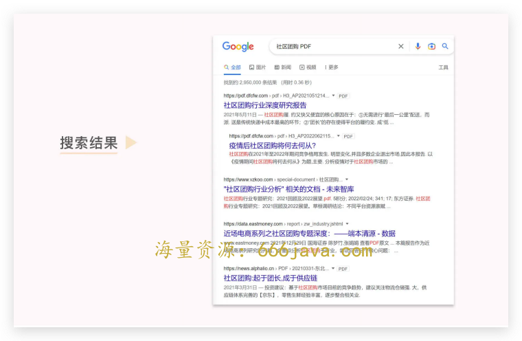
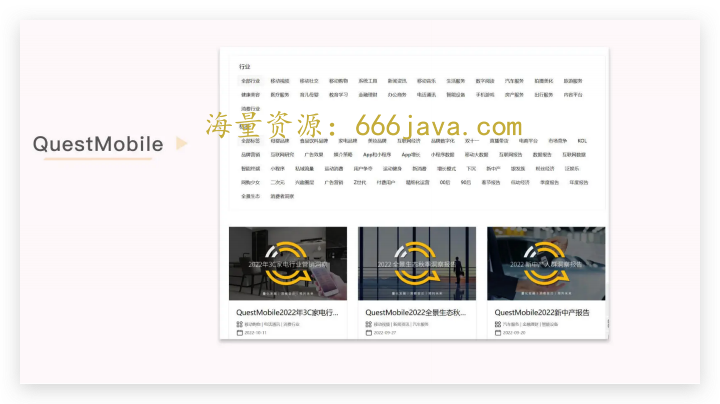
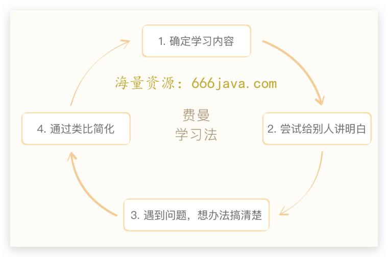

# 35-行业：如何在一周内快速了解一个行业？

<audio controls="" title="35-行业：如何在一周内快速了解一个行业？">
  <source
    id="mp3"
    src="/mp3/business-thinking/35-行业：如何在一周内快速了解一个行业？.mp3"
  />
</audio>

你好，我是雄峰。策略工具是商业思维案例笔记的最后一个内容模块。

如果说我们前面学习的是如何做各种各样美味的菜肴，那么这个模块则是教会我们如何更好地使用锅碗瓢盆，让菜品更上一层楼——只有懂得如何使用这些工具策略，才可以在工作中更快地推进业务，达成业务目标。

我们今天学习的内容是 **如何在一周内快速的了解一个行业**。这是一个常被人所忽视的关键性技能点，核心原因有两点：

1. **缺乏使用场景。**

了解一个新的行业大多是因为业务上要新拓展一个领域，这个时候往往有战略的辅助以及老板的决策，而对于大多一线员工来说，通常是“干就完了”，学习行业分析的技能远不如把 Excel 或者文档能力锻炼好来得实际。

1. **学习难度较高。**

一份好的行业分析报告需要满足三个条件：

- **能把行业说清楚。** 解释行业的发展规律、盈利模式以及影响行业发展的关键因素（包含数据）；
- **能把公司说清楚。** 分析企业在这个行业的生存情况以及核心竞争力（包含数据）；
- **有独特的见解以及相应的策略。** 通过切入点分析发现企业面临的问题，从而提出相应的解决方案。

这样的一份报告，没有长期的锻炼和行业浸泡是很难做出来，对于一个没有受过专业训练的人无异于天方夜谭。

那为什么我们还要学习这个技能呢？这就涉及到我们了解行业的目的，商业分析师（商分）写的行业研究报告是为了论证一个业务方向的机会或者问题点，说服老板，而我们做行业分析的目的，则更多是为了个人提升。

## 了解行业的价值

个人提升这个词很虚，而且在一周之内了解一个行业，也不会让你快速成为行业专家或者行业高管。所以我们说点实际的，这个技能对你的个人提升，有这么几个关键性作用。

首先， **构建行业认知。** 有一次某头部音乐 App 公司的朋友找我吐槽，她在做数字专辑的售卖，觉得现在的工作没意思，我先问了她一个问题：

> 你现在所做的是音乐专辑发行的哪一个环节？那你对于整个产业链是否有了解？比如传统音乐产业中，一个专辑从想法到售卖的过程要经历哪些环节？一个音乐人是如何被挖掘和包装出来的？数字化在中间可以解决哪些问题？

这句话把朋友给问懵了，她说她没有想过。我又给她举了一个很有意思的例子：

> 为什么现在音乐是 3-5 分钟左右？因为人们最早的留声机所使用的唱片盘一面只能够存储 4-5 分钟的内容，因此形成了如今的音乐播放习惯。这个是过往的传播介质形成的内容结构。换到数字化音乐时代，传播介质已经不是问题了，那么为什么还是如今的 3-5 分钟时间呢？

那天我给她的建议是把目光放高，看上下游的机会，一些思考不见得可以给工作带来太多的价值，但是可以让人抬头看到星辰大海，构建起一个更宏观的行业认知，也可以更清晰地认知自己当前岗位的现状。

其次， **越上两级思考。** 有一个前辈告诉我一个工作技巧，越一级思考是向上管理，越两级思考是顶层对齐，前者可以让你获得更为轻松的工作环境和信任度，后者才可以让你的长期发展更有空间。

事实上，很多时候你的老板跟老板的老板之间，也可能存在信息差和业务判断不一致的地方，跟更大的老板对齐目标才是保障工作正确性更好的道路。因此，我们常常需要从当前业务和周边信息去反推验证，而掌握行业分析的全视角能力，会让你更容易理解老板们的想法和原因。

最后， **了解** **行业化的方向。** 什么是行业化？腾讯在 18 年新增了一个职位通道：行业应用。这个岗位设置的背景是互联网成为了整个行业的基础设施，而运用互联网优化、改造传统行业，也就是行业化，成为了互联网下一阶段的发展方向。

所以，这个岗位的要求是既需要对一个传统行业有认知和经验，又需要具备互联网相关的知识技能，属于融合性岗位。早在几年前有朋友从传统互联网企业，跳槽去了这类企业，比如美团、贝壳等，都获得了不错的职业收益空间。

想一想，很多时候我们都在说升维思考，但并不知道它具体是什么意思，更不要说怎么去做了。了解行业就是升维思考的基础和方法。接下来，我们就化繁为简，将“了解行业”拆解为 4 个步骤，逐一了解。

## 准备：大规模获取信息

第一步，建立对这个行业的基准认知和概况了解。我常用的方式是 **读行业研报以及行业分析文档**。前者一般要看 20 份左右，后者一般是把几个关键信息源的关键词内容全部检索一遍。有了这些内容，就可以对整个行业有一个相对宏观和整体的认知。

先说 **行业研报**，一般来自券商分析师或者行业报告。前者比较有名的是天风证券、浙商证券、东吴证券等，后者来源则非常杂，有些来自数据分析平台，比如 [QuestMobile](https://www.questmobile.com.cn/research/report-new)，有些来自头部领先公司，比如腾讯和字节等。

行业研报一般是券商写给各大投资机构的内容，这类内容大多为付费内容，所以这里介绍几个性价比高的研报网站： [发现报告](https://www.fxbaogao.com/)、 [财联社](https://www.cls.cn/vip?column=20021) 以及 [萝卜投研](https://robo.datayes.com/v2/selection)。我常用的是萝卜投研，价格适中且内容更新相对及时。

当然，还有一些免费来源，相对比较杂，有些是直接进入各大券商官网查，有些则来自一些小网站。这里有一个小技巧： **善用 Google**。比如我们要找社区团购的研报，完全可以直接搜索：

> 社区团购 PDF
>
> 

如果想单独看社区团购某一个公司的，则可以搜索：

> 社区团购 拼多多 PDF

再说 **行业信息文档**。我通常从三部分获取，一部分是刚刚提到的行业数据平台 [QuestMobile](https://www.questmobile.com.cn/research/report-new)，定期会有各行业的数据资料，当然最好的还是购买 QM 的数据服务，全行业数据精准度非常高。

一部分是商业资讯媒体，比如虎嗅、极客公园、36kr、深网腾讯新闻，还有公众号 [晚点](https://mp.weixin.qq.com/mp/profile_ext?action=home&__biz=MzU3Mjk1OTQ0Ng==&scene=124#wechat_redirect)， [饭统戴老板](https://mp.weixin.qq.com/mp/profile_ext?action=home&__biz=MzU4NDY2MDMzMA==&scene=124#wechat_redirect)、 [锦缎](https://mp.weixin.qq.com/mp/profile_ext?action=home&__biz=MzkxOTAyNjAwOA==&scene=124#wechat_redirect) 等，还有一个付费媒体财新，这些专业平台对于时下热点内容都有定期的跟踪，拥有一线的数据信息以及专业的分析视角，内容非常值得看。

最后一部分是个人自媒体，个人经常看的有 [笔下求生](https://mp.weixin.qq.com/mp/profile_ext?action=home&__biz=MzA3MDgwMTk1Mw==&scene=124#wechat_redirect)、 [Less or More](https://mp.weixin.qq.com/mp/profile_ext?action=home&__biz=MzI0Njc0MjAwMw==&scene=124#wechat_redirect)、 [张小珺](https://mp.weixin.qq.com/mp/profile_ext?action=home&__biz=MzU0MDk3ODUwMA==&scene=124#wechat_redirect)、 [二爷鉴书](https://mp.weixin.qq.com/mp/profile_ext?action=home&__biz=MjM5OTM4ODU4MA==&scene=124#wechat_redirect)、 [乱翻书](https://mp.weixin.qq.com/mp/profile_ext?action=home&__biz=MjM5MDczODM3Mw==&scene=124#wechat_redirect)、 [Caoz 的梦呓](https://mp.weixin.qq.com/mp/profile_ext?action=home&__biz=MzI0MjA1Mjg2Ng==&scene=124#wechat_redirect)、 [王信文](https://mp.weixin.qq.com/mp/profile_ext?action=home&__biz=MzI0MTMyODM5OQ==&scene=124#wechat_redirect) 等，这些公众号不太追时下热点，但是一些对于某些行业或者现象的视角判断非常特殊，很有启发。

## 结构：行业运转逻辑

在看上述资料的时候，我们当然还要学会做 **关键信息摘要**。不然很可能看了大量内容后什么信息都记不住，回头详细梳理的时候又要重新再翻一遍，那什么内容值得摘要呢？

我的方式是 **用问题来圈定摘要的内容**，这里有一份具体问题 List，总结任何行业的时候都可以参考：

> 行业的商业模式是什么的？
>
> 行业的存在原因：提供了什么价值或者具备什么样的潜力空间？
>
> 行业从源头到终点都有哪些环节？每个环节的价值是什么样的？
>
> 每个环节的领头羊公司分别是谁？为什么他们可以占据领头羊的位置？
>
> 整个行业的规模有多少，具体推算的逻辑是怎么样的？
>
> 行业是否有被其他行业所颠覆的可能性？
>
> 进一步增长的动力来自哪里？
>
> 这个行业的法律监管情况如何？

通读下来，你会发现这些问题都指向了 **一个行业的链条的运转方向**。过往我每分析一个行业，就会把这些问题贴上去，在看到的资料中把适合的内容汇总到对应的问题下面，等到看完所有的资料，就可以汇总完自己想要的关键信息。

汇总完信息之后，就可以回答上面的问题了。但要注意， **确保每一个问题都得到有效答案**。以“在线出行”这个行业为例，我们回答一下第二个问题：这个行业存在的原因是什么？

> 1.  移动智能设备的普及可精准定位每一个用户；
>
> 2.  共享经济的大潮下实现了用户体验和商业价值的重构连接，既对闲置资产进行价值再释放，又为用户提供了更好的出行服务体验；
>
> 3.  政府对于行业是鼓励的态度，为其创造了更大的价值；
>
> 4.  资本看好移动出行，因其规模足够大，属于千亿级市场，因此大资本涌入也推动了快速发展。

8 个问题回答清楚之后，就可以串联出一个大致结构，构建对行业充足的了解了。

## 深入：费曼学习法

不过，是否了解一个行业，你自己说了不算，别人说了才算，因此我们需要想办法让一个对行业不了解的人有一定的了解。这个时候，我们之前学习过的 [费曼学习法](https://time.geekbang.org/column/article/576925) 派上了用场。

我们确定的学习内容就是用最短的时间、最简单的话介绍清楚一个行业。在这个过程中，你可以反复讲给很多同学听，遇到问题，再反复查找资料、完善自己的表达，甚至可以用类比的方式，通过熟悉事物的比喻，拉近听众和这个陌生行业的距离。

用一个我们都熟悉的行业举例子——便利店。以下是我过往做的一个费曼总结。

> 便利店是通常在居民区或者公司附近 100 平内的小型零售店铺，以满足用户便利购物的需求为第一目标，因此大部分商品为香烟、酒水饮料、食品零食、洗漱用品等，且营业时间较长，大多数实行 24 小时营业。
>
> 目前便利店行业因用户不一样产生了两个种类，一类是美宜佳、天福这类夫妻便利店，主要在一线城市的边缘区域以及二三线城市的工业区，用户主要是工厂和体力劳动者，这类用户的需求主要是便利性商品，比如酒水烟奶零食，而这类标准化商品利润很低，大多数在 20%以内，夫妻本质上赚取的就是个人工资，很难扩大规模，所以大多数这类便利店就是 2 个人共同经营。
>
> 另一类是 711、罗森以及全家这类社区便利店，主要在一二线城市的核心社区以及写字楼区域，用户主要是都是白领和附近的一线服务人员，这类便利店的本质是快餐店，因为主要销售商品为鲜食（包子/关东煮/乌冬面等）和饮料，毛利可高达 60%左右，因此可以请更多的人一起经营，经常可以看到 4 个人以上轮班。
>
> 便利店的行业趋势围绕着两个点持续优化。一个是售卖效率。便利店售卖的东西一定是周边用户常用的东西，所以便利店需要经常淘汰低购买率的商品，换上高购买率的商品。另一个则是需求融合。便利店因其地理位置的便利性，可以承载很多线上到线下的服务，比如社区团购的提货点、快递的货柜等等。

如果有细节没有理解，也欢迎你随时和我交流，帮助我完善总结，其实这就是不断深入行业的过程。

## 验证：访谈行业专家

费曼学习法就是结束了吗？我们之前还学习过一种了解信息的方法， [人肉图谱](https://time.geekbang.org/column/article/576925)。简单来说就是 **通过行业的专家帮我们判断自己对于行业的理解是否正确**，因为大部分领域的知识更新迭代的速度极快，最新的知识永远在人的大脑当中。

我们可以通过一些周边的朋友或者付费咨询的平台，找到行业结构中的专家去聊，而聊的 **基础是对行业有一定的了解，** **获取过大量信息、建立起自己对行业运转逻辑和结构的认知和理解**，不然不仅聊不出东西，还会浪费对方的时间。带着问题去聊，才有更深入的探讨点。

我在腾讯工作的时候，因为各业务线很多，人也都有，加上组织结构透明，所以当我想了解一个东西的时候，一般会把想聊的问题提前汇总出来，并说清楚大概会占用的时间，从而减少对对方的困扰以及时间的花费，翻一翻对应的组织架构，留言诚恳请教，只要对方有时间，一般都会得到解答。

## 小结

对大部分人而言，自己的第一份工作对后续职业生涯的影响至关重要，很多时候大家莫名其妙进入的一个行业决定了人生大部分机会，但任何工作并不是长盛不衰的。有些行业搭上了行业的口风一路向上，比如国产化高端制造业成为重要方向，比如汽车新能源领域。有些行业则被其他行业所影响所颠覆，比如银行线下柜台等。

在工作之后有兴趣去了解新的行业，不仅仅只是工作需求，也是更大的风险对冲。前者可以帮助你站在更高的角度帮助你构建行业认知，站在老板的角度来思考所了解的行业对于本行业的借鉴意义。后者则给你种下了一颗兴趣的种子，说不定哪一天就可以燃烧起来，给自己找到新的机会。

然而，任何一个行业以及一个公司要做深入的分析，分析方向不一样，也会导致需要准备的资料，切入的方向以及得出的结论不一样。如果你有一天要了解一个行业了，可能会出于这样三个目的：

1. **跨行业参考。** 希望从关联行业中获取启发，从而反哺当前行业的分析判断，比如游戏发行行业一定程度上跟电影宣发行业有点类似，那么后者是一个什么样的产业逻辑，是否可以对游戏发行有所参照呢？细想下来，必然能够获取一定的启发；

2. **差异化学习。** 同样是竞价广告行业，字节的信息流广告系统与腾讯的并不一样，同理，行业中百度和快手也各不相同，放眼海外，Google 和 Facebook 又不一样，而信息流广告只是竞价广告的一部分，这里还有搜索广告、联盟广告等，那么快速了解一个行业的各项细节做差异化对比分析，可以较为清晰的认知不足和优化方向；

3. **寻找新机会。** 这个目标下更多是了解为主，只要可以对一个行业构建起一个大致的结构性认知和发展趋势判断即可。比如了解社区团购兴趣的原因、各家切入行业的方法以及该行业的发展难点，并且可以把了解的内容做一个框架视图，用你现有的常识和之前学过的内容判断一下什么地方有问题，进而尝试找到机会。

三个场景对应的了解程度并不一致，而是逐步深入和递进的关系，我们今天讨论的通用技巧，在三个场景都可以应用。还记得它们是什么吗？

了解一个新的行业核心有四个步骤：先是 **大规模获取信息来源**，不同的行业有属于自己的行业信息库，我上面分享的是我做互联网业务时的信息来源；其次是在进一步整理信息的时候，通过问题的方式 **摘取关键信息**，可以有效的节约汇总时间；接着，把信息汇总成一篇 **通俗易懂的文章**，做到自己说出来大家都可以听懂就好；最后，别忘记 **找行业的专家** 给内容进行一层检查，避免有硬伤和过时的信息。

## 思考题

你可以用费曼的方式介绍一下你所处的行业吗？或者尝试一下这节课里的问题，为什么现在的音乐还是 3-5 分钟的时长呢？

欢迎你在留言区和我交流互动。我们建立了一个 [读者交流群](http://jinshuju.net/f/DuxzBi)，欢迎你的加入！如果你觉得有所收获，也可以把这节课分享给你的朋友一起学习。我们下节课见。

**编辑来信**

> 「一起“费曼一下”」活动开启！🔛
>
> 商业思维是一门长期主义课程，唯有不断探索、反复输入、输出，才能让自己看到星辰大海。
>
> 在“技巧呈现”板块，我们推出「一起“费曼一下”」活动，鼓励你对自己感兴趣的任意一个商业问题进行总结和输出，最终形成小篇幅的文字记录。我们最终会制作成用户加餐，展示在专栏内，和每一位同学一起学习进步。
>
> 如果对内容有所疑问，也欢迎你加入 [读者交流群](http://jinshuju.net/f/DuxzBi)，和曹老板以及同学们一起探究行业热点、讨论问题。
>
> 划重点！划重点！划重点！
>
> 1. 参与方式：在读者交流群内交流分享；
>
> 2. 参与建议：费曼之前，建议学习 [22 课](http://time.geekbang.org/column/article/576925) 和 [29 课](http://time.geekbang.org/column/article/597880)“费曼学习法”相关内容，将会大大提升你第一次总结的内容质量，同时，提升自信哦～
>
> 3. 截止时间：成稿收集截止时间未定，专栏结课后会将部分“费曼一下”的成果展示不定期展示在专栏中，欢迎你随时加入课程交流群探讨问题，参与活动！
