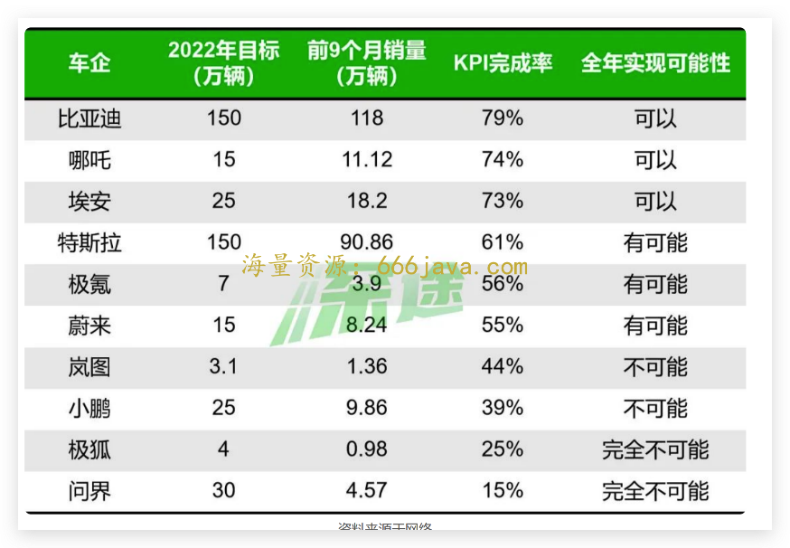
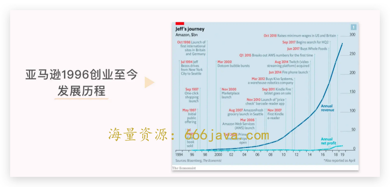
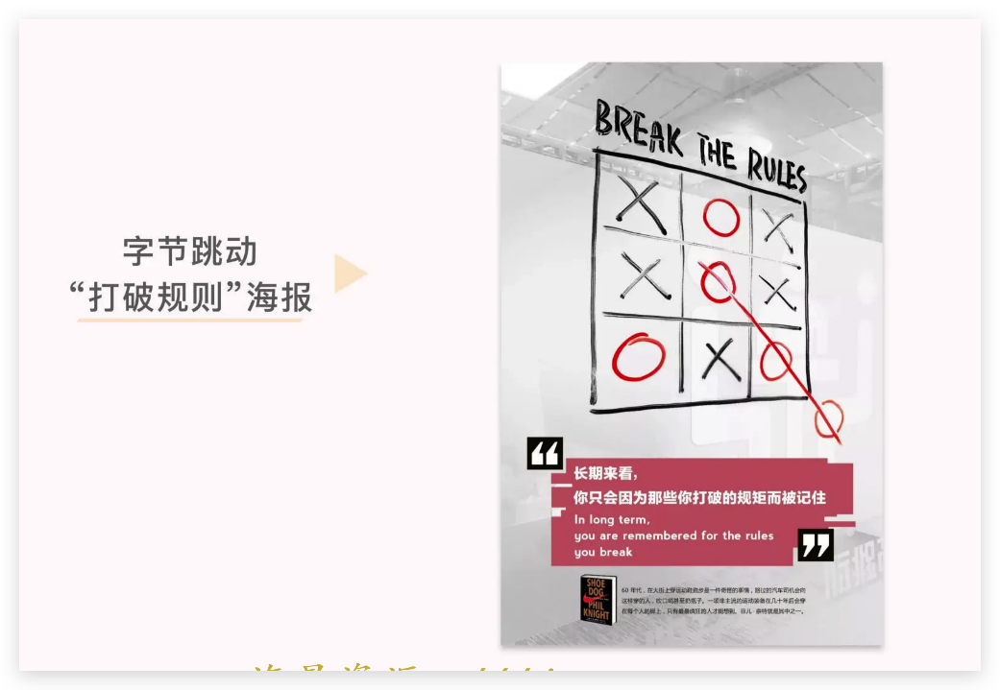

# 37-目标：如果目标是让猪上树，最好的方式是什么？

<audio controls="" title="37-目标：如果目标是让猪上树，最好的方式是什么？">
  <source
    id="mp3"
    src="/mp3/business-thinking/37-目标：如果目标是让猪上树，最好的方式是什么？.mp3"
  />
</audio>

你好，我是雄峰。今天我们聊一个职场关键技巧：如何面对高挑战目标？

今天的内容来自八年前刚毕业上的一次培训课，很偶然的机会，参加了一次公司 VP 级老板给员工做的培训，培训的内容围绕一个问题开展：如何让猪上树？

什么是让猪上树呢？

简单理解，就是企业会制定一个非常高的目标，以至于这个目标看起来非常不切实际，然后让人来完成，所以大家会把这种情况类比为让猪上树，因为常识来看猪是不可能上树的。最典型的让猪上树的例子，就是雷军创办小米——一个没有做过手机业务的公司阶段性做到了全球第一。

“让猪上树”在企业当中，既是一个 **业务思路** 问题——有没有创造性的方案可以实现让猪上树，从而实现不可能的目标？又是一个 **管理** 问题——如何让团队和员工相信这个目标是可以完成的，从而让大家向着高目标执行和努力。

总结下来，这个培训让我很好地理解了三个点：

1. 公司为什么喜欢制定很高的目标，甚至看来不切实际（为什么让猪上树）？
2. 在这种高目标下，有什么比较好的工作方式和协同策略（如何让猪上树）？
3. 如何尽量规避高目标下的危害（除了让猪上树以外，能不能尽量让猴上树或者让猪拱地）？

这个课程对我工作的启发非常大，可以排进所有培训内容的前三，每次在做高挑战性业务的时候，都会把过往内容拿出来反刍一下，看看工作方式和策略是否需要进行调整。

这节课，我把这个内容分享给你，希望可以在实际的工作中帮助你 **更好地理解上层决策的思路，更好地进行思路拟合，从而找到可推进项目的策略，并做到为业务负责。**

## 为什么要让猪上树？

说来也奇怪，不管是什么样的公司，都喜欢定非常高的业务目标。互联网行业中字节定目标非常夸张，基本上可以完成 70%或者 80%都是比较好的完成度。

传统行业也不例外，我们以新能源车企的数据为例，会发现大家 22 年定下来的出货量目标对比 21 年都要翻倍或者翻几倍，比如比亚迪要在 22 年卖 150w 辆新能源车，做到跟特斯拉一样的销量级别，再比如华为合作的问界，21 年还没有出来呢，22 年就要卖 30w 台，这些目标都是典型的让猪上树。

现如今 22 年已经快结束了，这些公司完成得怎么样了呢？可以很明显地发现有些有可能完成，有些完全不可能完成，问题来了，为什么公司都喜欢制定高挑战性的目标呢？

### 理解目标就是不合理的

最开始工作的时候，很多同学都会经常跟老板 argue 目标是否合理的问题，结果都会被拍回来。

大老板的回复一般都是：目标不是你能做什么，而是你做到什么样才对公司有价值。 **在定目标的时候** **，** **不是探讨合理性的问题，而是探讨必要性的问题。**

理解下来，就是他们自己也认为高目标很多时候并不是一个合理的存在，更多的时候，高目标是一个决心的表示，是对未来市场的判断。这不是你能完成多少的问题，而是如果不完成，你的业务在市场上就没有生存机会了。可能你完成了一个合理的目标，但是输掉了整个市场。所以，很多时候高目标就是一个盲拍的结果。

“盲拍”这句话真没有开玩笑。

举个例子，早些年几个部门之间争抢一个项目的业务权，A 部门的老板经过各种评估、各种测算，然后在这个数据的基础上再咬牙跺脚，报上去了一个数据。B 部门的老板则是反推：项目应该要在行业做到什么规模才有想象力？才对公司其他协同业务有帮助？这个规模下极限盈利可以做到什么规模？然后报上去了一个数据。

这个数据是 A 部门的 2 倍都多，当时 A 部门的老板都疯了——没有你们这么放卫星的！但实际情况是，B 部门确实在 5 年前实现了对公司的承诺，超预期完成了一个非常夸张的收入目标且占据了市场重要位置。

后来我也问过周边的朋友，当初在定这个目标的时候，大家的判断是什么？能够做到这个指标么？所有人都会说，没有想到可以做到，都是先报一个很大的目标要一个很大的资源支持，然后走一步看一步，全力去解决。

### “上树”是锻炼团队的机会

电影《面对巨人》中有一个非常励志的 [片段](https://www.bilibili.com/video/BV1HK4y1b7t1/)，也是很多培训课程的经典素材。

这个片段是在一个比赛之前，团队核心骨干 Brock 认为打败强有力的对手并不太可能，教练为了让团队成员认识到每一个人的潜力是无穷的，让两个团队的成员在操场上进行了一段死亡爬行。Brock 身负大汉，快要坚持不下去的时候，教练一直在鼓励“快到了”，一直逼着 Brock 往前走，最终爬完了整个球场，做到了大家之前认为不可能的事情。

工作中也是如此。低目标只会让团队安于现状，让整个团队不思进取，但是高目标则会倒逼你进行创新、进行改变，因为原有的固定路径行不通之后，则会变通的想新的办法， **很多创新就是在高目标的要求下逼出来的出路。**

此外， **高目标的标准下，团队能力也会有所提升**，即使完不成 100%的目标，也可以完成 70%或者 80%，比之前定的基础目标高得多，团队能力也得到了很大的提升。这就是“求其上者得其中”的工作心法。

况且，高目标下，团队的能力和状态都会不一样。虽然一个事情做不好，但是在后面有新业务的情况下，大老板也必然会派更有战斗力以及更有战斗意愿的团队去做业务。

所以，企业或者老板也喜欢定一些高的目标，完得成是惊喜，完不成也可以锻炼团队，就当练兵了。

### “上树”是企业增长的接力棒

企业是利润产物。因此，企业必须要赚钱，必须要扩张，尤其是上市企业，必须要给股东交代。这个交代要么是利润，要么是规模。但企业的扩张并不是无限的，诺威格定理很好地解释了这一点：

> 一家公司的市场占有率超过 50%后，就无法再使市场占有率翻番了。所以它必须不断寻找新的成长点，或扩展业务，或彻底转型进入其他行业。

我们以亚马逊为例，从 1996 年创业至今，市值翻了 3000 倍以上，然而亚马逊并不是靠一个点增长到如今的规模的，而是在每一个阶段都有新的服务推出，新的内容售卖，新的模式诞生，从而解决进一步增长的问题。

在这个过程中，很多新项目也都取得了行业的第一，比如全球最大的云服务提供商 AWS，比如全球最大的游戏直播平台 Twitch（收购）。

这种多元化的扩张也有极大的风险，亚马逊也并不是所有策略都是对的。2014 年，贝索斯踌躇满志发布的 Fire Phone 惨淡收场，股价暴跌，当时贝索斯的目标是成为行业第一的安卓手机产品，不过，这种情况也是每一个进入新行业的人都要面对的情况。

要知道，任何一个公司在面对一个新的行业，制定的目标必然不会靠谱，大多数都是拍一个值或者一个市场占有率。字节这几年可以说是横扫一切，一直想做一个类小红书的种草社区，做到市场第一，但也是一直没有完成。

你会发现，对于一个公司而言，不管是公司扩张的角度还是团队管理的角度，永远会追求一个较高的目标，而 **这个较高目标的制定逻辑并非是基于现状推算，而是要占据一个什么样的市场地位，才对自己有价值。**

## 该如何让猪上树？

理解了为什么非要“让猪上树”之后，我们来说说怎么“让猪上树”。任何一个高目标、高挑战的业务，要完成“让猪上树”，办法只有三个：

1. 创造性思路。告诉猪你可以长出一双翅膀飞上去，然后猪真的给自己弄出了一个翅膀飞了上去；
2. 努力奋斗型。猪也没有办法，只能够想各种办法往树上冲，往树上拱，然后拿着绳子跟树绑在一起，代表上去了；
3. 改关键目标。猪长不出翅膀，也不愿意努力，想了一个办法把树给砍倒，让猪趴上合影，告诉老板猪成功上树。

### 思路 1：创造性思路

虽然让猪飞上树是一个非常漂亮、理想的方案，但很多时候，猪很难长出翅膀。这个时候最好的办法就是要 **打破常规，放开自己的想象力，去思考一些过往被束缚的边界，找到新的增长点**。

字节跳动在全球的公司都放有 6 张海报，把不同公司的最佳实践传递给自己的员工，其中有一张图是下面这张： **打破规则。**

海报这句话来自耐克公司创始人奈特的自传《鞋狗》。同时，海报里的九宫格画满了圈和叉，这时在九宫格外再画一个圈，就可以完成三圈连线。这告诉我们，当现行规则走不通时，你应该做的，是另辟蹊径打破规则，创造新的需求。

很多时候让猪飞上树就是这个逻辑， **鼓励团队打破常规，想新的方案，也就是我们所说的非共识。**

### 思路 2：努力奋斗型

既然是很难完成的目标，必然意味着大部分的努力和尝试都会失败。所以让猪上树还有一种办法，就是 **向老板证明：我已经想尽一切办法了，但是我上不了树，只能够接近。**

我们设想一个场景，你是一个老板，你给下属定了一个上树的目标，下属过来找你说：

> 老板，你让我上树的目标，我想了 ABCDEF 总共 6 种方案，我尝试了其中 ABCD 四种方案，这四种方案的效果都不如预期，分别的情况是怎么样的，然后 E 和 F 的方案我在过程中碰到了哪些问题，希望老板给予支持，看看是否有机会做到。

面对这种类型的下属，一般会有三种情况，要么你可以给出更好的方案，要么可以满足他所需要的资源支持，要么你也没有任何办法。不过，只要你是负责的领导，大概率不会对于这种下属有啥脾气。因为他想到了所有可以想到的方案并且做了执行，且你也给不出更好的建议。

对于员工来说，也不用担心。因为这代表大多数情况，很多时候老板或者公司对于这类情况也是认可的。毕竟创造性的方案是少数，把自己可以想到的都尝试做一遍，已经算很不错了。这种情况属于并没有完成目标，但是通过自己的努力搞定了老板，如果你就是这样的，往往在企业里面也属于厚积薄发的类型。

### 思路 3：改关键目标

改关键目标是企业和团队最麻烦的情况，就是大家并没有想着去找创造性的方案或者努力去奋斗，而是想着如何讨巧地通过更改目标和口径，来完成最终的目标。

这种情况并不少见。举一个例子，某公司产品（非腾讯）要做到千万级别的日活，对比当前的 DAU 要有十倍的增长情况，这确实是一个很难完成的指标，但是团队很轻松地完成了。

为什么可以完成这个目标？因为通过某黑科技手段实现了目标。

产品的日活跃口径定义（统计数据所采用的标准）是产品活跃即可，并且要求用户在前台进行展示。

于是，负责的产品经理做了一个功能：1 像素页面保活。

安卓的系统机制会关闭不在前台使用的产品进程以降低电池的损耗，所以很多产品没有办法在后台活跃。这个产品经理做了 1 个像素的前台页面，让用户肉眼看不见这个页面，但在系统的判断中是“你还在使用这个产品”，所以保留了进程，也便于产品给用户发送 Push 消息，也可以计算为统计口径。

这就是典型的把树砍倒，让猪趴在树上： **通过口径和方式的调整，完成了目标，但是这个对业务非常不利** **。**

可以说，过往几年有不少这种情况，通过更改口径更改逻辑来做业务，导致业务大量的虚假繁荣。

站在企业角度，这三种方式必然是 1>2，一定要规避 3 这种情况，一旦发现 3 这种策略就会进行处理。因为第 3 种的存在和成功，对于 1 和 2 非常不公平，这也就是“让猪上树”背后的负面影响了。

## 背后的机会与负面

我们要理解的是， **高目标的要求下必然会带来很多的问题，而问题的本质就** **是目标与现实的差距。** 很多时候问题之所以产生，是因为目标定得太高，导致实际与预期产生了较大的差距，最终带来了问题。

很多同学都很焦虑的原因也是来自于此：对自己的要求比较高，有时候又喜欢跟身边的人进行对比——为什么身边的朋友薪酬比我高 5K？他可以进大厂为什么我不行？为什么他短短几年就积累了那么多的收入？

之前说的“让猪上树既是一个工作方法的问题，也是一个团队管理的问题”，就是因为我们需要看到高目标下对于团队管理的挑战和影响。

### 把握高目标下的机会

先说正面的情况。对于个人来说，如果你接到了一个非常具有挑战性的目标，而你和你的老板有一定的信任度，那你别着急生气，可以想这么一个点：

> 有没有可能这个东西是大老板交给他，他搞不定过来找到你，是因为对你足够信任以及依赖呢？

往往高挑战下和老板一起背目标、背压力，最终不管结果怎么样，只要老板信任你，还是会有更多的机会点的。毕竟工作中除了能力以外，忠诚度也非常关键。此外，因为要完成很高的目标挑战，如果你信任自己的老板和所在的组织，也可以趁机要更多的资源，来想办法解决这个问题，以此扩大你的业务地盘和空间，做着做着可能就有其他新的机会了。

### 警惕高目标下的困境

再说负面的情况。让猪上树一定是好的么？你可以问自己两个问题：

1. 猪真的能上树吗？
2. 要找个动物爬上树，为什么一定要猪呢？为什么不要猴子呢？

第一个问题就是目标制定得过于不合理的情况。在职场工作一定要理解一句话：成功是成功之母，失败并不是。很多时候如果失败了，就没有下一次实践的机会了，也失去了进一步调动资源的能力和信任。所以相对而言，合理的目标设置能够让团队有较大的概率完成目标，是一个相对稳定的策略。

相反如果你给一个团队布置了很夸张的目标，但是你又没有进行很好的保护，完不成就追责，这会导致一个问题点：大家都不愿意搞难的事情。

这也是我说这是一个管理问题的原因所在：如果没有人愿意去啃硬骨头，那么总有一天组织就会失去战斗力，而这种模式下很容易让“雷锋同志”吃亏。

针对第二个问题，想一想，如果让一个新人或者新团队去处理很困难的业务，也会让整个团队瞬间丧失斗志和信心，整体崩掉只能够汰换。这种情况我也见过不少，一般真这么做的时候就是为了裁员。不过往往也需要找到适合的人去做这个业务，比如把目标调整一下，让猴子去上树，给新团队安排一个合适的目标也很关键。

## 小结

“让猪上树”的事儿在每一个公司都不新鲜，大部分时候公司为了获取一定的市场地位或者确保公司的业务安全线，都会制定较高的业务目标。在这个情况下，一定要做好一个心理准备：

> 除非自己可以找到更好的方案或者换一个公司，不然就是理解要执行，不理解也要执行。

在执行之前，我们需要先 **理解为什么公司要这么做**。对公司而言，高目标不管是在公司的发展方向上还是团队锻炼上，都是一个相对合理的策略，另外，在当前环境下， **高目标也是一种变相筛选人的标准。**

在执行的过程中，我们 **完成高挑战目标，方案大致会有三种：创造性思路、努力奋斗型以及改变关键目标。** 实际上对于公司而言，鼓励的是第一种，第二种也是非常欢迎的，第三种需要认真识别以及处理，因为第三种人会对第一种和第二种形成劣币驱逐良币的情况。

同时，我们也需要理解 **“让猪上树”同样是一个管理问题**：有些人愿意挑战高目标，有些人喜欢在安全线以内做事情，如何识别、如何鼓励，如何建立挑战失败的文化，也是每一个管理人需要思考的点。错，也就意味着耽误了员工本人的职业发展，削弱了团队力量，增加了企业的成本。

## 思考题

你可以说说职场中有遇到过哪些为了完成目标导致动作变形的案例么？

欢迎你在留言区和我交流互动。我们建立了一个 [读者交流群](http://jinshuju.net/f/DuxzBi)，欢迎你的加入！如果你觉得有所收获，也可以把这节课分享给你的朋友一起学习。我们下节课见。

**编辑来信**

> 「一起“费曼一下”」活动开启！🔛
>
> 商业思维是一门长期主义课程，唯有不断探索、反复输入、输出，才能让自己看到星辰大海。
>
> 在“技巧呈现”板块，我们推出「一起“费曼一下”」活动，鼓励你对自己感兴趣的任意一个商业问题进行总结和输出，最终形成小篇幅的文字记录。我们最终会制作成用户加餐，展示在专栏内，和每一位同学一起学习进步。
>
> 如果对内容有所疑问，也欢迎你加入 [读者交流群](http://jinshuju.net/f/DuxzBi)，和曹老板以及同学们一起探究行业热点、讨论问题。
>
> 划重点！划重点！划重点！
>
> 1. 参与方式：在读者交流群内交流分享；
>
> 2. 参与建议：费曼之前，建议学习 [22 课](http://time.geekbang.org/column/article/576925) 和 [29 课](http://time.geekbang.org/column/article/597880)“费曼学习法”相关内容，将会大大提升你第一次总结的内容质量，同时，提升自信哦～
>
> 3. 截止时间：成稿收集截止时间未定，专栏结课后会将部分“费曼一下”的成果展示不定期展示在专栏中，欢迎你随时加入课程交流群探讨问题，参与活动！
