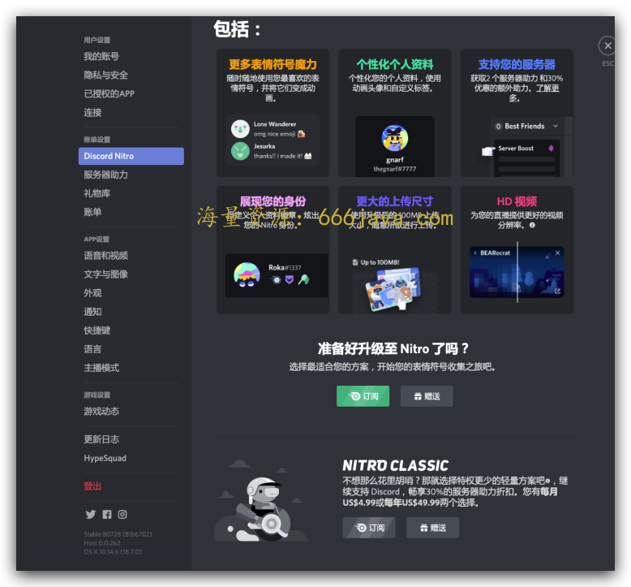
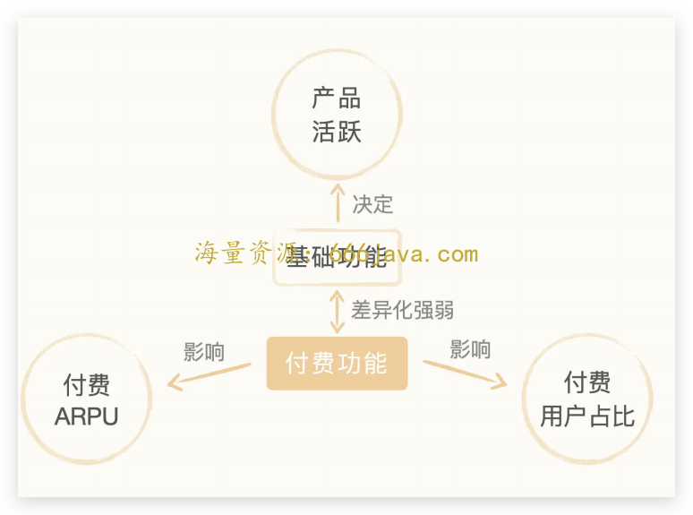
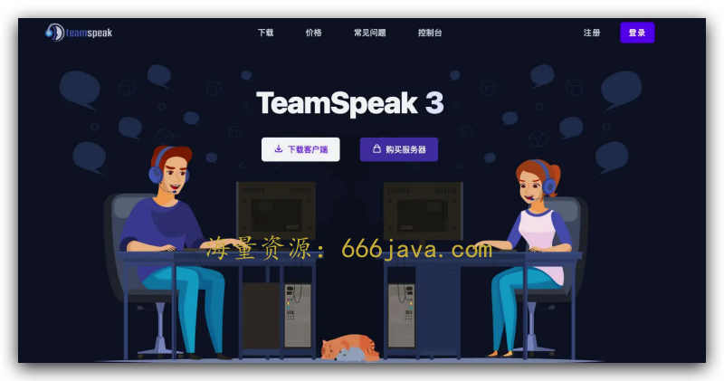
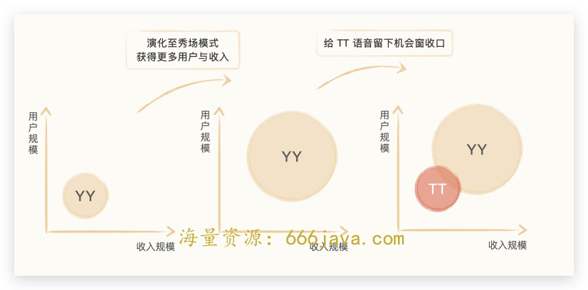

# 大咖助阵-演进：YY 诞生 17 年，微信诞生 11 年，为什么语音类产品依旧层出不穷？

<audio controls="" title="大咖助阵-演进：YY诞生17年，微信诞生11年，为什么语音类产品依旧层出不穷？">
  <source
    id="mp3"
    src="/mp3/business-thinking/大咖助阵-演进：YY诞生17年，微信诞生11年，为什么语音类产品依旧层出不穷？.mp3"
  />
</audio>

> 你好，我是雄峰。目前为止，我们已经探究完了“非规律世界”中的案例。但我相信，你读后一定意犹未尽。为此，我邀请了我的好基友“凯文吴”助阵，分享一期内容。
>
> 我们之前在同一家公司负责不同的产品及商业化方向，凯文哥有着很多特殊的业务经验和商业视角。这节课，可以让你 **了解语音领域的商业逻辑，增强你对于不同领域的理解**。
>
> 我们无比好奇又小心翼翼地探究着这个变幻莫测的“非规律世界”，如果硬要说这个世界有什么规律，那么我想这篇以“演进”为主题的案例笔记，也一定能够帮你触摸到这个规律的边缘。

你好，我是凯文吴，目前在某大厂负责工具类产品商业化相关业务。

我负责过行业头部的成熟产品变现，也打造过多款从 0 到 1 的工具产品。搭建的商业体系涉及广告、会员订阅、游戏联运等多个模式。既是产品负责人，也是 10 位数营收操盘手。

在这个过程中，我经历过移动互联网初期工具类产品百花齐放，也经历过在红海时代众多产品的转型。它们有的是因为发现了新的机会，主动开启转型；有的是苦于收入压力，被迫调整。这些发展和变化，本质就是 **一个产品随着行业、市场、用户习惯等众多因素改变，而持续演进的过程。**

今天我们加餐的内容，选取了长周期的语音赛道，去看不同商业模式的选择，对于产品演进的影响。

## 什么是语音产品？

本节课中的语音产品，指的是 **把语音通话功能作为产品核心或基础能力的 2C 产品**。我们所熟知的微信，也可以归在这个框架里。

微信 2011 年诞生，早已发展成国民级应用，它的语音模块，也从一开始的语音信息、语音电话，演化成了富内容化的视频号和直播，基本实现了大部分语音类场景的覆盖。但，即便是微信这种语音通话功能极其丰富的产品已经诞生，语音类产品依旧层出不穷：办公人群用的会议类产品，主打游戏场景的语音辅助工具，还有众多的语音社交类产品等等。

抽象地看，语音是社会人的基本社交沟通方式，这类需求具备 **强度高、用户面广** 等特点。这些特点促使满足不同人群需求的产品持续演化。除此之外，产品的盈利能力，也决定着一个产品是否可以健康、可持续地发展，对产品演进的方向起着重要作用。

产品盈利相关的损益模型，可以简单拆解成：

**收入 \-（成本 \+ 费用）= 利润**

想要提升一个产品的利润，我们自然而然地就会想到尽量地缩减成本。而语音类产品，带宽成本往往是最大的成本。当然，技术上有各种方法可以优化，但随着用户规模和语音时长的增长，这里的成本依旧是不容小觑。这也是当今国内外大部分语音类产品都不盈利的原因。

这种情况下，“增加语音产品的收入”这个命题就显得尤为重要，而商业模式的选择更是重中之重。

## 广告模式：工具变现最容易想到的模式，但不一定是最适合的模式

大多数语音类产品，初期都可以视为工具产品。那什么产品算是工具型产品呢？有人将其分为系统工具（手机管家）、工作效率工具（Office）、垂直领域专业性工具（Photoshop）等等。

不管怎么分类、怎么定义，工具型产品的核心都是功能和操作，都是能帮助用户解决特定问题的产品（无论是 YY 还是 Discord，都是从工具功能演化而来）。

假如你是语音工具的负责人，想一想，你可能通过什么方式来变现呢？

行业里大部分工具产品都是采用广告模式，或者是会员模式进行变现。你也可以回看之前“ [时间刻度](https://time.geekbang.org/column/article/551301)”这节课，课程里有详细拆解广告模式下的营收公式。广告类变现模式具备极强的通用性，无论是什么产品，都可以通过广告模式变现。

不过， **一个好的商业产品需要做好用户体验和商业收入的有序融合**。广告模式确实是短期可以见效的模式，也是常见且合理的模式。但在广告露出上需要不少巧劲儿，才能避免被用户反感。

而在互联网初期，先进的原生广告还没有诞生。特别是 PC 草莽时代，很多产品都是通过桌面弹窗的方式进行广告露出的。在移动时代，至今我们也能见到一些体验并不那么好的、牛皮藓类的突兀广告。所以，广告模式对于初期的 YY、Discord 等语音类产品而言，并不是一个很好的选择。

张小龙曾在微信公开课上说过，“好的产品就是用完即走”。我们不去评价这句话的对错，但它一定程度上也说明了，工具类产品时长短、频次低的特点。 **广告类模式最适合的产品是内容化产品，单纯的语音工具如果选用广告作为唯一商业模式，损益情况都不会太好。**

## **会员订购：对于工具产品变现，会员订购是最适合的模式，但二八效应明显**

除了广告模式，我相信刚才你也一定想到了会员订购的变现模式。产品功能做得好，对用户有价值，用户就会付费。具体应用上，除了你比较熟悉的 [长视频平台](https://time.geekbang.org/column/article/551301) 外，我也想和你分享一下语音赛道的海外明星产品 Discord，它采用的，就是会员订购的变现模式。

Discord 作为一个 15 年创立的产品，一开始以游戏连麦作为切入点。18-20 年，随着产品用户逐步增加以及用户之间交流的更加频繁，逐步演化成了游戏社区。又由 20 年至今，破圈演化成全品类社区。用户在这里讨论外语，学习知识，分享球鞋文化。近期更是越来越多 Web 3.0 的用户和玩家们，通过 Discord 建立了自己的 [DAO](https://time.geekbang.org/column/article/562730)（Web 3.0 领域的新式协同方式，Decentralized Autonomous Organization 的缩写）。目前，Discord 的全球 MAU 达到 1.5 亿，是语音赛道当之无愧的明星产品。

但在商业化方面，Discord 却是举步维艰，目前依旧亏损。Discord 2017 年开始探索商业化，发布了第一个付费功能 Nitro，用户可以在聊天中享受特权（更多表情，更大图像）以及服务器助力能力，一个月收费 4.99 美元；2018 年，他们又推出游戏商店，提供精选游戏购买，同时提升会员价格至 9.99 美元/月；2018 年 Q4，针对会员用户进行二次分层，基础 Nitro 用户的月价格是 4.99 美元，享受聊天特权，高级 Nitro 用户月价格 9.99 美元，在基础上享受服务器助力。

Discord 的会员功能，是围绕基础语音沟通场景及产品社区属性定做的。可以说，所有的产品会员类模式，都是基于基础能力的付费升级。既要与主功能、主场景强关联，又要显示出差异化。在这样的“ **既要又要**”模式下，很容易陷入一个 **博弈旋涡**（笔者自命名）。

什么是博弈漩涡呢？这是我自己习惯的叫法，我们可以来细致分析一下。

会员订阅类模式的产品收入，可以通过这个算法求得：

**产品 MAU × 付费用户活跃占比（这个值在 1-20%）× 月均 ARPU**

这三个参数并不孤立，相互影响。下面，我们一起拆解来看。

- **付费用户活跃占比**

会员订阅模式符合二八法则，业内大部分产品，会员占比都在 2 到 20%之间。 **这个数值由付费功能的用户感知强弱影响，与 MAU 强相关。** 这句话是什么意思呢？

**假设付费功能过强：** 虽然产品内的付费用户占比高，但也反映了增值功能点才是用户所需，趋近买断制应用（付费后下载使用），注定产品用户基本盘不会过高（毕竟会花钱买付费的用户，还是少数）。

**假设付费功能较弱：** 那就难以说服用户去购买，会员功能差异化不明显，会员用户比例和数量就不会高。

- **付费 ARPU（每用户平均收入）**

这个数值接近月会员售卖价格，与付费用户活跃占比相关。定价反映价值，价值反映用户对你所提供的增值服务的认可。价格定高了，买的用户就少了。价格定低了，买的人虽然多，但是总体收入不会太高。

可以看到，付费功能设计的好坏直接影响了这三个因素，构成了一个博弈旋涡： **在订阅模式下如何设计商业化功能，是最重要的命题**。反观 Discord，虽然产品受大众喜爱，但是由于它设计的商业功能差异化不明显，导致用户购买率较低，所以商业层面至今还在摸索阶段。

## **订阅模式推出后，会发生什么？**

上面说的会员模式的博弈旋涡，使得产品需要持续地探索增值功能的定位和价值，动态地调整会员体系，寻求更优解。但从另一个角度来看， **当一个行业头部的产品选择了这个商业模式后，产品本身和行业也会出现一些变化**。

这些变化究竟会产生什么样的影响呢？又会怎么影响后续产品的设计呢？

语音类产品发展历史悠久，是比较好的、用以观测产品演化的赛道。我们先把时间拨回到千禧年，去看看那时候的语音产品 Teamspeak（TS）。

作为老牌语音类产品，他的商业模式核心是售卖 lisence 许可的方法，即用户购买服务器后可以搭建自己的语音房间，可以 2C 也可以 2B。虽然用现在的眼光去看，它的交互极其原始，功能使用也非常硬核，用户通过配置服务器才可以使用。但是直到现在，还是有部分玩家通过 TS 进行语音交流。

后来，随着魔兽世界这款游戏的风靡，越来越多的用户有语音沟通的需求（工会团战，好友刷本等）。而那时，游戏内还没有植入语音模块，沟通成了一大问题，寻找第三方工具是唯一解。市面上的 TS，硬核且收费，大部分用户并不接受。于是，YY 利用“ **免费”+“高通话质量**”两个点切入市场，获得了一大批用户，产品爆火。

这个故事很有趣。虽然产品的商业化是终极目标，但 **商业化和产品诞生是可以解耦的**。什么意思呢？

从产品的演化角度去理解，就是 **A 产品占据行业领先优势后，开启会员订阅的商业模式。那么理论上，一定存在一个产品 B（近似功能）可以通过免费策略，切走部分用户，实现产品增长。**

通过这个现象，会有 2 个衍生问题及思考。

**第一个问题：增值订阅模式的产品，主功能和付费功能是否有较高的产品壁垒？**

如果产品本身技术壁垒较低，产品能力复制门槛不高，那么一旦开启订阅会员的商业模式，就会轻易被后来者通过免费模式洞穿。这就变成了一个循环，一旦后来者再采用一样的商业模式，又给再往后的后来者留下机会。小工具赛道上，经常会看到类似的情况。

**第二个问题：增值订阅模式的核心是用户付费** **，那还** **有没有其他商业模式，不需要用户付费就能产生收入？**

虽然上面说到，工具类产品，最合理的模式就是会员订阅。但是由于模式本身服从二八法则，付费用户始终是少数（虽然近些年有所好转，但是免费用户依旧占据绝对大头）。

如果深入思考这个问题，你就会发现， **产品不是一成不变的，商业模式也是持续地演化的，整个过程是动态的。**

我们下面以 YY 为例，去看看他通过免费模式获取大量用户后，商业模式到底是如何持续演化，又是如何变现的。

## **规模和收入增长，往往来自产品转型与演化**

在 YY 获得大量用户后，毫无疑问地开启了商业化尝试。从结果来看，可以说 YY 探索出了一条属于自己的独特商业模式，这个模式被后续直播行业广泛采用。当然，随着商业模式和产品模式的演进，也为下一代语音产品留下了机会的窗口。

YY 语音初期通过免费和高质量语音，获得了一大批用户的支持。随着越来越多用户入驻，也有部分草根歌手开始使用 YY。随着玩家结构的变化，YY 也做了调整： **从原来的游戏玩家沟通场景，演化出了“歌手+听众”的这一新的场景。**

伴随着这一改变，也上线了对应的 **商业化功能：“送鲜花”的打赏模式**。粉丝可以购买鲜花，送给自己喜欢的歌手。围绕着听歌直播，往后又不断演化出了月票、付费礼物等多种商业场景，开创了直播打赏的先河。这种模式被沿用至今，当今火热的短视频平台直播中随处可见。

这样独特的商业模式成功了吗？可以说，是的。

根据公开财报显示，YY 借由直播业务的发力，在几年前就已经突破年收入百亿的门槛。商业化价值作为重要的驱动因素，在 YY 从语音工具到直播化内容平台的演化中，扮演着重要的角色。相应的，产品形态也发生翻天覆地的变化。

工具化产品，本质上就是帮助用户解决问题的。在产品表现层，大多简单且直接，风格上也是以清爽为主基调。而内容化平台不一样，用户会追求更沉浸的体验，在交互风格上，往往有着富内容化的特点。

YY 从工具逐步演化成内容平台，实现了收入和规模的双增长。但总有部分用户，喜欢极简的功能，也就是原来基础工具的样子。这样就给语音工具再次留下了空间和机会。

随着 YY 朝着泛娱乐演化，TT 语音抓住机会窗口，与游戏和电竞深入结合，硬是在语音赛道分了一杯羹。它的商业模式以更加垂直的游戏联运为主。这种演进的过程，如果用二维坐标系展示，会更加立体直观，这种情况我称之为“随着产品持续演化迭代，产生的‘右移’  现象”。

除了语音赛道，浏览器赛道也发生着同样的事情。传统浏览器产品，从工具进化成以 Feeds（信息流）为主的产品形态，从而获得更多广告收益和用户时长；与之相对应，同样存在夸克这样的极简产品，后发出力，分得一杯羹。

## **小结**

讲到这里，我们今天这节课也就接近尾声了，最后我来给你总结一下今天的关键知识点。

- **商业模式的选择**

**广告模式：** 模式搭建快速直接，但并不适合所有产品，场景设计要有取舍。

**会员订阅模式：** 服从二八法则，且容易陷入三角博弈旋涡（活跃，付费率，月 ARPU 三者相互影响）。需要从产品设计之初，就想好增值功能与主功能关联的同时，又能体现差异化，从而存在付费价值。同时，产品功能的壁垒也十分重要，贸然开启商业化，会给竞对留下空间。

- **产品的动态演化**

产品的动态演化是时刻发生的，商业模式的选择也是关键因素之一。通过上面的案例，你可以清晰地感受到行业和用户都是在持续变化的。

商业洞察能力，需要 **用动态的眼光，去看市场上用户行为的迁移**（YY 语音发现 TS 用户体验不好，用户需要更好用的产品）， **去看市场上产品商业模式的取舍**（TT 语音发现 YY 朝着秀场发展，用户需要更纯粹的产品） **,动态地去发现产品演化的路径，寻找机会点。**

相信学完这一讲的你，已经能够从产品演化的视角动态剖析产品发展了。

作为非规律世界这一模块的内容加餐，我也希望今天的内容能够让你有一个新的观察维度，那就是学会从产品演进的角度去动态观察这个“非规律世界”。

商业模式是持续扩充发展的，而产品的商业模式选择也同样没有标准的方法论。就像克里斯坦森的创新三部曲里面说的一样： **要持续打破认知僵局，实现自我进化，才能可持续地发展。**

## **课后思考**

试着想想，哪些工具产品的转型算是成功的，它的转型又产生了哪些新的机会？

欢迎你在留言区和我交流互动。我们建立了一个 [读者交流群](http://jinshuju.net/f/DuxzBi)，欢迎你的加入！如果你觉得有所收获，也可以把这节课分享给你的朋友一起学习。我们下节课见。
