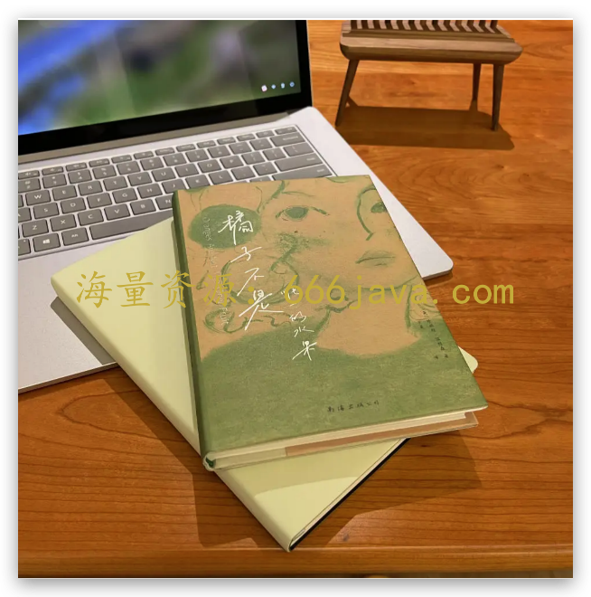
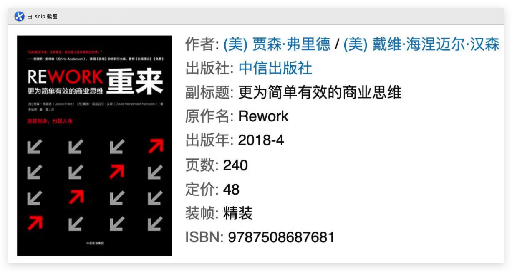
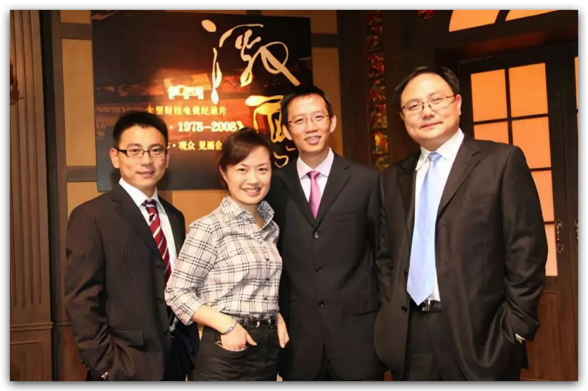

# 结束语-橘子不是唯一的水果

<audio controls="" title="结束语-橘子不是唯一的水果">
  <source
    id="mp3"
    src="/mp3/business-thinking/结束语-橘子不是唯一的水果.mp3"
  />
</audio>

你好，我是雄峰。

从 3 月份开始写这个专栏，到如今 11 月份结束，之前说了那么多商业世界的理论和案例，今天我想聊一些不一样的东西，基于三个生活场景分享一下我工作这些年的感悟，不说大道理，从小故事着手，希望给你带来一些新的视角和感悟。

## 橘子不是唯一的水果

我有一次去西西弗书店，只是陪爱人想找一个歇脚的地方坐坐，喝一杯咖啡，一个店员看我在翻书，向我走来，我本能是拒绝的，本打算应付一下，但是他拿起了旁边的一本书向我推荐，瞬间打动了我：

> 您手旁边的这本书叫做 **《橘子不是唯一的水果》，寓意着人生也不是只有一种可能，我们可以选择多样的生活方式来走过这一生**，毕竟一生很短，好好生活很重要。这本书恰好是西西弗的特供版，要不要考虑一下？

很简单的一句话，瞬间让我产生了共鸣，尤其在互联网这种大厂下忙碌了那么久之后，大家都会有这种感受：

> 既不喜欢现在朝九晚十的工作，忙碌生活，又找不到可以摆脱组织独立生存的方法，既不喜欢大体系对于自己的束缚，又喜欢大体系所带来的光环和安全感。

拧巴，就是我之前的状态。我也一直在想一个问题：有没有办法在现有的生活方式下，找到一些新的生活方式呢？有没有新的收入来源呢？如果有一天离开了大厂或者不再工作了，自己希望过上什么样的生活，进而以什么样的能力和姿态面对这个世界呢？

一个偶然的机会，经过二爷的推荐，我来到了极客时间——为什么我愿意来写这份“笔记”？

我第一份实习工作就在罗辑思维（得到的前身），虽然当时没有想到自己未来也有机会可以做这个事情，但现在回过头来，也想 **验证自己的能力**：讲出来的东西到底怎么样？有没有人看？另一方面，我也可以通过这个平台扩散自己的影响力，迭代认知水平。

另一个点是实践《纳瓦尔宝典》所说的方法：借助媒体和代码的力量， **把自己打造成一个产品**，实现被动收入的增长，起码在未来的一个周期内增加更多的抗风险能力，如果人生未来不想在企业里面上班，最好多一条出路。

非常感谢极客时间平台及团队，让我实现了这个目标的第一步，做到了：橘子不是唯一的水果。

## 知道和写出是两个概念

有一本经典商业管理书籍《重来》，提到过写作的意义：

> 如果你要从一堆人中决定出一个职位的合适人选，雇那个写作最厉害的人。这个人不在乎是不是营销人员、推销员、设计师、程序员，无论是谁；他们的写作技巧会对此有益。

工作越久，我越意识到能够 **把一个东西写清楚、写明白、写得大家都看得懂，是一个非常重要且稀缺的技能，也是一个横跨多种行业的通用技能点，同时也是个人成长的催化剂**，对于一个人成长和思考的意义非常大。

在 3 月份的时候，我提交了《商业思维案例笔记》第一版目录，被编辑无情地驳回：

> 内容基本上围绕流量逻辑来讲述，对于读者来说内容相对单调，不够具有吸引力，此外更多的是展示行业发生的现象，缺少系统的逻辑分析，读者会“知其然”而不是“其所以然”，同时整个结构不够立体和层次，很难从多维度把商业思维这个话题给讲清楚、讲明白。

我开始思考：要不要写一个不一样的东西？

如果全写自己知识领域内的东西，就会导致信息量和知识点相对单一。因此我下定决心，在内容上重新做了大的调整，除了调整原有内容的知识获得感以外，还补充了大量过往我“知道其核心逻辑，但不知道具体逻辑”的内容。

熬了一个晚上，重新写了一个新的框架，最终提交给编辑的时候，我心里多少还是捏一把汗：万一写不出来那就完蛋了。

当时的状态很奇妙，我安静地坐在电脑前，思绪乱飞，脑子在想象各种东西，有点类似《星际穿越》中飞船穿越虫洞的感觉——穿越未知的领域寻找自己未知的知识，忐忑又紧张。

实际上在写专栏的过程中， **写作的力量会让我把内容进行梳理和反刍**，把过往对一个业务的概念性理解，逐步从一个点或者一个圆，扩展描绘出大量的细节支脉。这份力量让我发现了自己过往认知的盲区和漏洞，另一方面，也逼着我去找各种人验证信息的正确性。

比如我知道 [马斯克的猎鹰火箭](http://time.geekbang.org/column/article/541156) 有大量骚操作，而这个骚操作本质上是打破常规来解决问题，但是不进一步了解永远不知道可以这么骚：且不说火箭采用最基础款通过多个绑定实现大推力，连太空中的火箭控制芯片也使用的是民用英特尔奔腾，非常的出乎意料，这些大量细节信息的补充让我对于马斯克的第一性原理有了更深的认知，也认识到了规则打破对于效应的创造。

再比如我知道 [小米手机的崛起](http://time.geekbang.org/column/article/574545) 属于非共识机会，但是不回到那个时代，不理解苹果对于中国手机供应链的重塑，也是很难理解雷军一直在说的“风口上的猪”到底是什么意思。本质上，是中国手机供应链的崛起和中国制造的高速发展。

现在回过头来看， **知道骚操作和知道“操作原来有这么骚”不同，用“风口上的猪”贴标签和了解时代风口的特殊性也不是一件事，输入和输出更是有着本质上的差异，而写作的力量让我自己的收获远大于付出。**

## 开创性思路的帮助

从腾讯离职后，有不少的同事会找我聊天，好几次前同事聊到对我的印象，有共识的一个点是，“可以提出很多开创性的思路和打破现有的规则”。

这点非常出乎我的意料。因为我以为大家对我的认知是推动力很强。有开创性思路倒并不是说结果一定是好的，因为很多新的方案也没有结果，但是我总会有更多的招。这个感受也验证了之前我们提到的一张图： **“长期来看，你只会因为那些你打破的规则而被记住”。**

为什么我相对而言思路较为开阔呢？这个跟我第一份实习工作有关系，我最早在罗辑思维实习，当时公司的人非常非常少，不过好处就是跟公司的老板们（包括罗老师）有较多的接触，这期间学习了很多开天眼的思路，对于后面帮助很大。

说两个在网上查得到的小故事。

一个是罗老师大学同学的故事。他在大学读书的时候，有一个同学特别懒，所有的作业都会拖到头一天晚上熬夜去赶。有一次该他倒霉了，因为老师布置的是一个录像的作业，得做一条片子。大家都知道，一条片子得有一个非常长的准备时间，不可能当天完成。但这位仁兄，还是依然故我，依然是头一天才开始准备。

他的这条片子非常简单。他领了摄像机，拎着它，弯着腰，在广播学院著名的核桃林里跑了一小圈儿，然后就把这片带子给交上去了。奇怪的是，这条片子居然得了当年作业评奖的大奖， **因为，它起了一个特别好的名字，叫做《狗眼看世界》。**

另一个是第一财经计划把吴晓波的书《激荡三十年》拍摄成纪录片，为了保障节目拍摄的顺利，节目组邀请了罗老师和吴晓波一起合作，目标是要拍摄 30 集而且预算只有 300 万，最关键的是要在 4 个月内拍完，这个目标基本上是不太可能完成的任务，因为要采访的企业家、政治家以及经济学家都是非常出名的人，大家的空档期根本排不进来，且很多人也约不上。

罗老师提了一个自己的方案：“ **为什么非要采访当事人，不能采访旁观者吗？** 我们书中的当事人，一个也不请，只做外围采访。比如，张瑞敏不是砸冰箱吗，我们不用采访他本人，而是把报道他砸冰箱的第一个记者找过来。”

这个方案虽然不靠谱但是可行。拍出来之后，这个纪录片在当年几乎拿到了所有的新闻纪录片大奖。

后来在工作中，我一直受到最初实习经历的影响，现在回过头来看，受益匪浅。

## 结语：做时间的朋友

在写这篇结束语的时候，我的心情既轻松又不舍。

轻松的点是再也不用半夜赶稿了，也不用把周末的时间都花在专栏上，有时候卡壳写不出来的感觉很难受，跟便秘一样，想着买过来的 PS5 终于可以打开，也有更多的时间陪家人出门玩，多少是挺开心的。

不舍的点在于，我少了一个逼迫我日常进步的动力。有些时候，人确实需要逼一把才可以进步。正是因为你和极客时间给了我这样一个机会，逼迫我重新复习了很多知识点，收获了新的信息，才让我在短时间内输出了这么多的内容。

人是容易遗忘的动物，这段时间我得到的远比我输出得多。所以，后续有时间的话，我也会持续更新一些新的知识点，作为自己费曼知识的阵地。也欢迎你在课程的 [交流群](https://jinshuju.net/f/DuxzBi) 里，随时和大家一起“费曼一下”。

最后，我希望跟你提一个小小的建议： **做时间的朋友。**

放到 8 年前我刚毕业那会儿，我肯定不认为我可以写出这么一份专栏，我会觉得我不配，也难以奢望。但是伴随时间的变化，自己不断的累积，最终写出来了一份我相对满意的内容，这一切源于 8 年期间不间断的努力，你不会亏待时间，时间也不会亏待你。

商业世界变化纷繁，不同时间、不同业务都会衍生出新的商业模式和案例，我们以有限的时间去学习无限的商业案例，肯定是学习不完的。

**我们能做的，就是把握商业规则和知识点，解构一个个现象后面的底层逻辑。在这个过程中，持续温习、持续练习，总会有进步的那一刻。常读常新是一个非常好的办法，一周、一个月、一整年以及终身的学习状态一定要保持。**

希望在精彩的商业世界里，你可以用上专栏里面的那些工具，在具体的工作中有所获益。希望在未来的求知生涯里，我们还能再次相聚。
