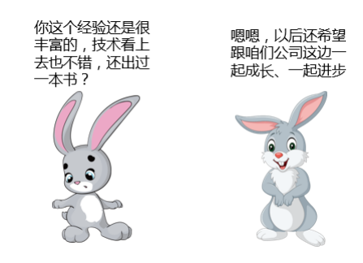
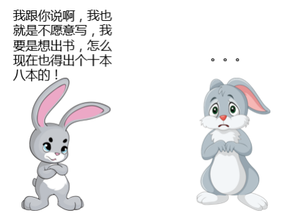
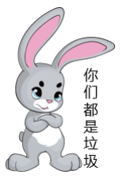
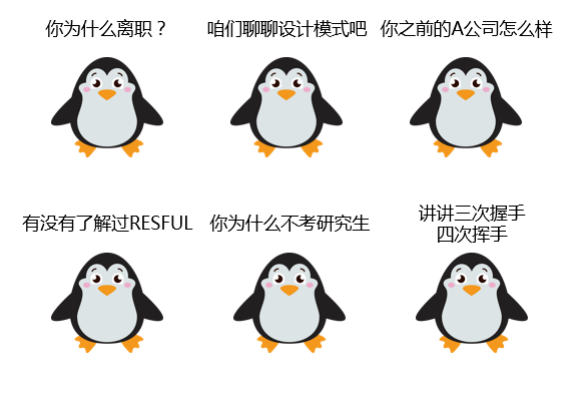
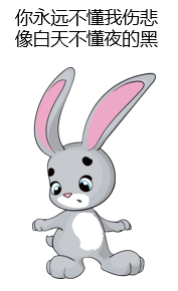

# 04-与“难缠面试官”不得不说的故事

> 每个人都是自己命运的主宰。 ——斯蒂尔斯

上一趴我们主要聊的是**“从自身做起”**，完善自己的面试情商，争取在面试过程中不犯错，但是呢，不排除我们在面试过程中，遇到各式各样奇葩的面试官。比如，在我来蚂蚁之前，曾经去某二线互联网车企面试：

当时的我啊，也是“年轻气盛”，直接回复他：那您真厉害，我就等着拜读您大作了，到时候别忘了打电话通知我一声。然后扭头离开了。

后来随着自己开始不断地面试别人，加上参加了更多的面试，也结识了身边更多的面试官，发现每个面试官都会有自己不同的性格，甚至于同一个面试官，在不同的时间和心情下也会表现出不同的面试风格。

所以，接下来的时间，我们一起聊聊那些“**奇葩的面试官**”。

### “谦虚和善”到不像面试官的面试官

这里要**高能预警**下！这类面试官看上去非常友善，用轻松的语调寒暄、用夸赞的语气回复，所以

很多人在面对这类面试官的时候会心情愉快，自信暴涨。

**这都是假象！**

**这都是假象！**

**这都是假象！**

重要的事情说三遍。为什么说的这么肯定呢？因为我自己大多数时间也属于这种。虽然看上去非常容易打交道，但是实际上却还是很有城府，内心非常严谨，拥有还比较强的洞察力。但是，这种面试官会非常喜欢赞扬、同意的对话方式，让你感觉自己面试的表现非常成功，然而实际上稍有不慎，就会被默默淘汰。

**应对策略**：

如果某天你遇到了这种“笑面虎”式的面试官，千万不要放松警惕，要保持高度警觉，比平日还要老实地谈自己的工作、技术和想法。这种面试官并不喜欢你放低身价，一味迎合；更加不喜欢骄傲自满，夸你两句就觉得自己非常了不起。

这样的人表面谦虚，内心又有着自己的骄傲，所以展现自己真实的水平就好，遇到不会的大可以虚心请求指教，不然就算你胡说乱说，他也会笑眯眯地说：不错！然后把你的名字从通过的名单上划掉。

### “武林盟主”式面试官

不知道大家有没有遇到过这样的面试官，就像我开篇提到的那样，给人一副“普天之下，唯我独尊”的样子。在他的心里无论你的能力、技术、出身多强，但是永远不会在任何一方面强于他自己。所以，他的语气是傲慢的，不会带任何笑容，甚至恶语相向，亦或是在你说话过程中不时的粗暴打断你。

我听到过很多这样的抱怨，我的不少学生都跟我说：我去XX公司面试有一个“黑面煞”面试官，从来没有见过这么讨厌的人。

这种人让你感觉很难对付，加上自身确实有一定实力，所以很容易一下子打击掉你的自信心，同时伤害你“脆弱“的自尊。

**应对策略**： 

后来我发现，这样的面试官未必是真的性格如此。我身边就有这样善于“伪装”成盟主的面试官，随着面试的次数多了，我自己有时候在心情不好或者烦躁的时候，也会变身如此。而我认识的大部分会在面试过程中有如此表现的“奇葩面试官”反而在生活中比较好说话，而且他们的面试通过率，居然要高于平均数。大多数时候这都是一种面试方式，类似于压力面试。毕竟，未来你的老板未必比这个面试官更好说话。

值得一说的是开篇的故事还有后续：在我生气地拂袖而去之后，居然意外还收到了该公司 HR 的下一轮 HR 面的电话。当时在诧异之余还是选择了放弃，不然说不定还能与那个面试官再去见面聊聊。

所以呢，遇上这种面试官，不要太过于在意态度的恶劣。如果大家心理上过不去的话，那么大可以做一些**心理建设**，比如：他是不是刚刚被领导骂了？他一定是遇到烦心的事儿了。这样或许就会平静很多。

同时，不要刻意追求讨好。这种吧，跟我们追女孩是一样的，能够追到女神的一定不是那个嘴最甜的，要不你就长得帅，要不你就有才华，都沾不上边呢，要是特有钱，也还是有希望的。

这说明啥？说明追求这事儿最重要的是展示自己的亮点和能力。所以，平静一点，用简洁有力的回答来对应哪怕是尖酸刺耳的问题，也不必在意他有什么反应。即便他说了什么不好听的话，如果你觉得这份工作对你还有吸引力，那么大可以不动声色，不用像我一样觉得收了委屈离开，更不用对着硬干，只把他当做外强中干的“纸老虎”，从战略上藐视他。

### **“卖弄”式面试官**

这些人是天生的演说家，他们非常喜欢说话，只要你一个不小心触及了他熟悉的话题，便开始口若悬河、滔滔不绝。从理论倒实践，从你的简历聊到他的工作，健谈到让人叹为观止，表现欲望极其强烈。给人的感觉，他的目标似乎不是来面试你的，而是为了表现自己。

**应对策略**：

无论你是不是一个擅长表达的人，都请收起你的话语权。让这样的面试官无拘无束地表达他自己想说的任何内容，大多数时间静静地当一个好的聆听者，必要的时候插几句话表示你对于他的演说非常有兴趣而且非常佩服，表情上大可以做出一副乖巧、认同的样子，让他持续聊下去。

不知道大家有没有听过相声哈，就像相声一样，既然面试官不让你做那个逗哏的，那就好好把捧哏的角色做好。ps：担心大家理解不了上边的相声术语，我们换个方式，如果面试官觉得自己才是“郭德纲”，那你就好好做“于谦”。这样，多半就会通过。

切记不要焦虑不安，也不要感到厌烦。不要担心时间过长，除非有天大的急事，只要还能忍，就可以继续忍下去。焦虑不安会让这种面试官非常扫兴，那么结果，你懂得。

### “东拉西扯”的面试官

实话说，我自己是没有见过这类面试官的，但是听很多学生说过。他们的特点呢，就是面试过程中不太像技术人员，反倒有点像公务员，做起事情来不紧不慢，效率很低，对别人的回答、甚至是简历都不太放心。不管你写的多详细，他们还是会从简历里的东西问起。最可怕的是他们的面试完全没有层次和逻辑，东拉西扯，想起来什么说什么。

**应对策略**：

这样的面试官有两种可能，一种是刚开始担任面试官角色，自己本身没有关于面试的体系，所以聊起来比较杂；另外一种就是刻意用繁杂的提问方式打断你的惯性思路，希望看到你下意识非连续性思考之后的反应。

无论是那种情况，作为面试者，一旦遇到这样的情况，一定要按捺住性子，说话保持温和谦逊的口气。回答问题一定记得要尽量周全详细，甚至可以啰嗦，如果讲到后边发现前边有忘记的情况，也想办法弥补。多做说明，少做辩解，而一旦面试官开始讲话，那么就可以专注聆听，并且不要插话。

我自己不是这样的面试官，但是换位思考呢，我觉得我会尽量多用“你觉得我哪里没有讲清楚？还需要我补充什么么？”之类的话术和语气，表达方式上也尽量去配合他的说话方式。

所以对付这样的面试官，大多时候最重要的就是耐心，相比其他面试官还是很容易被打动的。

### “死板”的面试官

尤其我们做技术的，很容易碰到的另一类面试官，就是非常死板、按部就班。你进入会议室或者面试场之前他就已经坐好了，而你的出现似乎对他也没有任何影响，仍然自顾自的想着什么。

我自己印象相对深刻的一次吧，就是我刚毕业时候去面试了，遇到了这样一个面试官。我很客气地去跟他打招呼、寒暄，但是他始终一副“爱答不理”的样子。面试过程也是死气沉沉，对我的回答也置若罔闻，看起来就像他自己都没听进去一样。甚至让我都开始怀疑自己，直到下一轮面试的通知电话响起。

**应对策略：**

工作了很久我突然发现，这样的面试官倒还不在少数，他们往往技术很好，但人相对内向，比较固执，也会坚持原则。他的考察方式大多时候不会考虑你的性格、你的处事之道，对于他来说，技术就是一切，所以只要你的实力足够，按部就班的发挥就 ok 了。

当话题谈及自己的能力、要求、感受时一定要慎重，少说为妙，最好说具体点，宏观而浪漫的设想一般不说为妙。不要一味的画大饼、吹嘘自己，因为这样的面试官大多也仍然在一线工作，而且也知道你过去公司的大体水平，实事求是反而能留下更好的印象。

### “麻木”的面试官

在我收到过的反馈中，我觉得这样的面试官是最可怕的。依然记得前不久有个学生跟我聊起：

> 上周去XX公司面试，那个面试官看起来非常淡定，面试过程非常漫不经心。我在回答他问题的时候，感觉他特别特别心不在焉。有时候我明明在认真回答问题，他呢一边听我说话一边在简历上画圈。对了对了，我做自我介绍的时候，他一直不看我，看窗户外边，引得我都忍不住回头看看，是不是外边有只哥斯拉……

为什么会这样呢？我很是认真的自我检讨了一下，发现可能在别人眼里，我或多或少也有这种“症状”。大约是因为面试的次数比较多了，你来面试，第一次看见我总会有几分新鲜，而面试官自己呢，因为见多了，就司空见惯了。甚至有时候，我通过简历和其他渠道的了解，已经大体知道了你的能力，只需要在面试过程中再落实一些模糊印象就够了。

甚至更多时候，我在进入面试的几分钟内已经确定了你的结果，只是表面上昂不好直接拒绝，所以坚持着半小时甚至更久的面试流程。

**应对策略：**

实话说，我没有非常好的应对策略。因为往往最麻木的也是最有主见的，除非他能够在面试中发现你的闪光点，不然大概率上很难更改他的第一判断，而一旦你感受到他的心不在焉，那结果自然。。。

所以，这里的建议就是：说一些你简历里覆盖不到的闪光点，找他感兴趣一点的点深聊，刺激一下他的新鲜感，加深这次的面试印象，这样，方有一线生机。

今天这一趴，我们从面试官角度分析了一下你该拥有怎么样的情商，什么样的分析能力和应变能力来面对不同的面试官。总结下来关于面试的两个小节，整体上讲其实也就是一句话：带着情商去面试！

最后，还是祝愿大家，能够在求职路上顺风顺水，做专业的**“面霸120”**。
