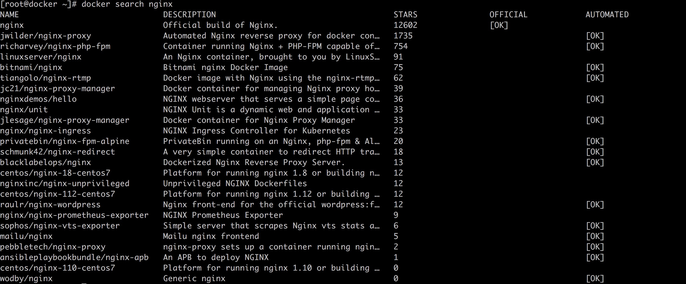
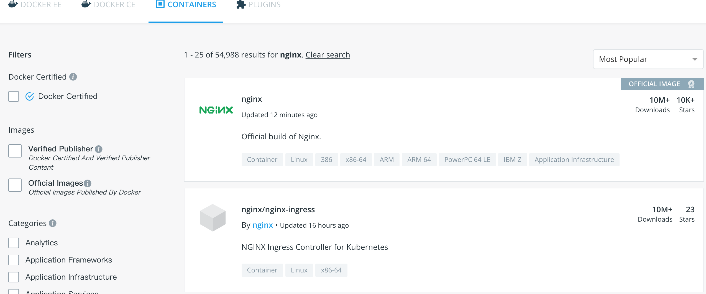
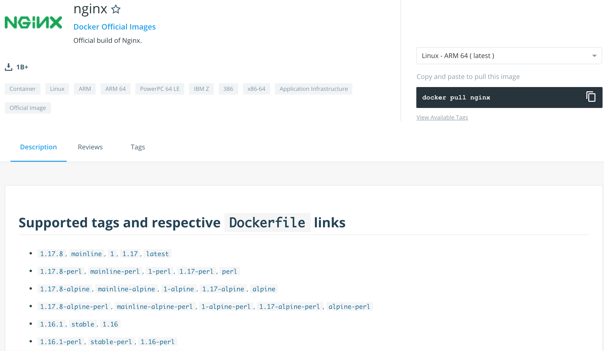
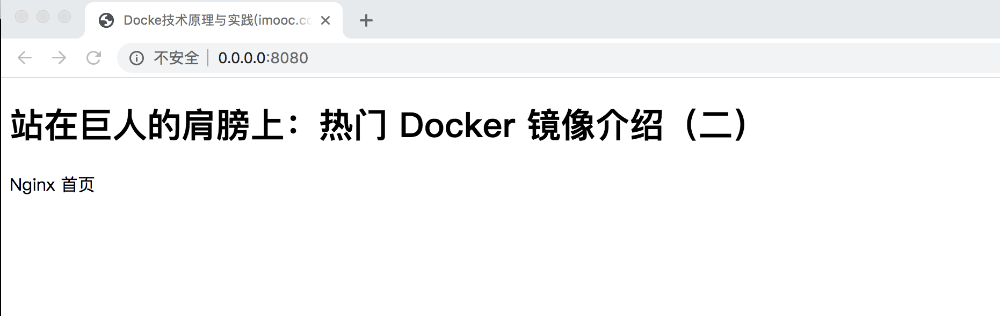
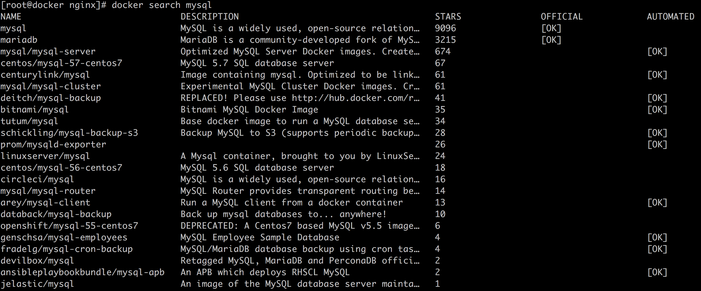
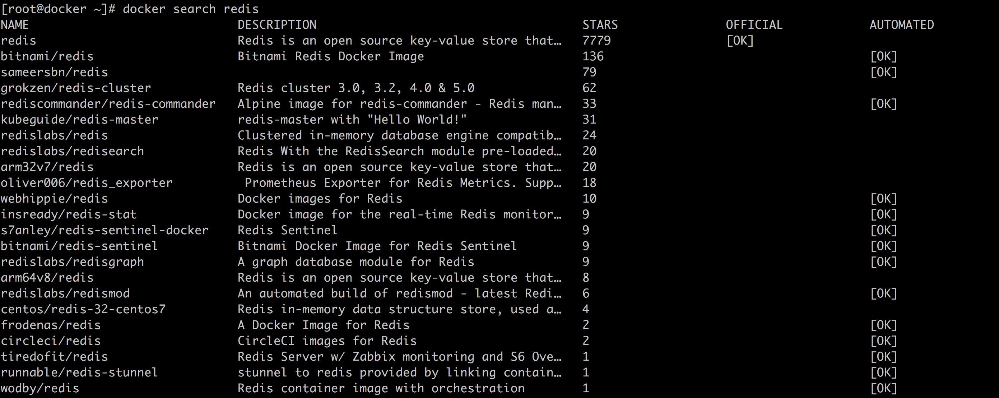

# 09-站在巨人的肩膀上热门 Docker 镜像介绍（二）


> 读书给人以快乐、给人以光彩、给人以才干。——培根

上一篇文章介绍了基础的热门 Docker 操作系统镜像，这篇文章我们来介绍一些应用镜像，也是我们可以直接拿来使用的。

很多时候我们要学习一门新的技术，比如 MySQL （这里举个例子，MySQL 当然不能算是新技术），如果不使用 Docker 的情况下，我们第一步是配置开发环境。但是很多软件的环境配置起来非常复杂，这一步就吓退了很多初学者。借助于 Docker 镜像，我们将不再受到这些困扰，因为镜像中包含了运行该软件需要的所有软件依赖，这样我们就可以将主要精力用来学习核心技术，而不是环境配置上。

下面我们就来介绍几个热门的 Docker 镜像：Nginx、MySQL、Redis。其他镜像使用各位读者可以举一反三。

## 1. Nginx

Nginx 是一个高性能的 HTTP 和反向代理 web 服务器，支持 HTTP、HTTPS、SMTP、POP3、IMAP 等协议。我们可以通过 docker search 命令搜索官方镜像中心有哪些版本的 nginx，如下图。



其中第一个 OFFICIAL 标志显示 OK 的为官方镜像。同时我们也可以通过官方的 Docker Hub 网站搜索，结果如下图：



其中第一个即为官方 Nginx 镜像，点进去我们可以看到镜像描述、评价、tag 等。



下面我们来简单演示一下镜像的使用，首先通过 docker pull 命令下载镜像。

```bash
[root@docker ~]# docker pull nginx
Using default tag: latest
latest: Pulling from library/nginx
bc51dd8edc1b: Pull complete
66ba67045f57: Pull complete
bf317aa10aa5: Pull complete
Digest: sha256:ad5552c786f128e389a0263104ae39f3d3c7895579d45ae716f528185b36bc6f
Status: Downloaded newer image for nginx:latest
[root@docker ~]# docker images | grep nginx
nginx               latest              2073e0bcb60e        4 days ago          127MB
```

要使用 nginx 我们需要准备一个 index.html 也就是网站初始页，使用 nginx 镜像的时候，我们可以在启动的时候通过 volume 的方式将 index.html 映射进去：

```bash
[root@docker ~]# docker run -p 8080:80 -d -v /root/nginx:/usr/share/nginx/html nginx:latest
```

其中 -p 是将宿主机的 8080 端口映射到容器，-v 是数据卷的意思，我们后面会详述，将宿主机的 /root/nginx 目录映射到容器中的 /usr/share/nginx/html 目录。细心一点的同学会发现不管是端口映射还是数据卷映射，都是宿主机在前，容器在后。在宿主机的 /root/nginx 目录存放在 index.html，也就是网站的初始页，内容很简单，如下：

```html
<!DOCTYPE html>
<html>
<head>
<meta charset="utf-8">
<title>Docke技术原理与实践(imooc.com)</title>
</head>
<body>
    <h1>站在巨人的肩膀上：热门 Docker 镜像介绍（二）</h1>
    <p>Nginx 首页</p>
</body>
</html>
```

然后我们使用宿主机的浏览器打开 0.0.0.0:8080 端口就能看到 index.html 的内容显示在浏览器上，如下图。



## 2. MySQL

MySQL 是一个关系型数据库管理系统，由瑞典 MySQL AB 公司开发，属于 Oracle 旗下产品。MySQL **是最流行的关系型数据库管理系统之一**，在 WEB 应用方面，MySQL 是最好的 RDBMS (Relational Database Management System，关系数据库管理系统) 应用软件之一。

**关系数据库将数据保存在不同的表中**，而不是将所有数据放在一个大仓库内，这样就增加了速度并提高了灵活性。MySQL所使用的 SQL 语言是用于访问数据库的最常用标准化语言。**MySQL 软件采用了双授权政策，分为社区版和商业版**，由于其体积小、速度快、总体拥有成本低，尤其是开放源码这一特点，一般中小型网站的开发都选择 MySQL 作为网站数据库。

下面我们像介绍 Nginx 镜像一样，直接通过 docker search 搜索 mysql 相关的镜像，结果如下图。



我们可以看到最上面两个 MySQL 和 MariaDB 就是官方提供的镜像。MariaDB 源于 MySQL 的一个分支，主要由开源社区进行维护，采用 GPL 授权许可。MariaDB 完全兼容 MySQL，包括 API 和命令行，我们完全可以将 MariaDB 作为 MySQL 的替代品使用，实际上确实有很多公司是这么使用的。所以这里我们通过 docker search mysql 的时候，MariaDB 的结果也出来了。 我们下面演示一下 MySQL 的镜像使用。首先通过 docker pull 下载镜像。

```bash
[root@docker ~]# docker pull mysql
...
[root@docker1 ~]# docker images | grep mysql
mysql               latest              791b6e40940c        4 days ago          465MB
```

需要注意的是，我们这里没有加 tag，下载的是 latest 版本，也就是 8.x 版本。如果要使用 5.7 版本，可以指定 mysql:5.7。下面启动 MySQL 容器。

```bash
[root@emr-header-1 ~]# docker run -d -e MYSQL_ROOT_PASSWORD=123456 -p 3307:3306 mysql:latest
6cb8b944810bd318cab711b8cb15596f4b5514470dcfa06401131335043b66ae
[root@emr-header-1 ~]# docker ps
CONTAINER ID        IMAGE               COMMAND                  CREATED             STATUS              PORTS                               NAMES
6cb8b944810b        mysql:latest        "docker-entrypoint.s…"   5 seconds ago       Up 4 seconds        33060/tcp, 0.0.0.0:3307->3306/tcp   wonderful_neumann
```

其中通过环境变量 MYSQL_ROOT_PASSWORD 指定了 root 用户的密码。由于我们这里直接使用了 latest 版本的，如果我们直接通过 MySQL Client 连接的话会报如下的错。原因是mysql8 之前的版本中加密规则是mysql_native_password,而在mysql8之后,加密规则是caching_sha2_password。

```bash
[root@docker1 ~]# mysql -h 192.168.64.82 -P 3307 -uroot -p
Enter password:
ERROR 2059 (HY000): Authentication plugin 'caching_sha2_password' cannot be loaded: /usr/lib64/mysql/plugin/caching_sha2_password.so: cannot open shared object file: No such file or directory
```

对于上面出现的问题我们可以通过迂回的方式进行解决，首先通过 docker exec 登录到 MySQL 容器中解决。

```bash
[root@docker1 ~]# docker exec -ti 945fb3c4fc2f /bin/bash
root@945fb3c4fc2f:/# mysql -uroot -p123456
mysql: [Warning] Using a password on the command line interface can be insecure.
Welcome to the MySQL monitor.  Commands end with ; or \g.
Your MySQL connection id is 11
Server version: 8.0.19 MySQL Community Server - GPL

Copyright (c) 2000, 2020, Oracle and/or its affiliates. All rights reserved.

Oracle is a registered trademark of Oracle Corporation and/or its
affiliates. Other names may be trademarks of their respective
owners.

Type 'help;' or '\h' for help. Type '\c' to clear the current input statement.

mysql> ALTER USER 'root'@'%' IDENTIFIED WITH mysql_native_password BY '123456';
Query OK, 0 rows affected (0.01 sec)
```

这时候我们再通过 MySQL 客户端进行登录就可以了。

```bash
[root@docker1 ~]# mysql -h 192.168.64.82 -P 3307 -uroot -p
Enter password:
Welcome to the MariaDB monitor.  Commands end with ; or \g.
Your MySQL connection id is 16
Server version: 8.0.19 MySQL Community Server - GPL

Copyright (c) 2000, 2018, Oracle, MariaDB Corporation Ab and others.

Type 'help;' or '\h' for help. Type '\c' to clear the current input statement.

MySQL [(none)]> show databases;
+--------------------+
| Database           |
+--------------------+
| information_schema |
| mysql              |
| performance_schema |
| sys                |
+--------------------+
4 rows in set (0.01 sec)
```

## 3. Redis

Redis 是使用 C 语言编写的高性能 key-value 数据库系统，遵守开源 BSD 协议。在日常开发中，Redis 经常被用来当做缓存使用，后端在加一层持久化存储，比如 MySQL 等。我们也可以通过 docker search 来搜索一下 docker hub 中包含的 Redis 镜像，下图是搜索结果。



我们先通过 docker pull 命令下载上图中第一个，也就是官方的 Redis 镜像。

```bash
[root@docker ~]# docker pull redis
Using default tag: latest
latest: Pulling from library/redis
bc51dd8edc1b: Already exists
37d80eb324ee: Pull complete
392b7748dfaf: Pull complete
48df82c3534d: Pull complete
2ec2bb0b4b0e: Pull complete
1302bce0b2cb: Pull complete
Digest: sha256:7b84b346c01e5a8d204a5bb30d4521bcc3a8535bbf90c660b8595fad248eae82
Status: Downloaded newer image for redis:latest
[root@docker ~]# docker images | grep redis
redis               latest              44d36d2c2374        4 days ago          98.2MB
```

通过 docker run 启动容器，我们这里使用默认配置。如果需要指定配置，可以先将配置文件通过数据卷的方式映射到容器内部，然后将配置文件作为启动参数加进去。

```bash
docker run --name redis-test -p 6379:6379 -d redis:latest
```

这时候我们启动一个 redis client，也就是通过 redis-cli 连接上 redis-test 容器。

```bash
[root@docker nginx]# redis-cli -p 6379
127.0.0.1:6379> set abc 1234
OK
```

同时启动另一个 redis client 来查看这个 key。

```bash
[root@docker ~]# redis-cli
127.0.0.1:6379> get abc
"1234"
```

## 4. 总结

限于篇幅，本文只简单介绍了几个常用的热门镜像，同时也告诉大家这种通过 Docker 镜像来学习技术的方式。希望后面大家在学习的过程的中可以按本文介绍的思路来举一反三。
