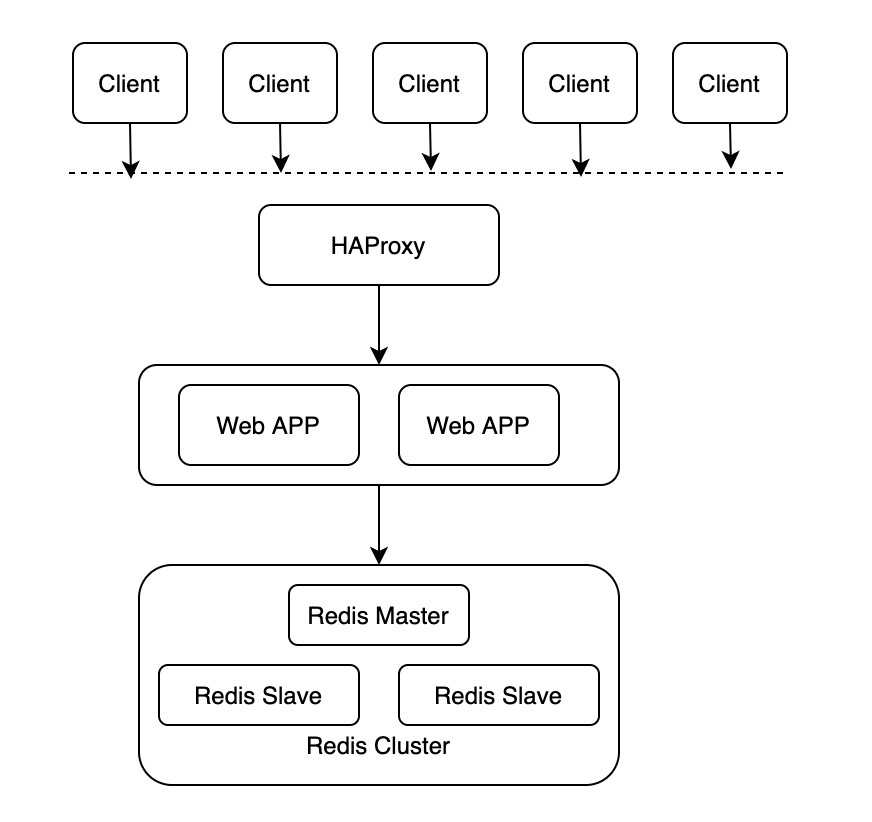

# 28-从 0 到 1 构建分布式高可用的 web 应用


> 生活永远不像我们想像的那样好，但也不会像我们想像的那样糟。——莫泊桑

这篇文章我们来实践一下稍微复杂一点的场景：构建一个分布式高可用的 web 应用。

## 1. 架构

下图是本文要介绍的系统架构，从上到下依次为：

1. 用户 client 端的请求；
2. HAProxy：开源代理软件，用来提供高可用和负载均衡；
3. 多个 Web 应用；
4. Redis 集群。

下面我们重点介绍后面三个部分：



## 2. HAProxy

#### HAProxy 概览

HAProxy 是一个使用 C 语言编写的开源软件，作者是 Willy Tarreau，其提供高可用性、负载均衡等特性，以及基于 TCP(四层) 和 HTTP(七层) 的应用程序代理。功能包括提供基于 cookie 的持久性、基于内容的交互、过载保护的高级流量管理、自动故障切换等。官网：http://www.haproxy.org。

HAProxy 实现了基于事件驱动的单进程模型，这是其高性能的根本原因。相比于多进程或者多线程模型在并发上的限制，比如内存资源限制、系统调度器限制、锁竞争等，HAProxy 的单进程模型具有天然的优势。同时结合事件驱动模型，可以在用户空间更高效的处理网络请求。

HAProxy 特别适用于那些负载特大的web站点，比如 github、stackoverflow 等网站就是使用了 HAProxy。这些站点通常又需要会话保持或七层处理。HAProxy运行在当前的硬件上，完全可以支持数以万计的并发连接。并且它的运行模式使得它可以很简单安全的整合进您当前的架构中， 同时可以保护你的web服务器不被暴露到网络上。

#### HAProxy 使用

在部署 HAProxy 的镜像之前，我们先手动安装一下看看如何使用。在 CentOS 系统安装比较简单。

```bash
[root@xxx ~]# yum install haproxy
...
```

默认配置在 `/etc/haproxy/haproxy.cfg`

```bash
#---------------------------------------------------------------------
# Example configuration for a possible web application.  See the
# full configuration options online.
#
#   http://haproxy.1wt.eu/download/1.4/doc/configuration.txt
#
#---------------------------------------------------------------------

#---------------------------------------------------------------------
# Global settings
#---------------------------------------------------------------------
global
    # to have these messages end up in /var/log/haproxy.log you will
    # need to:
    #
    # 1) configure syslog to accept network log events.  This is done
    #    by adding the '-r' option to the SYSLOGD_OPTIONS in
    #    /etc/sysconfig/syslog
    #
    # 2) configure local2 events to go to the /var/log/haproxy.log
    #   file. A line like the following can be added to
    #   /etc/sysconfig/syslog
    #
    #    local2.*                       /var/log/haproxy.log
    #
    log         127.0.0.1 local2

    chroot      /var/lib/haproxy
    pidfile     /var/run/haproxy.pid
    maxconn     4000
    user        haproxy
    group       haproxy
    daemon

    # turn on stats unix socket
    stats socket /var/lib/haproxy/stats

#---------------------------------------------------------------------
# common defaults that all the 'listen' and 'backend' sections will
# use if not designated in their block
#---------------------------------------------------------------------
defaults
    mode                    http
    log                     global
    option                  httplog
    option                  dontlognull
    option http-server-close
    option forwardfor       except 127.0.0.0/8
    option                  redispatch
    retries                 3
    timeout http-request    10s
    timeout queue           1m
    timeout connect         10s
    timeout client          1m
    timeout server          1m
    timeout http-keep-alive 10s
    timeout check           10s
    maxconn                 3000

#---------------------------------------------------------------------
# main frontend which proxys to the backends
#---------------------------------------------------------------------
frontend  main *:5000
    acl url_static       path_beg       -i /static /images /javascript /stylesheets
    acl url_static       path_end       -i .jpg .gif .png .css .js

    use_backend static          if url_static
    default_backend             app

#---------------------------------------------------------------------
# static backend for serving up images, stylesheets and such
#---------------------------------------------------------------------
backend static
    balance     roundrobin
    server      static 127.0.0.1:4331 check

#---------------------------------------------------------------------
# round robin balancing between the various backends
#---------------------------------------------------------------------
backend app
    balance     roundrobin
    server  app1 127.0.0.1:5001 check
    server  app2 127.0.0.1:5002 check
    server  app3 127.0.0.1:5003 check
    server  app4 127.0.0.1:5004 check
```

我们来简单看一下其中几个配置：

- global：
  - log: 日志输出配置，所有日志都记录在本机，通过 local2 输出；
  - chroot：改变当前工作目录至 /var/lib/haproxy；
  - pidfile：进程的 pid 文件。很多软件设计都通过判断 pid 文件存在来判断进程是不是还在；
  - maxconn：最大连接数；
  - user：进程运行的用户，haproxy；
  - group：进程运行的用户组，haproxy；
  - daemon：以后台形式运行 HAProxy。
- defaults
  - mode：设置启动实例的协议类型，支持 tcp/http；
  - log：沿用 global 里面的配置；
  - option dontlognull：不记录上级负载均衡发送过来的用于检测状态没有数据的心跳包；
  - option redispatch：当 serverId 对应的服务器挂掉后，强制定向到其他健康的服务器；
  - retries 3：重试 3 次连接失败就认为服务器不可用；
  - maxconn 3000：最大连接数；
  - timeout connect：连接超时时间；
  - timeout client：客户端连接超时时间；
  - timeout server：服务端连接超时时间。

剩下的默认配置暂时先不看了，聚焦一下核心问题，我们要用 HAProxy 来代理我们的服务，应该怎么增加我们的配置项呢？只需要在配置文件的结尾添加 `listen` 即可。下面是一个简单的例子，这块等我们的 Web 应用部署之后我们再来补充。

```bash
listen http-server 0.0.0.0:8080
		stats enable
		stats uri	/xxx
				server server1 xxx
```

## 3. Web APP

我们这里实现一个基于 Flask 的 Web 应用对 Redis 实现读写。主要要实现三个功能：

1. redis 连接；
2. 提供一个 route set 实现对 redis 中的值进行设置；
3. 提供一个 route get 实现对 redis 中的值进行查询。

##### redis 连接

redis 连接，我们直接使用 Python 的依赖库 Redis。

```python
import redis

redis_client = redis.Redis(host=redis_host, port=redis_port, db=0)
```

其中连接 Redis 需要使用三个参数：

- host: redis 的 host
- port: redis 的端口
- db：redis 中的数据库，我们使用 db = 0 即可。

这里的一个核心问题是 redis 运行在另外一个 Docker 中，那我们在应用的 Docker 中如何知道 redis 的 host 呢？在 Docker 技术中我们可以在启动 Docker 的时候指定参数 --link 将两个 Docker 的网络进行打通。在下面部署的时候我们再细说。

##### set route

编写一个 route，可以对 redis 进行写入。

```python
@app.route('/set')
def set():
    key = request.args.get("key")
    value = request.args.get("value")
    redis_client.set(key, value)
    return 'OK. We have set ' + key + ' to be ' + value
```

其中 request.args 中可以获取到 url 中的参数。但是上面的代码没有做参数校验，key 和 value 可能是空，我们加一个参数校验的逻辑。

```python
@app.route('/set')
def set():
    key = request.args.get("key")
    value = request.args.get("value")
    if key is None or value is None:
        return 'OOps, the key or value is NULL'
    redis_client.set(key, value)
    return 'OK. We have set ' + key + ' to be ' + value
```

##### get route

编写一个 route 对 redis 中的值查询

```python
@app.route('/get')
def get():
    key = request.args.get('key')
    if key is None:
        return 'OOps, the key is null'
    value = redis_client.get(key)
    return value
```

至此，我们的 web 应用代码编写完成，完整的代码如下，其中 redis-host 现在还是一个 placehold，我们部署的时候会把这个变量注入进来。

```python
from flask import Flask, request
import redis

redis_client = redis.Redis(host='redis-host', port=6379, db=0)
app = Flask(__name__)

@app.route('/set')
def set():
    key = request.args.get('key')
    value = request.args.get('value')
    if key is None or value is None:
        return 'OOps, the key or value is NULL'
    redis_client.set(key, value)
    return 'OK. We have set ' + key + ' to be ' + value

@app.route('/get')
def get():
    key = request.args.get('key')
    if key is None:
        return 'OOps, the key is null'
    value = redis_client.get(key)
    return value
```

下面编写 Dockerfile。

```dockerfile
from python:3

RUN pip install flask
RUN pip install redis
RUN mkdir /data

COPY hello.py /data/
WORKDIR /data

EXPOSE 5000
ENV FLASK_APP=/data/hello.py
ENTRYPOINT ["flask", "run", "-h", "0.0.0.0"]
```

然后通过 `docker build` 来构建我们的应用，由于提前没有拉取依赖镜像，并且要在镜像中安装一些依赖包，所以 build 时间会略久一点。

```bash
[root@ixxxZ imooc]# docker build -t web:v1 .
Sending build context to Docker daemon  3.584kB
Step 1/9 : from python:3
3: Pulling from library/python
e9afc4f90ab0: Pull complete
989e6b19a265: Pull complete
af14b6c2f878: Pull complete
5573c4b30949: Pull complete
11a88e764313: Pull complete
ee776f0e36af: Pull complete
513c90a1afc3: Pull complete
df9b9e95bdb9: Pull complete
86c9edb54464: Pull complete
Digest: sha256:dd6cd8191ccbced2a6af5d0ddb51e6057c1444df14e14bcfd5c7b3ef78738050
Status: Downloaded newer image for python:3
 ---> 7f5b6ccd03e9
Step 2/9 : RUN pip install flask
 ---> Running in 2d701068e85b
Collecting flask
  Downloading Flask-1.1.2-py2.py3-none-any.whl (94 kB)
Collecting Jinja2>=2.10.1
  Downloading Jinja2-2.11.2-py2.py3-none-any.whl (125 kB)
Collecting click>=5.1
  Downloading click-7.1.2-py2.py3-none-any.whl (82 kB)
Collecting itsdangerous>=0.24
  Downloading itsdangerous-1.1.0-py2.py3-none-any.whl (16 kB)
Collecting Werkzeug>=0.15
  Downloading Werkzeug-1.0.1-py2.py3-none-any.whl (298 kB)
Collecting MarkupSafe>=0.23
  Downloading MarkupSafe-1.1.1-cp38-cp38-manylinux1_x86_64.whl (32 kB)
Installing collected packages: MarkupSafe, Jinja2, click, itsdangerous, Werkzeug, flask
Successfully installed Jinja2-2.11.2 MarkupSafe-1.1.1 Werkzeug-1.0.1 click-7.1.2 flask-1.1.2 itsdangerous-1.1.0
Removing intermediate container 2d701068e85b
 ---> 40586a8d8950
Step 3/9 : RUN pip install redis
 ---> Running in cff9c96c09f2
Collecting redis
  Downloading redis-3.5.3-py2.py3-none-any.whl (72 kB)
Installing collected packages: redis
Successfully installed redis-3.5.3
Removing intermediate container cff9c96c09f2
 ---> f295e0ec8e7e
Step 4/9 : RUN mkdir /data
 ---> Running in 359538e774ec
Removing intermediate container 359538e774ec
 ---> 35935e5e1ba9
Step 5/9 : COPY hello.py /data/
 ---> 509d00b301f4
Step 6/9 : WORKDIR /data
 ---> Running in 95d6e233a897
Removing intermediate container 95d6e233a897
 ---> 231b90724d66
Step 7/9 : EXPOSE 5000
 ---> Running in 56c9c364235a
Removing intermediate container 56c9c364235a
 ---> 773eae476c98
Step 8/9 : ENV FLASK_APP=/data/hello.py
 ---> Running in e8a326d03937
Removing intermediate container e8a326d03937
 ---> a1bdaa647811
Step 9/9 : ENTRYPOINT ["flask", "run", "-h", "0.0.0.0"]
 ---> Running in 2fec7d6c8628
Removing intermediate container 2fec7d6c8628
 ---> 4124bbaadf14
Successfully built 4124bbaadf14
Successfully tagged web:v1
[root@ixxxZ imooc]# docker images
REPOSITORY                                                                TAG                          IMAGE ID            CREATED             SIZE
web                                                                       v1                           4124bbaadf14        21 seconds ago      944MB
```

启动的时候可以通过 `--link` 指定 redis 的地址，类似下面这样。由于我们的 redis 服务还没有部署起来，所以这里是跑不起来的，我们先来部署一下 redis 集群。

```bash
$ docker run -p 5000:5000 --link redis-test:redis-host -d --name web web:v1
```

## 4. Redis Cluster

我们这里要构建一个 Redis 集群，需要修改 Redis 镜像里面的配置，为了方便操作，这里我们先启动容器，设置 entrypoint 为 /bin/bash，然后修改配置，最后手动启动 Redis 实例。

#### Redis Master

先拉去 Redis 镜像，然后先启动 Redis Master 实例。

```bash
$ docker run -it --name redis-master redis /bin/bash
...
```

Redis 的镜像默认没有配置文件，但是我们可以通过 Volume 的方式映射进去。通过命令 `docker inspect <container-id>` ，我们可以看到容器挂载的 Volume。如下所示，宿主机目录：`/var/lib/docker/volumes/d51e68c64fea7241eb5d036ac2f6be3df3af8df982d59694bbccd48f339be42e/_data` ，容器内目录：`/data` 。也就是说我们在宿主机目录下创建的文件都会映射到容器内的 `/data` 目录下。

```bash
"Mounts": [
            {
                "Type": "volume",
                "Name": "d51e68c64fea7241eb5d036ac2f6be3df3af8df982d59694bbccd48f339be42e",
                "Source": "/var/lib/docker/volumes/d51e68c64fea7241eb5d036ac2f6be3df3af8df982d59694bbccd48f339be42e/_data",
                "Destination": "/data",
                "Driver": "local",
                "Mode": "",
                "RW": true,
                "Propagation": ""
            }
        ],
```

我们创建一个用于 redis 启动的配置文件 redis.conf，如果是默认安装的 redis，只需要修改其中几个字段即可：

- daemonize 从 no 改成 yes；
- logfile 改成 /data/redis.log；
- dir 改成 /var/lib/redis，需要手动创建该目录；
- bind 到 0.0.0.0，默认是 127.0.0.1。

```bash
bind 0.0.0.0
protected-mode yes
port 6379
tcp-backlog 511
timeout 0
tcp-keepalive 300
supervised no
pidfile /var/run/redis_6379.pid
loglevel notice
logfile /data/redis.log
databases 16
save 900 1
save 300 10
save 60 10000
stop-writes-on-bgsave-error yes
rdbcompression yes
rdbchecksum yes
dbfilename dump.rdb
dir /var/lib/redis
slave-serve-stale-data yes
slave-read-only yes
repl-diskless-sync no
repl-diskless-sync-delay 5
repl-disable-tcp-nodelay no
slave-priority 100
appendonly no
appendfilename "appendonly.aof"
appendfsync everysec
no-appendfsync-on-rewrite no
auto-aof-rewrite-percentage 100
auto-aof-rewrite-min-size 64mb
aof-load-truncated yes
lua-time-limit 5000
slowlog-log-slower-than 10000
slowlog-max-len 128
latency-monitor-threshold 0
notify-keyspace-events ""
hash-max-ziplist-entries 512
hash-max-ziplist-value 64
list-max-ziplist-size -2
list-compress-depth 0
set-max-intset-entries 512
zset-max-ziplist-entries 128
zset-max-ziplist-value 64
hll-sparse-max-bytes 3000
activerehashing yes
client-output-buffer-limit normal 0 0 0
client-output-buffer-limit slave 256mb 64mb 60
client-output-buffer-limit pubsub 32mb 8mb 60
hz 10
aof-rewrite-incremental-fsync yes
daemonize yes
```

修改完配置之后，我们通过下面的命令启动 redis master

```
# cd /usr/local/bin
# redis-server /data/redis.conf
```

我们可以在容器中启动 redis cli 来验证一下 redis server 是否启动成功。下面就表示 redis-master 启动成功了。

```bash
root@b8d2918d3f73:/usr/local/bin# redis-cli
127.0.0.1:6379> set abc 123
OK
127.0.0.1:6379> get abc
"123"
```

#### Redis Slave

我们下面启动两个 Redis Slave。

```bash
# docker run -ti --name redis-salve2 --link redis-master:master redis /bin/bash
# docker run -ti --name redis-salve2 --link redis-master:master redis /bin/bash
```

需要注意的是启动命令中的 `--link` 参数，表示将该容器加入到名字为 redis-master 的容器的网络空间，其实就是加入到同一个 network namespace，同时 redis-master 映射到新的 redis 从容器的名字为 master。

我们下面像修改 redis master 的配置文件一样，通过 Volume 的方式将我们之前的 redis 配置文件拷贝进去，并做如下修改：

```bash
daemonize yes
slaveof master 6379
```

最后一行的 slave 配置表示该 redis 实例为运行在 master:6379 （master 会转换为 ip）的 redis master 的 slave 节点。修改完配置别忘记创建目录配置中的 /var/lib/redis。剩下的启动操作、通过 redis-cli 验证和 redis master 一样。

## 5. 应用部署构建

现在 Redis 集群已经创建完成了，我们开始启动我们的 web 应用容器，启动两个 web 应用容器。我们先把 web 端口映射到宿主机。

```bash
# docker run -p 5001:5000 --link redis-master:redis-host -d --name web-app1 web:v1
# docker run -p 5002:5000 --link redis-master:redis-host -d --name web-app2 web:v1
```

两个 web 应用容器分别映射到宿主机的 5001 和 5002 端口。下面我们通过 http 请求来验证一下。

通过 web-app1 设置一个 key。

```bash
$ curl "localhost:5001/set?key=imooc&value=imooc.com"
OK. We have set imooc to be imooc.com
```

通过 web-app2 获取该 Key 的值。

```bash
$ curl "localhost:5002/get?key=imooc"
imooc.com
```

这里是为了演示所以将端口映射出来了，实际上端口是没有必要映射出来的。我们将这两个容器停止然后用下面的命令重启一下。

```bash
$ docker run --link redis-master:redis-host -d --name web-app1 web:v1
$ docker run --link redis-master:redis-host -d --name web-app2 web:v1
```

我们现在解决一下之前一个悬而未决的问题，HAProxy。通过下面的命令参数启动 HAProxy，主要是将两个 web app 的 host 映射进去。

```bash
$ docker run -it --name HAProxy --link web-app1:app1 --link web-app2:app2 -p 6301:6301 -v /tmp:/data haproxy /bin/bash
```

细心的同学肯定注意到了我们这里不仅做了宿主机的端口映射还做了数据卷映射 `-v /tmp:/data` ，这是为了拷贝配置文件。我们修改的配置文件如下。

```bash
global
    log         127.0.0.1 local2

    chroot      /var/lib/haproxy
    pidfile     /var/run/haproxy.pid
    maxconn     4000
    daemon

defaults
    mode                    http
    log                     global
    option                  httplog
    option                  dontlognull
    option http-server-close
    option forwardfor       except 127.0.0.0/8
    option                  redispatch
    retries                 3
    timeout http-request    10s
    timeout queue           1m
    timeout connect         10s
    timeout client          1m
    timeout server          1m
    timeout http-keep-alive 10s
    timeout check           10s
    maxconn                 3000

listen webapp
    bind 0.0.0.0:6301
    stats enable
    stats uri /web-app
        server app1 app1:5000 check inter 2000 rise 2 fall 5	#均衡节点
        server app2 app2:5000 check inter 2000 rise 2 fall 5
```

上面的配置文件中有几个需要注意的地方：

1. chroot 的目录必须保证是存在的，不如会报 chroot 失败；
2. listen 的 bind 参数要写在新的一行，这个应该是新版本的 HAProxy 的参数解析发生的变化；

我们下面来验证一下。我们将之前请求的 web server 的端口由 5001 改成 HAProxy 映射出来的端口 6301，然后发现 it works！

```bash
$ curl "localhost:6301/get?key=imooc"
imooc.com
```

## 6. 总结

本文从实践的角度使用 HAProxy + Web APP + Redis Cluster 构建了一个高可用的服务，虽然这里都是在一个 host 上演示的，但是表达的意思都是一样的。

本文所有的示例和代码片段都经过实测是可以运行的，运行的操作系统版本如下：

```bash
# lsb_release -a
LSB Version:	:core-4.1-amd64:core-4.1-noarch
Distributor ID:	CentOS
Description:	CentOS Linux release 7.6.1810 (Core)
Release:	7.6.1810
Codename:	Core
```

运行的 Docker 版本如下：

```bash
# docker --version
Docker version 18.09.2, build 6247962
```