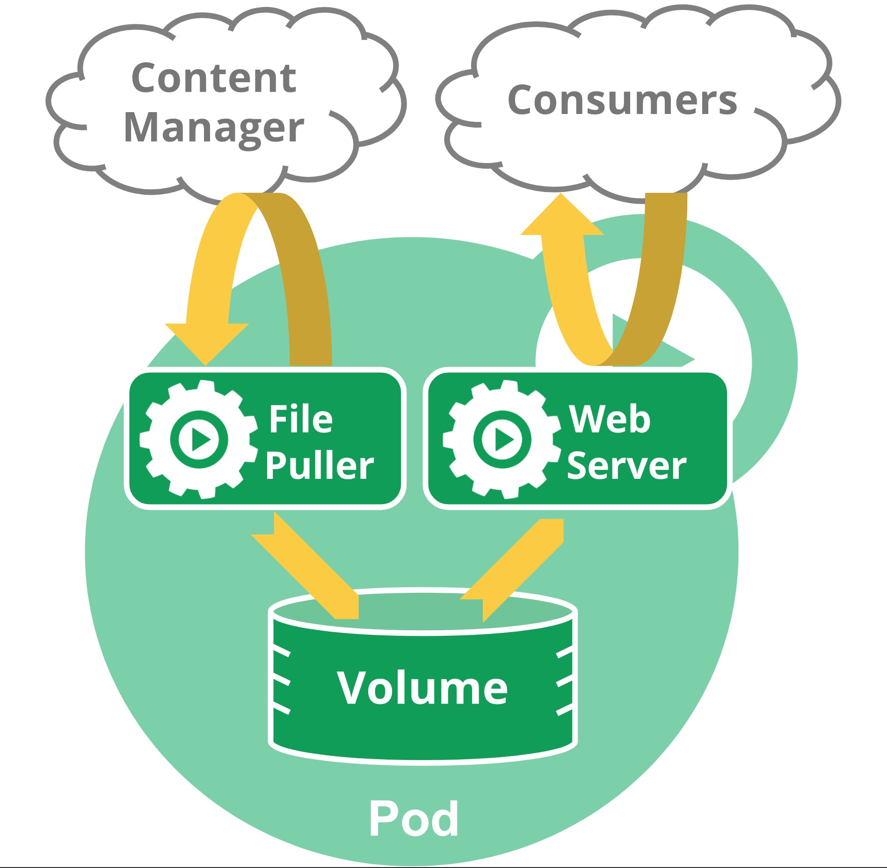

# 32-**Kubernetes 核心概念解析：Pod（一）**

> 每个人都是自己命运的主宰。——斯蒂尔斯

## 1. 背景

Pod 是 Kubernetes 中的原子调度单元，可以说是 Kubernetes 中最重要的概念也不为过。那么我们首先来看看为什么要设计 Pod 这个概念呢？直接使用容器有什么问题？

## 2. 原子调度单元

将 Pod 作为最小的调度单元，涉及到调度领域的一个 task co-scheduling 问题，简单来说就是如何协同调度几个 task。

举个例子，现在有两个容器：A 和 B，这两个容器在业务上具有一定的耦合性，需要被调度到一个机器节点上。目前有两个 node 几点 A 和 B，列举一下资源情况：

- A 容器需要内存资源 1 G；
- B 容器需要内存资源 0.5 G；
- Node A 可用内存 1.25 G；
- Node B 可用内存 2 G。

Co-scheduling 需要保证容器 A 和 B 同时被调度到 Node B 上，任意一个容器被调度到 Node A 上都会导致最后的部署拓扑不是预期的。对于这种问题，各种有名的调度器都是怎么解决的呢？

- Mesos：资源囤积，英文为 resource hoarding，简单来说，就是等待所有设置了 Affinity 约束的任务都达到时，才开始统一进行调度。这种调度机制的问题是等待占用可能导致调度效率损失和死锁。
- Google Omega：乐观调度。和乐观锁的机制类似，先假设没有冲突直接进行调度，同时设置一个巧妙的回滚机制。当调度出现冲突时，通过回滚来解决。这种方式在调度效率上要高效地多，但是和乐观锁一样，实现机制非常复杂。
- Kubernetes：对于这个问题，Kubernetes 直接将容器 A 和容器 B 封装到同一个 Pod 里面，通过把 Pod 作为原子调度单元，非常巧妙的解决了。

## 3. Pod 的好处

前面说到了可以通过 Pod 解决 task co-scheduling 的问题，除此之前，Pod 本身的机制还带来了一些其他的好处。

#### 管理

Pod 是形成内聚服务单元的多个协作过程模式的模型。它们提供了一个比它们的应用组成集合更高级的抽象，从而简化了应用的部署和管理。Pod 可以用作部署、水平扩展和制作副本的最小单元。在 Pod 中，系统自动处理多个容器的在并置运行（协同调度）、生命期共享（例如，终止），协同复制、资源共享和依赖项管理。

#### 资源共享和通信

Pod 内的容器之间没有进行资源隔离，可以进行资源共享和通信。

Pod 中的容器使用同一个 Network Namespace ，也就是相同的网络协议栈，比如 IP、端口空间等。那么容器之间通信就可以直接使用 `localhost` 来进行通信，而不需要通过网卡来交换数据。需要注意的是，由于多个容器使用同一个端口空间，所以需要自己协调 Pod 内部的容器的端口情况，防止冲突。

除了网络资源，Pod 内的容器还会共享存储，比如在 Pod 的 spec 中指定一组共享存储卷，那么 Pod 启动之后，内部的容器就可以通过这个数据存储卷来共享数据。

## 4. Pod 如何管理多个容器

Pod 中的容器被自动安排到及集群中的同一个物理或者虚拟机上，并可以一起进行调度。容器可以共享资源和依赖、彼此通信、协调何时以及何种方式终止它们。

注意，在单个 Pod 中将多个并置和共同管理的容器分组是一个相对高级的使用方式。 只在容器紧密耦合的特定实例中使用此模式。 例如，您可能有一个充当共享卷中文件的 Web 服务器的容器，以及一个单独的 sidecar 容器，该容器从远端更新这些文件，如下图所示：

## 4. Pod 的生命周期

Pod 的生命周期在多个状态之间轮转，支持的状态包括：

- 挂起（Pending）：Pod 已被 Kubernetes 系统接受，但有一个或者多个容器镜像尚未创建。等待时间包括调度 Pod 的时间和通过网络下载镜像的时间，这可能需要花点时间；
- 运行中（Running）：该 Pod 已经绑定到了一个节点上，Pod 中所有的容器都已被创建。至少有一个容器正在运行，或者正处于启动或重启状态；
- 成功（Succeeded）：Pod 中的所有容器都被成功终止，并且不会再重启；
- 失败（Failed）：Pod 中的所有容器都已终止了，并且至少有一个容器是因为失败终止。也就是说，容器以非0状态退出或者被系统终止；
- 未知（Unknown）：因为某些原因无法取得 Pod 的状态，通常是因为与 Pod 所在主机通信失败。

