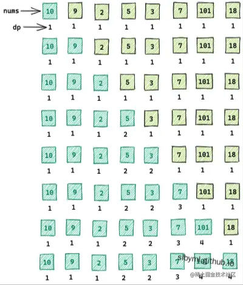
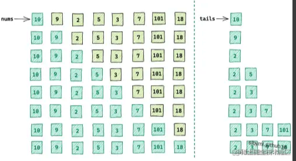
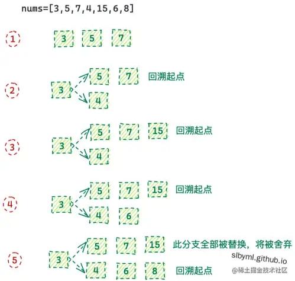

# 算法相关

## 异步并发控制

### 请实现以下函数

1. 可以批量请求数据，所有的 url 地址均在 urls 参数中，
2. 同时，可以通过 max 参数控制请求的并发数
3. 当所有请求结束之后，要执行 callback 回调函数
4. 发请求的函数可以直接使用 fetch 即可

```javascript
function sleep(n, name = 'test') {
  return new Promise((resolve) => {
    console.log(n, name, 'start-------')
    setTimeout(() => {
      console.log(n, name, 'end--------')
      resolve({ n, name })
    }, 1000 * n)
  })
}
// 限制并发数，items 是异步任务队列
async function asyncPool({ limit, items }) {
  const promises = []
  const pool = new Set()
  for (const item of items) {
    const fn = async (currentItem) => await currentItem()
    const promise = fn(item)
    pool.add(promise)
    const clean = () => pool.delete(promise)
    promise.then(clean, clean)
    if (pool.size >= 2) {
      await Promise.race(pool)
    }
    promises.push(promise)
  }
  return Promise.all(promises)
}

async function start() {
  await asyncPool({
    limit: 2,
    items: [
      () => sleep(1, '吃饭'),
      () => sleep(3, '睡觉'),
      () => sleep(5, '打游戏'),
      () => sleep(3.5, '学习算法'),
      () => sleep(4, '学习vue和react'),
    ],
  })
}
start()
```

执行代码，就可以看到控制台以此执行打印效果

## Vue 中的最长递增子序列

给你一个整数数组`nums`,找出其中最长严格递增子序列的长度

示例：

> 输入：nums = [10, 9, 2, 5, 3, 7, 101, 18]
>
> 输出：4
>
> 解释：最长递增子序列为[2, 3, 7, 101], 因此长度为 4

### 动态规划：O(n²)

定义: `de[i]`代表以`num[i]`为结尾的最长子序列的长度

思路

1. 双层遍历：对比`num[i]`和`num[i]`之前的数据

2. 当`num[i] > num[j]` 时，`num[i]`就可以拼接在`num[j]`后面，此时`num[i]`位置的上升子序列长度为`de[i] + 1`

3. 当`num[i] < num[j]` 时,`num[i]` 和 `num[j]` 无法构成上升子序列，跳过

4. 计算出`de[i]`中最大的值即为计算结果

   ```typescript
   function lengthOfLis(nums: number[]): number {
     const leng: number = nums.length
     if (leng <= 1) {
       return leng
     }
     let de: number[] = new Array(leng).fill(1)
     for (let i = 0; i < leng; i++) {
       for (let j = 0; i < j; j++) {
         if (nums[i] > nums[j]) {
           de[i] = Math.max(de[i], de[j] + 1)
         }
       }
     }
     return Math.max(...de)
   }
   ```

   计算过程如下

   

### 贪心 + 二分查找：O(nLog)

要使上升子序列的长度尽可能的长，就要使序列上升的速度尽可能的慢， 因此需要让序列内末尾数字尽可能的小

我们可以维护一个`result`数组，用来存放单调递增序列结果，然后依次遍历`nums`数组

- 如果`nums[i] > result[len - 1]`，则直接插入到`result`末尾
- 否则，在`result`数组中通过`二分查找`的方式，找到第一个比`nums[i]`大的值`result[j]`，并更新`result[j] = nums[i]`

```typescript
function lengthOfLis(nums: number[]): number {
  const n = nums.length
  if (n <= 1) {
    return n
  }
  let result: number[] = [nums[0]]
  let len = result.length // 最大长度
  for (let i = 0; i < n; i++) {
    if (nums[i] > result[len - 1]) {
      // 如果当前值，大于末尾的值，则直接进栈
      result.push(nums[i])
      len++
    } else {
      let left = 0,
        right = len
      // 二分查找序列内第一个大于 nums[i] 的值
      // 如果 中间值 小于 nums[i], 说明要往右边那一半中查找，否则就是左边那一半，直到 left 变量 大于等于 right 变量
      while (left < right) {
        const middle = (left + right) >> 1
        if (result[middle] < nums[i]) {
          left = middle + 1
        } else {
          right = middle
        }
      }
      // 替换掉第一个大于 nums[i] 的值为 nums[i]
      result[left] = nums[i]
    }
  }
  return len
}
```

计算过程如下



> 注意: 这个方案中的`result`得到的长度是正确的，但是顺序不一定是正确结果需要的顺序，比如`[10,9,2,5,3,7,1,18]`得到的 `result数组`是`[1,3,7,18]`

这是为什么呢？

要想得到最长上升子序列的正确长度，首先必须保证`result`内存放的数值增速尽可能稳和慢，所以要使用增长空间大、有潜力的值来组合

比如`1,50,5,...`当我们遍历到`50`的时候，并不知道后面是否还有值，此时先将数据放入栈中存起来是明智的，继续往后遍历遇到了`5`，显然选用`1,5`要更让人放心也更有潜力，因为后面的数再往栈内存放的几率更大，即使后面没有更多值了，那么选用`1,5`还是`1,50`其实最后长度都是一样的

那么如果使用了更小的值，已经在栈内的值应该如何处理呢？比如我们栈中存放了`1,3,9,10`，再往后遍历的时候遇到了`5`，显然`5`比`9,10`都更有潜力，如果将栈直变为`1,3,5`又不太可能，因为如果后面没有更多值了，长度由`4`变为`3`,结果显然是错误的；但是如果不去管`5`的话，后面再碰到`6,7,8`那不就嗝屁了；

所以我们可以考虑既不能放弃有潜力的值，也不能错失正确的长度结果，因此我们不妨鱼和熊掌都兼得一些，比如就第一个大于`5`的值`9`替换掉，变为`1,3,5,10`,这样在放弃栈内容顺序正确的情况下保证了栈长度的正确性，接下来，再往后遍历会遇到三种情况

- 后面没有更多值了，此时结果长度为 4，是没有问题的，
- 如果后面遇到`50`,则可以直接插入到栈中,变为`1,5,6,10,50`,长度为`5`也是没有问题的，因为我们并没有将最后的值替换掉，所以我们可以将栈想象成为`9`做了个替身`5`,真正的值还是替换前的`1,3,9,10`
- 如果后面遇到了`6`，则按照一开始的规则，将`10`替换掉变为`1,3,5,6`,长度为`4`也是没有问题的 ，因为我们将最后的值都做了替换，所以此时替身`5`变为了真身，同事我们也发现，得到的栈中的值就是最后的最优解

可以发现，在没有替换完栈中的值时，`栈`中被替换的值，起到的只是占位的效果，为后面遍历数字提供参照的作用

### 最长上升子序列进阶：得到正确的序列

要得到真正的序列，首先要对上面的代码做一些改动

- 将`result`修改为存储下标（最后回溯是会改成真正的值）；为下面的`chain`提供参考
- 增加`chain`,存放每一位在被加入到`result`时其对应的前一位的下标值，进行关系绑定
- 回溯`chain`,覆盖`result`的值。因为`result`内，**最后一位一定是正确的**，素以可以从后往前进行修正

上面我们说过要对栈内某个值进行替换后，变动的值后面的所有的值如果没有变动的话，那么替换的值只是一个替身，无法作为最后结果进行输出，只有替换值后面的都变动过了，才会由替身变为真身。 那么在没有全部替换前，我们是需要有一种方法区保存原来顺序的

比如`3,5,7`,可以想象成`7->5->3`他们之间是强绑定的，`7`前面永远都是 5，`5`前面永远都是`3`

- 如果此时遇到了`4`,栈就会变为`3,4,7`,`5`虽然变为了`4`,但是`7->5->3`这个绑定关系是不会变的，
- 如果此时又遇到了`15`,栈就变成了`3,4,7,15`,则绑定和回溯关系就变成了`15->7-->5->3`

那么什么时候`4`能生效呢？那就是`4`后面的值都被替换了，比如又遇到了`6`和`8`,则栈变为了`3,4,6,8`,绑定和回溯关系就变为了`8->6->4->3`

```javascript
nums = [3, 5, 7, 4, 15, 6, 8]
```



```typescript
function getOfLIS(nums: number[]): number[] {
  const n = nums.length
  if (n <= 1) return nums
  let result: number[] = [0] // 由原来存储具体值改为存储下标
  let chain = new Map() // 通过下标存储映射关系
  for (let i = 0; i < n; i++) {
    const j = result[result.length - 1]
    if (nums[i] > nums[j]) {
      chain.set(i, { val: i, pre: j })
      result.push(i)
    } else {
      let left = 0,
        right = result.length
      while (left < right) {
        const mid = (left + right) >> 1
        if (nums[result[mid]] < nums[i]) {
          left = mid + 1
        } else {
          right = mid
        }
      }
      chain.set(i, { val: i, pre: result[left - 1] })
      result[left] = i
    }
  }
  let preIdx = result[result.length - 1]
  let len = result.length
  // 从后往前进行回溯，修正覆盖result中的值，找到正确的顺序
  while (chain.get(preIdx)) {
    let lastObj = chain.get(preIdx)
    result[--len] = nums[lastObj.val]
    preIdx = lastObj.pre
  }
  return result
}

const test = [9, 2, 5, 3, 7, 101, 4, 18, 1]
console.log(getOfLIS(test)) // [2,3,4,18]

const test2 = [3, 5, 7, 4, 15, 6, 8]
console.log(getOfLIS(test2)) // [3,4,6,8]
```

### vue3 DOM DIFF 算法

vue3 中的 diff 和上面的思想其实是一样的，都是基于下标来绑定数字再被插入`result`内时和其前面的一个数字的关系。但是它看起来会更加难以理解，因为它是基于`数组(P)`来绑定回溯关系的，返回的是最长递增子序列的下标值

```typescript
function getSequence(arr: number[]) {
  // 复制一份数组
  const p = arr.slice()
  // 存放的是arr数组的索引，result数组将要存放的是递增的索引
  const result = [0]
  // 声明一些变量
  let i, j, u, v, c
  // 获取当前数组的长度
  const len = arr.length
  for (i = 0; i < len; i++) {
    // 当前要比较的值为arrI
    const arrI = arr[i]
    // 如果当前要比较的值不为0
    if (arrI !== 0) {
      // result数组中最大的值的索引
      j = result[result.length - 1]
      // 如果当前值大于result中的最大值，那么就将当前值添加到result数组中，意思是递增序列长度增加1
      if (arr[j] < arrI) {
        // 因为result在这里马上会push进去一个值，当前位置存储的是还没push前的最后一位也就是push后的前一位的索引
        p[i] = j
        // 也就是当前值arrI 所在位置的前一位的索引
        result.push(i)
        // 这里直接退出当前循环 下方就不需要使用else块
        continue
      }

      // 开始二分
      //左指针初始值为0
      u = 0
      // 右指针初始值为数组长度-1，也就是最大索引
      v = result.length - 1
      // 当左指针小于右指针时，才需要进入循环
      while (u < v) {
        // 这个位置是取中间值，Vue最初的代码是 ((u + v)/ 2) | 0 后来改成了 (u+v)>>1，
        // 更好的方式是 u+ ((v-u) >> 1) 可以避免指针越界，不过在vue中节点的数量远达不到越界的情况可暂时忽略
        c = (u + v) >> 1
        // 如果中间值的位置的值小于当前值
        if (arr[result[c]] < arrI) {
          // 那么就说明要找的值在中间值的右侧，因此左指针变为中间值+1
          u = c + 1
        } else {
          // 否则就是大于等于当前值
          // 那么右指针变为中间值，再进行下一次循环
          v = c
        }
      }
      // 最后输出的左指针的索引一定是非小于当前值的，有可能大于也有可能等于
      if (arrI < arr[result[u]]) {
        // 如果当前值小于第一个非小于的值，那么就意味着这个值是大于的，排除了等于的情况。
        if (u > 0) {
          // 如果u === 0 说明当前值是最小的，不会有比它小的值，那么它前面不会有任何的值，只有u大于0时才需要存储它前面的值
          // 当前位置因为result[u]马上就被arrI替换，所以result[u - 1]就是当前值存储位置的前一位，也就是比当前值小的那个值所在的位置
          p[i] = result[u - 1]
        }
        // 将第一个比当前值大的值替换为当前值，依次来让数组递增的更缓慢
        result[u] = i
      }
    }
  }
  // 使用二分可以找到最长的长度但是无法判断最长的序列
  // 开始回溯倒序找到最长的序列，因为p中当前位置存放的是上一个比当前值小的数所在的位置，所以使用倒序
  // 获取递增数组的长度
  u = result.length
  // 获取递增数组的最后一项也就是最大值的索引
  v = result[u - 1]
  // 当u的索引没有越界时一直循环
  while (u-- > 0) {
    // 一开始result的最后一个值存放的索引一定是最大值
    result[u] = v
    // 根据当前值就是该序列中最大的部分来查找是谁跳动这个位置的，依次往前查
    v = p[v]
  }
  // 最后输出结果数组，此数组中存放的就是最大递增子序列的索引值
  return result
}
```

## 自我模仿所写(最长子序列)

> 多增加了变量声明，源码中做了优化

```html
<script>
  function getOfLIS(arr) {
    const result = [0]
    const p = new Array(arr.length).fill(0)
    const len = arr.length
    for (let index = 0; index < len; index++) {
      // 如果当前项大于结果的最后一项
      if (arr[index] > arr[result[result.length - 1]]) {
        result.push(index)
        // 注意：这里因为先push,所以要取 result.length - 2 位
        // 记录前一位索引，便于回溯使用
        p[index] = result[result.length - 2]
      } else {
        let left = 0,
          right = result.length - 1
        while (left < right) {
          const middle = (left + right) >> 1
          if (arr[index] > arr[result[middle]]) {
            left = middle + 1
          } else {
            right = middle
          }
        }
        if (arr[result[left]] > arr[index]) {
          p[index] = result[left - 1] // 记录前一位索引，便于回溯使用
          result[left] = index
        }
      }
    }
    let resultLength = result.length
    let lastResultItem = result[resultLength - 1]
    const newArr = []
    while (resultLength-- > 0) {
      result[resultLength] = lastResultItem
      lastResultItem = p[lastResultItem]
      newArr.unshift(arr[result[resultLength]])
    }
    console.log('对应的最长子序列是', newArr)
    return result
  }

  const test = [3, 5, 7, 4, 15, 6, 8]
  console.log(getOfLIS(test)) //  [0, 3, 5, 6]
</script>
```

### 参考文档

[最长递增子序列及 vue3.0 中 diff 算法](https://juejin.cn/post/7134499769803603999#heading-3)

[一文揭秘 Vue3 中你不知道的最长递增子序列（逐行分析）](https://juejin.cn/post/7198506378432184377)
