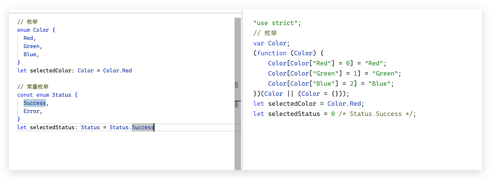

# TS 面试题

[TypeScript TS「面试题及答案」](https://juejin.cn/post/6999985372440559624)

## 1. declare 和 declare global 的区别

- declare 用于声明全局变量、全局函数、全局命名空间等，不会在编译阶段进行任何操作，只会在编译后的文件中生成声明语句，不会生成任何代码。
- declare global 用于声明全局变量，可以在全局作用域中访问这些变量，并且在编译后的文件中生成相应的代码。

```ts
declare global {
  interface Window {
    myGlobalVariable: string
  }
}

window.myGlobalVariable = 'Hello, World!'
```

## 2. keyof 和 typeof 关键字的作用？

- typeof 用于获取一个变量声明或对象的类型，返回一个字符串，表示类型的名称。
- keyof 索引类型查询操作符号，用于获取一个对象类型的所有键名，返回一个字符串或数字字面量的联合类型。

```ts
enum Color {
  Red,
  Green,
  Blue,
}

type ColorKey = keyof typeof Color // 'Red' | 'Green' | 'Blue'
```

```ts
interface ObjectType {
  name: string
  age: number
}

const object: ObjectType = { name: 'John', age: 30 }

type Keys = keyof ObjectType
// 输出 "string" | "number"
console.log(typeof Keys)
```

```ts
const num: number = 10
const str: string = 'Hello'
const bool: boolean = true

console.log(typeof num) // number
console.log(typeof str) // string
console.log(typeof bool) // boolean
```

```ts
type MyType = string
const myValue: MyType = 'Hello'

console.log(typeof myValue) // string

interface ObjectType {
  name: string
  age: number
}

const obj: ObjectType = { name: 'John', age: 30 }

console.log(typeof obj) // ObjectType

class MyClass {
  constructor() {}
}

const instance = new MyClass()

console.log(typeof instance) // MyClass
```

## 3. TypeScript 中的 any never unknown null undefined void 有什么区别？

- any: 动态的变量类型（失去了类型检查的作用）。
- never: 永不存在的值的类型。例如：never 类型是那些总是会抛出异常或根本就不会有返回值的函数表达式或箭头函数表达式的返回值类型。
- unknown: 任何类型的值都可以赋给  unknown  类型，但是  unknown  类型的值只能赋给  unknown  本身和  any  类型。
- null & undefined: 默认情况下 null 和 undefined 是所有类型的子类型。 就是说你可以把  null 和 undefined 赋值给 number 类型的变量。当你指定了 --strictNullChecks 标记，null 和 undefined 只能赋值给 void 和它们各自。
- void: 没有任何类型。例如：一个函数如果没有返回值，那么返回值可以定义为 void。

## 4. TypeScript 中使用 Union Types 时有哪些注意事项？

> 属性或方法访问: 当 TypeScript 不确定一个联合类型的变量到底是哪个类型的时候，我们只能访问此联合类型的所有类型里共有的属性或方法。

```ts
function getLength(something: string | number): number {
  return something.length
}
// index.ts(2,22): error TS2339: Property 'length' does not exist on type >'string | number'.
//   Property 'length' does not exist on type 'number'.

function getString(something: string | number): string {
  return something.toString()
}
// 公共方法和属性可以访问
```

## 5. TypeScript 的 tsconfig.json 中有哪些配置项信息？

```json
{
  "files": [],
  "include": [],
  "exclude": [],
  "compileOnSave": false,
  "extends": "",
  "compilerOptions": { ... }
}
```

- files  是一个数组列表，里面包含指定文件的相对或绝对路径，用来指定待编译文件，编译器在编译的时候只会编译包含在 files 中列出的文件。
- include & exclude 指定编译某些文件，或者指定排除某些文件。
- compileOnSave：true 让 IDE 在保存文件的时候根据 tsconfig.json 重新生成文件。
- extends 可以通过指定一个其他的 tsconfig.json 文件路径，来继承这个配置文件里的配置。
- compilerOptions 编译配置项，如何对具体的 ts 文件进行编译

## 6. TypeScript 中如何设计 Class 的声明？

```ts
// 在声明类的时候，一般类中都会包含，构造函数、对构造函数中的属性进行类型声明、类中的方法。
class Greeter {
  greeting: string
  constructor(message: string) {
    this.greeting = message
  }
  greet(): string {
    return 'Hello, ' + this.greeting
  }
}
let greeter = new Greeter('world')
```

## 7. TypeScript 中的 any 类型作用是什么？

为编程阶段还不清楚类型的变量指定一个类型。

这些值可能来自于动态的内容，比如来自用户输入或第三方代码库。

这种情况下，我们不希望类型检查器对这些值进行检查而是直接让它们通过编译阶段的检查。

## 8. TypeScript 中 const 和 readonly 的区别？枚举和常量枚举的区别？接口和类型别名的区别？

- const 和 readonly:
  - const 可以防止变量的值被修改
  - readonly 可以防止变量的属性被修改
- 枚举和常量枚举: 常量枚举只能使用常量枚举表达式，并且不同于常规的枚举，它们在编译阶段会被删除。
  - 常量枚举成员在使用的地方会被内联进来。
  - 之所以可以这么做是因为，常量枚举不允许包含计算成员。
- 接口和类型别名: 两者都可以用来描述对象或函数的类型。
  - 与接口不同，类型别名还可以用于其他类型，如基本类型（原始值）、联合类型、元组。

```ts
// 枚举
enum Color {
  Red,
  Green,
  Blue,
}
let selectedColor: Color = Color.Red

// 常量枚举
const enum Status {
  Success,
  Error,
}
let selectedStatus: Status = Status.Success
```

在上述代码中，Color 是一个枚举类型，它在编译时会生成一个对象，可以通过枚举成员名或索引来访问枚举值。
Status 是一个常量枚举类型，它在编译时会被删除，并且不能包含计算得出的值，只能包含常量成员。



## 9. TypeScript 中 type 和 interface 的区别?

相同点：

- 都可以描述 '对象' 或者 '函数'
- 都允许拓展 (extends)。`interface` 和 `type` 都可以拓展，并且两者并不是相互独立的，也就是说 `interface` 可以 `extends` `type`，`type` 也可以 `extends` `interface`。

不同点：

- type 可以声明基本类型，联合类型，元组，而 `interface` 只能声明对象类型。
- type 可以使用 typeof 获取实例的类型进行赋值
- 多个相同的 interface 声明可以自动合并，而 type 不能
- interface 可以继承，type 不能

## 10. **TypeScript 中的 this 和 JavaScript 中的 this 有什么差异？**

- TypeScript：noImplicitThis: true 的情况下，必须去声明 this 的类型，才能在函数或者对象中使用 this。
- Typescript 中箭头函数的 this 和 ES6 中箭头函数中的 this 是一致的。

## 11. TypeScript 中对象展开会有什么副作用吗？

- 展开对象后面的属性会覆盖前面的属性
- 仅包含对象自身的可枚举属性，不可枚举的属性将会丢失

## 12. TypeScript 中如何联合枚举类型的 Key?

```ts
enum str {
  A,
  B,
  C,
}
type strUnion = keyof typeof str // 'A' | 'B' | 'C'
```

## 13. TypeScript 中如何设置模块导入的路径别名？

通过 tsconfig.json 中的 paths 项来配置:

```json
{
  "compilerOptions":
    {
      "baseUrl": ".",
      "paths": {
         "@helper/*": ["src/helper/*"],
         "@utils/*": ["src/utils/*"],
         ...
      }
   }
}
```

## 14. TypeScript 类中成员的 public、private、protected、readonly 修饰符的理解？

- `public`: 成员都默认为`public`，被此限定符修饰的成员是可以被外部访问；
- `private`: 被此限定符修饰的成员是只可以被类的内部访问；
- `protected`: 被此限定符修饰的成员是只可以被类的内部以及类的子类访问;
- `readonly`: 关键字将属性设置为只读的。 只读属性必须在声明时或构造函数里被初始化。

## 15. 简单介绍一下 TypeScript 模块的加载机制？

假设有一个导入语句 `import { a } from "moduleA"`;

1. 首先，编译器会尝试定位需要导入的模块文件，通过绝对或者相对的路径查找方式；
2. 如果上面的解析失败了，没有查找到对应的模块，编译器会尝试定位一个`外部模块声明`（.d.ts）；
3. 最后，如果编译器还是不能解析这个模块，则会抛出一个错误 `error TS2307: Cannot find module 'moduleA'.`

## 16. 简单聊聊你对 TypeScript 类型兼容性的理解？

- `ts 类型兼容：` 当一个类型 Y 可以赋值给另一个类型 X 时， 我们就可以说类型 X 兼容类型 Y。也就是说两者在结构上是一致的，而不一定非得通过 extends 的方式继承而来
- `接口的兼容性：X = Y `只要目标类型 X 中声明的属性变量在源类型 Y 中都存在就是兼容的（ Y 中的类型可以比 X 中的多，但是不能少）
- `函数的兼容性：X = Y ` Y 的每个参数必须能在 X 里找到对应类型的参数，参数的名字相同与否无所谓，只看它们的类型（参数可以少但是不能多。与接口的兼容性有区别，原因参考第 17 问）

## 17. 协变、逆变、双变和抗变的理解？

`协变：X = Y `Y 类型可以赋值给 X 类型的情况就叫做协变，也可以说是 X 类型兼容 Y 类型

```typescript
typescript
复制代码interface X { name: string; age: number; }
interface Y { name: string; age: number; hobbies: string[] }
let x: X = { name: 'xiaoming', age: 16 }
let y: Y = { name: 'xiaohong', age: 18, hobbies: ['eat'] }
x = y
```

`逆变：printY = printX` 函数 X 类型可以赋值给函数 Y 类型，因为函数 Y 在调用的时候参数是按照 Y 类型进行约束的，但是用到的是函数 X 的 X 的属性和方法，ts 检查结果是类型安全的。这种特性就叫做逆变，函数的参数有逆变的性质。

```typescript
typescript
复制代码let printY: (y: Y) => void
printY = (y) => { console.log(y.hobbies) }
let printX: (x: X) => void
printX = (x) => { console.log(x.name) }
printY = printX
```

`双变（双向协变）：X = Y；Y = X`父类型可以赋值给子类型，子类型可以赋值给父类型，既逆变又协变，叫做“双向协变”（ts2.x 之前支持这种赋值，之后 ts 加了一个编译选项 strictFunctionTypes，设置为 true 就只支持函数参数的逆变，设置为 false 则支持双向协变）

`抗变（不变）：`非父子类型之间不会发生型变，只要类型不一样就会报错

## 18. 类型的全局声明和局部声明

如果声明文件内不包含`import、export`，那么这个文件声明的类型就会变成全局声明。

反之，若是这个文件包含了`import、export`，那么这个文件包含的类型声明则会是局部声明，不会影响到全局声明。

## 19. 如何使 TypeScript 项目引入并识别编译为 JavaScript 的 npm 库包？

1. 选择安装 ts 版本，`npm install @types/包名 --save`；
2. 对于没有类型的 js 库，需要编写同名的.d.ts 文件

## 20. 数组定义的两种方式

```ts
type Foo = Array<string>
interface Bar {
  baz: Array<{ name: string; age: number }>
}

type Foo = string[]
interface Bar {
  baz: { name: string; age: number }[]
}
```
