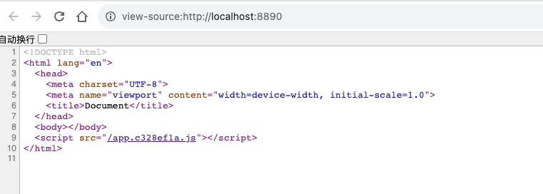
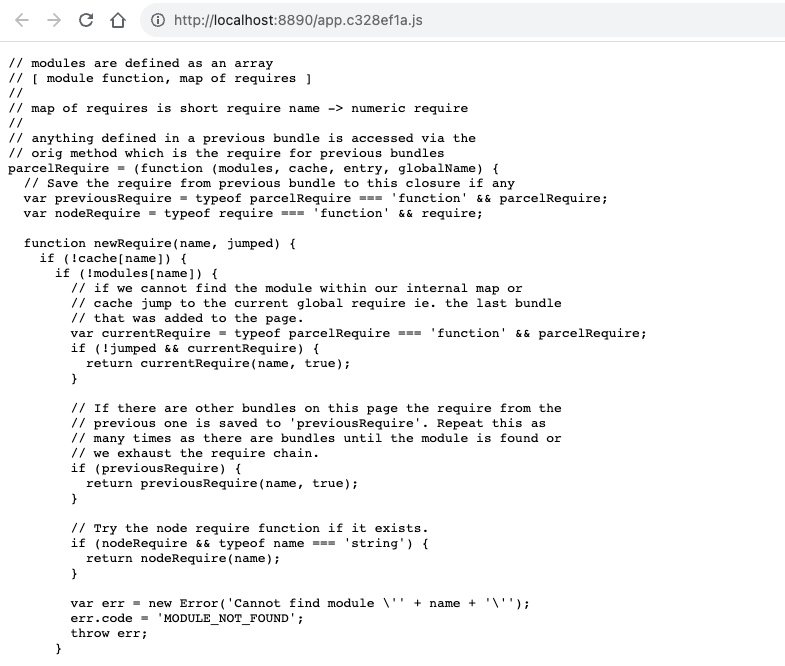

# Webpack

## 1. 与 webpack 类似的工具有哪些？谈谈你为什么使用 webpack 或者放弃其他的？

### 1.1 grunt

- 一句话：自动化。对于需要反复重复的任务，例如 压缩、编译、单元测试、linting 等。自动化工具可以减轻你的工作，当你的崽 `gruntFile` 文件正确配置了任务，任务运行器就回自动帮你或者你的小组完成大部分无聊的工作。
- 最老牌的打包工具，它运用配置的思想来写打包脚本，一切皆配置。

#### **优点**：

出现的比较早

#### **缺点**：

- 配置项太多
- 而且不同的插件可能会有自己的扩展字段
- 学习成本高，运用时候需要明白各种插件的配置规则和配合方式

#### **相关代码示例**

1. 初始化项目，并安装依赖

   ```shell
   npm init -y
   npm install grunt grunt-babel @babel/core @babel/preset-env
   ```

2. `package.json`中增加脚本命令

   ```json
   {
     "scripts": {
       "build": "grunt"
     }
   }
   ```

3. 新建配置文件`Grguntfile.js`，内容如下

   ```javascript
   module.exports = function (grunt) {
     // 1. 加载 babel 任务
     grunt.loadNpmTasks('grunt-babel')
     // 2. 初始化配置文件
     grunt.initConfig({
       babel: {
         options: {
           sourceMap: true,
           presets: ['@babel/preset-env'],
         },
         dist: {
           files: {
             'dist/js/app.js': 'src/js/app.js',
           },
         },
       },
     })
     // default 指的是入口任务
     grunt.registerTask('default', ['babel'])
   }
   ```

4. 新建`src/js/app.js`，内容如下

   ```javascript
   let sum = (a, b) => a + b
   ```

5. 执行脚本`npm  run build`，生成内容如下

   ```html
   // dist/js/app.js
   "use strict";
   
   var sum = function sum(a, b) {
     return a + b;
   };
   // sourceMappingURL=app.js.map
   
   // dist/js/app.js.map
   {"version":3,"file":"app.js","names":["sum","a","b"],"sources":["../../src/js/app.js"],"sourcesContent":["let sum = (a, b) => a + b\n"],"mappings":";;AAAA,IAAIA,GAAG,GAAG,SAANA,GAAGA,CAAIC,CAAC,EAAEC,CAAC;EAAA,OAAKD,CAAC,GAAGC,CAAC;AAAA"}
   ```

### 1.2 gulp

- 基于 node.js 的 steam 流打包工具
- 定位是基于任务流的自动化构建工具
- Gulp 是通过 task 对整个开发过程进行构建

#### **优点**

- 流式的写法简单直观
- API 简单，代码量少
- 易于学习和使用
- 适合多页面应用开发

#### **缺点**

- 异常处理比较麻烦
- 工作流程顺序难以精细控制
- 不太适合但也或者自定义模块的开发

#### **代码示例**

1. 初始化项目，并安装依赖

   ```shell
   npm init -y
   npm install gulp gulp-babel @babel/core @babel-preset-env
   ```

2. 新建配置文件`gulpfile.js`,内容如下

   ```javascript
   const gulp = require('gulp')
   const babel = require('gulp-babel')

   function defaultTask(callback) {
     gulp
       // 读取源文件
       .src('src/app.js')
       .pipe(
         // 传给 babel 任务
         babel({
           presets: ['@babel/preset-env'],
         }),
       )
       .pipe(gulp.dest('dist'))
     callback() // 支持异步
   }
   exports.default = defaultTask
   ```

3. 新建`src/app.js`,内容如下

   ```javascript
   let sum = (a, b) => a + b
   ```

4. 为`package.json`内容，增加如下脚本

   ```json
   {
     "scripts": {
       "build": "gulp"
     }
   }
   ```

5. 运行命令`npm run build`,内容如下

   ```javascript
   // dist/app.js
   'use strict'
   
   var sum = function sum(a, b) {
     return a + b
   }
   ```

### 1.3 webpack

- webpack 是模块化管理工具和打包工具。通过 loader 的转换，任何形式的资源都可以视作模块。比如 CommonJs 模块，AMD 模块，ES6 模块，CSS 图片等。它可以将许多松散的模块按照依赖和规则打包成符合生产环境部署的前端资源。
- 还可以将按需加载的模块进行分离，等到实际需要的时候再异步加载。
- 他定位是模块打包器，而 gulp/grunt 属于构建工具。Webpack 可以代替 gulp/grunt 的一些功能，但不是一个职能的工具，可以配合使用

#### 优点

- 它可以模块化打包任何资源
- 适配任何模块系统
- 适合 SPA 单页面的开发

#### 缺点

- 学习成本高，配置复杂
- 通过 babel 编译后的 js 代码打包后体积过大

#### 代码示例

1. 初始化项目，安装依赖库

   ```shell
   npm inin -y
   npm install webpack webpack-cli babel-loader @babel/core @babel/preset-env -D
   ```

2. 为`package.json`增加脚本命令

   ```javascript
   {
     "scripts": {
       "build": "webpack build"
     }
   }
   ```

3. 新建`webpack.config.js`,内容如下

   ```javascript
   const path = require('path')

   module.exports = {
     mode: 'development',
     devtool: false,
     entry: path.resolve(__dirname, 'src/index.js'),
     output: {
       path: path.resolve(__dirname, 'dist'),
       filename: 'bundle.js',
     },
     module: {
       rules: [
         {
           test: /\.js$/,
           use: [
             {
               loader: 'babel-loader',
               options: {
                 presets: ['@babel/preset-env'],
               },
             },
           ],
           include: path.resolve(__dirname, 'src'),
           exclude: /node_modules/,
         },
       ],
     },
     plugins: [],
     devServer: {},
   }
   ```

4. 运行脚本命令`npm run build`,结果如下

   ```javascript
   // dist/bundle.js
   /******/ ;(() => {
     // webpackBootstrap
     var __webpack_exports__ = {}
     /*!**********************!*\
     !*** ./src/index.js ***!
     \**********************/
     var sum = function sum(a, b) {
       return a + b
     }
     /******/
   })()
   ```

### 1.4 rollup

[官网](https://www.rollupjs.com/)

Rollup 是一个 JavaScript 模块打包工具，可以将多个小的代码片段编译为完整的库和应用。

与传统的 CommonJS 和 AMD 这一类非标准化的解决方案不同，Rollup 使用的是 ES6 版本 Javascript 中的模块标准。

新的 ES 模块可以让你自由、无缝地按需使用你最喜爱的库中那些有用的单个函数。这一特性在未来将随处可用，但 Rollup 让你现在就可以，想用就用。

#### 优点

* 用标准化的格式（es6）来写代码，通过减少死代码尽可能的缩小包体积

#### 缺点

* 对代码拆分，静态资源，Commonjs 模块支持不太好

#### 代码示例

1. 初始化安装依赖

   ```shell
   npm init -y
   npm install @babel/core @babel/preset-env babel-plugin-external-helpers @rollup/plugin-node-resolve @rollup/plugin-babel -D
   ```

2. 创建`rollup.config.js`文件，内容如下

   ```javascript
   import { nodeResolve } from '@rollup/plugin-node-resolve'
   import { babel } from '@rollup/plugin-babel'
   
   export default {
     input: 'src/index.js',
     output: {
       file: 'dist/bundle.js',
       format: 'cjs',
       exports: 'default',
     },
     plugins: [
       nodeResolve(),
       babel({
         presets: ['@babel/preset-env'],
         exclude: 'node_modules/**', // 只编译我们的代码
       }),
     ],
   }
   ```

3. 修改`package.json`增加如下脚本

   ```json
   {
     "scripts": {
       "build": "rollup -c ./rollup.config.js" // --bundleConfigAsCjs 增加这句或者 使用 type: module 二选一
     },
     "type": "module"
   }
   ```

4. 新建`src/index.js`，内容如下

   ```javascript
   let sum = (a, b) => a + b
   export default sum
   ```

5. 执行`npm run build` ，打包结果如下

   ```javascript
   // /dist/bundle.js
   'use strict';
   
   var sum = function sum(a, b) {
     return a + b;
   };
   
   module.exports = sum;
   ```

### 1.5 parcel

* 极速零配置Web应用打包工具
* 目前parcel 只能用来构建用于运行在浏览器中的网页，这也是它的出发点和专注点

#### 优点

* parcel 内置了常见场景的构建方案及其依赖，无需在安装各种依赖
* Parcel 能以 HTML 为入口，自动检测和打包依赖资源
* Parcel 默认支持模块热替换，真正的开箱即用

#### 缺点

* 不支持 SourceMap
* 不支持剔除无效代码(tree shaking)
* 配置不灵活

#### 代码示例

1. 初始化项目

   ```shell
   npm init -y
   ```

2. 修改`package.json`

   ```json
   {  
   	"scripts": {
       "start": "parcel src/index.html -p 8890"
     },
   }
   ```

3. 全局安装 pracel

   ```shell
   npm install -g parcel-bundler
   ```

4. 增加`src/index.html`文件，内容如下

   ```html
   <!DOCTYPE html>
   <html lang="en">
     <head>
       <meta charset="UTF-8" />
       <meta name="viewport" content="width=device-width, initial-scale=1.0" />
       <title>Document</title>
     </head>
     <body></body>
     <script src="./app.js"></script>
   </html>
   ```

5. 新建`src/app.js`,内容如下

   ```javascript
   let sum = (a, b) => a + b
   console.log(sum(2, 3))
   ```

6. 运行命令`npm run start`, 可以看到启动了服务`localhost:8890`

7. 打开后控制台正常显示

8. 查看源码, 结果如下

   

   

