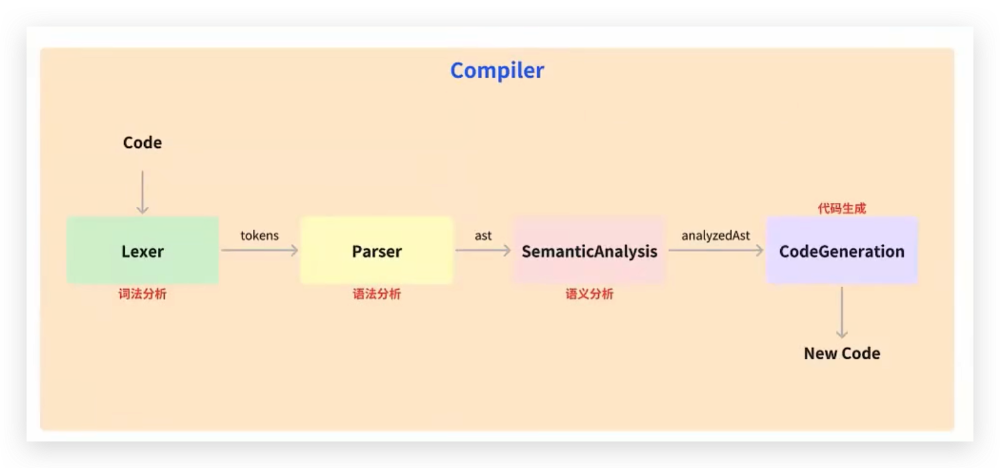
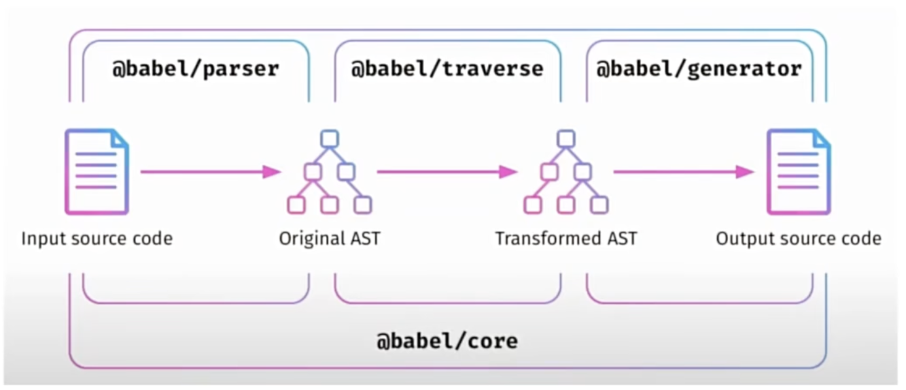

# 工程化相关面试题

## 1. 了解过 AST 吗？请说说它的运用场景？

### 代码的本质就是字符串

字符串的一些操作，就是所谓的编译



> 1. 词法分析（Lexical Analysis）：将代码转换为单词流，称为“词法单元”(tokens), 每个词法单元包含一个标识和一个属性值，比如变量名、数字、操作符号等等
> 2. 语法分析（parsing）:将词法单元流转换成抽象语法树（Abstract Syntax Tree 简称 AST），也就是标记所构成的数据结构，表示源代码的结构和规则。
> 3. 语义分析（Semantic Analysis）:在 AST 上执行类型检查、作用域检查等操作，以确保代码的正确性和安全性
> 4. 代码生成（Code Generation）:基于 AST 生成目标代码，包括优化代码结构、生成代码文本、进行代码压缩等等
>
> 下面是一个简单的 JavaScript 编译器实例代码
>
> 其中
>
> `laxer`是词法分析器，将源代码转换为词法单元流，生成 tokens
>
> `parser`是语法分析器，将词法单元流转换成抽象语法树；
>
> `samanticAnalysis`是语义分析器，对抽象语法树进行语义分析
>
> `codeGeneration`是代码生成器，将分析后的 AST 生成目标代码

### 一个编译器最核心的代码

```js
function compiler(sourceCode) {
  // 词法分析
  const tokens = laxer(sourceCode)
  // 语法分析
  const ast = parser(tokens)
  // 语义分析
  const analyzeAst = samanticAnalysis(ast)
  // 代码生成
  const targetCode = codeGeneration(analyzeAst)
  return targetCode
}
```

### 为什么在工作中需要用到编译原理？

> 一个公式编辑器、一个字符串复杂处理，特别是一些低代码平台，更是需要掌握 AST 以及编译原理。 比如： airtable、coda、glide、fibery 等

```ts
              LISP                      c
2 + 2         (add 2 2)                 add(2, 2)
4 - 2         (subtract 4 2)            subtract(4, 2)
2 + (4 - 2)   (add 2 (subtract 4 2))    add(2, subtract(4, 2))
```

将 LISP 的语言转换为 C
[实现一个 LISP to C 的语法转换器](https://zhuanlan.zhihu.com/p/140889954)

#### 1. 先实现 tokenizer

```js
// 词法分析，tokens
const tokenizer = (input: string) => {
  // 当前扫描字符的位置
  let current = 0
  // 存储的 token 值
  let tokens = []
  while (current < input.length) {
    let char = input[current]
    // 左括号
    if (char === '(') {
      tokens.push({
        type: 'paren',
        value: '(',
      })
      current++
      continue
    }
    // 右括号
    if (char === ')') {
      tokens.push({
        type: 'paren',
        value: ')',
      })
      current++
      continue
    }
    // 空格直接跳过
    let WHITESPACE = /\s/
    if (WHITESPACE.test(char)) {
      current++
      continue
    }
    // 数字取整个数字 直到遇到非数字的字符串为止
    let NUMBERS = /[0-9]/
    if (NUMBERS.test(char)) {
      let value = ''
      while (NUMBERS.test(char)) {
        value += char
        char = input[++current]
      }
      tokens.push({ type: 'number', value })
      continue
    }
    // 双引号 取整个字符串 直到遇到下一个双引号为止
    if (char === '"') {
      let value = ''
      char = input[++current]
      while (char !== '"') {
        value += char
        char = input[++current]
      }
      char = input[++current]
      tokens.push({ type: 'string', value })

      continue
    }
    // 操作符 取整个字符串 直到遇到下一个非[a-z]的字符为止，一般为空格
    let LETTERS = /[a-z]/i
    if (LETTERS.test(char)) {
      let value = ''
      while (LETTERS.test(char)) {
        value += char
        char = input[++current]
      }
      tokens.push({ type: 'name', value })

      continue
    }
    throw new TypeError('I dont know what this character is: ' + char)
  }
  return tokens
}
const input = '(add 2 (subtract 4 2))'
const tokens = tokenizer(input)
console.log(tokens)
```

```json
[
  // 结果如下
  { "type": "paren", "value": "(" },
  { "type": "name", "value": "add" },
  { "type": "number", "value": "2" },
  { "type": "paren", "value": "(" },
  { "type": "name", "value": "subtract" },
  { "type": "number", "value": "4" },
  { "type": "number", "value": "2" },
  { "type": "paren", "value": ")" },
  { "type": "paren", "value": ")" }
]
```

#### 2. 接着实现 parser

```js
// 语法分析
interface IToken {
  type: string;
  value: string | number;
}

const parser = (tokens: IToken[]) => {
  let current = 0
  function walk() {
    let token = tokens[current]
    // 数字
    if (token.type === 'number') {
      current++
      return {
        type: 'NumberLiteral',
        value: token.value,
      }
    }
    // 字符串
    if (token.type === 'string') {
      current++
      return {
        type: 'StringLiteral',
        value: token.value,
      }
    }
    // 带括号的表达式
    if (token.type === 'paren' && token.value === '(') {
      token = tokens[++current]
      let node: IASTExpressionNode = {
        type: 'CallExpression',
        name: token.value,
        params: [],
      }
      token = tokens[++current]
      while (
        token.type !== 'paren' ||
        (token.type === 'paren' && token.value !== ')')
      ) {
        // 进一步遍历
        node.params.push(walk())
        token = tokens[current]
      }
      current++
      return node
    }
    throw new TypeError(token.type)
  }
  let ast: IAST = {
    type: 'Program',
    body: [],
  }
  while (current < tokens.length) {
    // 生成ast
    ast.body.push(walk())
  }
  return ast
}
```

结果如下

```json
// console.log(parser(tokens))
{
  "type": "Program",
  "body": [
    {
      "type": "CallExpression",
      "name": "add",
      "params": [
        {
          "type": "NumberLiteral",
          "value": "2"
        },
        {
          "type": "CallExpression",
          "name": "subtract",
          "params": [
            {
              "type": "NumberLiteral",
              "value": "4"
            },
            {
              "type": "NumberLiteral",
              "value": "2"
            }
          ]
        }
      ]
    }
  ]
}
```

#### 3. Transformation: 将 LISP 的 AST 转成 C 的 AST

> 对 AST 内的每一种类型填充 enter 和 exit 函数（处理前和处理后）分别在遍历进入和退出的时候执行

```ts
function transformer(ast) {
  let newAst = {
    type: 'Program',
    body: [],
  }

  ast._context = newAst.body

  function traverser(ast, visitor) {
    function traverseArray(array, parent) {
      array.forEach((child) => {
        traverseNode(child, parent)
      })
    }
    function traverseNode(node, parent) {
      let methods = visitor[node.type]
      if (methods && methods.enter) {
        methods.enter(node, parent)
      }
      switch (node.type) {
        case 'Program':
          traverseArray(node.body, node)
          break
        case 'CallExpression':
          traverseArray(node.params, node)
          break
        case 'NumberLiteral':
        case 'StringLiteral':
          break
        default:
          throw new TypeError(node.type)
      }
      if (methods && methods.exit) {
        methods.exit(node, parent)
      }
    }
    traverseNode(ast, null)
  }
  traverser(ast, {
    NumberLiteral: {
      enter(node, parent) {
        parent._context.push({
          type: 'NumberLiteral',
          value: node.value,
        })
      },
    },
    StringLiteral: {
      enter(node, parent) {
        parent._context.push({
          type: 'StringLiteral',
          value: node.value,
        })
      },
    },
    CallExpression: {
      enter(node, parent) {
        let expression = {
          type: 'CallExpression',
          callee: {
            type: 'Identifier',
            name: node.name,
          },
          arguments: [],
        }
        node._context = expression.arguments
        if (parent.type !== 'CallExpression') {
          expression = {
            type: 'ExpressionStatement',
            expression: expression,
          }
        }
        parent._context.push(expression)
      },
    },
  })
  return newAst
}
```

输出结果如下
console.log(transformer(parser(tokens)))

```json
{
  "type": "Program",
  "body": [
    {
      "type": "ExpressionStatement",
      "expression": {
        "type": "CallExpression",
        "callee": {
          "type": "Identifier",
          "name": "add"
        },
        "arguments": [
          {
            "type": "NumberLiteral",
            "value": "2"
          },
          {
            "type": "CallExpression",
            "callee": {
              "type": "Identifier",
              "name": "subtract"
            },
            "arguments": [
              {
                "type": "NumberLiteral",
                "value": "4"
              },
              {
                "type": "NumberLiteral",
                "value": "2"
              }
            ]
          }
        ]
      }
    }
  ]
}
```

#### 4. Code Generation：将 C 的 AST 转化成 C 的 code

- 深度优先遍历基于 C 的 AST。
- 通过不同类型处理成不同的字符串。
- 将所有字符串组合成为 C 的 code。

```ts
const codeGenerator = (node) => {
  switch (node.type) {
    case 'Program':
      return node.body.map(codeGenerator).join('\n')
    case 'ExpressionStatement':
      return codeGenerator(node.expression) + ';'

    case 'CallExpression':
      return (
        codeGenerator(node.callee) +
        '(' +
        node.arguments.map(codeGenerator).join(', ') +
        ')'
      )
    case 'Identifier':
      return node.name
    case 'NumberLiteral':
      return node.value
    case 'StringLiteral':
      return '"' + node.value + '"'
    default:
      throw new TypeError(node.type)
  }
}
```

结果如下：

```js
// console.log(codeGenerator(transformer(parser(tokens))))
add(2, subtract(4, 2))
```

## 2. Babel 的 plugin 和 loader 的应用和原理？

babel 是一个流行的 JavaScript 编译器

babel 包含以下几个核心内容

- @babel/core
- @babel/parser
- @babel/traverse
- @babel/generator
- 辅助相关，type polyfill template 等

babel 的预设：babel-preset-env



```js
import %%importName%% from "%%source%%"

期望这段代码最终输出

import module from "module"
```

参考 bable 官网文档

> 官网给出的例子，运行时提示报错：
>
> import template from '@babel/template'
> import generate from '@babel/generator'
>
> TypeError: template is not a function
>
> TypeError: generate is not a function
>
> 需要修改 为如下
>
> import _template from '@babel/template'
> import _generate from '@babel/generator'
>
> const template = _template.default
> const generate = _generate.default

```js
import _template from '@babel/template'
import _generate from '@babel/generator'
import * as t from '@babel/types'

const template = _template.default
const generate = _generate.default

const buildRequire = template(`
  var %%importName%% = require(%%source%%);
`)

const ast = buildRequire({
  importName: t.identifier('myModule'),
  source: t.stringLiteral('my-module'),
})

console.log(generate(ast).code)

// var myModule = require("my-module");
```

babel 除了转译 code 外，还可以做什么呢？

* polyfill

## 3. 请说说 webpack 的打包过程与原理？

webpack 基本的配置情况如何？

* splitChunk 怎么做
* Tress shaking
* Dll
* css 提取
* terser 提取
* mode （development production）、entry、module(loader)、resolve、external、plugin

### webpack 打包构建流程

几个核心概念

1. Compiler
2. Compliation
3. Module
4. Chunk
5. Bundle

执行过程描述

1. 初始化，初始化会读取配置信息，统计入口文件、解析 loader 以及 plugin 等信息；
2. 编译阶段，webpack 编译代码，部分依赖 babel, ts 转译为 JavaScript，less 转为 css, styled-components 进行处理
3. 输出阶段：生成输出文件，包含文件名，输出路径，资源信息

#### 初始化阶段的主要流程

1. 初始化参数
2. 创建 compiler 对象实例
3. 开始编译，compiler.run
4. 确定入口，根据 entry，找出所有入口文件，调用 addEntry

#### 构建阶段

1. 编译阶段，通过 entry 对应的 dependence 构建 module 对象，调用对应 loder 去将模块转换为 js 内容（babel 将一些内容转换为目标内容）
2. 完成模块编译，得到一个 moduleGraphe

Module => chunk => bundle

#### 生成阶段

1. 输出资源组装 chunk, chunkGroup, 再将 Chunk 转换为一个单独文件加入到输出列表，既然到这儿已经加入到输出列表了，说明之类是修改资源的最后机会（也就是afterChunks: new SyncHooks([‘chunks’])钩子）
2. 写入文件系统(emitAssets)在确定好输出内容后，根据配置输出到文件中。
   1. （如果是 webpack-dev-server 呢？？不太一样）
   2. 还有比如热更新等等

### loader 的本质就是对象

```js
const loaderUtils = require("loader-utils")
exports = module.exports = function(source) {
  // 对 source 做一些处理
  return source
}
```

### Plugin的本质是对象

```js
export default Class CusPlugin {
  constructor(options = {}){
    this.options = options
  }
  apply (compiler) {
    /...../
  }
}
```


<!-- ## 4. 请说说 webpack 的热更新原理？ -->

<!-- ## 5. 请说说 webpack 的 tree-shaking 原理？ -->

<!-- ## 6. 请说说 webpack 的代码分割原理？ -->

<!-- ## 7. 请说说 webpack 的动态 import 原理？ -->

<!-- ## 8. 请说说 webpack 的代码压缩原理？ -->

<!-- ## 9. 请说说 webpack 的 source map 原理？ -->

<!-- ## 10. 请说说 webpack 的代码缓存原理？ -->

<!-- ## 11. 请说说 webpack 的多进程打包原理？ -->

<!-- ## 12. 请说说 webpack 的多入口打包原理？ -->

<!-- ## 13. 请说说 webpack 的多页面打包原理？ -->

<!-- ## 14. 请说说 webpack 的多页面打包优化原理 -->
