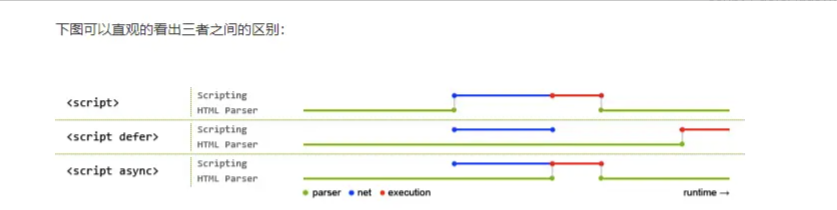

# JS 面试题

## 1. 使用迭代方式实现 flatten 函数

```js
const arr = [1, [2, [3, [4, 5]]]]

const flattenOne = (arr) => {
  while (arr.some((v) => Array.isArray(v))) {
    arr = [].concat(...arr)
  }
  return arr
}
console.log(flattenOne(arr))

const flattenTwo = (arr) => {
  return arr.reduce((acc, val) => {
    return acc.concat(Array.isArray(val) ? flattenTwo(val) : val)
  }, [])
}
console.log(flattenTwo(arr))
```

## 2. 数组的随机排序

```js
const arr = [1, 2, 3, 4, 5, 6, 7, 8, 9, 10]

const randomSortOne = (arr) => {
  const arrLength = arr.length
  for (let i = 0; i < arrLength; i++) {
    const randomIndex = Math.floor(Math.random() * arrLength)
    const temp = arr[i]
    arr[i] = arr[randomIndex]
    arr[randomIndex] = temp
  }
  return arr
}

console.log(randomSortOne(arr))

const randomSortTwo = (arr) => {
  arr.sort(() => Math.random() - 0.5)
  return arr
}

console.log(randomSortTwo(arr))
```

## 3. 如何提取 URL 中的参数

```js
let url =
  'http://www.domain.com/?user=anonymous&id=123&id=456&city=%E5%8C%97%E4%BA%AC&enabled'

const queryUrlParamsOne = (url) => {
  let urlArr = url.split('?')
  let paramsArr = urlArr[1].split('&')
  let paramsObj = {}
  paramsArr.forEach((item) => {
    let itemArr = item.split('=')
    paramsObj[itemArr[0]] = decodeURIComponent(itemArr[1])
  })
  return paramsObj
}
console.log(queryUrlParamsOne(url))

const queryUrlParamsTwo = (URL) => {
  const url = URL.split('?')[1]
  const urlSearchParams = new URLSearchParams(url)
  const paramsObj = Object.fromEntries(urlSearchParams.entries())
  return paramsObj
}
console.log(queryUrlParamsTwo(url))
```

## 4. 打印 100 以内的质数

```js
// 质数：只能被 1 和 自身整除
const resultArr = [1]
for (let index = 2; index <= 100; index++) {
  let count = 0
  for (let j = 1; j <= index; j++) {
    if (index % j === 0) {
      count++
    }
  }
  if (count === 2) {
    resultArr.push(index)
  }
}
console.log(resultArr)
```

## 5. 如何获得指定范围内的随机数

- Math.random() 生成 0-1 之间的随机数 (大于等于 0 且小于 1 )
- Math.floor() 向下取整
- Math.ceil() 向上取整
- Math.round() 四舍五入

```js
const randomNum = (min, max) => {
  // 不包含两端的处理：(min, max)
  // return Math.round(Math.random() * (max - min - 2) + min + 1)
  // 包含两端的处理：[min, max]
  // return Math.round(Math.random() * (max - min) + min)
  // 包含尾部的处理：(min, max]
  // return Math.ceil(Math.random() * (max - min) + min)
  // 包含头部的处理：[min, max)
  return Math.floor(Math.random() * (max - min) + min)
}
console.log(randomNum(1, 10))
```

## 6. 数组去重

```js
const arr = [
  {},
  {},
  '',
  '',
  233,
  233,
  'abc',
  undefined,
  null,
  null,
  NaN,
  NaN,
  123,
  [2],
  [2],
  [2, 3],
]
Array.prototype.myUnique = function () {
  // 第一种：使用 set 方法
  // return Array.from(new Set(this)) 这种方式并不能过滤掉数组，对象等

  //  第二种：使用 includes 来进行判断，结果如上
  // let arr = []
  // for (let i = 0; i < this.length; i++) {
  //   if (!arr.includes(this[i])) {
  //     arr.push(this[i])
  //   }
  // }
  // return arr

  //  第三种：使用 filter 方法
  return this.filter((item, index) => this.indexOf(item) === index) // 同样无法避免引用类型重复的问题
}
```

以上三种方式基本可以解决常见的去重问题

## 7. 自定义实现 unshift

> unshift: 在数组的开头添加一个或多个元素，并返回新的长度

```js
const arr = [1, 2, 3, 4, 5]
Array.prototype.myUnshift = function (...args) {
  // 1. 获取到数组中的所有元素
  // 2. 把所有元素添加到 args 数组中
  for (let index = args.length - 1; index >= 0; index--) {
    this.splice(0, 0, args[index]) // splice() 方法通过移除或者替换已存在的元素和/或添加新元素就地改变一个数组的内容。
  }
  return this.length
}
console.log(arr.myUnshift(6, 7, 8), arr)
```

## 8. 说说 Object.defineProperty 和 Proxy 的区别

- Vue2.x 使用 Object.defineProperty 实现响应式

1. Object.defineProperty 只能劫持对象的属性，从而需要对每个对象的每个属性进行遍历
2. Object.defineProperty 无法监听原生支持数组(其实可以的，只是尤大回答：性能代价和获得的用户体验收益不成正比)，需要特殊处理
3. Object.defineProperty 对新增属性需要手动进行 Observe

- Vue3.x 使用了 Proxy 实现响应式

1. 是针对整个对象
2. 解决了无法劫持数组的问题
3. 有更多的拦截方法，有助于性能的提升

[为什么 Vue 2.X 不能检测数组和对象的变化？](https://segmentfault.com/a/1190000043057433)

## 9. html 文档渲染过程中，css 和 js 文件的下载，是否会阻塞渲染？

CSS 会阻塞

- css 的文件的下载和解析不会阻塞 dom 的解析，但是会影响 dom 渲染，因为 cssom tree 需要和 DOM tree 合成 render tree 来渲染页面
- css 文件的下载和解析，会阻塞后面 js 文件的下载
- css 文件的下载不会阻塞前面 js 脚本的执行

js 阻塞

- 会阻塞 GUI 渲染进程，会阻塞 DOM 和 CSS 的解析和渲染

## 10. CSR 和 SSR 分别是什么？

CSR: Client Side Rendering 客户端渲染

- CSR 客户端渲染，客户端需要下载 js 文件，然后通过 js 文件来请求数据，生成 HTML 返回给浏览器，客户端还需要解析 HTML

SSR: Server Side Rendering 服务端渲染

- SSR 服务端渲染，服务端直接生成 HTML 返回给浏览器，客户端只需要解析 HTML 即可
- 但是 SSR 渲染那页面的交互能力有限，如果要实现较为复杂的交互，还需要引入 JS 文件，服务端用来渲染页面，在加载 JS 交互文件，同构

JS 文件比较大，加载起来比较慢，首屏白屏时间长，如何解决？可以使用服务端渲染

## 11. 简单说说你对函数式编程的理解，以及有何优缺点？

- 编程范式

  - 命令式编程
  - 声明式编程
  - 函数式编程

- 函数式编程：
  - 强调函数执行结果，而非过程

函数编程的优点

- 更好的管理状态（因为本身是无状态的）
- 更简单的复用：固定输入，固定输出，无副作用
- 更优雅的组合
- 隐性好处：减少代码量，提高维护性

函数式编程的缺点

- 代码可读性变差
- 代码调试难度变大
- 性能不一定更好: 对方法过度包装，产生上下文切换的性能开销
- 资源占用：js 对垃圾回收产生的压力超过其他范式
- 递归陷阱

## 12. 简单说说你对 ES 6 中的 module 的理解，有哪些应用场景？

模块：代码和数据结构集合体

外部特征：
内部特征：

为什么需要模块化？

- 避免命名冲突
- 代码复用，代码抽象
- 高维护性

ES 6 中的 module 是什么？

- 模块化：把一个复杂的程序依据一定的规则(规范)封装成几个块(文件)，并进行组合在一起
- 块的内部数据与实现是私有的，只是向外部暴露一些接口(方法)与外部其他模块通信

JS 程序模块化机制

- commonjs (node)
- AMD (require.js)
- CMD (sea.js)
- ES6 module

## 13. 简单说说你对 pnpm 的理解

pnpm : fast、disk space efficient package manager

- 磁盘空间高效：pnpm 利用 hard link 和内容寻址来确保安装速度非常快
- 扁平化的 node_modules 结构：pnpm 扁平化 node_modules 结构，避免依赖的依赖重复安装
- 网络性能高效：pnpm 利用 hard link 和内容寻址来确保安装速度非常快

## 14. 异步编程有哪些实现方式？

异步机制

1. 回调函数：容易产生回调地狱，代码耦合度高、不利于代码维护
2. Promise：解决了回调地狱的问题，链式调用，但是代码冗余，阅读不友好
3. Generator：可以暂停的函数，可以配合 co 库实现异步操作; 可以实现同步顺序书写，函数控制权转移回来
4. async/await：Generator 的语法糖，可以配合 async 函数实现异步操作

## 15. javaScript 脚本延迟加载的方式有哪些？

延迟加载：等页面加载完成之后在加载脚本，有助于提高页面加载速度

> 没有 defer 或 async 属性，浏览器会立即加载并执行相应的脚本。
>
> 也就是说在渲染 script 标签之后的文档之前，不等待后续加载的文档元素，读到就开始加载和执行，此举会阻塞后续文档的加载；

- defer 属性：
  - 脚本下载完成后并不会立刻执行，而是等到 DOM 解析完成才会执行脚本。
  - 如果有多个设置了`defer`的`<script>`标签存在，则会按照顺序执行所有的脚本。
- async 属性:

  - 脚本下载是异步行为，下载过程中并不影响 DOM 加载，但一旦脚本下载完毕就会立刻执行脚本。
  - 多个 async 脚本执行顺序不可预测

- 动态创建 DOM 元素：对文档的加载事件进行监听，当文档加载完成之后在动态的创建 script 标签来引入 js 脚本
- 使用 setTimeout 延迟加载 js 脚本
- 让 js 脚本最后加载



## 16. Promise 中的值穿透是什么？

> `Promise`的值穿透是指，在链式调用中，如果`then`或`catch`方法的参数不是函数，就会发生值穿透，即传入的非函数值会被忽略，传入的是之前的函数参数。以下是一个代码示例：

```js
Promise.resolve(1).then(2).then(Promise.resolve(3)).then(console.log) // 1
```

上述代码中，`2`和`Promise.resolve(3)`会发生值穿透。

`Promise`方法链通过`return`传值，没有`return`就只是相互独立的任务。

## 17. 什么是 PWA

PWA 是 Progressive Web App 的缩写，意为渐进式网页应用程序，是一种结合了网页和应用程序优势的技术。

2015 年 chrome 支持

- 渐进式
- 可响应式
- 可离线
- 实现类似 App 的交互
- 即时更新、安全
- 可被搜索引擎检索
- 可推送
- 可安装
- 可连接

它并不是特指某一项技术，而是应用了多项技术的 webappp

PWA 是一种应用了多项技术的 Web 应用程序，包括：

1. **Service Workers**：Service Workers 是一种在后台运行的 [JavaScript](coco://sendMessage?ext={"s%24wiki_link"%3A"https%3A%2F%2Fm.baike.com%2Fwikiid%2F7263973572305318203"}&msg=JavaScript) 线程，它可以在离线状态下处理网络请求，从而实现离线使用和推送通知等功能。
2. **Cache API**：Cache API 是一种用于[缓存](coco://sendMessage?ext={"s%24wiki_link"%3A"https%3A%2F%2Fm.baike.com%2Fwikiid%2F7793774935793854012"}&msg=缓存)静态资源的 API，它可以帮助 PWA 实现快速加载和离线使用等功能。
3. **Manifest JSON**：Manifest JSON 是一种用于描述 PWA 的配置信息的 JSON 文件，它可以帮助 PWA 在移动设备上显示更友好的界面，例如显示应用程序图标、启动画面等。
4. **Push API**：Push API 是一种用于向用户发送推送通知的 API，它可以帮助 PWA 实现更加实时和个性化的用户体验。

这些技术结合在一起，可以帮助 PWA 提供更加流畅、高效和可靠的用户体验，从而提高用户满意度和留存率。

## 18. 浅拷贝和深拷贝有什么区别 ？

数据类型

- 基本类型：栈内存中
- 引用类型：堆内存中，变量指向堆内存中实际对象的引用
  - 引用类型的值通过引用进行访问，引用是指向堆中对象的指针。当我们创建一个引用类型的变量时，实际上是创建了一个引用，而不是对象本身。这个引用存储在栈中，而对象本身存储在堆中。当我们使用引用类型的变量时，实际上是通过引用访问堆中的对象。

> ```js
> // 创建一个数组对象
> let array = [1, 2, 3]
>
> // 创建一个指向数组对象的引用
> let reference = array
>
> // 修改引用的值
> reference.push(4)
>
> // 打印数组的值
> console.log(array)
> ```
>
> 在这个示例中，我们创建了一个数组对象`array`，并将其存储在堆中。
>
> 然后，我们创建了一个指向数组对象的引用`reference`，并将其存储在栈中。
>
> 当我们使用`reference.push(4)`修改引用的值时，实际上是修改了堆中数组对象的值，而不是栈中的引用。
>
> 最后，我们打印了数组的值，发现数组的值已经发生了变化，因为我们通过引用修改了堆中数组对象的值。

### 浅拷贝

- 只拷贝一层
- 如果是引用类型，只会拷贝内存地址

常见的方式

- Object.assign
- Array.prototype.slice()
- Array.prototype.concat()
- 扩展运算符

### 深拷贝

开辟新的栈，两个对象的属性完全相同，对象两个不同的地址，修改一个对象，不会改变另一个对象

常见实现方式

- \_.cloneDeep() lodash 的深拷贝函数
- jQuery.extend()
- JSON.stringify() 存在弊端，undefined、symbol、函数会忽略
- 手写循环递归

### 区别

- 浅拷贝：只复制属性指向某个对象的指针，不复制对象本身，新旧对象共享一个内存，修改新对象属性会影响源对象
- 深拷贝：创造一模一样的对象，但是新对象不共存内存，修改新对象不影响源对象

## 19. 从输入 URL 到页面的展示过程

- 输入 URL
- 浏览器缓存：系统缓存、路由器缓存等有缓存时，直接显示页面内容
- 如果没有，http 请求前，DNS 解析获取 ip 地址
- tcp 链接，三次握手
- 握手成功，浏览器发送 http 请求，请求数据包
- 服务器收到请求，返回数据到浏览器
- http 响应
- 读取页面内容，渲染，解析 html 源码
- 生成 DOM tree， 解析 css 样式，js 交互，渲染显示页面

## 20. ES6 模块和 Commonjs 模块的相同点和区别？

相同点

- 对引入对象进行赋值，即对对象内部属性的值改变

区别

- CommonJS 模块：运行时加载，ES6 模块编译时输出接口
- CommonJS 模块输出的是一个值的拷贝，ES6 模块输出的是值的引用。
- CommonJS 模块的`require()`是同步加载模块，ES6 模块的`import`命令是异步加载，有一个独立的模块依赖的解析阶段。
- import 接口 read-only 不能修改变量值

## 21. 微前端中的应用隔离是什么？

分为主应用和 微应用，js 隔离 css 隔离

### css 隔离

- css module 或者命名空间之间的方式，添加特定前缀，postcss 插件，打包添加特定前缀
- 微应用之间 css 隔离，link、style 打标 去标
- shodowDom

### JS 隔离

- window 全局时间，sandbox 沙箱机制
- js with window.proxy 对象
-

## 22. 导致页面加载白屏时间长的原因有哪些？怎么进行优化

- 白屏时间：空白 => 第一个画面的时间
- 重要性：提升用户体验，减少用户跳出，提升整个页面的留存率

### 原因：

- css 加载放到 head 中，会阻塞渲染，加载时间长会出现页面长时间白屏
- js 加载和执行会阻塞页面解析和渲染，加载时间长出现页面长时间白屏

### 优化方式

- DNS 就解析
  - DNS 缓存解析
  - DNS 预加载解析
  - 确定可靠的 DNS 服务器
- 对浏览器页面下载、解析、渲染过程
  - 尽可能精简 HTML 的代码和结构
  - 优化 css 文件和结构
  - 合理放置 js 代码，尽量不使用内联的 js
  - 将渲染首屏 css 内敛到 HTML 中，快速下载 css
  - 延迟首屏不需要的图片加载，优先加载首屏需要的图片
- 文件体积
  - 尽量减少 css js 体积，css head 标签
  - 使用 js 的 defer 属性，不阻塞 DOM 解析
