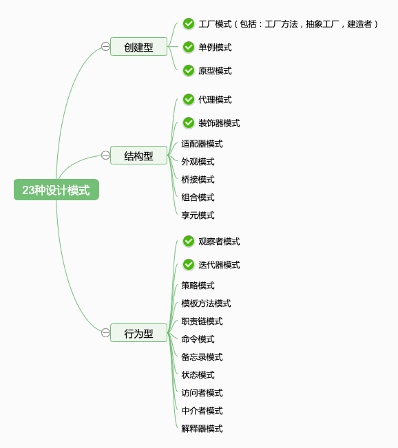

# 03-设计原则 - 设计模式只是套路，设计原则是指导思想

> 设计模式应该分开读：从设计到模式。因此先从基本的设计原则入手，引用《UNIX/Linux 设计哲学》一书来辅助讲解。然后再由设计过度到模式，介绍 23 种设计模式。

## 01：章介绍

### 主要内容

- SOLID 五大设计原则
- 介绍 23 种设计模式，以及前端常用设计模式
- Unix/Linux 设计哲学

### 学习方法

- 尝试理解设计的价值
- 分开理解“设计”和“模式”
- 重点关注开放封闭原则

### 注意事项

- 只需要掌握前端常用的设计模式即可，不需要掌握所有的
- 设计原则如果理解不了，那就记录下来背诵，下文而后化

## 02：设计原则

### 感性与理性

- 设计原则和设计模式都不难理解，它们是“讲道理”的。
- 因为：计算机越偏向底层就越简单、执拗、越傻（如必须使用二进制，不使用十进制），因为其本质是电子 + 数学。
- 而越偏向于高层或者表层就要越聪明，越任性（如 java 语言，设计原则），因为其本质是应对变化和需求。
- 但这个道理一定是**理性**的：
- 感性和理性永远是一对矛盾。感性喜欢宣传“多快好省”，但理性就需要思考如何具体实现，以及低成本的运作和维护（全流程）。
- 俗话说“书生误国”，文科生喜欢夸夸其谈，说理想，说结果，但从不考虑如何实现，以及如何监控、运维。
- 设计原则，设计模式，乃至整个软件工程，都是基于纯理性的思考。

### 五大设计原则

- S 单一职责原则
- O 开放封闭原则
- L 李氏置换原则
- I 接口独立原则
- D 依赖导致原则

### S: 单一职责原则

一个程序只做好一件事，如果功能过于复杂就拆分开，每个部分保持独立。

### O: 开放封闭原则(最重要)

- 对修改封闭
- 对扩展开放，**这是软件设计的终极目标**

即要设计一种机制，当需求发生变化时，根据这种机制扩展代码，而不是修改原有的代码。

### L: 李氏置换原则

- 子类能覆盖父类
- 父类能出现的地方子类就能出现
- **前端应用较少**

### I: 接口隔离原则

- 保持接口的单一独立，避免出现“胖接口”。
- 类似于单一职责原则，只不过前者说的比较统一，后者是单独对接口的规定。JS 中没有接口，因此体现较少。

### D: 依赖倒置原则

- 面向接口编程，依赖于抽象而不依赖于具体。
- 写代码时用到具体类时，不与具体类交互，而与具体类的上层接口交互。

```ts
function fn(p: Student) {} // 依赖具体的类
function fn(p: IPerson) {} // 依赖接口
```

### 举例说明

以常见的 Promise 来解释一下前两个原则。

```ts
// 加载图片
function loadImg(src: string) {
  const promise = new Promise((resolve, reject) => {
    const img = document.createElement('img')
    img.onload = () => {
      resolve(img)
    }
    img.onerror = () => {
      reject('图片加载失败')
    }
    img.src = src
  })
  return promise
}

const src = 'https://www.imooc.com/static/img/index/logo_new.png'

const result = loadImg(src)
result
  .then((img: HTMLImageElement) => {
    console.log('img.width', img.width)
    return img
  })
  .then((img: HTMLImageElement) => {
    console.log('img.height', img.height)
  })
  .catch((err) => {
    console.log(err)
  })
```

- 单一职责原则：每个`then`中的逻辑只做好一件事，如果要做多个就用多个`then`
- 开放封闭原则：如果这个需求要修改，那去扩展`then`即可，现有的逻辑不用修改，即对扩展开放、对修改封闭

这里引申两点：

- 其实 S 和 O 是相符现成的，相互依赖
- 开放封闭原则的好处不止于此，从整个软件开发流程看，减少现有逻辑的更改，也会减少测试的成本

### 总结

- 设计模式是***理性***的，“讲道理”的
- SOLID 五大设计原则
- 重点理解前两个 S 和 O

## 03: UNIX Linux 设计哲学
* 大型复杂的系统，才能体现出设计的价值。操作系统是这个世界上最复杂的系统之一，他的设计思路值得我们学习。

* 按我的理解，通俗来说，设计（仅指编程设计）就是按照哪一种思路或者标准来实现功能。同样的功能，不同的设计思想都能用不同的方式来实现，前期效果可能一样，但是随着产品功能的增加和扩展，设计的作用才会慢慢的显示出来。

结合《UNIX/Linux 设计哲学》中提到的系统设计原则 https://github.com/wangfupeng1988/read-notes/blob/master/book/Linux-Unix%E8%AE%BE%E8%AE%A1%E6%80%9D%E6%83%B3.md 。可能有一些会跟传统思想有区别，但是请你重视它们。

- 准则1：小即是美
- 准则2：让每个程序只做好一件事
- 准则3：快速建立原型
- 准则4：舍弃高效率，而更关注可移植性和扩展性
- 准则5：采用纯文本来存储数据
- 准则6：充分利用软件的杠杆效应（软件复用，代码复用）
- 准则7：使用 shell 脚本来提高杠杆效应和可移植性
- 准则8：避免强制性的用户界面
- 准则9：让每个程序都称为过滤器
- 十条小准则
    - 允许用户定制环境
    - 尽量使操作系统内核小而轻量化
    - 使用小写字母并尽量简短
    - 保护树木
    - 沉默是金
    - 并行思考
    - 各部分之和大于整体
    - 寻求 90% 的解决方案
    - 更坏就是更好
    - 层次化思考

无论你现在能否理解以上这些准则，我都希望你每隔一段时间（如半年）都重新自省一下，看自己结合自己的工作经历，是否又加深了这些准则的理解。
## 04: 介绍 23 种设计模式

### 从设计到模式

“设计”和“模式”两个词应该分开读，先有设计，后有模式。
- 设计：即设计原则，设计思想
- 模式：前辈总结出来的固定的套路
- 1995 年《设计模式：可复用面向对象软件的基础》23 种设计模式

### 设计的价值

* 从需求到设计，从设计到开发
* 为何需要设计？？
  * 因为软件规模变大，甚至是一个系统集群，需要先设计，后开发，否则就乱掉
* 为何需要模式？
  * 可套用前人经验，降低设计和沟通的成本

### 23 种设计模式

- 创建型模式
    - **工厂模式**（包括：工厂方法模式，抽象工厂模式，建造者模式）
    - **单例模式**
    - **原型模式**
- 结构型模式
    - 适配器模式
    - **装饰器模式**
    - **代理模式**
    - 外观模式
    - 桥接模式
    - 组合模式
    - 享元模式
- 行为型模式
    - 策略模式
    - 模板方法模式
    - **观察者模式**
    - **迭代器模式**
    - 职责连模式
    - 命令模式
    - 备忘录模式
    - 状态模式
    - 访问者模式
    - 中介者模式
    - 解释器模式


### 前端常用的设计模式

> 这就是课程的价值，帮你节省时间，直击重点，不盲目

1995 年还没有前端，所有当时的一些设计模式，并不完全适用于现在。而且，前后端也有区别。

所以，前端最常用的设计模式，就以下几个：
- 工厂模式
- 单例模式
- 原型模式
- 装饰器模式
- 代理模式
- 观察者模式
- 迭代器模式

要结合实际应用，把它们学精、学透彻，要明白 JS 是如何体现这些设计模式的。
让你学完了就忘不了（不常用的，学完就忘）

### 总结

- 从设计到模式
- 23 种设计模式
- 前端常用设计模式

## 05：章总结 

### 内容回顾

- S O L I D五大设计原则
- 介绍 23 种设计模式，以及前端常用设计模式
- Unix/Linux 设计哲学

### 重要细节

- **开放封闭原则**
- 学习工厂模式不必拆分为 3 种，按一种学习即可

### 注意事项

- 理解感性与理性
- 只需要掌握前端常用的设计模式即可，不需要掌握所有的
- 设计原则如果理解不了，不要停留，继续学习