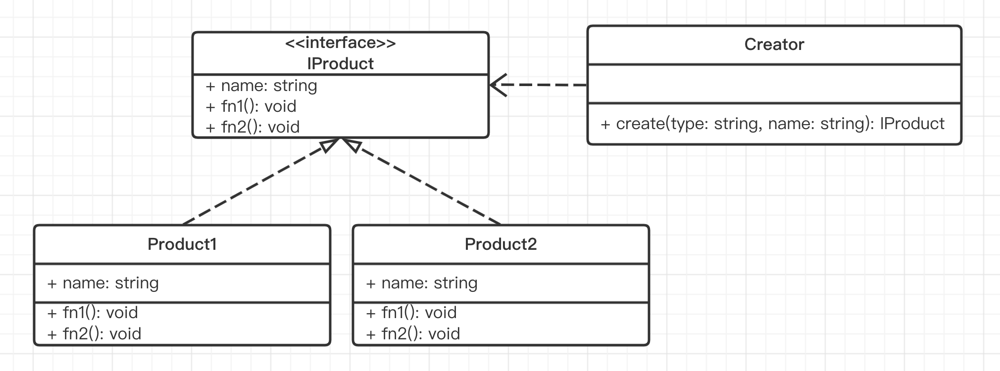

# 04-工厂模式 - 封装实例的创建过程，解放 Vue React 内部都在用

> 工厂模式是前端常用设计模式之一。本章将详细讲解工厂模式，从概念背景，到代码示例和 UML 类图，最后到它的具体使用场景。

## 01: 章介绍

### 主要内容

- 概念介绍 + 解决的问题
- UML 类图 + 代码演示
- 应用场景

### 学习方法

- UML 类图和代码结合理解
- 要结合使用场景

### 注意事项

- 遇到 `new class` 时，考虑工厂模式

## 02: 工厂模式介绍

> 创建对象的一种方式。不用每次都亲自创建对象，而是通过一个既定的“工厂”来生产对象。

### 示例

现在你要得到一个汉堡，你是跟服务员要（买）一个，还是自己动手做一个？这个问题，服务员就是工厂方法，而动手做一个其实就是`new A()`。

另外从快餐店考虑，你想要提供一个汉堡，是让服务员（工厂方法）做出来（`new A()`）给客户，还是让客户自己做一个汉堡？

从这个示例很容易理解工厂模式的用意，**所有的设计模式都是很讲道理的，很容易理解**

### 伪代码

OOP 中，默认创建对象一般是 `new class` ，但一些情况下用 `new class` 会很不方便。

```js
// 伪代码
// 不用工厂模式，自己做汉堡
let f1
class Foo {}

if (a) {
  f1 = new Foo(x)
}
if (b) {
  f1 = new Foo(x, y)
}
```

此时就需要一个“工厂”，把创建者和 class 分离，符合开放封闭原则。

```js
// 工厂
function create(a, b) {
  if (a) {
    f1 = new Foo(x)
  }
  if (b) {
    f1 = new Foo(x, y)
  }
  return f1
}

const f1 = create(a, b)
```

### 注意

工厂模式可以拆分为三个：

- 工厂方法模式

- 抽象工厂模式

- 建造者模式

前端用不到这么细致，只需要掌握核心的工厂模式即可。

## 03: 工厂模式代码演示和 UML 类图-简易版本

### 标准的工厂模式



```typescript
interface IProduct {
  name: string
  fn1: () => void
  fn2: () => void
}

class Product1 implements IProduct {
  name: string
  constructor(name: string) {
    this.name = name
  }
  fn1() {
    alert('product1 fn1')
  }
  fn2() {
    alert('product1 fn2')
  }
}

class Product2 implements IProduct {
  name: string
  constructor(name: string) {
    this.name = name
  }
  fn1() {
    alert('product2 fn1')
  }
  fn2() {
    alert('product2 fn2')
  }
}

class Creator {
  create(type: string, name: string): IProduct {
    if (type === 'p1') {
      return new Product1(name)
    }
    if (type === 'p2') {
      return new Product2(name)
    }
    throw new Error('Invalid type')
  }
}
```

### 简单的工厂模式


```ts
class Product {
  name: string
  constructor(name: string) {
    this.name = name
  }
  fn1() {
    alert('product fn1')
  }
  fn2() {
    alert('product fn2')
  }
}

class Creator {
  create(name: string): Product {
    return new Product(name)
  }
}
```

### 是否符合设计原则？

5 大设计原则中，最重要的就是：**开放封闭原则**，对扩展开放，对修改封闭

- 工厂和类分离，解耦
- 可以扩展多个类
- 工厂的创建逻辑也可以自由扩展

## 04：工厂模式的场景

### jQuery `$('div')`

```ts
// 扩展 window.$
declare interface Window {
  $: (selector: string) => JQuery
}

class JQuery {
  selector: string
  length: number

  constructor(selector: string) {
    const domList = Array.prototype.slice.call(
      document.querySelectorAll(selector),
    )
    const length = domList.length
    for (let i = 0; i < length; i++) {
      this[i] = domList[0]
    }

    this.selector = selector
    this.length = length
  }

  append(elem: HTMLElement): JQuery {
    // ...
    return this
  }

  addClass(key: string, value: string): JQuery {
    // ...
    return this
  }

  html(htmlStr: string): JQuery | string {
    if (htmlStr) {
      // set html
      return this
    } else {
      // get html
      const html = 'xxx'
      return html
    }
  }
}

window.$ = (selector) => {
  return new JQuery(selector)
}
```

做一个对比，如果开放给用户的不是`$`，然后让用户自己去`new JQuery(selector)`，带来的问题：

- 不方便链式操作，如`$('div').append($('#p1')).html()`
- 不宜将构造函数暴露给用户，尽量高内聚、低耦合

### Vue `_createElementVNode`

在线编译 https://vue-next-template-explorer.netlify.app/

```html
<div>
  <span>静态文字</span>
  <span :id="hello" class="bar">{{ msg }}</span>
</div>
```

会编译出很多 `_createXxx` JS 代码。这些就是工厂函数，创建 vnode 。

```js
export function render(_ctx, _cache, $props, $setup, $data, $options) {
  return (
    _openBlock(),
    _createElementBlock('div', null, [
      _createElementVNode('span', null, '静态文字'),
      _createElementVNode(
        'span',
        {
          id: _ctx.hello,
          class: 'bar',
        },
        _toDisplayString(_ctx.msg),
        9 /* TEXT, PROPS */,
        ['id'],
      ),
    ])
  )
}
```

PS：不了解 Vue 模板编译流程的，可以去参考课程 https://coding.imooc.com/class/419.html

### React `createElement`

在线编译 https://www.babeljs.cn/repl

在 React 中使用 JSX 语法

```jsx
const profile = (
  <div>
    
    <h3>{[user.firstName, user.lastName].join(' ')}</h3>
  </div>
)
```

这是一种语法糖，编译之后就会是

```javascript
// 返回 vnode
const profile = React.createElement(
  'div',
  null,
  React.createElement('img', { src: 'avatar.png', className: 'profile' }),
  React.createElement('h3', null, [user.firstName, user.lastName].join(' ')),
)
```

其实`React.createElement`也是一个工厂，模拟代码

```javascript
class Vnode(tag, attrs, children) {
    // ...省略内部代码...
}
React.createElement =  function (tag, attrs, children) {
    return new Vnode(tag, attrs, children)
}
```

PS：不了解 Vue 模板编译流程的，可以去参考课程 https://coding.imooc.com/class/419.html

### 总结

工厂模式在前端 JS 中应用非常广泛，随处可见

- jQuery `$`

- Vue `_createElementVNode`

- React `createElement`


## 05: 总结

 日常项目开发中，遇到 `new class` 的场景，要考虑是否可用工厂模式。

### 内容回顾

- 概念介绍 + 解决的问题
- UML 类图 + 代码演示
- 应用场景

### 重要细节

- TS 扩展 window 属性
- 对 vnode 的理解

### 注意事项

- 遇到 `new class` 时，考虑工厂模式