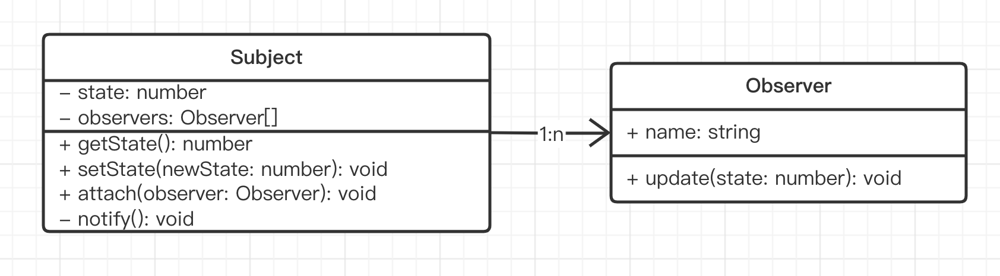

# 06-观察者模式

前端（及其他 UI 编程）最常用的设计模式，工作必用，面试必考

> 观察者模式是前端最常见的设计模式，也是其他 UI 编程最常用的编程模式。本章将详细讲解观察者模式，从概念背景，到代码示例和 UML 类图，最后到它的具体使用场景。此外，还要对比观察者模式和发布订阅模式，学完能让你一眼看出他们的区别。...

## 01: 章介绍

### 主要内容

- 概念介绍 + 解决的问题
- UML 类图和代码演示
- 场景
- 观察者模式 vs 发布订阅模式

### 学习方法

- 结合场景理解
- UML 要结合代码

### 注意事项

- 观察者模式很重要，本章内容较多，耐心学习
- 观察者模式场景很多，要抓住重点，不要拘泥细节

## 02-观察者模式-介绍

> 观察者模式是前端最常用的一个设计模式，也是 UI 编程最重要的思想。

### 示例

例如你在星巴克点了咖啡，此时你并不需要在吧台坐等，你只需要回到位子上玩手机，等咖啡好了服务员会叫你。不光叫你，其他人的咖啡好了，服务员也会叫他们来取。

还有，DOM 事件就是最常用的观察者模式

```html
<button id="btn1">btn</button>

<script>
  const $btn1 = $('#btn1')
  $btn1.click(function () {
    console.log(1)
  })
  $btn1.click(function () {
    console.log(2)
  })
  $btn1.click(function () {
    console.log(3)
  })
</script>
```

还有，Vue React 的生命周期，也是观察者模式


## 03: 观察者模式代码演示和 UML 类图

### UML 类图、代码演示

Subject 和 Observer 是**一对多**的关系



```typescript
// 主题
class Subject {
  private state: number = 0
  private observers: Observer[] = []

  getState(): number {
    return this.state
  }

  setState(newState: number) {
    this.state = newState
    this.notify()
  }

  // 添加观察者
  attach(observer: Observer) {
    this.observers.push(observer)
  }

  // 通知所有观察者
  private notify() {
    for (const observer of this.observers) {
      observer.update(this.state)
    }
  }
}

// 观察者
class Observer {
  name: string
  constructor(name: string) {
    this.name = name
  }
  update(state: number) {
    console.log(`${this.name} update, state is ${state}`)
  }
}

const sub = new Subject()
const observer1 = new Observer('A')
sub.attach(observer1)
const observer2 = new Observer('B')
sub.attach(observer2)

sub.setState(1) // 更新状态，触发观察者 update
```

### 是否符合设计原则？

5 大设计原则中，最重要的就是：**开放封闭原则**，对扩展开放，对修改封闭

- Observer 和 Subject **分离，解耦**
- Observer 可自由扩展
- Subject 可自由扩展

## 04: 观察者模式-场景

> 观察者模式在前端（包括其他 UI 编程领域）应用非常广泛。

### DOM 事件

```html
<button id="btn1">btn</button>

<script>
  const $btn1 = $('#btn1')
  $btn1.click(function () {
    console.log(1)
  })
  $btn1.click(function () {
    console.log(2)
  })
</script>
```

### Vue React 组件生命周期

**PS: 当你开发自己的 lib 时，也要考虑它的完整生命周期，如 [wangEditor](https://www.wangeditor.com/v5/guide/editor-config.html#oncreated)，负责创建，也得复杂销毁。**


### Vue watch

```javascript
// Vue 组件配置
{
  data() {
    name: '双越'
  },
  watch: {
    name(newVal, val) {
      console.log(newValue, val)
    }
  }
}
```

**PS：面试题 watch 和 watchEffect 有什么区别？—— 请看我的面试课程**

### Vue 组件更新过程

**PS：React 组件更新过程不是这样的，它是通过 `setState` 主动触发的，而非响应式监听。**


### 各种异步的回调

#### 定时器

- setTimeout setInterval

#### Promise then 回调

- 参考之前 `loadImg` 代码

#### nodejs stream

```js
const fs = require('fs')
const readStream = fs.createReadStream('./data/file1.txt') // 读取文件的 stream

let length = 0
readStream.on('data', function (chunk) {
  length += chunk.toString().length
})
readStream.on('end', function () {
  console.log(length)
})
```

#### nodejs readline

```js
const readline = require('readline')
const fs = require('fs')

const rl = readline.createInterface({
  input: fs.createReadStream('./data/file1.txt'),
})

let lineNum = 0
rl.on('line', function (line) {
  lineNum++
})
rl.on('close', function () {
  console.log('lineNum', lineNum)
})
```

#### nodejs http server 回调

```js
const http = require('http')

function serverCallback(req, res) {
  console.log('get 请求不处理', req.url)
  res.end('hello')
}
http.createServer(serverCallback).listen(8081)
console.log('监听 8081 端口……')
```

### MutationObserver

- HTML 代码

  ```html
  <div id="container">
    <p>A</p>
    <p>B</p>
  </div>
  ```

- JS 代码

  ```typescript
  function callback(records: MutationRecord[], observer: MutationObserver) {
    for (let record of records) {
      console.log('record', record)
    }
  }
  const observer = new MutationObserver(callback)

  const containerElem = document.getElementById('container')
  const options = {
    attributes: true, // 监听属性变化
    attributeOldValue: true, // 变化之后，记录旧属性值
    childList: true, // 监听子节点变化（新增删除）
    characterData: true, // 监听节点内容或文本变化
    characterDataOldValue: true, // 变化之后，记录旧内容
    subtree: true, // 递归监听所有下级节点
  }

  // 开始监听
  observer.observe(containerElem!, options)

  // 停止监听
  // observer.disconnect()
  ```

### 总结

- DOM 事件
- 组件生命周期
- Vue 组件更新过程
- 各种异步回调
- MutationObserver

注意，这里没有自定义事件，这个会在“发布订阅模式”讲解。

## 05: 观察者模式 vs 发布订阅模式

### 发布订阅模式

> 发布订阅模式，没有在传统 23 种设计模式中，它是观察者模式的另一个版本。

- 不属于传统的 23 种设计模式
- 是观察者模式的另一种实现形式
- 实际工作中，不会区分的那么细致（但是学习要区分细致）

```js
// 绑定
event.on('event-key', () => {
  // 事件1
})
event.on('event-key', () => {
  // 事件2
})

// 触发执行
event.emit('event-key')
```

### 观察者模式 vs 发布订阅模式


### 区别

- 观察者模式

  - Subject 和 Observer 直接绑定，中间无媒介
  - 如 `addEventListener` 绑定事件

- 发布订阅模式

  - Publisher 和 Observer 相互不认识，中间有媒介
  - 如 `event` 自定义事件

- 小技巧：一个很明显的特点：发布订阅模式需要在代码中触发 `emit` ，而观察者模式没有 `emit`

### 场景

#### 自定义事件

- Vue2 本身就是一个 EvevntBus
- Vue3 不再自带 EventBus 功能，推荐使用 mitt
- 老牌 EventBus - eventEmitter

Vue2 实例本身就支持[自定义事件](https://v2.cn.vuejs.org/v2/api/#vm-on)，但 Vue3 不再支持。

Vue3 推荐使用 mitt ，轻量级 200 bytes ，文档 [https://github.com/developit/mitt](https://github.com/developit/mitt)

```ts
import mitt from 'mitt'

const emitter = mitt() // 单例

emitter.on('change', () => {
  console.log('change1')
})
emitter.on('change', () => {
  console.log('change2')
})

emitter.emit('change')
```

但是，mitt 没有 once ，需要可以使用 event-emitter [https://www.npmjs.com/package/event-emitter](https://www.npmjs.com/package/event-emitter)

```ts
import eventEmitter from 'event-emitter' // 还要安装 @types/event-emitter

const emitter = eventEmitter()

emitter.on('change', (value: string) => {
  console.log('change1', value)
})
emitter.on('change', (value: string) => {
  console.log('change2', value)
})
emitter.once('change', (value: string) => {
  console.log('change3', value)
})

emitter.emit('change', '张三')
emitter.emit('change', '李四')
```

#### postMessage 通讯

- 网页 和 iframe 的通讯
- 其他：多进程(nodejs Webworker)通讯，WebSocket 通讯等
- nodejs 多进程通讯
- WebWorker 通讯
- WebSocket 通讯

通过 `window.postMessage` 发送消息。注意第二个参数，可以限制域名，如发送敏感信息，要限制域名。

```js
// 父页面向 iframe 发送消息
window.iframe1.contentWindow.postMessage('hello', '*')

// iframe 向父页面发送消息
window.parent.postMessage('world', '*')
```

可监听 `message` 来接收消息。可使用 `event.origin` 来判断信息来源是否合法，可选择不接受。

```js
window.addEventListener('message', (event) => {
  console.log('origin', event.origin) // 通过 origin 判断是否来源合法
  console.log('child received', event.data)
})
```

### 注意事项

* 在 Vue 和 React 组件中使用，在组件销毁之前，要及时 off 自定义事件。否则可能会导致**内存泄漏**。

* 另，off 时要传入原来的函数，而不能是匿名函数。

### 总结

- 观察者模式 vs 发布订阅模式
- 发布订阅模式的场景：自定义事件
- 注意事项：及时 off
## 06: 总结

### 内容回归

- 概念介绍 + 解决的问题
- UML 类图和代码演示
- 场景
- 观察者模式 vs 发布订阅模式

### 重要细节

- Vue3 本身没有了自定义事件功能
- 组件销毁时及时 off 事件，防止内存泄漏

### 注意事项

- 观察者模式很重要，本章内容较多，耐心学习
- 观察者模式场景很多，要抓住重点，不要拘泥细节

另，观察者模式和发布订阅模式，本课程学习时区分明显，但在实际工作中并不会严格区分（减少沟通成本）
