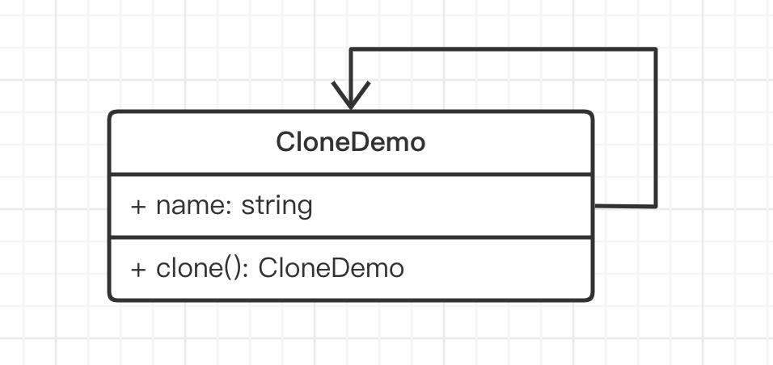
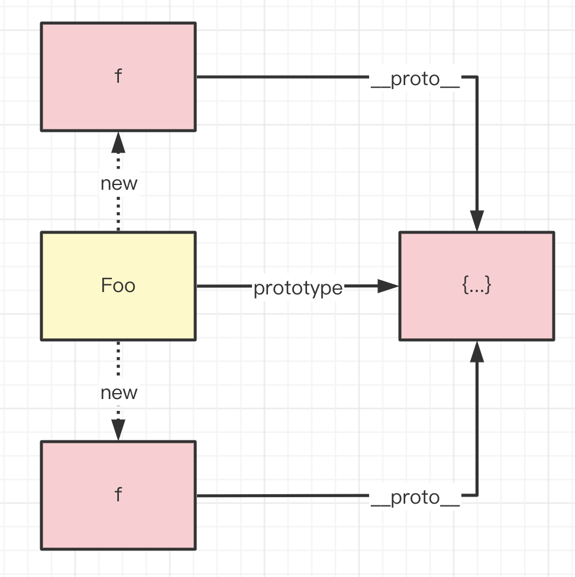
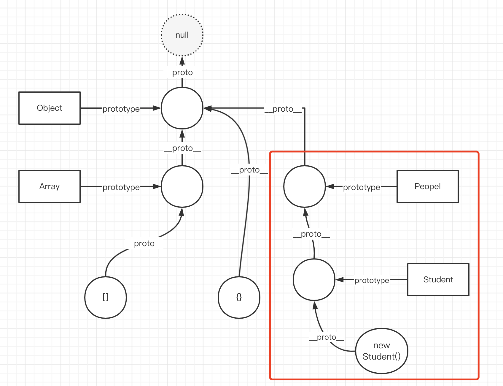

# 08- 原型模式

原型和原型链是 JS 必备的基础知识，还扩展了 JS 对象属性描述符

> JS 对象是基于原型的，原型和原型链是 JS 的基础知识。因此，原型模式也是我们必须要学习掌握的。本章将详细介绍原型模式，并配合 JS 原型和原型链一起理解。

## 01: 开始

### 主要内容

- 介绍和演示
- JS 原型和原型链
- JS 属性描述符

### 学习方法

- 结合使用场景学习
- UML 类图
- 原型链的图亲自画一遍

### 注意事项

- 原型模式不常用，但原型和原型链是 JS 的基础, 必须掌握
- 属性描述符日常不会直接使用，但它是理解对象属性的重要基础

## 02: 介绍

定义：用一个已经创建的实例作为原型，通过复制该原型对象来创建一个和原型相同或相似的新对象

传统的原型模式就是克隆，但这在 JS 中并不常用。



```ts
  name: string = 'clone demo'

  clone(): CloneDemo {
    return new CloneDemo()
  }
}
```

JS 中并不常用原型模式，但 JS 对象本身就是基于原型的，原型和原型链是非常重要的概念。

## 03: 原型和原型链

- 函数（class）都有显式原型 `prototype`
- 对象都有隐式原型 `__proto__`
- 对象 `__proto__` 指向其构造函数的 `prototype`

### 函数和显示原型 `prototype`

JS 中所有函数都有一个 `prototype` 属性。例如

- `Object.prototype`
- `Array.prototype`

自定义的函数也有

```ts
function Foo(name: string, age: number) {
  this.name = name
  this.age = age
}

Foo.prototype.getName = function () {
  return this.name
}

Foo.prototype.sayHi = function () {
  alert('hi')
}
```

### 对象和隐式原型 `__proto__`

#### 引用类型

JS 所有的引用类型对象都是通过函数创建的，都有 `__proto__` ，**指向其构造函数的 `prototype`**



```js
const obj = {} // 相当于 new Object()
obj.__proto__ === Object.prototype

const arr = [] // 相当于 new Array()
arr.__proto__ === Array.prototype

const f1 = new Foo('张三', 20)
f1.__proto__ === Foo.prototype
const f2 = new Foo('李四', 21)
f2.__proto__ === Foo.prototype
```

访问对象属性或 API 时，首先查找自身属性，然后查找它的 `__proto__`

```js
f1.name
f1.getName()
```

#### 值类型的 API

值类型没有 `__proto__` ，但它依然可访问 API 。因为 JS 会先将它包装为引用类型，然后触发 API

```js
const str = 'abc'
str.slice(0, 1) // 调用 String.prototype.slice
```

### 原型链

上文讲过，一个对象的 `__proto__` 指向它构造函数的 `prototype` ，**而 `prototype` 本身也是一个对象，也会指向它构造函数的 `prototype`** ，于是就形成了原型链。


### class 是函数的语法糖

class 和函数一样，也是基于原型实现的。

```ts
class Foo {
  name: string
  age: number
  constructor(name: string, age: number) {
    this.name = name
    this.age = age
  }
  getName() {
    return this.name
  }
  sayHi() {
    alert('hi')
  }
}

Foo.prototype

const f1 = new Foo('张三', 20)
f1.__proto__ = Foo.prototype
```

### 继承

```ts
class People {
  name: string
  age: number
  constructor(name: string, age: number) {
    this.name = name
    this.age = age
  }
  eat() {
    alert(`${this.name} eat something`)
  }
  speak() {
    alert(`My name is ${this.name}, age ${this.age}`)
  }
}

class Student extends People {
  school: string
  constructor(name: string, age: number, school: string) {
    super(name, age)
    this.school = school
  }
  study() {
    alert(`${this.name} study`)
  }
}

const s1 = new Student('aa', 20, 'xx')
s1.study()
s1.eat()
```



### 总结

- 函数或 class 都有 prototype
- 对象都有 `__proto__` 指向构造函数 prototype
- 原型链（图）和继承

PS：原型和原型链的范围非常广泛，遇到新问题可以在课程里提问。

## 04: 场景

最符合原型模式的应用场景就是 `Object.create` ，它可以指定原型。

### 演示

```js
const obj1 = {}
obj1.__proto__ // obj1.__proto__ === Object.prototype

const obj2 = Object.create({ x: 100 })
obj2.__proto__ // { x: 100 }
```

## 05: JS 对象属性描述符

> 用于描述对象属性的一些特性

- 获取和设置
- 有哪些属性描述符
- 原型属性的描述符

### 获取属性描述符

```ts
const obj = { x: 100 }
Object.getOwnPropertyDescriptor(obj, 'x')
// {value: 100, writable: true, enumerable: true, configurable: true}

// Object.getOwnPropertyDescriptors(obj)
```

### 设置属性描述符

```ts
Object.defineProperty(obj, 'y', {
  value: 200,
  writable: false,
  // 其他...

  // PS： 还可以定义 get set
})
```

使用 `Object.defineProperty` 定义新属性，属性描述符会默认为 false `{ configurable: false, enumerable: false, writable: false }`

而用 `{ x: 100 }` 字面量形式定义属性，属性描述符默认为 true

### 解释各个描述符

- value
- configurable
- writtable
- enumerable

#### value

- 属性值：值类型、引用类型、函数等

  ```js
  const obj = { x: 100 }
  Object.defineProperty(obj, 'x', {
    value: 101,
  })
  ```

- 如果没有 value ，则打印 obj 就看不到属性。
- 但可以通过 get set 来操作属性值

  ```js
  const obj = {}
  let x = 100
  Object.defineProperty(obj, 'x', {
    get() {
      return x
    },
    set(newValue) {
      x = newValue
    },
  })
  console.log(obj) // {}
  console.log(obj.x) // 100
  ```

#### configurable

- 是否可以通过 delete 删除, 并重新定义
- 是否可以修改其他属性描述符配置
- 是否可以修改 get set

  ```js
  const obj = { x: 100 }
  Object.defineProperty(obj, 'y', {
    value: 200,
    configurable: false, // false
  })
  Object.defineProperty(obj, 'z', {
    value: 300,
    configurable: true,
  })

  delete obj.y // 不成功, 返回 false

  // 重修修改 y 报错（而修改 z 就不报错）
  Object.defineProperty(obj, 'y', {
    value: 210,
  })
  ```

#### writable

- 属性是否可以被修改
- 对比 Object.freeze() "冻结"
- 对比 Object.seal() "密封"

  ```js
  const obj = { x: 100 }
  Object.defineProperty(obj, 'x', {
    writable: false,
  })
  obj.x = 101
  obj.x // 依然是 10
  ```

* `Object.freeze()` 冻结对象：

  - 1. 现有属性值**不可被修改**；
  - 2. 不可添加新属性；

  ```js
  const obj = { x: 100, y: 200 }
  Object.freeze(obj) // 冻结属性
  obj.x = 101
  obj.x // 100
  // Object.getOwnPropertyDescriptor(obj, 'x') // { configurable: false, writable: false }
  // obj.z = 300 // 不成功。不能再添加新属性
  Object.isFrozen(obj) // true
  ```

  PS：在 Vue 中，如果 data 中有比较大的对象，且不需要响应式，则可以使用 `Object.freeze()` 冻结来优化。

* 对比 `Object.seal()` 密封对象：

  - 1. 现有属性值**可以修改**；
  - 2. 不可添加新属性；

  ```js
  const obj = { x: 100, y: 200 }
  Object.seal(obj)
  Object.getOwnPropertyDescriptor(obj, 'x') // { configurable: false }
  obj.x = 101 // 成功
  // obj.z = 300 // 不成功。不能再添加新属性
  Object.isSealed(obj) // true
  ```

  PS：`Object.freeze()` 和 `Object.seal()` 是浅操作，不会递归下级属性

#### enumerable

- 是否可以通过 `for...in` 遍历到

  ```js
  const obj = { x: 100 }
  Object.defineProperty(obj, 'y', {
    value: 200,
    enumerable: false, // false
  })
  Object.defineProperty(obj, 'z', {
    value: 300,
    enumerable: true,
  })

  for (const key in obj) {
    console.log(key) // 'x' 'z'
  }

  // console.log('y' in obj) // true —— 只能限制 for...in 无法限制 in
  ```

  PS：对比 `for...in` 回顾 `for...of`

### 原型的属性描述符

- 在 N 年之前，使用 `for...in` 遍历对象时，需要用 `hasOwnProperty` 剔出原型属性，否则会把原型属性过滤出来。

  ```js
  const obj = { x: 100 }
  for (const key in obj) {
    if (obj.hasOwnProperty(key)) {
      console.log(key)
    }
  }
  ```

* 现在不用了，都是通过 `enumerable` 来判断

  ```js
  Object.getOwnPropertyDescriptor(obj.__proto__, 'toString')
  // { writable: true, enumerable: false, configurable: true, value: ƒ toString() }
  ```

* 如果修改原型属性的 `enumerable` ，也是可以通过 `for...in` 遍历出来的

  ```js
  const obj = { x: 100 }
  Object.defineProperty(obj.__proto__, 'toString', {
    // 提醒，这里用于教学，实际项目不要修改原型属性的描述符！
    enumerable: true,
  })
  for (const key in obj) {
    console.log(key)
  }

  // obj.hasOwnProperty('toString') // 依然是 false ，和 enumerable 没关系
  ```

* 还有，有些地方会修改函数的 prototype ，但却忽略了 `constructor` 的属性描述符。

  ```js
  function Foo() {}
  Foo.prototype = {
    constructor: Foo, // 需要设置 { enumerable: false } ，否则它的实例 for...in 会有 constructor
    fn1() {},
    fn2() {},
  }
  ```

### Symbol 类型

- Object 的 symbol 属性，即便 `enumerable: true` 也无法通过 `for...in` 遍历

  ```js
  const b = Symbol('b')
  const obj = { a: 100, [b]: 200 }
  for (const key in obj) {
    console.log(key)
  }

  // Object.getOwnPropertyDescriptor(obj, b) // enumerable: true
  ```

- 获取 Symbol 属性，可使用 `getOwnPropertySymbols` 或 `Reflect.ownKeys`

  ```js
  Object.keys(obj) // ['a']
  Object.getOwnPropertySymbols(obj) // [ b ]
  Reflect.ownKeys(obj) // ['a', b]
  ```

### 总结

- 获取属性描述符 Object.getOwnPropertyDescriptor
- 设置属性描述符 Object.defineProperty
- 各个属性描述符的作用
- enumerable 和 for...in
- for...in 和 for...of
- enumerable 和原型属性

## 06: 总结

### 内容回顾

- 介绍和演示
- JS 原型和原型链
- JS 属性描述符
- 应用场景

### 重要细节

- 原型和原型链（图）
- 属性描述符 writable 和 Object.freeze()
- 属性描述符 enumerable 和 for...in

### 注意事项

- 原型模式不常用，但原型和原型链是 JS 的基础，必须掌握
- 属性描述符日常不会直接使用，但它是理解对象属性的重要基础
