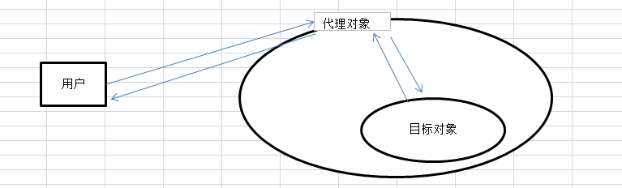

# 10-代理模式

无论开发环境还是线上环境，编程处处有代理

> 代理模式是前端常用的设计模式之一，Proxy 早已是 ES 的标准语法，Vue3 也使用 Proxy 实现数据响应式。本章将详细介绍代理模式，并配合 Proxy 语法和应用一起理解。

## 01: 开始

### 主要内容

- 概念介绍 + 解决了什么问题
- 代码演示和 UML 类图
- 使用场景和 Proxy 语法

### 学习方法

- UML 类图 结合代码理解
- 结合使用场景理解
- Proxy 代码手写一遍

### 注意事项

- 注意 Proxy 的几个坑（后面会讲到）

## 02：介绍

### 定义

为其他对象提供一种代理以**控制**对这个对象的访问。在直接访问对象时带来的问题，比如说：要访问的对象在远程的机器上。在面向对象系统中，有些对象由于某些原因（比如对象创建开销很大，或者某些操作需要安全控制，或者需要进程外的访问），直接访问会给使用者或者系统结构带来很多麻烦，我们可以在访问此对象时加上一个对此对象的访问层。



### 举例

例如，你通过房产中介买房子，中介就是一个代理。你接触到的是中介这个代理，而非真正的房主。

再例如，明星都有经纪人，某活动想请明星演出，需要对接经纪人。艺术家不方便谈钱，但可以和经纪人谈。经纪人就是一个代理。

### 03：演示


### 代码展示

```ts
class RealImg {
  fileName: string
  constructor(fileName: string) {
    this.fileName = fileName
    this.loadFromDist()
  }
  display() {
    console.log('display...', this.fileName)
  }
  private loadFromDist() {
    console.log('loading...', this.fileName)
  }
}

class ProxyImg {
  readImg: RealImg
  constructor(fileName: string) {
    this.readImg = new RealImg(fileName)
  }
  display() {
    this.readImg.display()
  }
}

const proxImg = new ProxyImg('xxx.png') // 使用代理
proxImg.display()
```

### 是否符合设计原则？

5 大设计原则中，最重要的就是：**开放封闭原则**，对扩展开放，对修改封闭

- 代理和目标分离，解耦
- 代理可自行扩展逻辑
- 目标也可自行扩展逻辑

## 04: 场景

### DOM 事件代理

- 事件绑定到父级 容器上，而非目标节点
- 适合目标较多或者数量不确定（如无限加载的瀑布流图片列表）
- 代码展示

  ```html
  <div id="div1">
    <a href="#">a1</a>
    <a href="#">a2</a>
    <a href="#">a3</a>
    <a href="#">a4</a>
  </div>
  <button>点击增加一个 a 标签</button>

  <script>
    var div1 = document.getElementById('div1')
    div1.addEventListener('click', function (e) {
      var target = e.target
      if (e.nodeName === 'A') {
        alert(target.innerHTML)
      }
    })
  </script>
  ```

### webpack devServer

- 开发环境，前端请求服务端 API
- 代理到本地服务器，或者 mock 接口
- 正向代理

* 第一，配置 webpack ，参考 https://webpack.docschina.org/configuration/dev-server/#devserverproxy

  ```js
  // webpack.config.js
  module.exports = {
    // 其他配置...
    devServer: {
      proxy: {
        '/api': 'http://localhost:8081',
      },
    },
  }
  ```

* 第二，启动 nodejs 服务，监听 `8081` 端口

* 第三，借用 axios 发送请求

  ```ts
  import axios from 'axios'

  document.getElementById('btn1')?.addEventListener('click', () => {
    axios.get('/api/info').then((res) => {
      console.log(res)
    })
  })
  ```

### nginx 反向代理

- nginx 配置文件可参考 https://www.runoob.com/w3cnote/nginx-setup-intro.html

  ```nginx
  server {
    listen 8000;
    location / {
      proxy_pass http://localhost:8001;
    }
    location /api/ {
      proxy_pass http://localhost:8002;
      proxy_set_header Host $host;
    }
  }
  ```

### 反向代理 vs 正向代理

[推荐文章链接:正向代理与反向代理的区别](https://juejin.cn/post/6844904064266960903)

- 正向代理需要你主动设置代理服务器 ip 或者域名进行访问，由设置的服务器 ip 或者域名去获取访问内容并返回；
- 反向代理不需要你做任何设置，直接访问服务器真实 ip 或者域名，但是服务器内部会自动根据访问内容进行跳转及内容返回，你不知道它最终访问的是哪些机器。

- 正向代理是代理客户端，为客户端收发请求，使真实客户端对服务器不可见；而反向代理是代理服务器端，为服务器收发请求，使真实服务器对客户端不可见。

- 从上面的描述也能看得出来正向代理和反向代理最关键的两点区别：
  - 是否指定目标服务器
  - 客户端是否要做设置 下面用一张图来表示两者的差异：
  - 

### Proxy

Vue3 就使用 Proxy 做 data 响应式

```ts
// 明星
const star = {
  name: '张三',
  age: 25,
  phone: '18611112222',
  price: 0, // 艺术物价，明星不谈钱
}

// 经纪人
const agent = new Proxy(star, {
  get(target, key) {
    if (key === 'phone') {
      return '13900001111' // 返回经纪人的的电话
    }
    if (key === 'price') {
      return 100 * 1000 // 报价
    }
    return Reflect.get(target, key) // 返回原来的属性值
  },
  set(target, key, val): boolean {
    if (key === 'price') {
      if (val < 100 * 1000) {
        throw new Error('价格太低了...')
      } else {
        console.log('报价成功，合作愉快！', val)
        return Reflect.set(target, key, val)
      }
    }
    // 其他属性不可设置
    return false
  },
})

// 主办方
console.log(agent.name)
console.log(agent.age)
console.log(agent.phone)
console.log(agent.price)
// agent.price = 90000 // 价格低了会报错
```

### 总结

- DOM 事件代理
- webpack-dev-server 代理
- nginx 反向代理
- Proxy

## 05: Proxy 的使用场景

### 跟踪属性访问

Vue3 就是通过这个特性实现数据响应式

```ts
const user = {
  name: '张三',
}
const proxy = new Proxy(user, {
  get(target, key) {
    console.log('get...')
    return Reflect.get(target, key)
  },
  // get(...args) {
  //     return Reflect.get(...args)
  // },
  set(target, key, val) {
    console.log('set...', val)
    return Reflect.set(target, key, val)
  },
})

proxy.name = '李四'
console.log(proxy.name)
```

### 隐藏属性

```ts
const hiddenProps = ['girlfriend'] // 要隐藏的属性 key
const user = {
  name: '张三',
  age: 25,
  girlfriend: '小红',
}
const proxy = new Proxy(user, {
  get(target, key) {
    if (hiddenProps.includes(key as string)) return undefined
    return Reflect.get(target, key)
  },
  has(target, key) {
    if (hiddenProps.includes(key as string)) return false
    return Reflect.has(target, key)
  },
  set(target, key, val) {
    if (hiddenProps.includes(key as string)) return false
    console.log('set...', val)
    return Reflect.set(target, key, val)
  },
})

console.log('age', proxy.age)
console.log('girlfriend', proxy.girlfriend) // undefined
console.log('girlfriend' in proxy) // false
```

### 验证属性

如果用 TS ，会有静态类型检查，用不到这个验证。用 JS 的话会有效果。

以下代码可以在浏览器中运行（非 TS 环境）

```ts
const user = {
  name: '张三',
  age: 25,
}
const proxy = new Proxy(user, {
  get(target, key) {
    return Reflect.get(target, key)
  },
  set(target, key, val) {
    if (key === 'age') {
      if (typeof val !== 'number') return false // 验证 age 类型
    }
    return Reflect.set(target, key, val)
  },
})

proxy.age = 'a'
console.log(proxy.age) // 25
```

### 记录实例

```ts
const userList = new WeakSet() // 每次初始化 user ，都记录到这里

class User {
  name: string
  constructor(name: string) {
    this.name = name
  }
}

const ProxyUser = new Proxy(User, {
  construct(...args) {
    const user = Reflect.construct(...args)
    userList.add(user) // 记录 user 对象
    return user
  },
})

const user1 = new ProxyUser('张三')
const user2 = new ProxyUser('李四')
console.log('userList', userList)
```

### Proxy 适用场景：总结

- 跟踪属性访问 get set
- 隐藏属性
- 验证属性
- 记录实例

## 06: Proxy 可能遇到的坑

### 捕获器不变式

> 这是“红宝书”里的叫法。捕获器即 get，不变式即不能因为 Proxy 而改变对象本身的描述符特性。

```ts
const obj = { x: 100, y: 0 }
Object.defineProperty(obj, 'y', {
  value: 200,
  writable: false,
  configurable: false,
})
const proxy = new Proxy(obj, {
  get() {
    return 'abc'
  },
})

console.log(proxy.x)
console.log(proxy.y) // y 属性描述符被修改，proxy 不能修改它的值
```

### this

函数里的 this 是由执行时确认的，而非定义时。

```ts
const user = {
  name: '张三',
  getName() {
    console.log('this...', this)
    return this.name
  },
}

const proxy = new Proxy(user, {})

user.getName() // 执行时 this 是 user
proxy.getName() // 执行时 this 是 proxy
```

### 总结

- 捕获器不变式
- this

## 07: 总结

### 内容回顾

- 概念介绍 + 解决了什么问题
- 代码演示和 UML 类图
- 使用场景和 Proxy 语法

### 重要细节

- Proxy 使用场景
- Proxy 注意事项

### 注意事项

- Proxy 注意事项
