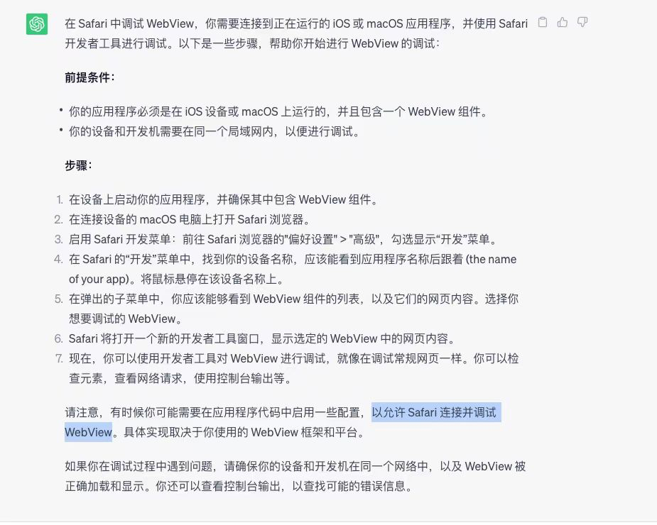

# 03-场景三：开发如剑，测试如具，调试如诊

## 01: 三类真机调试技巧

### 真机调试总结

* chrome + Android / Safari + iOS



* Fiddler/Charles
* vConsole, Weinre, Spy-Debugger

## 02：如何调试Webpack？如何配置VSCode调试？ 

* 使用命令

  ```json
  {
    "script": {
      "webpack:debug": "node --inspect-brk ./nodule_modules/.bin/webpack --inline --progress"
    }
  }
  ```

* 配置 VScode 调试，需要新建 launch.json 文件

  * [如何在vscode内调试js ](https://www.cnblogs.com/yalong/p/15670527.html)

## 03：接口测试必会的Mock接口&平台介绍 

### 什么是 mock 数据

> mock翻译过来是‘模拟’的意思，也就是模拟接口返回的信息，用已有的信息替换接口返回的信息，从而提供仿真环境，实现模拟数据下的功能测试；

* 模拟真实接口
  * 实现效率开发，前后台同步，特别是分布式的系统
* 虚拟业务场景
  * 某些业务场景非常难触发，还有一些异常逻辑，交互逻辑
* 压力测试

### Mock 数据工具

* [YApi](https://yapi.pro/)
* [Easy Mock](https://mock.presstime.cn/login)
* [DocLever](http://doclever.cn/controller/index/index.html)
* [fast Mock](https://www.fastmock.site/#/)

### Mock.js 简介

> [http://mockjs.com/](http://mockjs.com/)

* 安装 & 起步
* 语法规范
* 常用方法及使用

## 04：【编程任务】Mock一个数据结构的接口


