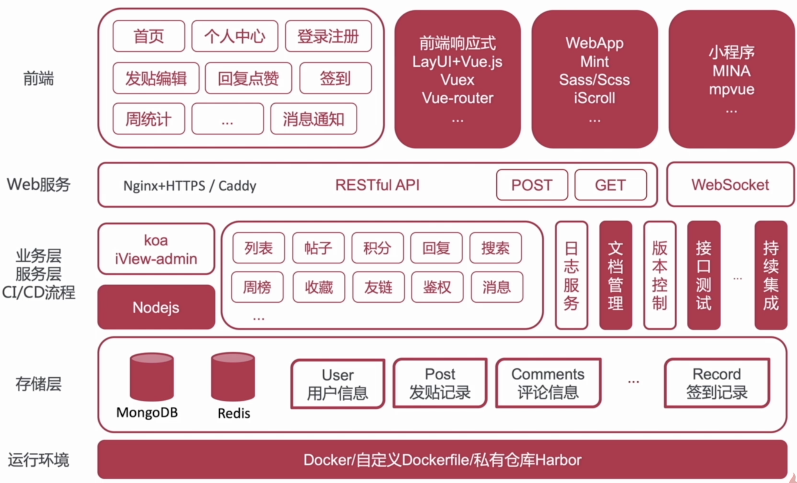

# 06：场景六：多端、跨端应用该何去何从

## 01: 多端应用需求分析难点解析

### PC 端需求分析

* 内容展示
* 回复/点赞
* **积分与用户体系**

### 服务端需求分析

* 用户、权限管理
* 内容管理、首页管理
* 其他功能（日志、多语言等）

### WebApp/小程序的需求分析

* 主题功能
* 技术实现/交互体验
* 用户数据与流量入口

### 原型设计

## 02: 多应用场景应用技术栈考量

### 技术栈考量

* 团队技术实例与业务需求结合
* 能够复用，坚决不造轮子；需要造轮子，坚决不牵强
* **怎么简单怎么来，多考虑时间、进度、质量因素**

## 03 课程后续服务及 前端技术展望

### 技术展望

* TypeScript 普及，Vue3.x 的到来
* 跨端能力增强：Flutter、Electron、Taro、Uniapp
* GraphQL 落地实践
* ServerLess 让前端更加专注于业务
* **中后台的发展对模块化、标准化、工程化提出了更高的要求**
* 数据可视化

