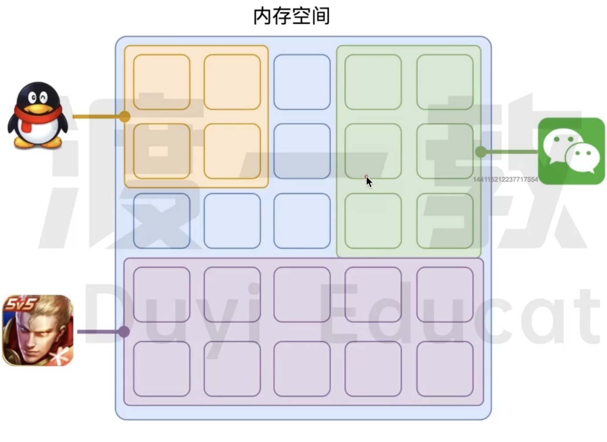
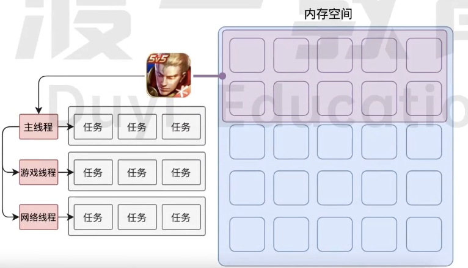
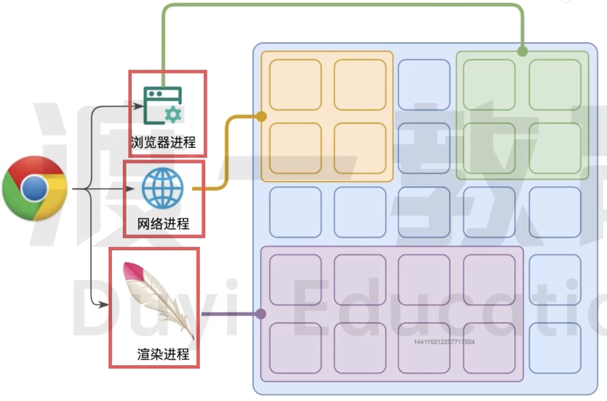
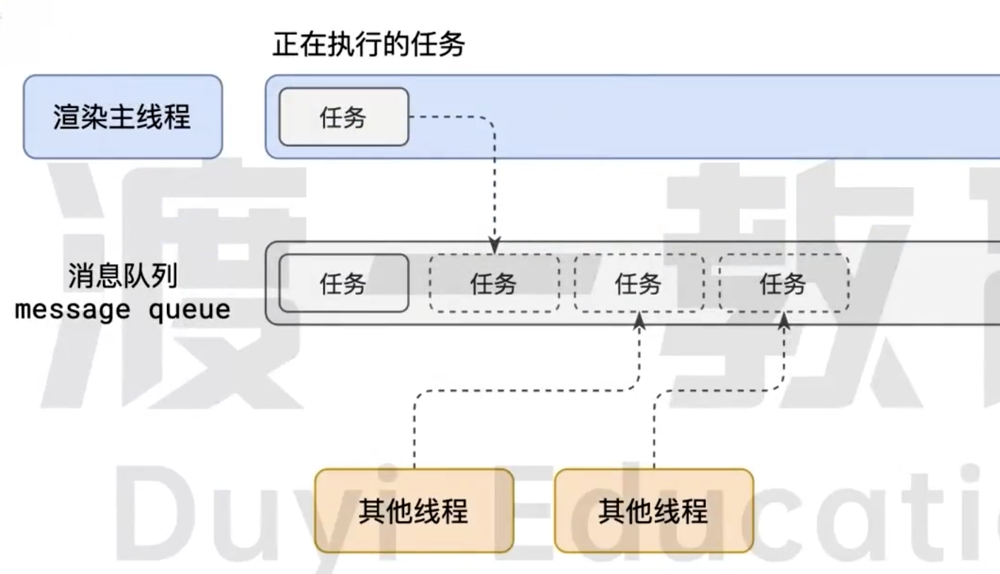

# 01-原理-事件循环

## 浏览器的进程模型

### 何为进程？

进程运行需要它自己专属的内存空间，可以把这块内存空间简单的理解为进程



每一个应用至少有一个进程，进程之间相互独立，**即使要通信，也需要双方同意**。

### 何为线程？

有了进程后，就可以运行程序的代码了。

运行代码的【人】称为【线程】

一个进程至少有一个线程，所以在线程开启后自动创建一个线程来运行代码，该线程称之为主线程。

如果程序需要同时执行多块代码，主进程就会启动更多的线程来执行代码，所以一个进程中可以包含多个线程。



### 浏览器有哪些进程和线程？

**浏览器是一个多进程多线程的应用程序**

浏览器内部工作及其复杂

为了避免相互影响，为了减少连环崩溃的几率，当启动浏览器后，它会自动启动多个进程。（不止下图的三个，只是我们比较关心这几个）



> 可以在浏览器的任务管理器中查看所有的进程

其中，主要的进程有

1. 浏览器进程

   主要负责界面显示、用户交互、子进程管理等。浏览器进程内部会启动多个线程处理不同的任务

2. 网络进程

   负责加载网络资源。网络进程内部会启动多个线程来处理不同的网络任务

3. **渲染进程**-本节课重点讲解的进程

   渲染进程启动后，会开启一个**渲染主进程**，主线程负责执行 HTML、CSS、JS 代码

   默认情况下，浏览器会为每一个标签页开启一个新的渲染进程，以保证不同的标签页之间不相互影响

   > 将来该默认模式可能会有所改变，有兴趣的同学可以参见[chrome官方说明文档](https://chromium.googlesource.com/chromium/src/+/main/docs/process_model_and_site_isolation.md#Modes-and-Availability)

## 渲染主线程是如何工作的？

渲染主线程是浏览器中最繁忙的线程，需要它处理的任务包括但不限于：

* 解析 HTML
* 解析 CSS
* 计算样式
* 布局
* 处理图层
* 每秒把页面画 60 次
* 执行全局 js 代码
* 执行事件处理函数
* 执行计时器的回调函数
* 。。。

> 思考题：为什么渲染进程不适用多个线程来处理这件事情？

要处理这么多的任务，主线程遇到了一个前所未有的难题：如何调度任务？

比如：

* 我正在执行一个 JS 函数，执行到一半的时候用户点击了按钮，我该立即去执行点击事件的处理函数吗？
* 我正在执行一个 JS 函数，执行到一半的时候某个计时器到达了时间，我该立即去执行它的回调？
* 浏览器进程通知我“用户点击了按钮”，与此同时，某个计时器也到达了时间，我应该处理哪一个呢？
* 。。。

渲染主线程想出来了一个绝妙的主意来处理这个问题：排队



1. 最开始的时候，渲染主线程会进入一个无限循环

   ```c
   for(;;){
     
   }
   ```

2. 每一次循环都会检查消息队列中是否有任务存在。如果有，就取出一个任务执行，执行完一个后进入下一次循环；如果没有，则进入休眠状态。

3. 其他所有线程（包括其他进程的线程）可以随时向消息队列中添加任务。新任务会增加到消息队列的末尾，在添加新任务时，如果主线程是休眠状态，则会将其唤醒以继续循环拿取任务

这样一来，就可以让每个任务有条不紊的、持续的进行下去了

**整个过程，被称之为事件循环 Event Loop（消息循环 message loop)**

## 若干解释

41:16

### 何为异步？

### JS 为何会阻塞渲染？

### 任务有优先级吗？
