# 02-原理-浏览器渲染原理

> 可以简单的理解渲染，是输入一段 HTML 字符串，然后根据一套及其复杂的工序，环环相扣，精密的配合，输出一个大对象的过程。这个对象包括每一个像素点的位置、颜色等

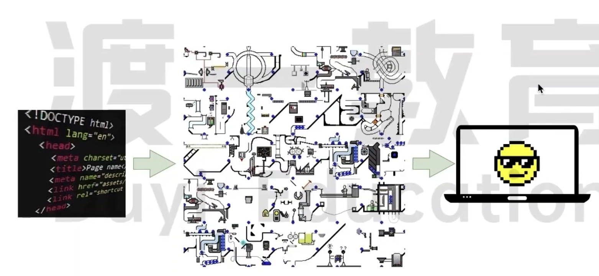

## 浏览器是如何渲染页面的？

当浏览器的网络进程收到 HTML 文档后，会产生一个渲染任务，并将其传递给渲染主进程的消息队列。

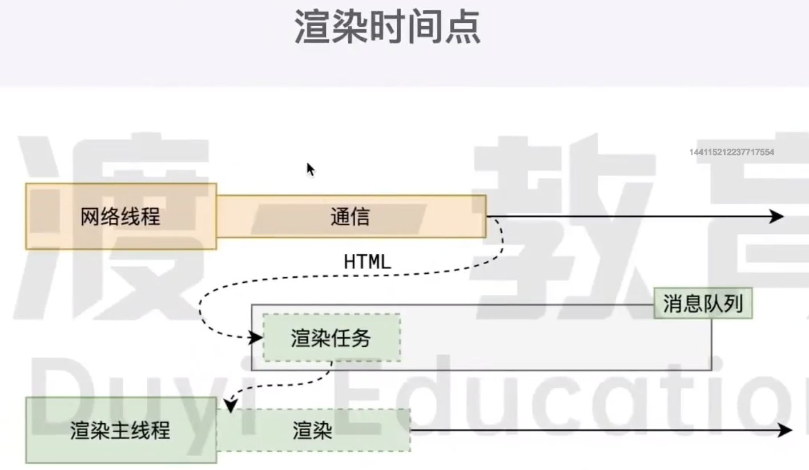

在**事件循环机制**的作用下，渲染主进程取出消息队列中的渲染任务，开启渲染流程

---

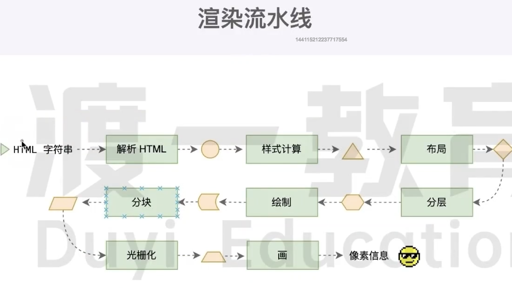

整个渲染流程分为多个阶段，分别是：`HTML` 解析、样式计算、分层、绘制、分块、光栅化、绘画

每个阶段都有明确的输入输出，上一个阶段的输出会成为下一个阶段的输入

这样，整个渲染流程形成了一套组织严密的生产流水线

---

渲染的第一步就是 **解析 HTML**

> 主要的过程就是 根据一段 HTML 字符串，得到一个 DOM（Document Object Model）树和 CSSOM（CSS Object Model）树

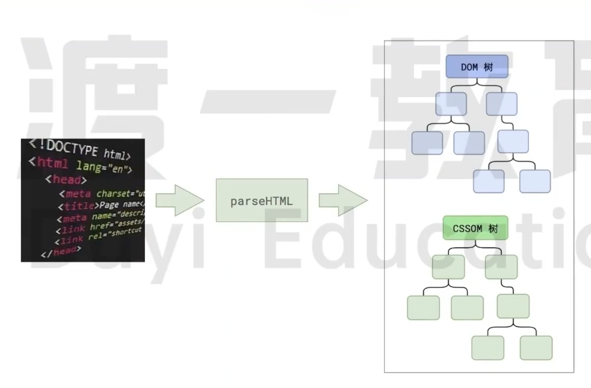

解析过程中遇到 `CSS` 解析 `CSS`，遇到 `JS` 执行 `JS`。为了提高解析效率，浏览器在开始解析前，会启动一个**预解析**的线程，率先下载 `HTML` 中外部的 `CSS` 文件和 外部的 `JS` 文件

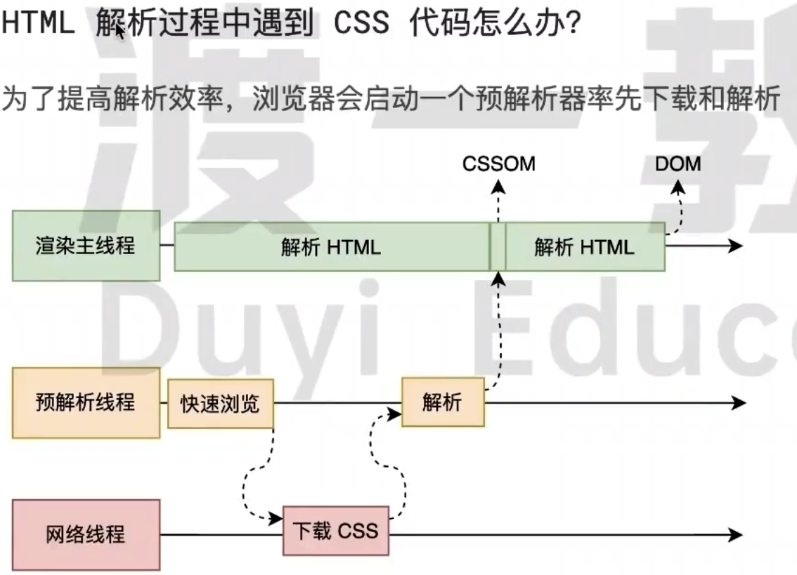

如果主线程解析到 `Link` 位置，此时外部的 `CSS` 文件还没有下载解析好，主线程不会等待，继续解析后续的 `HTML`。这是以为下载和解析 `CSS` 的工作是在预解析线程中进行的。这就是 `CSS` 不会阻塞 `HTML` 解析的根本原因

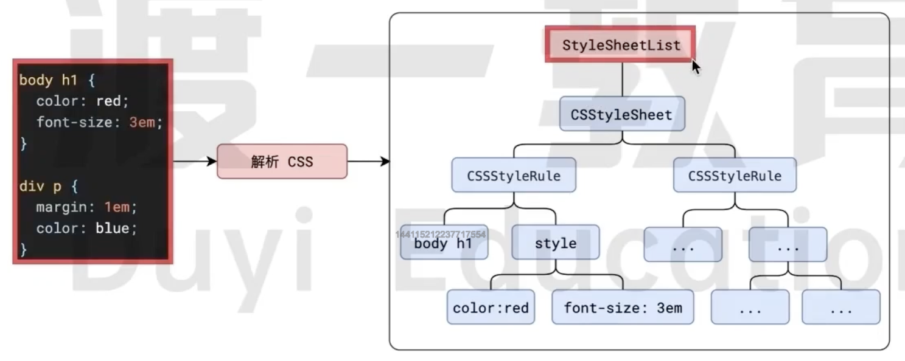

如果主线程解析到 `script` 位置，会停止解析 `HTML`，转而等到 `JS` 文件下载好，并将全局代码解析执行完成后，才能继续解析 `HTML`。这是因为 `JS` 代码的执行过程中可能会修改当前的 `DOM` 树，所以 `DOM` 树的生成必须暂停。这就是 `JS` 会阻塞 `HTML` 解析的根本原因

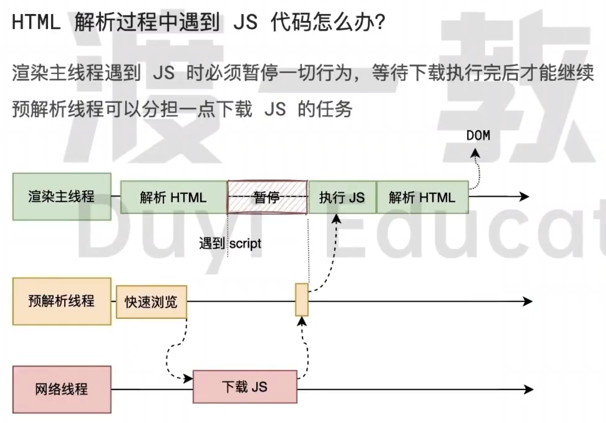

第一步完成后，会得到 `DOM` 和 `CSSOM` 树，浏览器的默认样式、内部样式、外部样式、行内样式均包含在 `CSSOM` 树中。

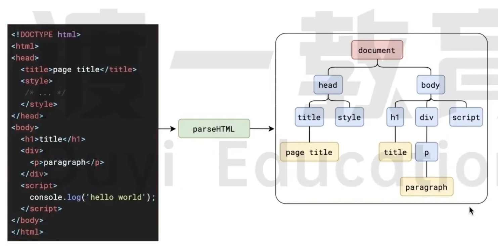

---

渲染的下一步就是 **样式计算**（Recalculate Style）

主线程会遍历得到的 **DOM** 树，依次为树中的每个节点算出它最终的样式，称之为 **Computed Style**.

在这一过程中，很多预设值会变成绝对值，比如 `red` 会变成 `rgba(255,0,0)`; 相对单位会变为绝对单位，比如 `em` 会变成 `px`

这一步完成后，会得到一棵带有样式的 `DOM` 树

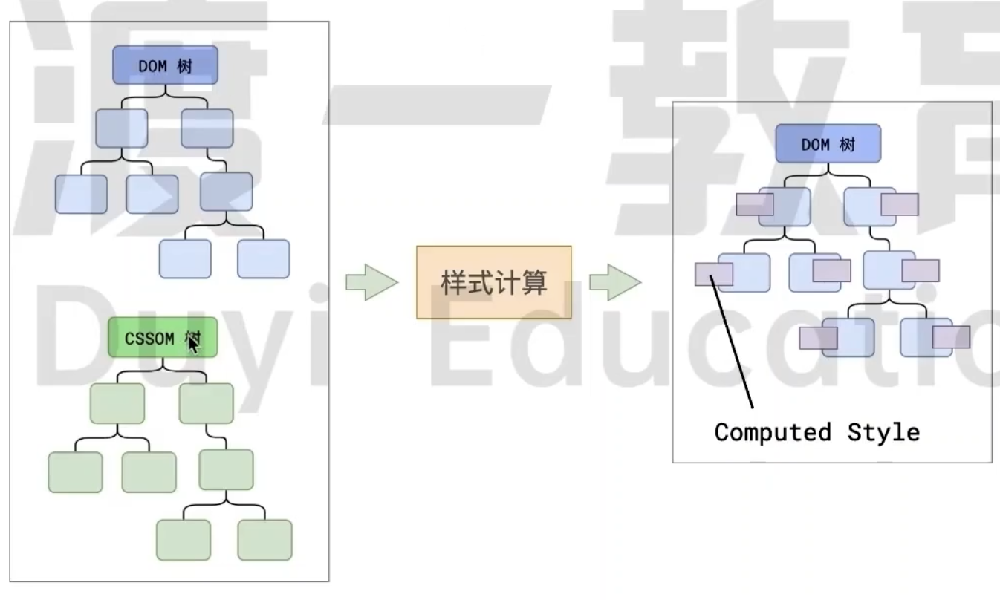

---

接下来是 **布局**（Layout），布局完成后会得到布局树

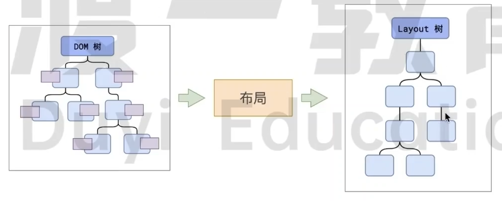

布局阶段会依次遍历 DOM 树的每一个节点，计算每个节点的几何信息。比如节点的宽度、**相对包含块**的位置。

大部分时候，DOM 树和 布局树并非一一对应

比如`display: none` 的节点没有几何信息，因此不会生成到布局树；又比如使用了伪元素选择器，虽然 DOM 树中不存在这些伪元素节点，但它们拥有几何信息，所以会生成到布局树中。还有匿名行盒、匿名块盒等等都会导致 DOM 树和布局树无法一一对应。

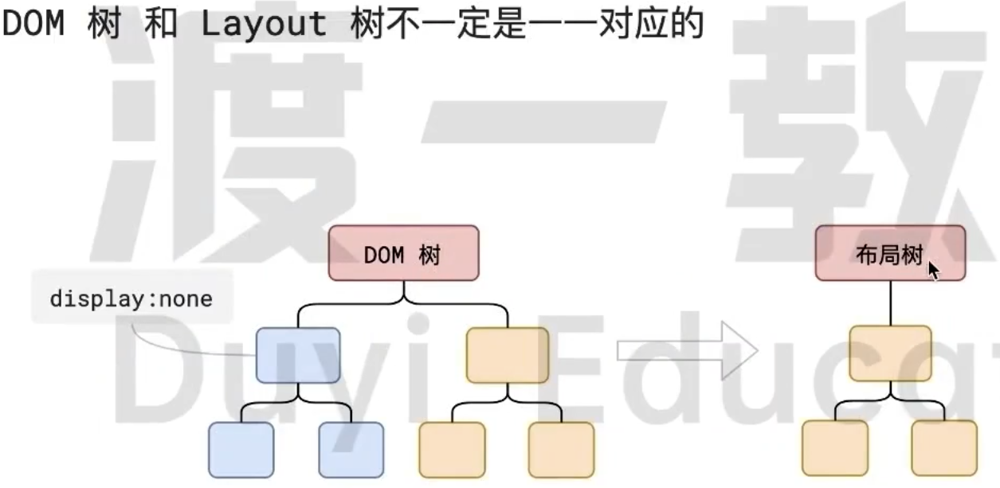

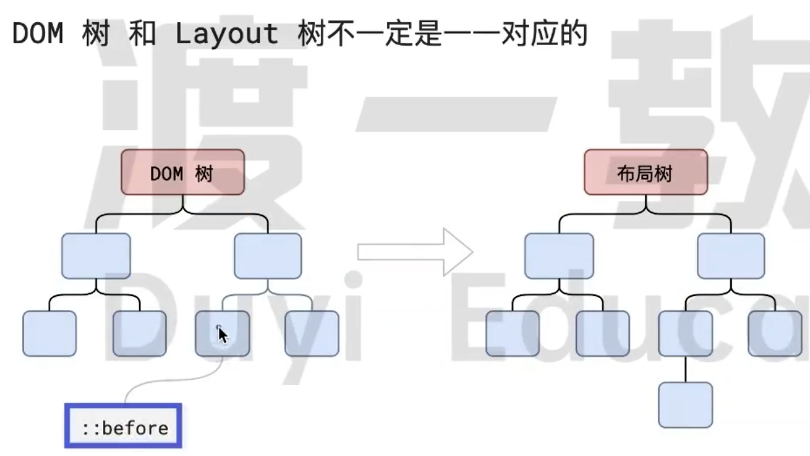

行盒盒块盒不能相邻，否则会增加匿名行盒

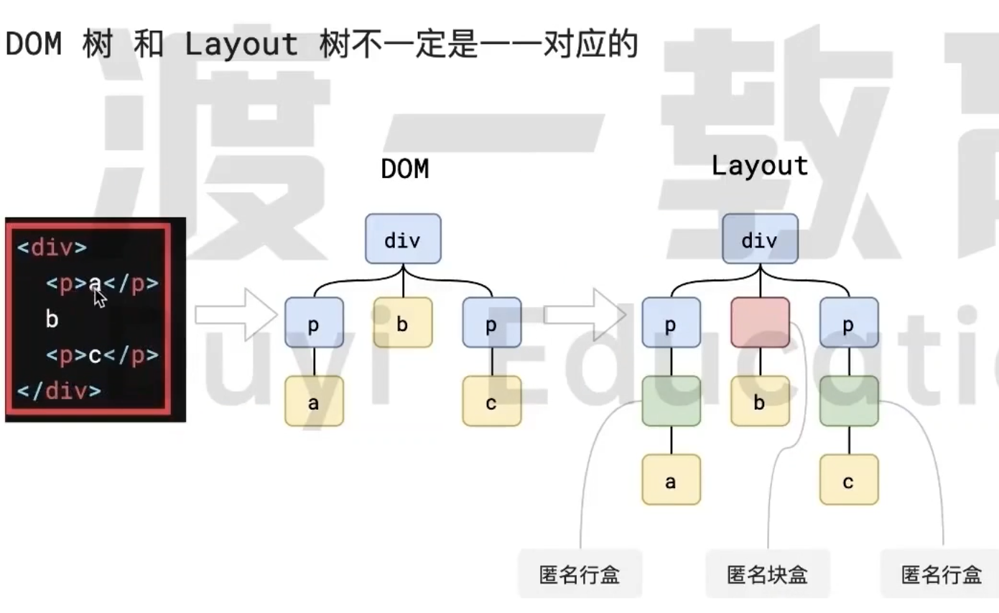

---

下一步是 **分层**

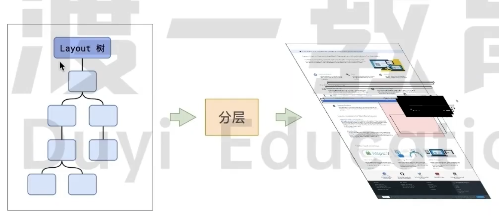

主线程会使用一套复杂的策略对整个布局树中进行分层。

分层的好处在于，将来某一个层改变后，仅会对该层进行后续处理，从而提高效率

滚动条、堆叠上下文、transform、opacity、z-index 等样式都会或多或少的影响分层结果，也可以通过 `will-change` 属性更大程度的影响分层结果

---

在下一步就是**绘制**(Paint)

主线程会为每个层单独产生绘制指令集，用于描述这一层的内容该如何画出来。

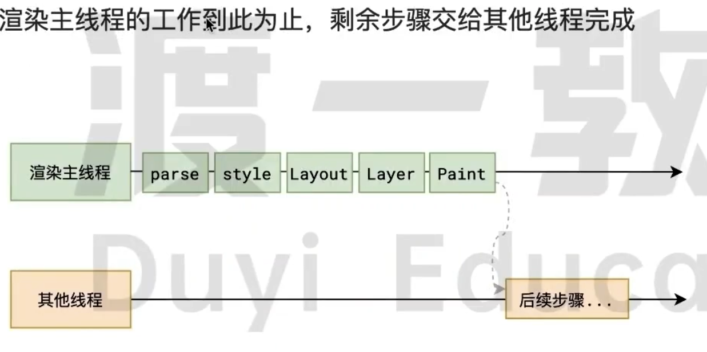

---

完成绘制之后，主线程将每个图层的绘制信息提交给合成线程，剩余工作将由合成线程完成。

合成线程首先对每个图层进行**分块**（Tiling），将其划分为更多的小区域。

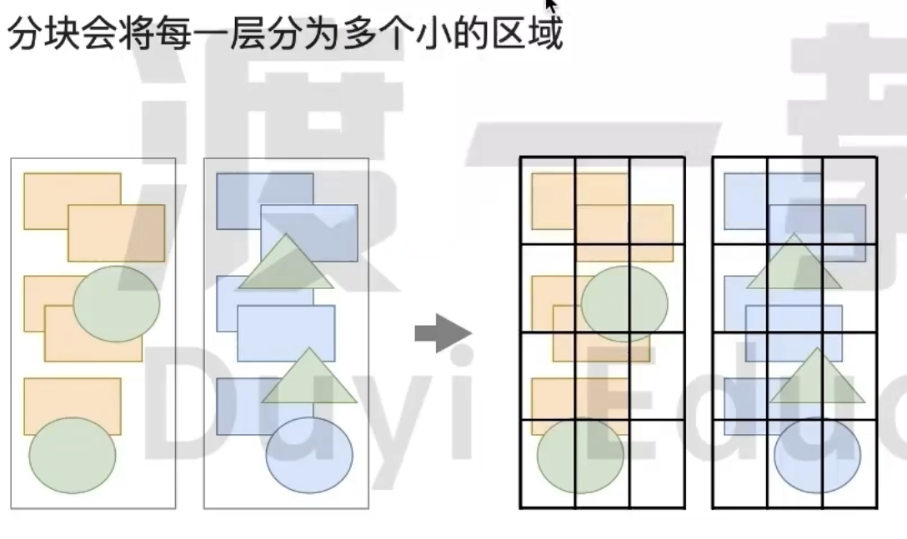

它会从线程池中拿取多个线程来完成分块工作。

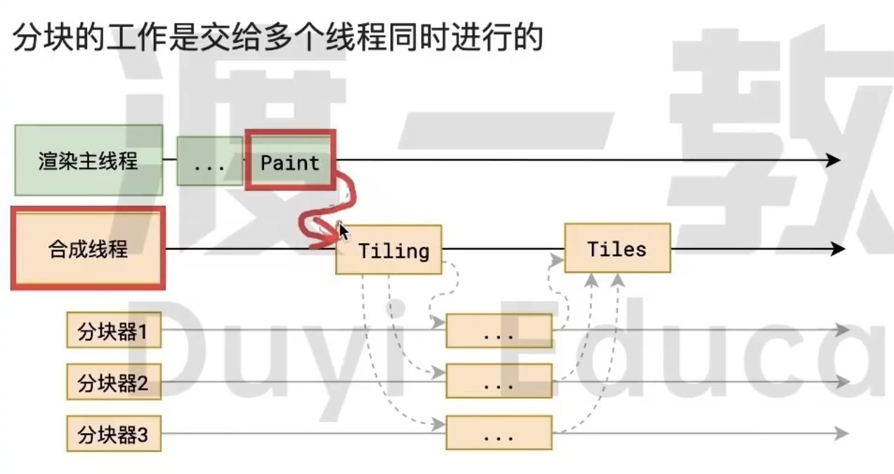

---

分块完成后，会进入**光栅化**(Raster)阶段

合成线程会将块信息交给 GPU 进程，以极高的速度完成光栅化。

GPU 进程会开启多个线程来完成光栅化，并且优先处理靠近视口区域的块

光栅化的结果，就是一块一块的位图

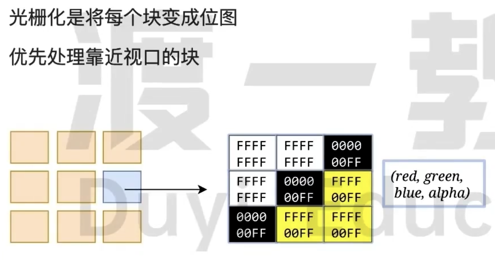

## 什么是 reflow?

## 什么是 repaint?

## 为什么 transform?
