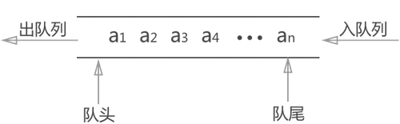

# 02-前端面试技能拼图 1 ：数据结构和算法（上），大厂面试必考

## 01：开始

### 数据结构和算法

数据结构和算法，是大厂前端面试的“拦路虎”，很多同学都望而生畏。其实如果了解常用数据结构，掌握基本的算法思维，就不能应对。本章将通过多个面试题，为你讲解算法面试题的解题思路，同时复习常用数据结构和算法思维。

### 为何要考察

如果在短时间之内快速判断一个工程师是否优秀？考察算法是最合理的方式 —— 这是业界多年的经验积累。

前端面试考算法不是因为内卷。算法一直在后端面试中被考察，现在前端也考查，说明前端能做的工作越来越多了。这是好事。

### 考察的重点

- 算法的时间复杂度和空间复杂度
- 三大算法思维：贪心，二分，动态规划
- 常见数据结构

### 注意事项

- 算法，有难度，请耐心学习
- 一个问题的解决方案有很多种，要找出最优解(重要！！！)
- 不仅关注题目本身，更要关注知识点和解题思路
- 按顺序学习（本章课程按顺序设计的）

### 看几个面试题

列举几个代表性的面试题，具体参考视频。

- 题目 1：定义一个函数，实现数组的旋转。
  > 如输入 `[1, 2, 3, 4, 5, 6, 7]` 和 `key = 3`， 输出 `[5, 6, 7, 1, 2, 3, 4]`<br>
  > 考虑时间复杂度和性能
- 题目 2：快速排序

  > 用 Javascript 实现快速排序，并说明时间复杂度。

- 题目 3：是否匹配指定字符
  > 一个字符串 s 可能包含 {} () [] 三种符号
  >
  > 判断 s 是否是括号匹配的
  >
  > 如 `(a{b}c)` 匹配，而 `{a(b}c)` 就不匹配
- 题目 4：反转单向链表
  > 输入一个单向链表，输出它的反转（头变尾，尾变头）

## 02: 科普-算法复杂度

- 什么是复杂度
- 时间复杂度
- 空间复杂度

### 什么是复杂度

- 程序执行时需要的计算量和内存空间（和代码是否简洁无关）
- 复杂度是**数量级**（方便记忆、推广），不是具体的数字
- 一般针对一个具体的算法，而非一个完整的系统


### 时间复杂度

> 程序执行时需要的计算量(CPU)

- O(1) 一次就够（数量级）,无循环
- O(n) 和传输的数据量一样（数量级）,单次循环
- O(n^2) 数据量的平方 (数量级), 嵌套循环
- O(logn) 数据量的对数 (数量级), 二分法
- O(nlogn) 数据量 \* 数据量的对数 (数量级): 单次循环 & 二分法

【注意】如果你用到了 API （如数组 `unshift`）要结合数据结构去分析复杂度。**要看到代码的本质**。

### 空间复杂度

> 程序执行时需要的内存空间(CPU)

- O(1) 有限的、可数的空间（数量级）
- O(n) 和 输入的数据量相同的空间（数量级）

前端算法通常不太考虑空间复杂度，或者它比时间复杂度要次要的多。

因为前端环境，通常内存都是足够的，或者内存不够通常也是其他因素（如媒体文件）。

### 程序员必须掌握算法复杂度

- 如果你没有复杂度的概念和敏感度，写程序是非常危险的
- 例如，代码功能测试正常，但是数据量大了，程序就会崩溃
- 对于前端开发，尤其是时间复杂度(重时间，轻空间)

PS: 算法达到 O(n^2), 算法基本是不可用的

## 03: 旋转数组

> 把一个数组旋转 k 步-代码演示和单元测试

### 题目

- 定义一个函数，实现数组的旋转。
- 如输入 `[1, 2, 3, 4, 5, 6, 7]` 和 `key = 3`， 输出 `[5, 6, 7, 1, 2, 3, 4]`
- 考虑时间复杂度和性能

### 实现思路

1. 思路 1

- 将 `k` 后面的元素，挨个 `pop` 然后 `unshift` 到数组前面

2. 思路 2

- 将 `k` 后面的所有元素拿出来作为 `part1`
- 将 `k` 前面的所有元素拿出来作为 `part2`
- 返回 `part1.concat(part2)`

### 代码演示

- 思路 1

  ```typescript
  /**
   * 旋转数组 k 步 - 使用 pop 和 unshift
   * @param arr arr
   * @param k k
   * @returns arr
   */
  export function rotate1(arr: number[], k: number): number[] {
    const length = arr.length
    if (!k || length === 0) return arr
    const step = Math.abs(k % length) // abs 取绝对值
  
    // O(n^2)
    for (let i = 0; i < step; i++) {
      const n = arr.pop()
      if (n != null) {
        arr.unshift(n) // 数组是一个有序结构，unshift 操作非常慢！！！ O(n)
      }
    }
    return arr
  }
  ```

  测试代码如下

  ```typescript
  const arr = [1, 2, 3, 4, 5, 6, 7]
  const k = 3
  
  const res = rotate1(arr, k)
  ```

* 思路 2

  ```typescript
  /**
   * 旋转数组 k 步 - 使用 concat
   * @param arr arr
   * @param k k
   */
  export function rotate2(arr: number[], k: number): number[] {
    const length = arr.length
    if (!k || length === 0) return arr
    const step = Math.abs(k % length) // abs 取绝对值
  
    // O(1)
    const part1 = arr.slice(-step) // O(1)
    const part2 = arr.slice(0, length - step)
    const part3 = part1.concat(part2)
    return part3
  }
  ```

  测试代码如下

  ```typescript
  const arr = [1, 2, 3, 4, 5, 6, 7]
  const k = 3
  
  const res = rotate2(arr, k)
  ```

### 复杂度分析

时间复杂度

- 思路 1 - 看代码时间复杂度是 `O(n)`，**但数组是有序结构 `unshift` 本身就是 `O(n)` 复杂度**，所以实际复杂度是 `O(n^2)`

  - 使用`unshift`这样的方法会导致延迟，因为我们必须移动数组中每个元素的索引。因此，`unshift`操作的复杂度为**O(n)**
  - 同样复杂度操作的 API 还有 `splice`、`shift`

- 思路 2 - `O(1)`。`slice` 和 `concat` 不会修改原数组，而数组是有序结构，复杂度是 `O(1)` 。

空间复杂度

- 思路 1 - `O(1)`
- 思路 2 - `O(n)`

经过性能测试，知道“思路 2”性能更优。看来，思路简单并不一定性能最优。

【注意】我看到网上有很多人为“思路 1”的写法点赞，要保持独立思考，不要从众！

### 答案

整体分析，选择“思路 2”

### 划重点

- 考虑参数非法情况，代码鲁棒性
- 算法复杂度
  - 要看到全部的时间复杂度（包括 API）
  - 重时间，轻空间
- 识破内置 API 的时间复杂度
  - 数组是有序结构，`shift` `unshift` 等要慎用
- 单元测试，考虑参数非法情况，提升代码健壮性

### 扩展 - 不要过度优化

其实还有一种思路，时间复杂度 `O(n)` ，空间复杂度 `O(1)` ，思路：

- k 前面的元素移动到 `i + (length - k)` 的位置
- k 后面的元素移动到 `i - k` 的位置

但不推荐这样的做法

- 前端重时间、轻空间，优先考虑时间复杂度，而非空间复杂度
- 代码是否易读，是否易沟通 —— 这个比性能更重要！人力成本永远是最贵的！！

## 04: 括号匹配

### 题目

一个字符串内部可能包含 `{ }` `( )` `[ ]` 三种括号，判断该字符串是否是括号匹配的。<br>
如 `(a{b}c)` 就是匹配的， `{a(b` 和 `{a(b}c)` 就是不匹配的。

### 栈 Stack

该题目的考察目的很明确 —— **栈**

栈，先进后出，基本的 API

- push
- pop
- length

和栈相关的数据结构（后面讲）

- 队列，先进先出
- 堆，如常说的“堆栈模型”


### 逻辑结构和物理结构

- 栈和数组有什么区别？—— **没有可比性，两者不一个级别**。就像：房子和石头有什么区别？

- 栈是一种逻辑结构，一种理论模型，它可以脱离编程语言单独讲。

- 数组是一种物理结构，代码的实现，不同的语言，数组语法是不一样的。

- 栈可以用数组来表达，也可以用链表来表达，也可以自定义 `class MyStack {...}` 自己实现…

* 在 JS 中，栈一般情况下用数组实现。

### 思路

- 遇到左括号 `{ ( [` 则压栈
- 遇到右括号 `} ) ]` 则判断栈顶，相同的则出栈
- 最后判断栈 length 是否为 0

### 划重点

- 栈
- 逻辑结构和物理结构

### 代码实现

```typescript
/**
 * 判断左右括号是否匹配
 * @param left 左括号
 * @param right 右括号
 */
function isMatch(left: string, right: string): boolean {
  if (left === '{' && right === '}') return true
  if (left === '[' && right === ']') return true
  if (left === '(' && right === ')') return true
  return false
}

/**
 * 判断是否括号匹配
 * @param str str
 */
export function matchBracket(str: string): boolean {
  const length = str.length
  if (length === 0) return true

  const stack = []

  const leftSymbols = '{[('
  const rightSymbols = '}])'

  for (let i = 0; i < length; i++) {
    const s = str[i]

    if (leftSymbols.includes(s)) {
      // 左括号，压栈
      stack.push(s)
    } else if (rightSymbols.includes(s)) {
      // 右括号，判断栈顶（是否出栈）
      const top = stack[stack.length - 1]
      if (isMatch(top, s)) {
        stack.pop()
      } else {
        // 如果一个不匹配，就直接返回 false
        return false
      }
    }
  }

  return stack.length === 0
}
```

测试代码

```javascript
const str = '{a(b[c]d)e}f'
// const str = '{a(b[(c]d)e}f'
// const str = '{a(b[c]d}e)f'
const res = matchBracket(str)
```

### 性能分析

- 时间复杂度 O(n)
- 空间复杂度 O(n)

> 注意：这里的 inlcudes 与字符串长度是有关系的，因为此处字符串 leftSymbols 的长度是固定的，所以我们认为时间复杂度 是 O(n)

### 划重点

- 栈
- 逻辑结构 VS 物理结构

## 05：用两个栈实现一个队列

### 题目

- 请用两个栈，实现一个队列
- 实现功能 `add` `delete` `length` 。

### 队列 Queue

- 栈，先进后出

- 队列，先进先出，API 包括

  - `add`

  - `delete`

  - `length`

常见的“消息队列”就是队列的一种应用场景

- A 系统向 B 系统持续发送海量的消息
- A 系统先把一条一条消息放在一个 queue
- B 系统再从 queue 中逐条消费（按顺序，先进先出）



### 逻辑结构 VS 物理结构

- 队列和栈一样，是一种逻辑结构。它可以用数组、链表等实现。
- 简单的，可以用数组、链表实现
- 复杂的队列服务（如海量数据，内存不够用），需要单独设计

思考：用数组实现队列，性能会怎样 —— add 怎样？delete 怎样？

### 题目分析

- 队列 add 方法
  - 往 stack1 push 元素
- 队列 delete 方法
  - 将 stack1 所有元素 pop 出来，push 到 stack2
  - 将 stack2 执行一次 pop，取出栈顶
  - 再将 stack2 所有元素 pop 出来，push 进 stack1

### 代码示例

```typescript
export class MyQueue {
  private stack1: number[] = []
  private stack2: number[] = []

  /**
   * 入队
   * @param n n
   */
  add(n: number) {
    this.stack1.push(n)
  }

  /**
   * 出队
   */
  delete(): number | null {
    let res

    const stack1 = this.stack1
    const stack2 = this.stack2

    // 将 stack1 所有元素移动到 stack2 中
    while (stack1.length) {
      const n = stack1.pop()
      if (n != null) {
        stack2.push(n)
      }
    }

    // stack2 pop
    res = stack2.pop()

    // 将 stack2 所有元素“还给”stack1
    while (stack2.length) {
      const n = stack2.pop()
      if (n != null) {
        stack1.push(n)
      }
    }

    return res || null
  }

  get length(): number {
    return this.stack1.length
  }
}

// // 功能测试
// const q = new MyQueue()
// q.add(100)
// q.add(200)
// q.add(300)
// console.info(q.length)
// console.info(q.delete())
// console.info(q.length)
// console.info(q.delete())
// console.info(q.length)
```

### 划重点

* 队列
* 逻辑结构 VS 物理结构

* 画图，帮助梳理解题思路
