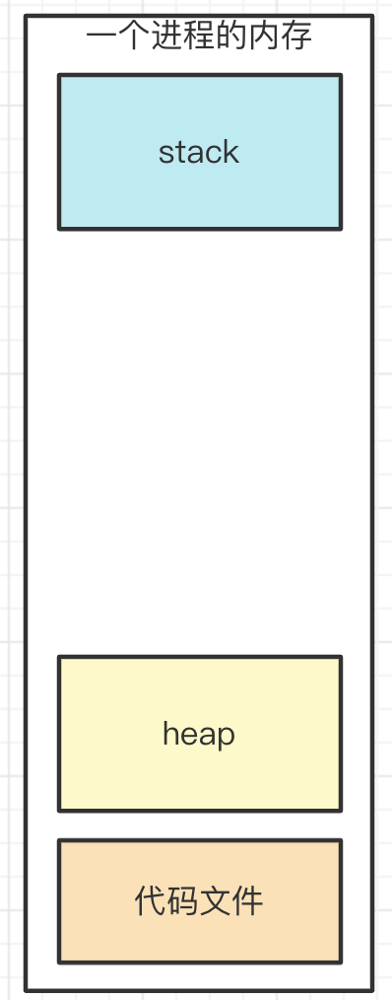

# 03: 前端面试技能拼图 1： 数据结构和算法（下），大厂面试必考

## 01: 求二叉搜索树的第 K 小的值

### 题目

一个二叉搜索树，求其中的第 K 小的节点的值。
如下图，第 3 小的节点是 `4`


### 二叉树

树，大家应该都知道，如前端常见的 DOM 树、vdom 结构。

二叉树，顾名思义，就是每个节点最多能有两个子节点。

树节点的数据结构是 `{ value, left, right }`

```ts
interface ITreeNode {
  value: number // 或其他类型
  left?: ITreeNode | null
  right?: ITreeNode | null
}
```

### 二叉树的遍历

- 前序遍历：`root -> left -> right`
- 中序遍历：`left -> root -> right`
- 后序遍历：`left -> right -> root`

### 二叉树遍历的三种方式代码演示

```typescript
// 数据结构演示
const bst: ITreeNode = {
  value: 5,
  left: {
    value: 3,
    left: {
      value: 2,
      left: null,
      right: null,
    },
    right: {
      value: 4,
      left: null,
      right: null,
    },
  },
  right: {
    value: 7,
    left: {
      value: 6,
      left: null,
      right: null,
    },
    right: {
      value: 8,
      left: null,
      right: null,
    },
  },
}
```

#### 前序遍历

```typescript
export interface ITreeNode {
  value: number
  left: ITreeNode | null
  right: ITreeNode | null
}

/**
 * 二叉树前序遍历
 * @param node tree node
 */
function preOrderTraverse(node: ITreeNode | null) {
  if (node == null) return
  console.log(node.value)
  preOrderTraverse(node.left)
  preOrderTraverse(node.right)
}

// 前序遍历结果
preOrderTraverse(bst) // 5 3 2 4 7 6 8
```

#### 中序遍历

```typescript
/**
 * 二叉树中序遍历
 * @param node tree node
 */
function inOrderTraverse(node: ITreeNode | null) {
  if (node == null) return
  inOrderTraverse(node.left)
  console.log(node.value)
  inOrderTraverse(node.right)
}

// 中序遍历结果
inOrderTraverse(bst) // 2 3 4 5 6 7 8
```

#### 后序遍历

```typescript
/**
 * 二叉树后序遍历
 * @param node tree node
 */
function postOrderTraverse(node: ITreeNode | null) {
  if (node == null) return
  postOrderTraverse(node.left)
  postOrderTraverse(node.right)
  console.log(node.value)
}

// 后序遍历结果
postOrderTraverse(bst) // 2 4 3 6 8 7 5
```

### 二叉搜索树 BST

- left(包括其后代) value <= 根节点(root value)
- right(包括其后代) value >= 根节点(root value)

### 分析题目

根据 `BST` 的特点，中序遍历的结果，正好是按照从小到大排序的结果。

所以，中序遍历，求数组的 `arr[k]` 即可。

### 答案

```typescript
interface ITreeNode {
  value: number
  left: ITreeNode | null
  right: ITreeNode | null
}

const arr: number[] = []

function inOrderTraverse(node: ITreeNode | null) {
  if (node == null) return
  inOrderTraverse(node.left)
  arr.push(node.value)
  inOrderTraverse(node.right)
}

/**
 * 寻找 BST 里的第 K 小值
 * @param node tree node
 * @param k 第几个值
 */
function getKthValue(node: ITreeNode, k: number): number | null {
  inOrderTraverse(node)
  return arr[k - 1] || null
}

console.log(getKthValue(bst, 3)) // 4
```

### 划重点

- 二叉搜索树的特点
- 前序、中序、后序遍历
- 二叉树的特点：`left <= root`, `right >= root`
- 二叉搜索树的价值：可使用 **二分法** 进行快速查找

## 02：为什么二叉树很重要，而不是三叉树四岔树

### 如何让性能整体最优？

有序结构

- 数组：查找易 O(1)，增删难 O(n)
- 链表：查找难 O(n), 增删易 O(1)

将两者优点结合起来 —— 二叉搜索树 BST ：查找易，增删易 —— 可使用二分算法

二叉搜索树 BST

- 左节点（包括其后代） <= 根节点
- 右节点（包括其后代） >= 根节点


### 高级二叉树

二叉搜索树 BST ，如果左右不平衡，也无法做到最优。

极端情况下，它就成了链表 —— 这不是我们想要的。

#### **平衡二叉搜索树 BBST** ：

- 要求树左右尽量平衡

* 树高度 `h` 约等于 `logn`
* 查找、增删，时间复杂度都等于 `O(logn)`

#### **红黑树**：

- 一种自动平衡的二叉树

* 节点分 红/黑 两种颜色，通过颜色转换来维持树的平衡
* 相比于普通平衡二叉树，它维持平衡的效率更高


#### B 树：

- 物理上是多叉树，但逻辑上是一个 BST 。
- 用于高效 I/O ，如关系型数据库就用 B 树来组织数据结构。


### 小结

- 数组、链表，各有各的缺点
- 特定的二叉树（BBST）可以让整体效果最优
- 各种高级二叉树，继续优化，满足不同场景

## 03：堆有什么特点，和二叉树有什么关系

### 堆栈模型

JS 执行时代码中的变量

- 值类型 - 存储到栈

- 引用类型 - 存储到堆



#### 堆

- 节点的值，总是不大于（或不小于）其父节点的值
- 完全二叉树
- 最大堆：父节点 >= 子节点
- 最小堆：父节点 <= 子节点


### 逻辑结构 VS 物理结构

- 堆，**逻辑结构**是一个二叉树
- 但是**物理结构**是一个数组
- 数组：适合连续存储 + 节省空间（回顾堆栈模型）


```js
// 上图是一个堆（从小到大），可以用数组表示
const heap = [-1, 10, 14, 25, 33, 81, 82, 99] // 忽略 0 节点

// 节点关系
const parentIndex = Math.floor(i / 2)
const leftIndex = 2 * i
const rightIndex = 2 * i + 1
```

### 堆 VS BST

#### 对比

堆的排序规则，没有 `BST` 那么严格，这就造成了

- 查询比 `BST` 慢
- 增删比 BST 快，维持平衡也更快
- 但整体复杂度都是 `O(logn)` 级别，即树的高度

#### 堆的使用场景

- 特别适合 "堆栈模型"
- 堆的数据，都是在栈中引用的，不会直接从根节点搜索

- 堆的物理结构是数组，根据栈的地址，可用 O(1)找到目标，所以查询复杂度就是 `O(1)`

### 总结

- 物理结构是数组（空间更小），逻辑结构是二叉树（操作更快）
- 适用于“堆栈”结构

### 答案

- 二叉树，可以充分利用二分法
- 二叉树可以同时规避数组和链表的缺点
- 引申到 `BST` `BBST` 等其他扩展结构

### 划重点

- 二分法的神奇力量
- 各个高级数据结构的存在价值、设计初衷
- 数据结构是基本功能

## 04: 求斐波那契数列的第 n 值

> 递归算法会导致运行崩溃

### 题目

用 Javascript 计算第 n 个斐波那契数列的值，注意时间复杂度。

### 分析

斐波那契数列很好理解

- `f(0) = 0`

- `f(1) = 1`

- `f(n) = f(n - 1) + f(n - 2)` 前两个值的和

### 递归计算

但这种方式会导致很多重复计算。

时间复杂度是 `O(2^n)` ，爆炸式增长，不可用。（可以试试 `n: 100` ，程序会卡死）


### 优化

- 不用递归，用循环
- 记录中间结果
- 时间复杂度降低到 `O(n)`

### 动态规划

即，把一个大问题，拆解为不同的小问题，递归向下。

【注意】一般使用动态规划的思路（递归）分析问题，再转换为循环来解决问题。

### 三大算法思维

- 贪心（递归）
- 二分
- 动态规划

### 答案

```typescript
// /**
//  * 斐波那契数列（递归）--不可用，时间复杂度太高
//  * @param n n
//  */
// function fibonacci(n: number): number {
//     if (n <= 0) return 0
//     if (n === 1) return 1

//     return fibonacci(n - 1) + fibonacci(n - 2)
// }
```

```typescript
/**
 * 斐波那契数列（循环）
 * @param n n
 */
export function fibonacci(n: number): number {
  if (n <= 0) return 0
  if (n === 1) return 1

  let n1 = 1 // 记录 n-1 的结果
  let n2 = 0 // 记录 n-2 的结果
  let res = 0

  for (let i = 2; i <= n; i++) {
    res = n1 + n2

    // 记录中间结果
    n2 = n1
    n1 = res
  }

  return res
}
```

### 划重点

- 动态规划的思路
- 识别出时间复杂度

## 05：连环问：青蛙跳台阶

青蛙跳台阶：一只青蛙，一次可以跳 1 个台阶，也可以跳 2 个台阶，问该青蛙跳上 n 级台阶，总共有多少种方式？

用动态规划分析

- 要跳到 跳 1 级台阶，只有一种方式， `f(1) = 1`
- 要跳到 跳 2 级台阶，有 2 种方式，`f(2) = 2`
- `f(n) = f(n - 1) + fn(n - 2)` 跳 n 级，可拆分为两个问题
  - 第一次跳，要么 1 级，要么 2 级，只有这两种
  - 第一次跳 1 级，剩下有 `f(n - 1)` 种方式
  - 第一次跳 2 级，剩下有 `f(n - 2)` 种方式

看公式，和斐波那契数列一样。

## 06: 移动 0 到数组的末尾

> splice 会导致性能问题

### **题目**

定义一个函数，将数组种所有的 `0` 都移动到末尾，例如输入 `[1, 0, 3, 0, 11, 0]` 输出 `[1, 3, 11, 0, 0, 0]`。要求：

- 只移动 `0` ，其他数字顺序不变

- 考虑时间复杂度

- 必须在原数组就行操作

### 如果不限制“必须在原数组修改”

- 定义 `part1` `part2` 两个空数组
- 遍历数组，非 `0` push 到 `part1` ，`0` push 到 `part2`
- 返回 `part1.concat(part2)`

时间复杂度 `O(n)` 空间复杂度 `O(n)` ，

所以，遇到类似问题，要提前问面试官：**是否能在原数组基础上修改？**

### 传统方式

#### 思路

- 遍历数组
- 遇到 `0` 则 push 到数组末尾
- 然后用 splice 截取掉当前元素

#### 分析性能

- 空间复杂度没有问题 `O(1)`
- 时间复杂度
  - 看似是 `O(n)`
  - 但实际上 `splice` 和 `unshift` 一样，修改数组结构，时间复杂度是 `O(n)`
  - 总体看来时间复杂度是 `O(n^2)`，**不可用**

【注意】网上有很多人对这种方式点赞，切不可随意从众，要对思考！

```typescript
/**
 * 移动 0 到数组的末尾（嵌套循环）
 * @param arr number arr
 */
export function moveZero1(arr: number[]): void {
  const length = arr.length
  if (length === 0) return

  let zeroLength = 0

  // O(n^2)
  for (let i = 0; i < length - zeroLength; i++) {
    if (arr[i] === 0) {
      arr.push(0)
      arr.splice(i, 1) // 本身就有 O(n)
      i-- // 数组截取了一个元素，i 要递减，否则连续 0 就会有错误
      zeroLength++ // 累加 0 的长度
    }
  }
}
```

#### 功能测试

```typescript
const arr = [1, 0, 3, 4, 0, 0, 11, 0]
moveZero1(arr)
console.log(arr)
```

### 优化-双指针

思路

- 指针 1 指向第一个 0 ，指针 2 指向第一个非 0
- 把指针 1 和 指针 2 进行交换，指针继续向后移
- 只遍历一次，所以时间复杂度是 `O(n)`

性能分析

- 时间复杂度 `O(n)`
- 空间复杂度 `O(1)`

性能测试，实际对比差距非常大。

```typescript
/**
 * 移动 0 到数组末尾（双指针）
 * @param arr number arr
 */
export function moveZero2(arr: number[]): void {
  const length = arr.length
  if (length === 0) return

  let i
  let j = -1 // 指向第一个 0

  for (i = 0; i < length; i++) {
    if (arr[i] === 0) {
      // 第一个 0
      if (j < 0) {
        j = i
      }
    }

    if (arr[i] !== 0 && j >= 0) {
      // 交换
      const n = arr[i]
      arr[i] = arr[j]
      arr[j] = n

      j++
    }
  }
}
```

### 划重点

- 咨询面试官，确认是否必须要修改原数据？
- 数组是有序结构，连续存储，不能随意使用 `splice` `unshift`等 API
- 双指针的思路

