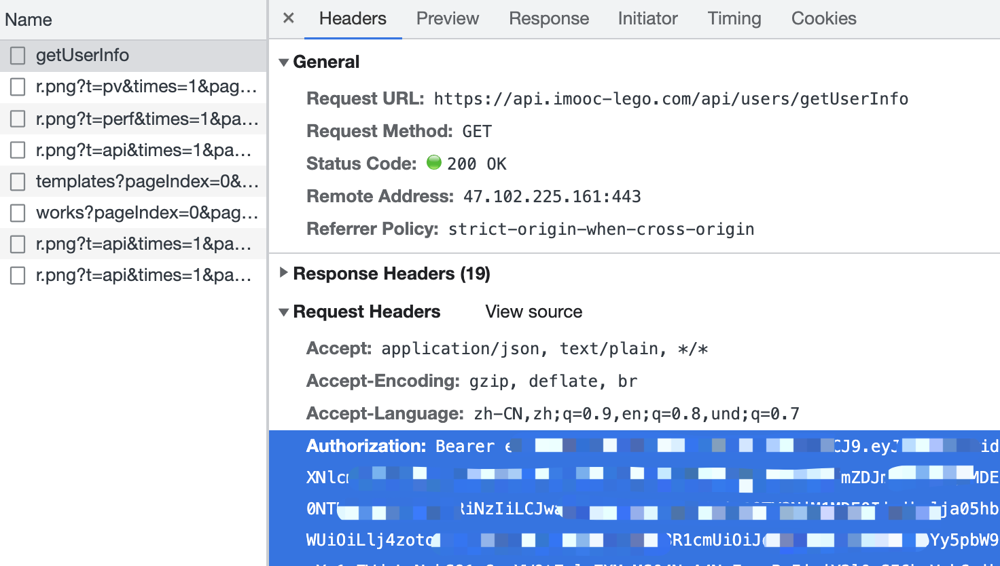
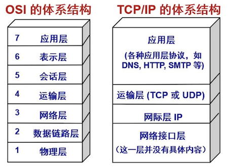

# 06-知识广度 - 从前端到全栈

## 01: 章节介绍

### 开始

前端工程师有很多，而是技能全面、独当一面的前端工程师到哪里都是“香饽饽”，企业争抢。所以，技术广度将决定你的稀缺性，以及未来的发展空间。本章将通过多个面试题，讲解前端面试常考的技术广度问题，涉及前端、移动端、服务端等全流程。

### 为何要考察

现代前端工程师已经不单单是开发页面了，你可能需要去开发移动端、服务端。或者和他们有亲密的合作，你需要了解他们的运作流程。

企业想要招聘到一些全能型的工程师，能在工作中串通上下流程，而不是只做开发。

### 考察重点

- 移动端相关支持
- HTTP 网路相关支持
- Nodejs 相关支持

### 注意事项

- 不会从 0 基础讲起，基础不熟悉的可以给我提问
- 广，则不能深

### 看几个问题

- HTTP 和 WebSocket 有什么区别
- 前端攻击的常用手段有哪些？如何预防
- 请描述 koa2 的洋葱模型

## 02：移动端 H5 点击有 300ms 延迟，该如何解决

### 题目

移动端 click 300ms 延迟，如何解决

### 背景

智能手机开始流行的前期，浏览器可以点击缩放（double tap to zoom）网页。这样在手机上就可以浏览 PC 网页，很酷炫。


浏览器为了分辨 click 还是“点击缩放”，就强行把 click 时间延迟 300ms 触发。

### 初期解决方案

[FastClick](https://www.npmjs.com/package/fastclick) 专门用于解决这个问题。

```js
// FastClick 使用非常简单
window.addEventListener(
  'load',
  function () {
    FastClick.attach(document.body)
  },
  false,
)
```

它的内部原理是

- 监听 `touchend` 事件 （`touchstart` `touchend` 会先于 `click` 事件被触发）
- 通过 [DOM 自定义事件](https://developer.mozilla.org/zh-CN/docs/Web/API/CustomEvent) 模拟一个 click 事件
- 把 300ms 之后触发的 click 事件阻止掉

### 现代浏览器的改进

随着近几年移动端响应式的大力发展，移动端网页和 PC 网页有不同的设计，不用再缩放查看。

这 300ms 的延迟就多余了，现代浏览器可以通过禁止缩放来取消这 300ms 的延迟。

- Chrome 32+ on Android
- iOS 9.3

```html
<meta name="viewport" content="width=device-width" />
```

### 答案

- 原因：点击缩放（double tap to zoom）网页
- 可使用 FastClick 解决
- 现代浏览器可使用 `width=device-width` 规避

## 03:扩展：Retina 屏幕的 1px 像素，如何实现

### 题目

Retina 屏 1px 像素问题，如何实现

### 介绍

该问题通常用于考察你是否做过移动端 h5 项目。<br>
如果你能知道这个问题，并且答出来，知道前因后果，证明你有过 h5 开发经验。<br>
否则就说明你没有 h5 的任何开发经验，尤其是你如果都不知道这个事情，那就更加说明这一点。

### 普通的 `1px`

如果仅仅使用 css 的 `1px` 来设置 border ，那可能会出现比较粗的情况。<br>
因为，有些手机屏幕的 DPR = 2 ，即 `1px` 它会用两个物理像素来显示，就粗了。

```css
#box {
  padding: 10px 0;
  border-bottom: 1px solid #eee;
}
```

如下图，上面是微信 app 的 border ，下面是 `1px` 的 border ，有明显的区别。显得很粗糙，很不精致，设计师不会允许这样的页面发布上线的。


PS：你不能直接写 `0.5px` ，浏览器兼容性不好，渲染出来可能还是 `1px` 的效果。

### 使用 `transform` 缩小

我们可以使用 css 伪类 + `transform` 来优化这一问题。即把默认的 `1px` 宽度给压缩 0.5 倍。

```css
#box {
  padding: 10px 0;
  position: relative;
}
#box::before {
  content: '';
  position: absolute;
  left: 0;
  bottom: 0;
  width: 100%;
  height: 1px;
  background: #d9d9d9;
  transform: scaleY(0.5);
  transform-origin: 0 0;
}
```

如下图，上面是微信 app 的 border ，下面是优化之后的 border ，两者粗细就一致了。


### 连环问：如果有 `border-radius` 怎么办

可以使用 `box-shadow` 设置

- X 偏移量 `0`
- Y 偏移量 `0`
- 阴影模糊半径 `0`
- 阴影扩散半径 `0.5px`
- 阴影颜色

```css
#box2 {
  margin-top: 20px;
  padding: 10px;
  border-radius: 5px;
  /* border: 1px solid #d9d9d9; */
  box-shadow: 0 0 0 0.5px #d9d9d9;
}
```

## 04: HTTP 请求中 token 和 cookie 有什么区别-cookie 和 session

### 题目

cookie 和 token 有何区别

### cookie

- http 请求是无状态的，即每次请求之后都会断开链接。
- 所以，每次请求时，都可以携带一段信息发送到服务端，以表明客户端的用户身份。
- 服务端也也可以通过 `set-cookie` 向客户端设置 cookie 内容。
- 由于每次请求都携带 cookie ，所以 cookie 大小限制 4kb 以内。
- 默认有跨域限制：不可跨域共享、传递 Cookie


### cookie 作为本地存储

- 前些年大家还常用 cookie 作为本地存储，这并不完全合适。
- 所以后来 html5 增加了 `localStorage` 和 `sessionStorage` 作为本地存储。

### cookie 跨域限制

浏览器存储 cookie 是按照域名区分的，在浏览器无法通过 JS `document.cookie` 获取到其他域名的 cookie 。

http 请求传递 cookie 默认有跨域限制。如果想要开启，需要客户端和服务器同时设置允许

- 客户端：使用 fetch 和 XMLHttpRequest 或者 axios 需要配置 `withCredentials`
- 服务端：需要配置 header `Access-Control-Allow-Credentials`

### 现代浏览器禁用第三发 cookie

- 和跨域限制不同，这里是：禁止网页引入的第三方 JS 设置 Cookie
- 打击第三方广告，保护用户个人隐私。
- 新增属性 SameSite: Strict/Lax/None 供用户自己选择

例如一个电商网站 A 引用了淘宝广告的 js

- 你访问 A 时，淘宝 js 设置 cookie ，记录下商品信息
- 你再次访问淘宝时，淘宝即可获取这个 cookie 内容
- 再和你的个人信息（也在 cookie 里）一起发送到服务端，这样就知道了你看了哪个商品

### cookie 和 session

- cookie 用于登录验证，存储用户标识（如 userId）
- session 在服务端，存储用户详细信息，和 cookie 信息一一对应
- cookie 和 session 是常见登录验证解决方案

cookie 用途非常广泛，最常见的就是登录。

使用 cookie 做登录校验

- 前端输入用户名密码，传给后端
- 后端验证成功，返回信息时 set-cookie
- 接下来所有接口访问，都自动带上 cookie （浏览器的默认行为， http 协议的规定）

什么是 session ？

- cookie 只存储 userId ，不去暴露用户信息
- 用户信息存储在 session 中 —— session 就是服务端的一个 hash 表

### token

token 和 cookie 一样，也是一段用于客户端身份验证的字符串，随着 http 请求发送

- cookie 是 http 协议规范的，而 token 是自定义的，可以用任何方式传输（如 header body query-string 等）
- token 默认不会在浏览器存储
- token 没有跨域限制

所以，token 很适合做跨域或者第三方的身份验证。

### token 和 JWT

JWT === JSON Web Token

JWT 的过程

- 前端输入用户名密码，传给后端
- 后端验证成功，返回一段 token 字符串 - 将用户信息加密之后得到的
- 前端获取 token 之后，存储下来
- 以后访问接口，都在 header 中带上这段 token



### 答案

- cookie：http 规范；有跨域限制；可存储在本地；可配合 session 实现登录
- token：自定义标准；不在本地存储；无跨域限制；可用于 JWT 登录

### 划重点

- cookie 的知识点很多，对于 HTTP 也很重要
- Session 存在的价值
- token 和 cookie 要对比理解，否则容易混淆

### 连环问：session 和 JWT 比较，你更推荐哪个？

#### Session 优点

- 原理简单，易于学习
- 用户信息存储在服务端，可以快速封禁某个登录的用户 —— 有这方强需求的人，一定选择 Session

#### Session 的缺点

- 占用服务端内存，有硬件成本
- 多进程、多服务器时，不好同步 —— 一般使用第三方 redis 存储 ，成本高
- 跨域传递 cookie ，需要特殊配置

#### JWT 的优点

- 不占用服务器内存
- 多进程、多服务器，不受影响
- 不受跨域限制

#### JWT 的缺点

- 无法快速封禁登录的用户（用户信息存储在客户端）
- 万一服务端秘钥被泄露，则用户信息全部丢失
- token 信息一般大于 cookie, 会增加请求的数据量

#### 答案

- 如果严格管理用户信息的需求（保密、快速封禁等）推荐 session
- 如果没有特殊要求，则推荐 JWT(如创业初期的网站)

### 连环问：如何实现 SSO 单点登录

#### 基于 cookie

- cookie 默认是跨域不共享，但是有些情况下可以设置为共享
- 主域名相同下，可以设置为共享。如 `wenku.baidu.com` `tieba.baidu.com`
- 设置 cookie domain 设置为主域名，即可共享 cookie

简单的，如果业务系统都在同一主域名下，比如 `wenku.baidu.com` `tieba.baidu.com` ，就好办了。
可以直接把 cookie domain 设置为主域名 `baidu.com` ，百度也就是这么干的。

#### SSO

[单系统登录机制](https://www.cnblogs.com/ywlaker/p/6113927.html)

[单点登录(SSO)看这一篇就够了！❤️ 这次不慌了](https://juejin.cn/post/7044328327762411534)

- 主域名不一样,则 cookie 无法共享
- 可以使用 SSO 技术

复杂一点的，滴滴这么潮的公司，同时拥有 `didichuxing.com` `xiaojukeji.com` `didiglobal.com` 等域名，种 cookie 是完全绕不开的。需要使用 SSO 技术方案


#### OAuth2

[最详细的一篇关于 Oauth2 的认证模式](https://juejin.cn/post/6949929792502235149)

上述 SSO 是 oauth 的实际案例，其他常见的还有微信登录、github 登录等。即，当设计到第三方用户登录校验时，都会使用 OAuth2.0 标准。
流程参考 [RFC 6749](https://tools.ietf.org/html/rfc6749)

### 答案

- 主域名相同，则课共享 cookie
- 主域名不同，则需要使用 SSO

## 05: HTTP 协议和 UDP 协议有什么区别

### 题目

HTTP 和 UDP 有何区别

### 网络协议



- HTTP 协议在应用层，直接被程序使用
- TCP 和 UDP 在传输层，底层
- 严格来说，应该拿 TCP 和 UDP 进行比较

### TCP 协议

- 有链接(三次握手)
- 有断开(四次挥手)
- 稳定传输

### UDP 协议

- 无连接，无断开
- 不稳定传输，但是效率高
- 如：视频会议、语音通话

UDP 是一种无连接的、不可靠的传输层协议。而 TCP 需要连接、断开连接，参考“三次握手、四次挥手”。

不需要连接，所以 UDP 的效率比 TCP 高。

虽然 UDP 从协议层是不稳定的，但随着现代网络硬件环境的提升，也能保证绝大部分情况下的稳定性。所以，UDP 一直处于被发展的趋势。

例如视频会议、语音通话这些允许中段、不完全保证持续连接的场景，又需要较高的传输效率，就很适合 UDP 协议。

### 答案

- HTTP 在应用层，而 UDP 和 TCP 在传输层
- HTTP 是有连接、有断开的，稳定传输
- UDP 是无连接、无断开的，不稳定传输，但是效率高

## 06: 连环问：http 协议 1.0 1.1 2.0 区别

### http 1.0

- 最基础的 http 协议
- 支持基本的 GET POST 方法

### http 1.1

- 引入更多的缓存策略，如 `cache-control` `E-tag`
- 长链接，默认开启 `Connection: keep-alive` ，一次 TCP 连接多次 http 请求
- 断点续传，状态吗 `206`
- 增加新的 method `PUT` `DELETE` 等，可用于 Restful API

### http2.0

- header 压缩，以减少体积
- 多路复用，一个 TCP 连接中可以多个 http 并行请求。拼接资源（如雪碧图、多 js 拼接一个）将变的多余
- 服务器端推送

### HTTP 3.0

- 基于 google 的 QUIC 协议，而 quic 协议是使用 udp 实现的
- 减少了 tcp 三次握手时间，以及 tls 握手时间
- 解决了 http 2.0 中前一个 stream 丢包导致后一个 stream 被阻塞的问题
- 优化了重传策略，重传包和原包的编号不同，降低后续重传计算的消耗
- 连接迁移，不再用 tcp 四元组确定一个连接，而是用一个 64 位随机数来确定这个连接
- 更合适的流量控制

## 07: 什么是 HTTPS 中间人攻击，如何预防

### 题目

什么是 https 中间人攻击，如何预防？

### 复习：https 加密原理

http 是明文传输，传输的所有内容（如登录的用户名和密码），都会被中间的代理商（无论合法还是非法）获取到。

http + TLS/SSL = https ，即加密传输信息。只有客户端和服务端可以解密为明文，中间的过程无法解密。


### 中间人攻击

中间人攻击，就是黑客劫持网络请求，伪造 CA 证书。


解决方案：使用浏览器可识别的，正规厂商的证书（如阿里云），慎用免费证书。


