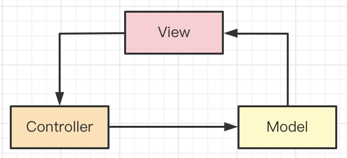

# 07- 实际工作经验 - 是否做过真实项目

## 01: 开始

无论是校招还是社招，企业都希望得到工作经验丰富的候选人。所以面试时会有很多面试题来考察候选人，是否有真实工作经验（而非只做过个人项目和 demo）。本章将通过多个面试题，讲解前端面试常考的实际工作经验问题。

### 为何考察

企业都需要有工作经验的人才，入职之后简单培训就可以干活，不用再操心培养。毕竟现在人员流动很频繁。

而且，有实际工作经验的，他之前踩过很多坑，未来工作就可以多一些稳定性。

### 考察重点

各种能体现工作经验的题目，如

- 性能优化的实践
- 设计模式的应用
- 错误监控的实践 （不是真实项目，很少有错误监控）
- 项目难点，角色之间的沟通

### 注意事项

- 进做过个人项目，不代表有项目经验
- 应届毕业生也需要工作经验 —— 你的毕业设计，实习经历

### 看几个题目

- 如果一个网页访问慢，你该如何分析问题原因？
- Vue 应该如何监听 JS 报错
- 你遇到了哪些项目难点，如何解决的？

## 02: H5 页面如何进行首屏优化

### 题目

H5 如何进行首屏优化？尽量说全

### 前端通用的优化策略

压缩资源，使用 CDN ，http 缓存等。本节只讨论首屏，这些先不讲。

### 路由懒加载

- 是用于 SPA，不适用 MPA
- 路由拆分，优先保证首页加载

### 服务端渲染 SSR

- 传统的 SPA 方式过程繁多

  - 下载 html ，解析，渲染
  - 下载 js ，执行
  - ajax 异步加载数据
  - 重新渲染页面

- 而 SSR 则只有一步

  - 下载 html ，接续，渲染

- 如果是纯 H5 页面，SSR 就是首屏优化的终极方案。

技术方案：

- 传统的服务端模板，如 ejs smarty jsp 等
- Nuxt.js ( Vue 同构 )
- Next.js ( React 同构 )

### App 预取

如果 H5 在 App webview 中展示，可以使用 App 预取资源

- 在列表页，App 预取数据（一般是标题、首页文本，不包括图片、视频）
- 进入详情页，H5 直接即可渲染 App 预取的数据
- 可能会造成“浪费”：预期了，但用户未进入该详情页 —— 不过没关系，现在流量便宜

例如，你在浏览朋友圈时，可以快速的打开某个公众号的文章。

这里可以联想到 `prefetch` ，不过它是预取 `js css` 等静态资源，并不是首屏的内容。
不要混淆。

### 分页

- 针对列表页
- 默认只显示第一页内容
- 上滑加载更多

根据显示设备的高度，设计尽量少的页面内容。即，首评内容尽量少，其他内容上滑时加载。

### 图片 lazyLoad

先加载内容，再加载图片。<br>
注意，提前设置图片容器的尺寸，尽量重绘，不要重排。

### 离线包 hybrid

提前将 `html css js` 等下载到 App 内。<br>
当在 `App` 内打开页面时，`webview` 使用 `file://` 协议加载本地的 `html css js` ，然后再 `ajax` 请求数据，再渲染。

可以结合 `App` 预取。

### 答案

- 路由懒加载

* 服务端渲染 SSR
* APP 预取
* 分页
* 图片 lazyLoad
* Hybrid

### 划重点

- 服务端 SSR 是 H5 的终极优化方案（但是成本也高）
- 移动端 H5 要结合 APP 原生能力去优化
- 严格来说， Hybird 不是 H5，但是这里回答出来也没问题

### 扩展

- 做完性能优化，还要进行统计、计算、评分，作为你的工作成果。
- 性能优化也需要配合体验，如 骨架屏、 `loading 动画`等
- 不同的形式，有不同的优化方式，要积极和面试官沟通

## 03：后端一次性返回 10w 条数据，你该如何渲染

### 题目

后端返回 10w 条数据，该如何渲染？

### 设计是否合理？

前端很少会有一次性渲染 10w 条数据的需求，而且如果直接渲染会非常卡顿。<br>
你可以反问面试官：这是什么应用场景。然后判断这个技术方案是否合理。

例如，就一个普通的新闻列表，后端一次性给出 10w 条数据是明显设计不合理的。应该分页给出。<br>
你能正常的反问、沟通、给出自己合理的建议，这本身就是加分项。

当然，面试官话语权更大，他可能说：对，不合理，但就非得这样，该怎么办？

### 思考：浏览器能否处理 10W 条数据

- JS 没有问题
- 渲染到 DOM 会非常卡顿

### 自定义中间层

- 自定义 nodejs 中间层，获取并拆分这 10w 条数据
- 前端对接 nodejs 中间层，而不是服务端
- 成本比较高

### 虚拟列表

基本原理

- 只渲染可视区域 DOM
- 其他隐藏区域不渲染，只用一个 `<div>` 撑开高度
- 监听容器滚动，随时创建和销毁 DOM


虚拟列表实现比较复杂，特别是在结合异步 ajax 加载。明白实现原理，实际项目可用第三方 lib

- [vue-virtual-scroll-list](https://www.npmjs.com/package/vue-virtual-scroll-list)
- [react-virtualized](https://www.npmjs.com/package/react-virtualized)

### 答案

- 沟通需求和场景，给出自己合理的设计建议
- 虚拟列表

### 划重点

- 要主动沟通，表达观点（也许正在考察你的沟通能力）
- 后端的问题，首先要用后端的思维去解决--中间层

* 虚拟列表只是无奈的选择，实现复杂而且效果不一定好（低配手机）

### 扩展

有时候面试官会出这种刁钻的问题来故意“难为”候选人，把自己扮演成后端角色，看候选人是否好欺负。<br>
如果此时你顺从面试官的问题继续埋头苦思，那就错了。应该适当的追问、沟通、提出问题、给出建议，这是面试官想要看到的效果。

实际工作中，前端和后端、服务端的人合作，那面会遇到各种设计沟通的问题。看你是否有这种实际工作经验。

## 04: 扩展：文字超出省略

注：文本小节

### 题目

文字超出省略，用哪个 CSS 样式？

### 分析

如果你有实际工作经验，实际项目有各种角色参与。页面需要 UI 设计，开发完还需要 UI 评审。<br>
UI 设计师可能是这个世界上最“抠门”的人，他们都长有像素眼，哪怕差 1px 他们都不会放过你。所以，开发时要严格按照视觉稿，100% 还原视觉稿。

但如果你没有实际工作经验（或实习经验），仅仅是自学的项目，或者跟着课程的项目。没有 UI 设计师，程序员的审美是不可靠的，肯定想不到很多细节。

所以，考察一些 UI 关注的细节样式，将能从侧面判断你有没有实际工作经验。

### 答案

单行文字

```css
#box1 {
  border: 1px solid #ccc;
  width: 100px;
  white-space: nowrap; /* 不换行 */
  overflow: hidden;
  text-overflow: ellipsis; /* 超出省略 */
}
```

多行文字

```css
#box2 {
  border: 1px solid #ccc;
  width: 100px;
  overflow: hidden;
  display: -webkit-box; /* 将对象作为弹性伸缩盒子模型显示 */
  -webkit-box-orient: vertical; /* 设置子元素排列方式 */
  -webkit-line-clamp: 3; /* 显示几行，超出的省略 */
}
```

### 扩展

UI 关注的问题还有很多，例如此前讲过的移动端响应式，Retina 屏 1px 像素问题。

再例如，网页中常用的字号，如果你有工作经验就知道，最常用的是 `12px` `14px` `16px` `20px` `24px` 等。你如果不了解，可以多去看看各种 UI 框架，例如 [antDesign 排版](https://ant.design/components/typography-cn/)。

## 05: 前端常用的设计模式？什么场景？

### 题目

前端常用的设计模式？什么场景？

### 开放封闭原则

- S: Single Responsibility Principle（SRP）：单一职责原则
- O: Open Closed Principle（OCP）：开闭原则
- L: Liskov Substitution Principle（LSP）：里氏替换原则
- I: Interface Segregation Principle（ISP）：接口隔离原则
- D: Dependence Inversion Principle（DIP）：依赖倒置原则

设计原则是设计模式的基础，开放封闭原则是最重要的：对扩展开发，对修改封闭。

### 工厂模式

用一个工厂函数，创建一个实例，封装创建的过程。

```ts
class Foo { ... }

function factory(): Foo {
  // 封装创建过程，这其中可能有很多业务逻辑
  return new Foo(...arguments)
}
```

应用场景

- jQuery `$('div')` 创建一个 jQuery 实例
- React `createElement('div', {}, children)` 创建一个 vnode

### 单例模式

提供全局唯一的对象，无论获取多少次。

```js
class SingleTon {
  private constructor() {}
  private static instance: SingleTon | null = null
  public static getInstance(): SingleTon {
    if(this.instance == null){
      this.instance = new SingleTon()
    }
    return this.instance
  }
  fn1() {}
  fn2() {}
}

// const s1 = new SingleTon() // Error: constructor of 'singleton' is private

const s2 = SingleTon.getInstance()
s2.fn1()
s2.fn2()

const s3 = SingleTon.getInstance()
s2 === s3 // true
```

应用场景

- Vuex Redux 的 store ，全局唯一的
- 全局唯一的 dialog modal

PS：JS 是单线程语言,创建单例很简单。如果是 Java 等多线程语言，创建单例时还需要考虑线程锁死，否则两个线程同时创建，则可能出现两份 instance （多线程共享进程内存）。

### 代理模式

- 使用者不能直接访问真实数据，而是通过一个代理层来访问。<br>
- 在代理层可以监听 get set 做很多事情
- 如 ES6 Proxy 本身就是代理模式，Vue3 基于它来实现响应式。

### 观察者模式

即常说的绑定事件。一个主题，一个观察者，主题变化之后触发观察者执行。

```js
// 一个主题，一个观察者，主题变化之后触发观察者执行
btn.addEventListener('click', () => { ... })
```

### 发布订阅模式

即常说的自定义事件，一个 `event` 对象，可以绑定事件，可以触发事件。

```js
// 绑定
event.on('event-key', () => {
  // 事件1
})
event.on('event-key', () => {
  // 事件2
})

// 触发执行
event.emit('event-key')
```

温故知新。在讲 JS 内存泄漏时提到，Vue React 组件销毁时，要记得解绑自定义事件。

```js
function fn1() {
  /* 事件1 */
}
function fn2() {
  /* 事件2 */
}

// mounted 时绑定
event.on('event-key', fn1)
event.on('event-key', fn2)

// beforeUnmount 时解绑
event.off('event-key', fn1)
event.off('event-key', fn2)
```

### 装饰器模式

- 原功能不变，增加一些新功能（AOP 面向切面编程）

- ES 和 TS 的 Decorator 语法就是装饰器模式

- 类装饰器，方法装饰器

以下代码可以在 [ts playground](https://www.typescriptlang.org/play) 中运行。

```js
// class 装饰器
function logDec(target) {
  target.flag = true
}

@logDec
class Log {
  // ...
}

console.log(Log.flag) // true
```

```js
// method 装饰器
// 每次 buy 都要发送统计日志，可以抽离到一个 decorator 中
function log(target, name, descriptor) {
  // console.log(descriptor.value) // buy 函数
  const oldValue = descriptor.value // 暂存 buy 函数

  // “装饰” buy 函数
  descriptor.value = function(param) {
    console.log(`Calling ${name} with`, param) // 打印日志
    return oldValue.call(this, param) // 执行原来的 buy 函数
  };

  return descriptor
}
class Seller {
  @log
  public buy(num) {
    console.log('do buy', num)
  }
}

const s = new Seller()
s.buy(100)
```

Angular nest.js 都已广泛使用装饰器。这种编程模式叫做**AOP 面向切面编程**：关注业务逻辑，抽离工具功能。

```js
import { Controller, Get, Post } from '@nestjs/common'

@Controller('cats')
export class CatsController {
  @Post()
  create(): string {
    return 'This action adds a new cat'
  }

  @Get()
  findAll(): string {
    return 'This action returns all cats'
  }
}
```

### 答案

传统的经典设计模式有 23 个，作为面试题只说出几个前端常用的就可以。

- 工厂模式
- 单例模式
- 代理模式
- 观察者模式
- 发布订阅模式
- 装饰器模式

### 连环问：观察者模式和发布订阅模式的区别？


观察者模式

- Subject 和 Observer 直接绑定，中间无媒介
- 如 `addEventListener` 绑定事件

发布订阅模式

- Publisher 和 Observer 相互不认识，中间有媒介
- 如 `EventBus` 自定义事件

### 连环问：MVC 和 MVVM 有什么区别

MVC 原理

- View 传送指令到 Controller
- Controller 完成业务逻辑后，要求 Model 改变状态
- Model 将新的数据发送到 View，用户得到反馈



MVVM 直接对标 Vue 即可

- View 即 Vue template
- Model 即 Vue data
- VM 即 Vue 其他核心功能，负责 View 和 Model 通讯


## 06: Vue 优化

### 题目

你在实际工作中，做过哪些 Vue 优化？

### 前端通用的优化策略

压缩资源，拆包，使用 CDN ，http 缓存等。本节只讨论首屏，这些先不讲。

### v-if 和 v-show

区别

- `v-if` 组件销毁/重建
- `v-show` 组件隐藏（切换 CSS `display`）

场景

- 一般情况下使用 `v-if` 即可，普通组件的销毁、渲染不会造成性能问题
- 如果组件创建时需要大量计算，或者大量渲染（如复杂的编辑器、表单、地图等），可以考虑 `v-show`

### v-for 使用 key

`key` 可以优化内部的 diff 算法。注意，遍历数组时 `key` 不要使用 `index` 。

```html
<ul>
  <!-- 而且，key 不要用 index -->
  <li v-for="(id, name) in list" :key="id">{{name}}</li>
</ul>
```

### computed 缓存

`computed` 可以缓存计算结果，`data` 不变则缓存不失效。

```js
export default {
  data() {
    return {
      msgList: [ ... ] // 消息列表
    }
  },
  computed: {
    // 未读消息的数量
    unreadCount() {
      return this.msgList.filter(m => m.read === false).length
    }
  }
}
```

### keep-alive

`<keep-alive>` 可以缓存子组件，只创建一次。通过 `activated` 和 `deactivated` 生命周期监听是否显示状态。<br>
代码参考 components/KeepAlive/index.vue

场景

- 局部频繁切换的组件，如 tabs
- 不可乱用 `<keep-alive>` ，缓存太多会占用大量内存，而且出问题不好 debug

### 异步组件

- 对于体积大的组件（如编辑器、表单、地图等）可以使用异步组件
- 拆包，需要时异步加载，不需要时不加载
- 减少 main 包的体积，页面首次加载更快

vue3 使用 `defineAsyncComponent` 加载异步组件，代码参考如下

```vue
<template>
  <Child></Child>
</template>

<script>
import { defineAsyncComponent } from 'vue'

export default {
  name: 'AsyncComponent',
  components: {
    Child: defineAsyncComponent(() =>
      import(/* webpackChunkName: "async-child" */ './Child.vue'),
    ),
  },
}
</script>
```

### 路由懒加载

对于一些补偿访问的路由，或者组件提交比较大的路由，可以使用路由懒加载。

```js
const routes = [
  {
    path: '/',
    name: 'Home',
    component: Home,
  },
  {
    path: '/about',
    name: 'About',
    // 路由懒加载
    component: () =>
      import(/* webpackChunkName: "about" */ '../views/About.vue'),
  },
]
```

### SSR

- 可以使用 Nuxt.js
- 按需优化，使用 SSR 的成本比较高

SSR 让网页访问速度更快，对 SEO 友好。

但 SSR 使用和调试成本高，不可乱用。例如，一个低代码项目（在线制作 H5 网页），toB 部分不可用 SSR ， toC 部分适合用 SSR 。

### 答案

- v-if 和 v-show
- v-for 使用 key
- computed 缓存数据
- keep-alive 缓存组件
- 异步组件
- 路由懒加载
- SSR

### 扩展

网上看到过一些“较真”的性能优化，对比普通组件和函数组件，JS 执行多消耗了几 ms 。

- 如果这些是为了探索、学习前端技术，非常推荐
- 但在实际项目中要慎用，不要为了优化而优化。肉眼不可见的 ms 级的优化，对项目没有任何实际价值

### 划重点

- 性能优化要按需进行，不要为了优化而优化
- 面试是面试，工作是工作。工作中用不到，面试中也要答出来

## 07: 连环问：Vue 遇到过哪些坑？？？

全局事件、自定义事件要在组件销毁时解除绑定

- 内存泄漏风险
- 全局事件、全局变量、全局定时器（如 `window.resize`）不解除，则会继续监听，而且组件再次创建时会重复绑定
- 自定义事件

Vue2.x 中，无法监听 data 属性的新增和删除，以及数组的部分修改 —— Vue3 不会有这个问题

- 新增 data 属性，需要用 `Vue.set`
- 删除 data 属性，需要用 `Vue.delete`
- 修改数组某一元素，不能 `arr[index] = value` ，要使用 `arr.splice` API 方式

路由切换时，页面会 scroll 到顶部。例如，在一个新闻列表页下滑到一定位置，点击进入详情页，在返回列表页，此时会 scroll 到顶部，并重新渲染列表页。所有的 SPA 都会有这个问题，并不仅仅是 Vue 。

- 在列表页缓存数据和 `scrollTop`
- 返回列表页时（用 Vue-router [导航守卫](https://router.vuejs.org/zh/guide/advanced/navigation-guards.html)，判断 `from`），使用缓存数据渲染页面，然后 `scrollTo(scrollTop)`

### 划重点

- 日常要注意记录总结，遇到坑就记录下，下次面试时就能用到
