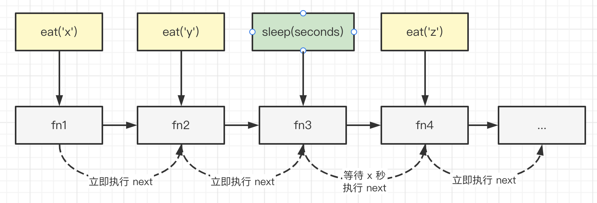

# 08-编写高质量代码 - 正确，完整，清晰，鲁棒

> 能在规定时间内写出功能健全、思路清晰、格式规整的代码，这是前端工程师的必备技能，所以面试时必考手写代码。本章将通过多个面试题，讲解前端常考的写代码问题，并总结出高质量代码的关键点。

## 01: 开始

能在规定时间内写出功能健全、思路清晰、格式规整的代码，这是前端工程师的必备技能，所以面试时必考手写代码。本章将通过多个面试题，讲解前端常考的写代码问题，并总结出高质量代码的关键点。

### 为何要考察

代码是成员的一张脸。如果代码都写不好，那不具备基本的工作能力。所以，面试都要考察手写代码。

而且，实际工作中，多人协同做项目，你自己写不好代码，会影响整个项目。所以，代码写不好，工作找不到。

### 考察重点

- 代码规范性
- 功能完整性
- 鲁棒性(健壮性)

### 注意事项

面试不一定要求在纸上写代码，所以建议带着自己的笔记本电脑去面试，写代码时可以咨询面试官可否在电脑上写。

### 看几个题目

- 请手写一个 JS 函数，实现数组扁平化（Array Flatten)
- 请手写一个 LazyMan（实现 sleep 机制）
- 请手写一个 EventBus（自定义事件）

## 02: 高质量代码的特点

软件工程师日常工作主要就是写代码，工作产出也是代码。代码是我们的一张脸，能写出高质量的代码，本身就应该是我们自己对自己的要求。

对于企业来讲，更希望能招聘到产出高质量代码的员工。企业的软件产品都是多个程序员合作写出来的，如果一旦有一位程序员产出代码质量不高，则会严重影响整个软件产品的质量。

很多同学面试完了之后，觉得自己写的代码也都对，正常执行也都没问题。但是最后面试没有通过，就很纳闷，觉得自己非技术方面有问题。其实不然，也许是你的代码是对的，但质量不高。

### 规范性

记得前些年和一位同事（也是资深面试官）聊天时，他说到：一个候选人写完了代码，不用去执行，你打眼一看就知道他水平怎样。看写的是不是整洁、规范、易读，好的代码应该是简洁漂亮的，应该能明显的表达出人的思路。

代码规范性，包括两部分。<br>
第一，就是我们日常用 [eslint](https://eslint.org/) 配置的规则。例如用单引号还是双引号，哪里应该有空格，行尾是否有分号等。这些是可以统一规定的。

第二，就是代码可读性和逻辑清晰性。
例如变量、函数的命名应该有语义，不能随便 `x1` `x2` 这样命名。再例如，一个函数超过 100 行代码就应该拆分一下，否则不易读。
再例如，一段代码如果被多个地方使用，应该抽离为一个函数，复用。像这些是 eslint 无法统一规定的，需要我们程序员去判断和优化。
再例如，在难懂的地方加注释。

PS：发现很多同学写英文单词经常写错，这是一个大问题。可以使用一些工具来做提醒，例如 [vscode spell checker](https://marketplace.visualstudio.com/items?itemName=streetsidesoftware.code-spell-checker)。

### 完整性

代码功能要完整，不能顾头不顾尾。例如，让你找到 DOM 节点子元素，结果只返回了 Element ，没有返回 Text 和 Comment 。

要保证代码的完整性，需要两个要素。第一，要有这个意识，并且去刻意学习、练习。第二，需要全面了解代码操作对象的完整数据结构，不能只看常用的部分，忽略其他部分。

### 鲁棒性

“鲁棒”是英文 Robust 的音译，意思是强壮的、耐用的。即，不能轻易出错，要兼容一些意外情况。

例如你定义了一个函数 `function ajax(url, callback) {...}` ，我这样调用 `ajax('xxx', 100)` 可能就会报错。因为 `100` 并不是函数，它要当作函数执行会报错的。

再例如，一些处理数字的算法，要考虑数字的最大值、最小值，考虑数字是 `0` 或者负数。在例如，想要通过 `url` 传递一些数据，要考虑 `url` 的最大长度限制，以及浏览器差异。

PS：使用 Typescript 可以有效的避免类型问题，是鲁棒性的有效方式。

### 总结

高质量代码的特点：

- 规范性：符合代码规范，逻辑清晰可读
- 完整性：考虑全面所有功能
- 鲁棒性：处理异常输入和边界情况

## 03: 手写一个 JS 函数，实现数组扁平化 Array Flatten

### 题目

写一个函数，实现 Array flatten 扁平化，只减少一个嵌套层级<br>
例如输入 `[1, 2, [3, 4, [100, 200], 5], 6]` 返回 `[1, 2, 3, 4, [100, 200], 5, 6]`

### 解答

- 遍历数组
- 如果 item 是数字，则累加
- 如果 item 是数组，则 forEach 累加其元素

代码参考 array-flatten.ts

```typescript
/**
 * 数组扁平化，使用 push
 * @param arr arr
 */
export function flatten1(arr: any[]): any[] {
  const res: any[] = []

  arr.forEach((item) => {
    if (Array.isArray(item)) {
      item.forEach((n) => res.push(n))
    } else {
      res.push(item)
    }
  })

  return res
}

/**
 * 数组扁平化，使用 concat
 * @param arr arr
 */
export function flatten2(arr: any[]): any[] {
  let res: any[] = []

  arr.forEach((item) => {
    res = res.concat(item)
  })

  return res
}

// // 功能测试
// const arr = [1, [2, [3], 4], 5]
// console.info( flatten2(arr) )
```

## 04: 连环问：如果想要彻底扁平，忽略所有嵌套层级？

像 lodash [flattenDepth](https://www.lodashjs.com/docs/lodash.flattenDepth) ，例如输入 `[1, 2, [3, 4, [100, 200], 5], 6]` 返回 `[1, 2, 3, 4, 100, 200, 5, 6]`

最容易想到的解决方案就是**递归**，代码参考 array-flatten-deep.ts （注意单元测试，有全面的数据类型）

```typescript
/**
 * 数组深度扁平化，使用 push
 * @param arr arr
 */
export function flattenDeep1(arr: any[]): any[] {
  const res: any[] = []

  arr.forEach((item) => {
    if (Array.isArray(item)) {
      const flatItem = flattenDeep1(item) // 递归
      flatItem.forEach((n) => res.push(n))
    } else {
      res.push(item)
    }
  })

  return res
}

/**
 * 数组深度扁平化，使用 concat
 * @param arr arr
 */
export function flattenDeep2(arr: any[]): any[] {
  let res: any[] = []

  arr.forEach((item) => {
    if (Array.isArray(item)) {
      const flatItem = flattenDeep2(item) // 递归
      res = res.concat(flatItem)
    } else {
      res = res.concat(item)
    }
  })

  return res
}

// // 功能测试
// const arr = [1, [2, [3, ['a', [true], 'b'], 4], 5], 6]
// console.info( flattenDeep2(arr) )
```

还有一种 hack 的方式 `toString` —— 但遇到引用类型的 item 就不行了。

```js
const nums = [1, 2, [3, 4, [100, 200], 5], 6]
nums.toString() // '1,2,3,4,100,200,5,6'

// 但万一数组元素是 {x: 100} 等引用类型，就不可以了
```

### 划重点

- 高质量代码的特点：规范性、完整性、鲁棒性
- 题目示例是 number 类型，但是你需要考虑其他类型
- 慎用那些看似巧妙的类型，可能会有坑

## 05: 手写一个 getType 函数，获取详细的数据类型

### 题目

实现一个 `getType` 函数，传入一个变量，能准确的获取它的类型。
如 `number` `string` `function` `object` `array` `map` `regexp` 等。

### 类型判断

常规的类型判断一般用 `typeof` 和 `instanceof` ，但这俩也有一些缺点

- `typeof`只能判断值类型， 无法继续区分 `object` 类型
- `instanceof` 需要知道构造函数，即需要两个输入,而不是获取类型

### 枚举不是好方法

你可能觉得 `typeof` 和 `instanceof` 结合起来可以判断，枚举所有的类型。<br>
这并不是一个好方法，因为**手动枚举是不靠谱的**，不具备完整性。<br>

- 第一，你有可能忽略某些类型，如；
- 第二，ES 如果有会继续增加新的类型，需要修改代码，如 `Symbol` `BigInt`

```ts
function getType(x: any): string {
  if (typeof x === 'object') {
    if (Array.isArray(x)) return 'array'
    if (x instance of Map) return 'map'
    // 继续枚举...
  }
  return typeof x
}
```

### 使用 `Object.prototype.toString`

注意，必须用 `Object.prototype.toString` ，不可以直接用 `toString`。后者可能是子类重写的。

```js
;[1, 2].toString() // '1,2' （ 这样使用的其实是 Array.prototype.toString ）
Object.prototype.toString.call([1, 2]) // '[object Array]'
```

代码参考 get-type.ts

```typescript
/**
 * 获取详细的数据类型
 * @param x x
 */
export function getType(x: any): string {
  const originType = Object.prototype.toString.call(x) // '[object String]'
  const spaceIndex = originType.indexOf(' ')
  const type = originType.slice(spaceIndex + 1, -1) // 'String'
  return type.toLowerCase() // 'string'
}

// // 功能测试
console.info(getType(null)) // 'null'
console.info(getType(undefined)) // 'undefined'
console.info(getType(100)) // 'number'
console.info(getType('abc')) // 'string'
console.info(getType(true)) // 'boolean'
console.info(getType(Symbol())) // 'symbol'
console.info(getType({})) // 'object'
console.info(getType([])) // 'array'
console.info(getType(() => {})) // 'function'
console.info(getType(new Set())) // set
console.info(getType(new WeakSet())) // weakset
console.info(getType(new Date())) // date
console.info(getType(new RegExp(''))) // regexp
console.info(getType(new Error())) // error
console.info(getType(Promise.resolve())) // promise
```

## 06: new 一个对象的过程是什么，手写代码表示

```javascript
function myNew(Fn) {
  if (typeof Fn !== 'function') {
    throw new TypeError('This is not a constructor') // Fn校验
  }
  var args = Array.from(arguments).slice(1) // 取入参
  // 1.创建一个空的简单JavaScript对象（即`  {}  `）
  var obj = {}
  // 2.  为步骤1新创建的对象添加属性`  __proto__  `，将该属性链接至构造函数的原型对象
  obj.__proto__ = Fn.prototype
  // 3.  将步骤1新创建的对象作为this的上下文并传入参数；
  var res = Fn.call(obj, ...args)
  // 4.  如果该函数没有返回对象，则返回this。
  return Object(res) === res ? res : obj
}
```

### 题目

new 一个对象内部发生了什么，手写代码表示

### class 是语法糖

ES6 使用 class 代替了 ES6 的构造函数

```js
class Foo {
  constructor(name) {
    this.name = name
    this.city = '北京'
  }
  getName() {
    return this.name
  }
}
const f = new Foo('双越')
```

其实 class 就是一个语法糖，它本质上和构造函数是一样的

```js
function Foo(name) {
  this.name = name
  this.city = '北京'
}
Foo.prototype.getName = function () {
  // 注意，这里不可以用箭头函数
  return this.name
}
const f = new Foo('双越')
```

### new 一个对象的过程

- 创建一个空对象 obj，继承构造函数的原型
- 执行构造函数（将 obj 作为 this）
- 返回 obj

### 实现 new

代码参考 new.ts

```typescript
export function customNew<T>(constructor: Function, ...args: any[]): T {
  // 1. 创建一个空对象，继承 constructor 的原型
  const obj = Object.create(constructor.prototype)
  // 2. 将 obj 作为 this ，执行 constructor ，传入参数
  constructor.apply(obj, args)
  // 3. 返回 obj
  return obj
}
```

## 07: 面试连环问：Object.create 和 {} 的区别

- `Object.create` 可以指定原型，创建一个空对象。<br>
- `{}` 就相当于 `Object.create(Object.prototype)` ，即根据 `Object` 原型的空对象。

PS：对 JS 原型和原型链还不了解的需要抓紧恶补。

## 08: 遍历一个 DOM 树(深度有优先和广度优先)

### 题目

写一个函数遍历 DOM 树，分别用深度优先和广度优先

PS：注意回顾 “Node 和 Element 和区别”

### 深度优先 vs 广度优先


深度优先的结果 `<div> <p> "hello" <b> "world"  注释 <ul> <li> "a" <li> "b"`

广度优先的结果 `<div> <p>  注释 <ul> "hello" <b> <li> <li> "world" "a" "b"`

访问节点

```typescript
/**
 * 访问节点
 * @param n node
 */
function visitNode(n: Node) {
  if (n instanceof Comment) {
    // 注释
    console.info('Comment node ---', n.textContent)
  }
  if (n instanceof Text) {
    // 文本
    const t = n.textContent?.trim()
    if (t) {
      console.info('Text node ---', t)
    }
  }
  if (n instanceof HTMLElement) {
    // element
    console.info('Element node ---', `<${n.tagName.toLowerCase()}>`)
  }
}
```

### 深度优先

一般通过**递归**实现，代码参考 dom-traverse.ts

```typescript
/**
 * 深度优先遍历
 * @param root dom node
 */
function depthFirstTraverse1(root: Node) {
  visitNode(root)

  const childNodes = root.childNodes // .childNodes 和 .children 不一样
  if (childNodes.length) {
    childNodes.forEach((child) => {
      depthFirstTraverse1(child) // 递归
    })
  }
}
```

不用递归的情况下

```typescript
function depthFirstTraverse2(root: Node) {
  const stack: Node[] = []
  // 根节点压栈
  stack.push(root)
  while (stack.length > 0) {
    const curNode = stack.pop() // 出栈
    if (curNode == null) break
    visitNode(curNode)
    // 子节点压栈
    const childNodes = curNode.childNodes
    if (childNodes.length > 0) {
      // reverse 反顺序压栈
      Array.from(childNodes)
        .reverse()
        .forEach((child) => stack.push(child))
    }
  }
}
```

### 广度优先

一般通过**队列**实现，代码参考 dom-traverse.ts

```typescript
/**
 * 广度优先遍历
 * @param root dom node
 */
function breadthFirstTraverse(root: Node) {
  const queue: Node[] = [] // 数组 vs 链表
  // 根节点入队列
  queue.unshift(root)
  while (queue.length > 0) {
    const curNode = queue.pop()
    if (curNode == null) break
    visitNode(curNode)
    // 子节点入队
    const childNodes = curNode.childNodes
    if (childNodes.length) {
      childNodes.forEach((child) => queue.unshift(child))
    }
  }
}
```

### 解答

- 深度优先，递归, 贪心
- 广度优先，队列（数组 VS 链表）
- 注意：children 和 childNodes 不同

## 09: 连环问：深度优先可以不用递归吗？

深度优先遍历，可以使用**栈**代替递归，递归本质上就是栈。代码参考如上

递归和非递归哪个更好？

- 递归逻辑更加清晰，但容易出现 `stack overflow` 错误（可使用`尾递归`，编译器有优化）
- 非递归效率更高，但使用栈，逻辑稍微复杂一些

## 10: 手写一个 LazyMan，实现 sleep 机制

### 题目

手写 LazyMan ，实现 `sleep` 和 `eat` 两个方法，支持链式调用。
代码示例：

```js
const me = new LazyMan('双越')
me.eat('苹果').eat('香蕉').sleep(5).eat('葡萄') // 打印结果如下：

// '双越 eat 苹果'
// '双越 eat 香蕉'
// （等待 5s）
// '双越 eat 葡萄'
```

### 设计 class 框架

```js
class LazyMan {
  private name: string
  constructor(name: string) {
    this.name = name
  }
  eat(x: string) {
    // 打印 eat 行为
    // 支持链式调用
    return this
  }
  sleep(seconds: number) {
    // 等待 10s 的处理逻辑
    // 支持链式调用
    return this
  }
}
```

### 处理 sleep 逻辑

初始化一个任务队列，执行 `eat` 和 `sleep` 是都往队列插入一个函数。依次执行队列的任务，遇到 `sleep` 就延迟触发 `next` 。



代码参考 lazy-man.ts

```typescript
class LazyMan {
  private name: string
  private tasks: Function[] = [] // 任务列表

  constructor(name: string) {
    this.name = name
    // 等待队列中投入任务完毕，在进行执行
    setTimeout(() => {
      this.next()
    })
  }

  private next() {
    const task = this.tasks.shift() // 取出当前 tasks 的第一个任务
    if (task) {
      task()
    }
  }

  eat(food: string) {
    const task = () => {
      console.info(`${this.name} eat ${food}`)
      this.next()
    }
    this.tasks.push(task)
    return this // 链式调用
  }

  sleep(seconds: number) {
    const task = () => {
      console.info(`${this.name} 开始睡觉`)
      setTimeout(() => {
        console.info(`${this.name} 已经睡完了 ${seconds}s，开始执行下一个任务`)
        this.next() // xx 秒之后再执行下一个任务
      }, seconds * 1000)
    }
    this.tasks.push(task)
    return this // 链式调用
  }
}

const me = new LazyMan('双越')
me.eat('苹果').eat('香蕉').sleep(5).eat('葡萄').eat('西瓜').sleep(2).eat('橘子')
```

### 总结

- 任务队列
- 链式调用
- 延迟触发

## 11: 手写 curry 函数，实现函数柯里化

### 题目

写一个 `curry` 函数，可以把其他函数转为 curry 函数

```js
function add(a, b, c) {
  return a + b + c
}
add(1, 2, 3) // 6

const curryAdd = curry(add)
curryAdd(1)(2)(3) // 6
```

### 分析

- curry 返回的是一个函数 fn
- 执行 fn, 中间状态返回函数，如 add(1) 或者 add(1)(2)
- 最后返回执行结果，如 add(1)(2)(3)

### 解答

代码参考 curry.ts

```typescript
export function curry(fn: Function) {
  const fnArgsLength = fn.length // 传入函数的参数长度
  let args: any[] = []

  // ts 中，独立的函数，this 需要声明类型
  function calc(this: any, ...newArgs: any[]) {
    // 积累参数
    args = [...args, ...newArgs]
    if (args.length < fnArgsLength) {
      // 参数不够，返回函数
      return calc
    } else {
      // 参数够了，返回执行结果
      return fn.apply(this, args.slice(0, fnArgsLength))
    }
  }

  return calc
}

function add(a: number, b: number, c: number): number {
  return a + b + c
}
add(10, 20, 30) // 60

const curryAdd = curry(add)
const res = curryAdd(10)(20)(30)
console.info(res) // 60
```

### 划重点

- 工作不常用，面试很爱考（工作和面试不完全一样）
- 如果有 this, 慎用 箭头函数

### 总结

- 判断参数长度
- 中间态返回函数，最后返回执行结果
- 如用 this 慎用箭头函数

## 12: instanceof 原理是什么，请写代码表示

### 题目

instanceof 的原理是什么，请用代码来表示

### 原型链


## instanceof 原理

例如 `a instanceof b` 就是：顺着 `a` 的 `__proto__` 链向上找，能否找到 `b.prototype`

代码参考 instanceof.ts

```typescript
export function myInstanceof(instance: any, origin: any): boolean {
  if (instance == null) return false // null undefined

  const type = typeof instance
  if (type !== 'object' && type !== 'function') {
    // 值类型
    return false
  }

  let tempInstance = instance // 为了防止修改 instance
  while (tempInstance) {
    if (tempInstance.__proto__ === origin.prototype) {
      return true // 配上了
    }
    // 未匹配
    tempInstance = tempInstance.__proto__ // 顺着原型链，往上找
  }

  return false
}

// 功能测试
console.info(myInstanceof({}, Object))
console.info(myInstanceof([], Object))
console.info(myInstanceof([], Array))
console.info(myInstanceof({}, Array))
console.info(myInstanceof('abc', String)) // false
```

### 总结

- 原型链
- 循环判断
